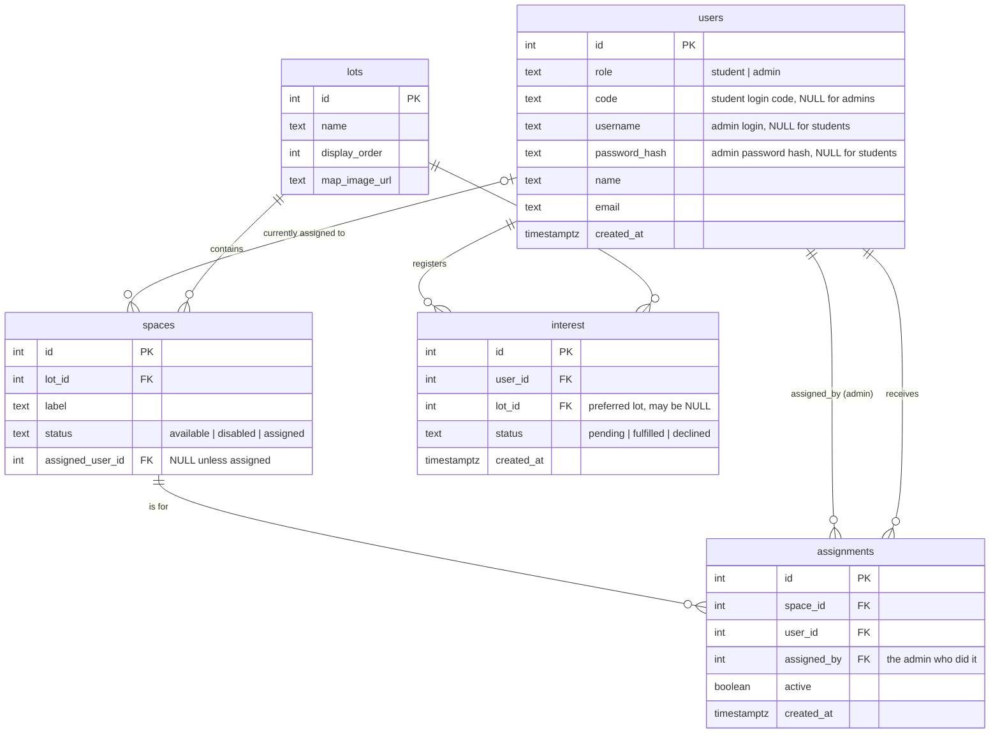

# LTRide — Backend Development & Deployment Guide

> **Who this is for:** someone brand new to coding. Follow it **literally, line by line**. Gray boxes are commands you type into the **Terminal**. Type one line, press Enter, wait, then the next.
>
> **What you are building:** the "backend" — a program (written in Python with a framework called **Flask**) that runs on a server, stores data in a **database**, and answers requests from the website over the internet as **JSON**. The website (frontend) has its own guide: `ui-development-guide.md`. Read the [overall plan](plan.md) first.
>
> **Two halves of this guide:**
> - **Part 1 (CRs B0–B7):** build the backend on your own computer, one small CR at a time.
> - **Part 2 (CRs D1–D4):** put it on AWS so it's live on the internet.

---

## The source structure you're building toward

Before you touch anything, here's the map. **The left side is what's in the repo today; the right side is where you're heading.** Each CR moves a little of the left into the right.

### What exists today (a course-template scaffold)

```
LTR-Backend/                 # the repo root (you run most commands here)
├── webapp/                  # the real app lives here
│   ├── App/
│   │   ├── __init__.py      # Flask app factory (create_app)
│   │   ├── config.py        # settings (currently a hard-coded secret — B0 fixes this)
│   │   ├── model.py         # DB connection (currently SQLite)
│   │   └── views/           # the route handlers (endpoints)
│   │       ├── index.py     # placeholder routes from the template
│   │       ├── root.py
│   │       └── images.py
│   ├── sql/                 # database SQL files
│   └── requirements.txt     # the Python libraries to install (§0.5)
├── BK/                      # an OLDER duplicate of the app — ignore it
├── deploy/                  # AWS deployment (scripts + CloudFormation) — Part 2
│   ├── deploy.sh            # creates the AWS infrastructure
│   ├── release.sh           # ships your code to the server
│   ├── params/prod.json     # your AWS settings
│   ├── server/              # nginx + systemd + provision.sh (CR D1b)
│   └── cfn/                 # 01-network / 02-database / 03-compute / 04-dns (CR D1)
├── plan/                    # the three docs (this guide, the UI guide, plan.md)
└── webapp/var/ , *.pem      # local data & a key file — leave the .pem alone
```

> **Why two app copies (`webapp/` and `BK/`)?** The project was started from a course template that got duplicated. We build inside **`webapp/`** and ignore `BK/`. (A later cleanup can delete `BK/`, but that's not your job right now.)

### What it becomes as you finish the CRs (the target)

This is the same `webapp/App/` folder, filled in. Each file maps to a CR so you always know *where* new code goes:

```
webapp/
├── App/
│   ├── __init__.py          # registers all the blueprints below + CORS + error handling
│   ├── config.py            # reads SECRET_KEY, DATABASE_URL, CORS_ORIGINS from .env   (B0)
│   ├── db.py                # connects to PostgreSQL, returns rows as dicts            (B3)
│   ├── auth.py              # makes/checks login tokens (JWT), @require_role decorator (B3)
│   └── views/               # one file per feature area — these are the "endpoints"
│       ├── health.py        # GET /api/health                                          (B1)
│       ├── auth.py          # POST /api/auth/student | /admin , GET /api/auth/me        (B3)
│       ├── lots.py          # GET /api/lots , GET /api/lots/<id>/spaces                 (B4)
│       ├── spaces.py        # PATCH /api/spaces , PATCH /api/spaces/<id>                (B5)
│       ├── interest.py      # POST/GET /api/interest , GET /api/interest/me             (B6)
│       └── assignments.py   # POST /api/assignments , DELETE /api/assignments/<id>      (B7)
├── sql/
│   ├── migrations/
│   │   └── 001_init.sql     # creates the tables (users, lots, spaces, ...)             (B2)
│   └── seed.sql             # sample lots, spaces, an admin, a few students            (B2)
├── .env                     # your local secrets — never committed                     (B0)
├── .env.example             # a template of .env — safe to commit                      (B0)
└── requirements.txt         # the Python libraries
```

> **How to read this:** a **"view" / "blueprint"** is just a Python file holding a group of related endpoints. When the guide says *"add `views/auth.py`"*, you're adding one of these files and then telling `__init__.py` about it. The full per-endpoint request/response spec for every route lives in **plan.md §7.1**.

---

## Part 0 — One-time setup

### 0.1 Install the tools

1. **VS Code** — <https://code.visualstudio.com> (same editor as the frontend).
2. **Python 3.11+** — macOS may already have it. Check:
   ```bash
   python3 --version
   ```
   If it's missing or older than 3.11, install with Homebrew (see 0.2) via `brew install python@3.12`.
3. **Homebrew** (the macOS app installer we'll reuse for everything) — if `brew --version` fails, install it from <https://brew.sh> (paste their one-line command).
4. **Git** — check `git --version` (same as the frontend guide).
5. **PostgreSQL** — the database itself *and* its command-line tools (`psql`, `createdb`). Install it now; you'll **start it and put it on your PATH** in CR B2 (there's a full step-by-step box there):
   ```bash
   brew install postgresql@16
   ```
   > `psql` is the terminal program for talking to the database; `createdb` makes a new database. They arrive with this install but need two extra one-time steps (start the server + add to PATH) — all covered in the **"Installing and starting PostgreSQL"** box in CR B2.

### 0.2 Tell Git who you are (skip if you already did this for the frontend)

```bash
git config --global user.name "Your Name"
git config --global user.email "you@example.com"
```

### 0.3 Get the backend project

```bash
cd ~/workspace
cd LTR-Backend
ls
```
You should see folders like `webapp/`, `plan/`, `deploy/`.

### 0.4 Make a "virtual environment" (Python's private toolbox)

A **virtual environment** (venv) is a private folder of Python libraries just for this project, so it never clashes with the rest of your computer.

```bash
python3 -m venv .venv
source .venv/bin/activate
```
After the second line your prompt shows `(.venv)` at the start. That means it's active. **You must run `source .venv/bin/activate` every time you open a new terminal** to work on the backend.

To turn it off later: type `deactivate`.

### 0.5 Install the backend's libraries

The list of libraries lives in **`webapp/requirements.txt`** (not the repo root — there's also an older copy in `BK/`, ignore that one). From the repo root (`~/workspace/LTR-Backend`), with the venv active, run:

```bash
pip install -r webapp/requirements.txt
```

> **Tip:** if you'd rather not type the `webapp/` path each time, you can `cd webapp` first and then run `pip install -r requirements.txt`. Just remember which folder you're in — `pwd` tells you.

---

## Part 1 — Build the backend, CR by CR

> **The same Git routine as the frontend** (see `ui-development-guide.md` Part B/C). Each backend CR is `cr/b<N>-<slug>` and **branches off the previous backend CR**. Every PR uses the CR description template and includes a local testing guide.
>
> **How you'll test the backend without a browser:** with a tool called `curl` (sends a request from the terminal) and your terminal output. Each CR below gives you the exact `curl` command and what you should see back.

### Vocabulary

- **Endpoint / route** — a URL the backend answers, like `GET /api/lots`. "GET" / "POST" / "PATCH" / "DELETE" are the *method* (read / create / update / delete).
- **JSON** — the text format data travels in: `{"name": "Lot 1"}`.
- **Database** — where data is permanently stored, in tables (like spreadsheets).
- **Migration** — a `.sql` file that creates or changes database tables. We number them so they run in order.
- **Environment variable** — a setting read from outside the code (like a password) so secrets aren't written in the code.

---

### The "☁️ Cloud check" recipe (deploy a CR and test it on the real server)

Each CR below ends with two test passes:
- **Local testing guide** — test on your laptop (always do this first; it's fast and free).
- **☁️ Cloud check** — *optionally* push the same CR to the real AWS server and confirm it works there too. This catches "works on my machine" problems (missing env var, migration not applied, CORS) early instead of all at once at the end.

**One-time prerequisite (do this once, before your first cloud check).** The AWS server has to exist before you can deploy to it. That setup lives in **Part 2** — jump ahead and do **D0** (AWS account + CLI), **D1** (templates), and **D2** (`./deploy.sh up`) one time. It takes ~15 min and ~a few dollars/month while it's running (or `./deploy.sh down` between sessions). Come back here once `./deploy.sh outputs` prints a public IP.

**The repeatable recipe — run this after committing any CR you want to verify in the cloud:**
```bash
# 1) make sure your CR is committed and pushed (release.sh pulls from git on the server)
git push

# 2) ship it to the server (builds nothing for backend-only; migrates DB; restarts gunicorn)
cd ~/workspace/LTR-Backend/deploy
./release.sh backend          # use ./release.sh all once the frontend is also ready

# 3) find your server address
./deploy.sh outputs           # note the ElasticIp / PublicIp
```
Then run that CR's **☁️ Cloud check** line below, swapping `http://localhost:8000` for `http://<ElasticIp>`. That's the only difference from local testing — same endpoints, real server.

> **Tip:** if a cloud check fails but the local test passed, it's almost always (a) a migration that didn't run on the server, (b) a missing env var in the server's `.env`, or (c) CORS. See **Part 3 — Operating & troubleshooting**.

---

### CR B0 — Clean slate & safety (do this first)

**Goal:** make the project safe and tidy before building features. (This is the deferred security cleanup — **do not touch the `aws-tutorial.pem` key**; that one is being handled separately.)

**Branch:**
```bash
git checkout main
git pull
git checkout -b cr/b0-hygiene
```

**Steps:**

1. **Stop committing secrets and junk.** Create (or open) the file `.gitignore` at the repo root and make sure it contains **exactly** these lines (add any that are missing — order doesn't matter):
   ```gitignore
   # Python
   .venv/
   env/
   __pycache__/
   *.pyc

   # local database files (if you ever use SQLite)
   *.sqlite3

   # secrets & local settings — NEVER commit these
   .env

   # the AWS key file (handled separately — do not touch the key itself)
   *.pem

   # build output / dependencies
   node_modules/
   dist/
   ```

2. **Add the libraries this project needs.** Open `webapp/requirements.txt` and make sure these lines are present (add the missing ones). We'll use them across the next CRs:
   ```text
   Flask>=2.2
   flask-cors>=4.0
   psycopg[binary]>=3.1
   PyJWT>=2.8
   python-dotenv>=1.0
   Werkzeug>=2.2
   gunicorn>=21.2
   ```
   Then install them (venv active):
   ```bash
   pip install -r webapp/requirements.txt
   ```

3. **Move the secret key out of the code.** Open `webapp/App/config.py`. Find the hard-coded line that looks like `SECRET_KEY = "some-literal-string"` and replace the whole file's settings with this env-driven version:
   ```python
   # webapp/App/config.py
   """All settings come from environment variables (loaded from .env locally)."""
   import os

   # Loads variables from a local .env file if present. On the real server the
   # variables are set by systemd, so this is a no-op there.
   from dotenv import load_dotenv
   load_dotenv()

   # Required — the app refuses to start if these are missing.
   SECRET_KEY = os.environ["SECRET_KEY"]
   DATABASE_URL = os.environ["DATABASE_URL"]

   # Optional — sensible defaults for local development.
   CORS_ORIGINS = os.environ.get("CORS_ORIGINS", "http://localhost:5173")
   JWT_EXP_HOURS = int(os.environ.get("JWT_EXP_HOURS", "12"))
   ```
   > **Why `os.environ[...]` (square brackets) and not `.get(...)`?** Square brackets make the app crash immediately with a clear error if a required secret is missing — far better than starting up "half-configured" and failing mysteriously later.

4. **Create a `.env` file** at the repo root (it's git-ignored, so it stays on your machine only). This holds your *local* secrets:
   ```dotenv
   SECRET_KEY=dev-only-change-me-to-anything-long-and-random
   DATABASE_URL=postgresql://localhost/ltride_dev
   CORS_ORIGINS=http://localhost:5173
   JWT_EXP_HOURS=12
   ```

5. **Create `.env.example`** at the repo root — same keys, but **no real secrets**. This one *is* committed so the next person knows what to fill in:
   ```dotenv
   SECRET_KEY=
   DATABASE_URL=postgresql://localhost/ltride_dev
   CORS_ORIGINS=http://localhost:5173
   JWT_EXP_HOURS=12
   ```

**Local testing guide:**
1. Setup: `source .venv/bin/activate`; create the `.env` file from step 4.
2. Steps:
   ```bash
   git status                                  # what would be committed?
   python -c "import webapp.App.config as c; print('SECRET loaded:', bool(c.SECRET_KEY))"
   ```
3. Expected:
   - `git status` does **not** list `.venv/`, `__pycache__`, `.env`, or any `*.pem` file.
   - The `python -c ...` line prints `SECRET loaded: True` (proves the secret comes from `.env`, not the code).
   - If you temporarily rename `.env`, that same command crashes with `KeyError: 'SECRET_KEY'` — that's the intended "fail loud" behavior.

**Commit & push:**
```bash
git add -A
git commit -m "B0: gitignore junk, move SECRET_KEY/DATABASE_URL to env, add .env.example"
git push -u origin cr/b0-hygiene
```
PR base = `main`.

---

### CR B1 — Health check (prove the server runs)

**Depends on:** B0. **Branch off B0.**

**Goal:** one tiny endpoint, `GET /api/health`, that returns `{"data":{"status":"ok"}}`. This proves the whole setup works before adding anything complex.

**Branch:**
```bash
git checkout cr/b0-hygiene
git checkout -b cr/b1-health
```

**Steps:**

1. **Create the health route.** In `webapp/App/views/`, create a new file `health.py`:
   ```python
   # webapp/App/views/health.py
   from datetime import datetime, timezone
   from flask import Blueprint, jsonify

   # A "Blueprint" is a group of related routes. We register it in __init__.py.
   bp = Blueprint("health", __name__)

   @bp.get("/api/health")
   def health():
       now = datetime.now(timezone.utc).isoformat()
       return jsonify({"data": {"status": "ok", "time": now}})
   ```

2. **Write the app factory.** Open `webapp/App/__init__.py` and replace its contents with this. `create_app()` is the standard Flask pattern: one function that builds and returns the app.
   ```python
   # webapp/App/__init__.py
   from flask import Flask, jsonify
   from flask_cors import CORS

   from . import config


   def create_app():
       app = Flask(__name__)
       app.config["SECRET_KEY"] = config.SECRET_KEY

       # Allow the React dev server (and later the real site) to call this API.
       CORS(app, origins=config.CORS_ORIGINS.split(","), supports_credentials=True)

       # Register every blueprint (group of routes). We add more in later CRs.
       from .views import health
       app.register_blueprint(health.bp)

       # Turn any uncaught error into our standard JSON error envelope so the
       # frontend always gets predictable shapes.
       @app.errorhandler(404)
       def not_found(_e):
           return jsonify({"error": {"code": "not_found", "message": "Not found"}}), 404

       @app.errorhandler(500)
       def server_error(_e):
           return jsonify({"error": {"code": "server_error", "message": "Server error"}}), 500

       return app


   # Lets `flask run` find the app via FLASK_APP=webapp.App
   app = create_app()
   ```

**Run the server (do this in its own terminal, venv active, from the repo root):**
```bash
export FLASK_APP=webapp.App
flask run --port 8000
```
> If you get `ModuleNotFoundError: webapp`, you're in the wrong folder — run it from `~/workspace/LTR-Backend` (where the `webapp/` folder is visible with `ls`).

**Local testing guide:**
1. Setup: venv active; `.env` exists (from B0); `flask run --port 8000` in one terminal.
2. Steps: in a **second** terminal:
   ```bash
   curl -i http://localhost:8000/api/health
   curl -i http://localhost:8000/api/does-not-exist
   ```
3. Expected:
   - The first returns `200` and `{"data":{"status":"ok","time":"...."}}`.
   - The second returns `404` and `{"error":{"code":"not_found","message":"Not found"}}` — proving the error envelope works.

**☁️ Cloud check (optional):** run the recipe (`git push` → `./release.sh backend` → `./deploy.sh outputs`), then:
```bash
curl -i http://<ElasticIp>/api/health     # expect 200 {"data":{"status":"ok",...}}
```
This is the best first cloud check — if `/api/health` works on the server, your whole deploy pipeline (git pull → gunicorn → nginx) is healthy.

---

### CR B2 — Database schema & seed data

**Depends on:** B1. **Branch off B1.**

**Goal:** create the real tables and put a little test data in so later CRs have something to read.

**Branch:**
```bash
git checkout cr/b1-health
git checkout -b cr/b2-schema
```

#### The database diagram (what you're building)

These are the five tables and how they connect. An arrow `A → B` means "a row in A points at a row in B" (a *foreign key*).



**The three fixed value sets (enums):**
- `users.role` ∈ `{student, admin}`
- `spaces.status` ∈ `{available, disabled, assigned}`
- `interest.status` ∈ `{pending, fulfilled, declined}`

#### Step 1 — Create the database (one time)

```bash
createdb ltride_dev
```
> If `createdb` says "command not found", Postgres isn't on your PATH yet — see the **"Installing and starting PostgreSQL"** box at the end of this CR, do that, then come back.

#### Step 2 — Write the schema file

Create the folder and file `webapp/sql/migrations/001_init.sql` with **exactly** this content. Read the comments — they explain each choice.

```sql
-- webapp/sql/migrations/001_init.sql
-- Initial schema for LTRide. Safe to re-run: it drops then recreates everything.

BEGIN;

DROP TABLE IF EXISTS assignments CASCADE;
DROP TABLE IF EXISTS interest    CASCADE;
DROP TABLE IF EXISTS spaces      CASCADE;
DROP TABLE IF EXISTS lots        CASCADE;
DROP TABLE IF EXISTS users       CASCADE;

-- USERS: both students and admins live here, told apart by `role`.
--   students  -> have a `code`, no username/password
--   admins    -> have username + password_hash, no code
CREATE TABLE users (
    id            SERIAL PRIMARY KEY,
    role          TEXT NOT NULL CHECK (role IN ('student', 'admin')),
    code          TEXT UNIQUE,                 -- student login code (e.g. STU001)
    username      TEXT UNIQUE,                 -- admin login name
    password_hash TEXT,                        -- admin password (hashed, never plain)
    name          TEXT NOT NULL,
    email         TEXT,
    created_at    TIMESTAMPTZ NOT NULL DEFAULT now()
);

-- LOTS: a parking lot / area.
CREATE TABLE lots (
    id            SERIAL PRIMARY KEY,
    name          TEXT NOT NULL,
    display_order INTEGER NOT NULL DEFAULT 0,
    map_image_url TEXT
);

-- SPACES: one parking space, belongs to a lot.
CREATE TABLE spaces (
    id               SERIAL PRIMARY KEY,
    lot_id           INTEGER NOT NULL REFERENCES lots(id) ON DELETE CASCADE,
    label            TEXT NOT NULL,            -- human label, e.g. "1-0-3"
    status           TEXT NOT NULL DEFAULT 'available'
                     CHECK (status IN ('available', 'disabled', 'assigned')),
    assigned_user_id INTEGER REFERENCES users(id) ON DELETE SET NULL,
    UNIQUE (lot_id, label)                     -- no two spaces share a label in a lot
);

-- INTEREST: a student registering that they want a spot.
CREATE TABLE interest (
    id         SERIAL PRIMARY KEY,
    user_id    INTEGER NOT NULL REFERENCES users(id) ON DELETE CASCADE,
    lot_id     INTEGER REFERENCES lots(id) ON DELETE SET NULL,  -- preferred lot (optional)
    status     TEXT NOT NULL DEFAULT 'pending'
               CHECK (status IN ('pending', 'fulfilled', 'declined')),
    created_at TIMESTAMPTZ NOT NULL DEFAULT now()
);

-- Stop a student having two *active* (pending) requests at once.
-- (Used by B6's "duplicate request -> 409" rule.)
CREATE UNIQUE INDEX one_active_interest_per_user
    ON interest (user_id)
    WHERE status = 'pending';

-- ASSIGNMENTS: an admin gave a space to a student. History is kept (active flag).
CREATE TABLE assignments (
    id          SERIAL PRIMARY KEY,
    space_id    INTEGER NOT NULL REFERENCES spaces(id) ON DELETE CASCADE,
    user_id     INTEGER NOT NULL REFERENCES users(id) ON DELETE CASCADE,
    assigned_by INTEGER NOT NULL REFERENCES users(id),   -- the admin
    active      BOOLEAN NOT NULL DEFAULT TRUE,
    created_at  TIMESTAMPTZ NOT NULL DEFAULT now()
);

-- A space can have at most ONE active assignment at a time.
CREATE UNIQUE INDEX one_active_assignment_per_space
    ON assignments (space_id)
    WHERE active;

COMMIT;
```

> **Why the partial unique indexes?** They let the *database itself* enforce the rules ("one pending request per student", "one active assignment per space") so you can't get into a bad state even if there's a bug in the Python code. The `WHERE` clause means the rule only applies to the rows that matter (e.g. only `pending` interest).

#### Step 3 — Make the admin password hash

We never store a plain password. Generate a hash for the admin's password (`admin123` for local dev) using the same library the app will use to check it:

```bash
python -c "from werkzeug.security import generate_password_hash; print(generate_password_hash('admin123'))"
```
This prints a long string starting with `scrypt:` or `pbkdf2:`. **Copy that whole string** — you'll paste it into the seed file in the next step.

#### Step 4 — Write the seed file

Create `webapp/sql/seed.sql`. Replace `PASTE_HASH_HERE` with the string you just copied.

```sql
-- webapp/sql/seed.sql
-- Sample data for local development. Re-runnable (clears the tables first).

BEGIN;

TRUNCATE assignments, interest, spaces, lots, users RESTART IDENTITY CASCADE;

-- One admin. password is 'admin123' (only for local dev!).
INSERT INTO users (role, username, password_hash, name, email) VALUES
    ('admin', 'admin', 'PASTE_HASH_HERE', 'Site Admin', 'admin@school.edu');

-- A few students. They log in with their code (no password).
INSERT INTO users (role, code, name, email) VALUES
    ('student', 'STU001', 'Jane Doe',   'jane@school.edu'),
    ('student', 'STU002', 'John Smith', 'john@school.edu'),
    ('student', 'STU003', 'Amy Lee',    'amy@school.edu');

-- Two lots.
INSERT INTO lots (name, display_order) VALUES
    ('Lot 1', 1),
    ('Lot 2', 2);

-- ~20 spaces in Lot 1 (ids/labels 1-0-1 .. 1-0-20), all available to start.
INSERT INTO spaces (lot_id, label, status)
SELECT 1, '1-0-' || g, 'available'
FROM generate_series(1, 20) AS g;

-- A handful in Lot 2 so the lot switcher has something to show.
INSERT INTO spaces (lot_id, label, status)
SELECT 2, '2-0-' || g, 'available'
FROM generate_series(1, 6) AS g;

COMMIT;
```

> **`generate_series(1, 20)`** is a Postgres trick that produces the numbers 1..20, so we insert 20 spaces without writing 20 lines. `'1-0-' || g` glues the text label together (`||` is "join strings" in SQL).

#### Step 5 — Run them

```bash
psql ltride_dev -f webapp/sql/migrations/001_init.sql
psql ltride_dev -f webapp/sql/seed.sql
```
Each should print a list of `CREATE TABLE` / `INSERT` lines and no `ERROR`.

**Local testing guide:**
1. Setup: Postgres running (`brew services start postgresql@16`); both files run with no error.
2. Steps:
   ```bash
   psql ltride_dev -c "\dt"                                          # list tables
   psql ltride_dev -c "SELECT label, status FROM spaces WHERE lot_id=1 LIMIT 5;"
   psql ltride_dev -c "SELECT code, name FROM users WHERE role='student';"
   psql ltride_dev -c "SELECT count(*) AS lot1_spaces FROM spaces WHERE lot_id=1;"
   ```
3. Expected:
   - `\dt` lists all five tables: `assignments, interest, lots, spaces, users`.
   - The spaces query shows labels like `1-0-1 … 1-0-5`, all `available`.
   - The users query shows `STU001 Jane Doe`, `STU002 John Smith`, `STU003 Amy Lee`.
   - `lot1_spaces` = `20`.

**☁️ Cloud check (optional):** the schema/seed run against the **server's** database (RDS), not your laptop's. `release.sh` auto-applies `sql/migrations/*.sql` on deploy, but the **seed** is manual (you don't want dev data on a real site). To verify on the server:
```bash
./release.sh backend                       # applies 001_init.sql on RDS
ssh -i ~/.ssh/ltride-key.pem ubuntu@<ElasticIp>
sudo -u ltride bash -c 'set -a; . /home/ltride/app/.env; set +a; psql "$DATABASE_URL" -c "\dt"'
# expect the five tables. To seed dev data on the server too (optional):
#   psql "$DATABASE_URL" -f /home/ltride/app/sql/seed.sql
exit
```
Expect `\dt` to list the same five tables on RDS.

**Commit & push:**
```bash
git add webapp/sql/
git commit -m "B2: add schema migration + dev seed data"
git push -u origin cr/b2-schema
```
> Double-check: the real admin hash is fine to commit here because it's a throwaway *local-dev* password. Never commit a hash of a real production password.

---

> #### 📦 Installing and starting PostgreSQL (do this once, if `createdb`/`psql` aren't found)
>
> `psql` and `createdb` are command-line tools that come **with PostgreSQL**. In §0.1 you ran `brew install postgresql@16`, which installs them — but two things often trip people up: the database **server isn't running yet**, and the tools **aren't on your PATH**. Fix both:
>
> 1. **Start the database server** (and have it auto-start on login):
>    ```bash
>    brew services start postgresql@16
>    ```
> 2. **Put the tools on your PATH.** Homebrew installs this version "keg-only", meaning you must add it yourself. Run the line for your Mac:
>    ```bash
>    # Apple Silicon (M1/M2/M3) Macs:
>    echo 'export PATH="/opt/homebrew/opt/postgresql@16/bin:$PATH"' >> ~/.zshrc
>    # Intel Macs:
>    echo 'export PATH="/usr/local/opt/postgresql@16/bin:$PATH"' >> ~/.zshrc
>    ```
>    Then reload your shell: `source ~/.zshrc` (or just open a new Terminal window).
> 3. **Verify:**
>    ```bash
>    psql --version        # should print "psql (PostgreSQL) 16.x"
>    createdb --version
>    ```
> 4. The very first connection sometimes fails with *"role does not exist"*. If so, create a database user matching your Mac username once:
>    ```bash
>    createuser -s "$(whoami)"
>    ```
>
> **What is `psql`?** It's the interactive PostgreSQL client — a terminal program for talking to the database. `psql ltride_dev` opens a session connected to the `ltride_dev` database; `psql ltride_dev -f file.sql` runs a file against it; `psql ltride_dev -c "SQL..."` runs one command. Type `\q` to quit an interactive session.

---

### CR B3 — Authentication (login)

**Depends on:** B2. **Branch off B2.** **Unblocks frontend U1.**

**Goal:** the three auth endpoints so people can log in:
- `POST /api/auth/student` — body `{"code":"STU001"}` → returns a token + user.
- `POST /api/auth/admin` — body `{"username","password"}` → returns a token + user.
- `GET /api/auth/me` — returns the logged-in user (reads the `Authorization: Bearer <token>` header).

**Branch:**
```bash
git checkout cr/b2-schema
git checkout -b cr/b3-auth
```

#### Step 1 — Database helper (`webapp/App/db.py`)

This is the **one place** that opens a connection to PostgreSQL. Everything else asks it for a connection. Create `webapp/App/db.py`:
```python
# webapp/App/db.py
"""Database access: one connection per request, rows returned as dicts."""
import psycopg
from psycopg.rows import dict_row
from flask import g

from . import config


def get_db():
    """Return this request's DB connection, opening one if needed."""
    if "db" not in g:
        g.db = psycopg.connect(config.DATABASE_URL, row_factory=dict_row)
    return g.db


def close_db(_e=None):
    """Close the connection at the end of the request (wired in __init__.py)."""
    db = g.pop("db", None)
    if db is not None:
        db.close()


def query(sql, params=()):
    """Run a SELECT, return a list of dict rows."""
    with get_db().cursor() as cur:
        cur.execute(sql, params)
        return cur.fetchall()


def query_one(sql, params=()):
    """Run a SELECT, return the first dict row or None."""
    with get_db().cursor() as cur:
        cur.execute(sql, params)
        return cur.fetchone()


def execute(sql, params=()):
    """Run an INSERT/UPDATE/DELETE and commit. Returns the first row if the
    SQL ends in RETURNING, else None."""
    db = get_db()
    with db.cursor() as cur:
        cur.execute(sql, params)
        row = cur.fetchone() if cur.description else None
    db.commit()
    return row
```
Then wire `close_db` into the app factory. In `webapp/App/__init__.py`, inside `create_app()`, add after `CORS(...)`:
```python
    from . import db
    app.teardown_appcontext(db.close_db)
```

#### Step 2 — Auth service (`webapp/App/auth.py`)

This creates and checks **tokens** (a JWT is a signed string that proves who you are) and provides the `@require_role` guard. Create `webapp/App/auth.py`:
```python
# webapp/App/auth.py
"""Token creation/verification and the route guards."""
from datetime import datetime, timedelta, timezone
from functools import wraps

import jwt
from flask import request, jsonify, g

from . import config
from .db import query_one


def issue_token(user):
    """Make a signed token that says who this user is and when it expires."""
    payload = {
        "user_id": user["id"],
        "role": user["role"],
        "exp": datetime.now(timezone.utc) + timedelta(hours=config.JWT_EXP_HOURS),
    }
    return jwt.encode(payload, config.SECRET_KEY, algorithm="HS256")


def _current_user():
    """Read the Bearer token, verify it, and load the user. None if invalid."""
    header = request.headers.get("Authorization", "")
    if not header.startswith("Bearer "):
        return None
    token = header.split(" ", 1)[1]
    try:
        payload = jwt.decode(token, config.SECRET_KEY, algorithms=["HS256"])
    except jwt.PyJWTError:
        return None
    return query_one("SELECT id, role, name, email FROM users WHERE id = %s",
                     (payload["user_id"],))


def _error(code, message, status):
    return jsonify({"error": {"code": code, "message": message}}), status


def require_auth(fn):
    """Allow any logged-in user. Stashes the user on flask.g."""
    @wraps(fn)
    def wrapper(*args, **kwargs):
        user = _current_user()
        if user is None:
            return _error("unauthorized", "Login required", 401)
        g.user = user
        return fn(*args, **kwargs)
    return wrapper


def require_role(role):
    """Allow only a given role (e.g. 'admin')."""
    def decorator(fn):
        @wraps(fn)
        def wrapper(*args, **kwargs):
            user = _current_user()
            if user is None:
                return _error("unauthorized", "Login required", 401)
            if user["role"] != role:
                return _error("forbidden", f"{role} only", 403)
            g.user = user
            return fn(*args, **kwargs)
        return wrapper
    return decorator
```

#### Step 3 — Auth routes (`webapp/App/views/auth.py`)

Create `webapp/App/views/auth.py`:
```python
# webapp/App/views/auth.py
from flask import Blueprint, request, jsonify, g
from werkzeug.security import check_password_hash

from ..db import query_one
from ..auth import issue_token, require_auth

bp = Blueprint("auth", __name__)


def _err(code, message, status):
    return jsonify({"error": {"code": code, "message": message}}), status


def _public_user(u):
    return {"id": u["id"], "role": u["role"], "name": u["name"]}


@bp.post("/api/auth/student")
def student_login():
    body = request.get_json(silent=True) or {}
    code = body.get("code")
    if not code:
        return _err("bad_request", "code is required", 400)
    user = query_one(
        "SELECT id, role, name FROM users WHERE role='student' AND code = %s", (code,))
    if user is None:
        return _err("unauthorized", "Unknown code", 401)
    return jsonify({"data": {"token": issue_token(user), "user": _public_user(user)}})


@bp.post("/api/auth/admin")
def admin_login():
    body = request.get_json(silent=True) or {}
    username, password = body.get("username"), body.get("password")
    if not username or not password:
        return _err("bad_request", "username and password are required", 400)
    user = query_one(
        "SELECT id, role, name, password_hash FROM users "
        "WHERE role='admin' AND username = %s", (username,))
    if user is None or not check_password_hash(user["password_hash"], password):
        return _err("unauthorized", "Bad credentials", 401)
    return jsonify({"data": {"token": issue_token(user), "user": _public_user(user)}})


@bp.post("/api/auth/logout")
def logout():
    # Tokens are stateless, so the client just discards it. 204 = "done, no body".
    return "", 204


@bp.get("/api/auth/me")
@require_auth
def me():
    u = g.user
    return jsonify({"data": {"id": u["id"], "role": u["role"],
                             "name": u["name"], "email": u["email"]}})
```

#### Step 4 — Register the blueprint

In `webapp/App/__init__.py`, next to where you registered `health`, add:
```python
    from .views import auth
    app.register_blueprint(auth.bp)
```

**Local testing guide:**
1. Setup: DB seeded (B2); `flask run --port 8000` running.
2. Steps:
   ```bash
   # valid student
   curl -i -X POST http://localhost:8000/api/auth/student \
     -H 'Content-Type: application/json' -d '{"code":"STU001"}'
   # invalid student
   curl -i -X POST http://localhost:8000/api/auth/student \
     -H 'Content-Type: application/json' -d '{"code":"NOPE"}'
   # admin (password from B2 seed)
   curl -i -X POST http://localhost:8000/api/auth/admin \
     -H 'Content-Type: application/json' -d '{"username":"admin","password":"admin123"}'
   ```
   Copy the `token` value from a successful response, then:
   ```bash
   curl -i http://localhost:8000/api/auth/me -H "Authorization: Bearer <paste-token>"
   curl -i http://localhost:8000/api/auth/me     # no token
   ```
3. Expected:
   - Valid student/admin → `200` with `{"data":{"token":"...","user":{...}}}`.
   - Wrong code / wrong password → `401` `{"error":{"code":"unauthorized",...}}`.
   - `/me` with token → `200` and your user; `/me` without token → `401`.

**☁️ Cloud check (optional):** after `./release.sh backend`, repeat the login against the server (the seed must have been run on RDS — see B2's cloud check):
```bash
curl -i -X POST http://<ElasticIp>/api/auth/student \
  -H 'Content-Type: application/json' -d '{"code":"STU001"}'
```
Expect `200` with a token. A `500` here usually means `SECRET_KEY`/`DATABASE_URL` aren't set in the server's `.env` (`Part 3`).

**Commit & push:**
```bash
git add -A
git commit -m "B3: db helper, JWT auth service, student/admin login + /me"
git push -u origin cr/b3-auth
```

---

### CR B4 — Read lots & spaces

**Depends on:** B3. **Branch off B3.** **Unblocks frontend U3.**

**Goal:**
- `GET /api/lots` → all lots (with capacity + available counts).
- `GET /api/lots/:id/spaces` → spaces in one lot.

**Branch:**
```bash
git checkout cr/b3-auth
git checkout -b cr/b4-lots
```

**Step 1 — Create `webapp/App/views/lots.py`:**
```python
# webapp/App/views/lots.py
from flask import Blueprint, jsonify

from ..db import query, query_one
from ..auth import require_auth

bp = Blueprint("lots", __name__)


@bp.get("/api/lots")
@require_auth
def list_lots():
    rows = query("""
        SELECT l.id, l.name, l.display_order, l.map_image_url,
               count(s.id)                                    AS capacity,
               count(s.id) FILTER (WHERE s.status='available') AS available_count
        FROM lots l
        LEFT JOIN spaces s ON s.lot_id = l.id
        GROUP BY l.id
        ORDER BY l.display_order, l.id
    """)
    data = [{
        "id": r["id"], "name": r["name"], "displayOrder": r["display_order"],
        "mapImageUrl": r["map_image_url"], "capacity": r["capacity"],
        "availableCount": r["available_count"],
    } for r in rows]
    return jsonify({"data": data})


@bp.get("/api/lots/<int:lot_id>/spaces")
@require_auth
def lot_spaces(lot_id):
    lot = query_one("SELECT id FROM lots WHERE id = %s", (lot_id,))
    if lot is None:
        return jsonify({"error": {"code": "not_found", "message": "Lot not found"}}), 404
    rows = query("""
        SELECT id, label, status, assigned_user_id
        FROM spaces WHERE lot_id = %s ORDER BY id
    """, (lot_id,))
    spaces = [{
        "id": r["id"], "label": r["label"], "status": r["status"],
        "assignedUserId": r["assigned_user_id"],
    } for r in rows]
    return jsonify({"data": {"lotId": lot_id, "spaces": spaces}})
```

**Step 2 — Register it** in `webapp/App/__init__.py`:
```python
    from .views import lots
    app.register_blueprint(lots.bp)
```

**Local testing guide:**
1. Setup: server running; a token from B3 (`export T=<token>` makes the commands shorter).
2. Steps:
   ```bash
   curl -i http://localhost:8000/api/lots -H "Authorization: Bearer $T"
   curl -i http://localhost:8000/api/lots/1/spaces -H "Authorization: Bearer $T"
   curl -i http://localhost:8000/api/lots/999/spaces -H "Authorization: Bearer $T"
   curl -i http://localhost:8000/api/lots          # no token
   ```
3. Expected:
   - `/api/lots` → `200` with Lot 1 (`capacity` 20, `availableCount` 20) and Lot 2.
   - `/api/lots/1/spaces` → `200` with 20 spaces, each `available`.
   - Lot `999` → `404`; no token → `401`.

**☁️ Cloud check (optional):** after `./release.sh backend`, with a token from the server's `/api/auth/student`:
```bash
curl -s http://<ElasticIp>/api/lots -H "Authorization: Bearer $T"
```
Expect the same lots JSON the local server returned (assuming RDS was seeded).

**Commit & push:**
```bash
git add -A && git commit -m "B4: read lots and spaces" && git push -u origin cr/b4-lots
```

---

### CR B5 — Admin enables/disables spaces

**Depends on:** B4. **Branch off B4.** **Unblocks frontend U4.**

**Goal:**
- `PATCH /api/spaces/:id` — change one space's status (`available` or `disabled`).
- `PATCH /api/spaces` — change many at once, body `{"ids":[...],"status":"disabled"}`.

Both require admin (`@require_role("admin")`). You **cannot** disable a space that is currently `assigned` — that returns `409` (single) or is reported in `skipped` (bulk).

**Branch:**
```bash
git checkout cr/b4-lots
git checkout -b cr/b5-spaces
```

**Step 1 — Create `webapp/App/views/spaces.py`:**
```python
# webapp/App/views/spaces.py
from flask import Blueprint, request, jsonify

from ..db import query_one, execute, get_db
from ..auth import require_role

bp = Blueprint("spaces", __name__)
ALLOWED = {"available", "disabled"}   # admins toggle these; 'assigned' is set by B7


def _err(code, message, status):
    return jsonify({"error": {"code": code, "message": message}}), status


@bp.patch("/api/spaces/<int:space_id>")
@require_role("admin")
def update_space(space_id):
    body = request.get_json(silent=True) or {}
    status = body.get("status")
    if status not in ALLOWED:
        return _err("bad_request", "status must be 'available' or 'disabled'", 400)

    space = query_one("SELECT id, status FROM spaces WHERE id = %s", (space_id,))
    if space is None:
        return _err("not_found", "Space not found", 404)
    if space["status"] == "assigned":
        return _err("conflict", "Space is assigned; unassign it first", 409)

    row = execute(
        "UPDATE spaces SET status = %s WHERE id = %s "
        "RETURNING id, label, status, assigned_user_id", (status, space_id))
    return jsonify({"data": {
        "id": row["id"], "label": row["label"], "status": row["status"],
        "assignedUserId": row["assigned_user_id"],
    }})


@bp.patch("/api/spaces")
@require_role("admin")
def bulk_update_spaces():
    body = request.get_json(silent=True) or {}
    ids, status = body.get("ids"), body.get("status")
    if not isinstance(ids, list) or not ids or status not in ALLOWED:
        return _err("bad_request", "ids (non-empty list) and valid status required", 400)

    updated, skipped = [], []
    db = get_db()
    with db.cursor() as cur:
        for sid in ids:
            cur.execute("SELECT id, status FROM spaces WHERE id = %s", (sid,))
            row = cur.fetchone()
            if row is None:
                skipped.append({"id": sid, "reason": "not_found"}); continue
            if row["status"] == "assigned":
                skipped.append({"id": sid, "reason": "assigned"}); continue
            cur.execute("UPDATE spaces SET status = %s WHERE id = %s", (status, sid))
            updated.append({"id": sid, "status": status})
    db.commit()
    return jsonify({"data": {"updated": updated, "skipped": skipped}})
```

**Step 2 — Register it** in `webapp/App/__init__.py`:
```python
    from .views import spaces
    app.register_blueprint(spaces.bp)
```

**Local testing guide:**
1. Setup: server running. Get an **admin** token (`export A=<admin-token>`) and a **student** token (`export S=<student-token>`).
2. Steps:
   ```bash
   # bulk disable spaces 1,2,3 as admin
   curl -i -X PATCH http://localhost:8000/api/spaces \
     -H "Authorization: Bearer $A" -H 'Content-Type: application/json' \
     -d '{"ids":[1,2,3],"status":"disabled"}'
   # confirm it stuck
   curl -s http://localhost:8000/api/lots/1/spaces -H "Authorization: Bearer $A"
   # single re-enable
   curl -i -X PATCH http://localhost:8000/api/spaces/1 \
     -H "Authorization: Bearer $A" -H 'Content-Type: application/json' -d '{"status":"available"}'
   # a student must NOT be allowed
   curl -i -X PATCH http://localhost:8000/api/spaces/2 \
     -H "Authorization: Bearer $S" -H 'Content-Type: application/json' -d '{"status":"available"}'
   ```
3. Expected:
   - Bulk → `200` with `updated:[1,2,3]`, `skipped:[]`; re-reading shows them `disabled`.
   - Single re-enable → `200`, space 1 back to `available`.
   - Student token → `403` `{"error":{"code":"forbidden",...}}`.

**☁️ Cloud check (optional):** after `./release.sh backend`, repeat the bulk-disable against `http://<ElasticIp>` with a server admin token, then re-read the lot to confirm it persisted in RDS.
   - An invalid status (e.g. `{"status":"banana"}`) → `400`.

**Commit & push:**
```bash
git add -A && git commit -m "B5: admin enable/disable single + bulk spaces" && git push -u origin cr/b5-spaces
```

---

### CR B6 — Student registers interest

**Depends on:** B4. **Branch off B5.** **Unblocks frontend U5.**

**Goal:**
- `POST /api/interest` — body `{"lotId":1}` (student) → creates a `pending` interest. A second *pending* request → `409` (the DB index from B2 also enforces this).
- `GET /api/interest/me` — the student's own requests.
- `GET /api/interest` — admin sees all requests (optional `?status=` filter).

**Branch:**
```bash
git checkout cr/b5-spaces
git checkout -b cr/b6-interest
```

**Step 1 — Create `webapp/App/views/interest.py`:**
```python
# webapp/App/views/interest.py
import psycopg
from flask import Blueprint, request, jsonify, g

from ..db import query, query_one, execute
from ..auth import require_role

bp = Blueprint("interest", __name__)


def _err(code, message, status):
    return jsonify({"error": {"code": code, "message": message}}), status


@bp.post("/api/interest")
@require_role("student")
def create_interest():
    body = request.get_json(silent=True) or {}
    lot_id = body.get("lotId")   # optional preferred lot
    # Block a second pending request (matches the DB unique index from B2).
    existing = query_one(
        "SELECT id FROM interest WHERE user_id = %s AND status='pending'", (g.user["id"],))
    if existing:
        return _err("conflict", "You already have an active request", 409)
    try:
        row = execute(
            "INSERT INTO interest (user_id, lot_id, status) VALUES (%s, %s, 'pending') "
            "RETURNING id, user_id, lot_id, status, created_at",
            (g.user["id"], lot_id))
    except psycopg.errors.UniqueViolation:
        return _err("conflict", "You already have an active request", 409)
    return jsonify({"data": {
        "id": row["id"], "userId": row["user_id"], "lotId": row["lot_id"],
        "status": row["status"], "createdAt": row["created_at"].isoformat(),
    }}), 201


@bp.get("/api/interest/me")
@require_role("student")
def my_interest():
    rows = query(
        "SELECT id, lot_id, status, created_at FROM interest "
        "WHERE user_id = %s ORDER BY created_at DESC", (g.user["id"],))
    return jsonify({"data": [{
        "id": r["id"], "lotId": r["lot_id"], "status": r["status"],
        "createdAt": r["created_at"].isoformat(),
    } for r in rows]})


@bp.get("/api/interest")
@require_role("admin")
def list_interest():
    status = request.args.get("status")
    sql = """
        SELECT i.id, i.lot_id, i.status, i.created_at,
               u.id AS uid, u.name AS uname, u.code AS ucode
        FROM interest i JOIN users u ON u.id = i.user_id
    """
    params = ()
    if status:
        sql += " WHERE i.status = %s"; params = (status,)
    sql += " ORDER BY i.created_at DESC"
    rows = query(sql, params)
    return jsonify({"data": [{
        "id": r["id"],
        "user": {"id": r["uid"], "name": r["uname"], "code": r["ucode"]},
        "lotId": r["lot_id"], "status": r["status"],
        "createdAt": r["created_at"].isoformat(),
    } for r in rows]})
```

**Step 2 — Register it** in `webapp/App/__init__.py`:
```python
    from .views import interest
    app.register_blueprint(interest.bp)
```

**Local testing guide:**
1. Setup: server running; `$S` = student token, `$A` = admin token.
2. Steps:
   ```bash
   curl -i -X POST http://localhost:8000/api/interest \
     -H "Authorization: Bearer $S" -H 'Content-Type: application/json' -d '{"lotId":1}'
   curl -i -X POST http://localhost:8000/api/interest \
     -H "Authorization: Bearer $S" -H 'Content-Type: application/json' -d '{"lotId":1}'  # again
   curl -s http://localhost:8000/api/interest/me -H "Authorization: Bearer $S"
   curl -s "http://localhost:8000/api/interest?status=pending" -H "Authorization: Bearer $A"
   ```
3. Expected:
   - First POST → `201` with a `pending` request.
   - Second POST → `409` (`You already have an active request`).
   - `/interest/me` (student) shows the one request; `/interest?status=pending` (admin) shows it with the student's name + code.
   - An admin hitting `POST /api/interest` → `403`; a student hitting `GET /api/interest` → `403`.

**☁️ Cloud check (optional):** after `./release.sh backend`, POST an interest to `http://<ElasticIp>/api/interest` with a server student token, then read it back with `/api/interest/me`. (This is the backend half of the full E2E flow in **Part 1E** — running it in the cloud means UI CR **U5** can be tested against the live server too.)

**Commit & push:**
```bash
git add -A && git commit -m "B6: student interest register + list (self/admin)" && git push -u origin cr/b6-interest
```

---

### CR B7 — Admin assigns a space

**Depends on:** B5 + B6. **Branch off B6.** **Unblocks frontend U6.**

**Goal:**
- `POST /api/assignments` — body `{"spaceId","userId"}` (optional `"interestId"`) → marks the space `assigned`, sets `assigned_user_id`, flips the matching interest to `fulfilled`, records who assigned it.
- `DELETE /api/assignments/:id` — undo an assignment (space back to `available`).

Both admin-only. We do all the writes inside **one database transaction** so they either *all* succeed or *all* roll back — you can never end up with a space marked assigned but no assignment row.

**Branch:**
```bash
git checkout cr/b6-interest
git checkout -b cr/b7-assignments
```

**Step 1 — Create `webapp/App/views/assignments.py`:**
```python
# webapp/App/views/assignments.py
import psycopg
from flask import Blueprint, request, jsonify, g

from ..db import query_one, get_db
from ..auth import require_role

bp = Blueprint("assignments", __name__)


def _err(code, message, status):
    return jsonify({"error": {"code": code, "message": message}}), status


@bp.post("/api/assignments")
@require_role("admin")
def create_assignment():
    body = request.get_json(silent=True) or {}
    space_id, user_id = body.get("spaceId"), body.get("userId")
    interest_id = body.get("interestId")   # optional
    if not isinstance(space_id, int) or not isinstance(user_id, int):
        return _err("bad_request", "spaceId and userId (integers) are required", 400)

    space = query_one("SELECT id, status FROM spaces WHERE id = %s", (space_id,))
    if space is None:
        return _err("not_found", "Space not found", 404)
    if query_one("SELECT id FROM users WHERE id = %s", (user_id,)) is None:
        return _err("not_found", "User not found", 404)
    if space["status"] != "available":
        return _err("conflict", f"Space is {space['status']}, not assignable", 409)

    db = get_db()
    try:
        with db.cursor() as cur:
            cur.execute(
                "INSERT INTO assignments (space_id, user_id, assigned_by, active) "
                "VALUES (%s, %s, %s, TRUE) "
                "RETURNING id, space_id, user_id, assigned_by, active, created_at",
                (space_id, user_id, g.user["id"]))
            a = cur.fetchone()
            cur.execute(
                "UPDATE spaces SET status='assigned', assigned_user_id=%s WHERE id=%s",
                (user_id, space_id))
            if interest_id is not None:
                cur.execute("UPDATE interest SET status='fulfilled' WHERE id=%s", (interest_id,))
            else:
                cur.execute(
                    "UPDATE interest SET status='fulfilled' "
                    "WHERE user_id=%s AND status='pending'", (user_id,))
        db.commit()
    except psycopg.errors.UniqueViolation:
        db.rollback()
        return _err("conflict", "Space already has an active assignment", 409)
    except Exception:
        db.rollback()
        raise

    return jsonify({"data": {
        "id": a["id"], "spaceId": a["space_id"], "userId": a["user_id"],
        "assignedBy": a["assigned_by"], "active": a["active"],
        "createdAt": a["created_at"].isoformat(),
    }}), 201


@bp.delete("/api/assignments/<int:assignment_id>")
@require_role("admin")
def delete_assignment(assignment_id):
    a = query_one("SELECT id, space_id, active FROM assignments WHERE id = %s",
                  (assignment_id,))
    if a is None:
        return _err("not_found", "Assignment not found", 404)

    db = get_db()
    try:
        with db.cursor() as cur:
            cur.execute("UPDATE assignments SET active=FALSE WHERE id=%s", (assignment_id,))
            cur.execute(
                "UPDATE spaces SET status='available', assigned_user_id=NULL WHERE id=%s",
                (a["space_id"],))
        db.commit()
    except Exception:
        db.rollback()
        raise
    return jsonify({"data": {"id": a["id"], "active": False,
                             "spaceId": a["space_id"], "spaceStatus": "available"}})
```

**Step 2 — Register it** in `webapp/App/__init__.py`:
```python
    from .views import assignments
    app.register_blueprint(assignments.bp)
```

**Local testing guide:**
1. Setup: server running; `$A` = admin token; first register interest as a student (B6) so there's a `pending` request. Use a known student id (Jane = `2`) and an available space id (e.g. `4`).
2. Steps:
   ```bash
   curl -i -X POST http://localhost:8000/api/assignments \
     -H "Authorization: Bearer $A" -H 'Content-Type: application/json' \
     -d '{"spaceId":4,"userId":2}'
   # space 4 should now be 'assigned'
   curl -s http://localhost:8000/api/lots/1/spaces -H "Authorization: Bearer $A"
   # the student's request should now be 'fulfilled'
   curl -s http://localhost:8000/api/interest/me -H "Authorization: Bearer $S"
   # try to assign the SAME space again -> 409
   curl -i -X POST http://localhost:8000/api/assignments \
     -H "Authorization: Bearer $A" -H 'Content-Type: application/json' \
     -d '{"spaceId":4,"userId":3}'
   # undo (use the assignment id from the first response)
   curl -i -X DELETE http://localhost:8000/api/assignments/1 -H "Authorization: Bearer $A"
   ```
3. Expected:
   - POST → `201`; space 4 becomes `assigned` with `assignedUserId: 2`; the student's interest becomes `fulfilled`.
   - Re-assigning space 4 → `409`.
   - DELETE → `200`; re-reading the lot shows space 4 back to `available`.

**☁️ Cloud check (optional):** after `./release.sh backend`, run the assign → read → fulfilled sequence against `http://<ElasticIp>`. With B7 deployed, the **whole backend is live in the cloud** — now run the full two-window browser story from **Part 1E** against the deployed site (`./release.sh all`) as your real end-to-end cloud test.

**Commit & push:**
```bash
git add -A && git commit -m "B7: transactional assign + unassign" && git push -u origin cr/b7-assignments
```

---

### How the backend CRs and frontend CRs line up

| Build this backend CR | …then this frontend CR can be done |
|---|---|
| B3 (auth) | U1 (real login) |
| B4 (read lots/spaces) | U3 (data-driven map) |
| B5 (enable/disable) | U4 (persisted disable) |
| B6 (interest) | U5 (student registers interest) |
| B7 (assignments) | U6 (admin assigns) |

Build the backend CR first (or at least open its PR), because the frontend needs the endpoint to exist to test against.

---

### Part 1E — End-to-end (E2E) test: backend + frontend together

Each CR above had a "Local testing guide" that poked **one endpoint** with `curl`. An **end-to-end test** runs the **real backend and the real frontend at the same time** and walks the whole user story through the browser. It's the truest check that everything fits: API, database transactions, auth tokens, and the UI.

> Do this once after **B7** is merged (both core features exist), and again before every deploy. This mirrors **Part F2** in the UI guide — same flow, described from the backend side.

#### Step 1 — Start PostgreSQL + the backend (Terminal 1)

```bash
cd ~/workspace/LTR-Backend
brew services start postgresql@16          # the version you installed in B2

source .venv/bin/activate                  # virtualenv from Part 0
# reset to clean, predictable data so the login codes/passwords are known:
psql "$DATABASE_URL" -f webapp/sql/migrations/001_init.sql
psql "$DATABASE_URL" -f webapp/sql/seed.sql

export FLASK_APP=webapp.App
flask run --port 8000
```
Sanity check (new terminal):
```bash
curl -s http://localhost:8000/api/health        # -> {"data":{"status":"ok"}}
```

#### Step 2 — Confirm the API works on its own (no UI yet)

Before bringing in the browser, prove the full chain with `curl`. This isolates "is it the backend or the frontend?" if anything later fails.
```bash
# 1) student logs in -> capture the token
STU_TOKEN=$(curl -s -X POST http://localhost:8000/api/auth/student \
  -H 'Content-Type: application/json' -d '{"code":"STU001"}' | python3 -c "import sys,json;print(json.load(sys.stdin)['data']['token'])")

# 2) student registers interest in lot 1
curl -s -X POST http://localhost:8000/api/interest \
  -H "Authorization: Bearer $STU_TOKEN" -H 'Content-Type: application/json' -d '{"lotId":1}'

# 3) admin logs in -> capture token
ADM_TOKEN=$(curl -s -X POST http://localhost:8000/api/auth/admin \
  -H 'Content-Type: application/json' -d '{"username":"admin","password":"admin123"}' | python3 -c "import sys,json;print(json.load(sys.stdin)['data']['token'])")

# 4) admin sees the pending request
curl -s "http://localhost:8000/api/interest?status=pending" -H "Authorization: Bearer $ADM_TOKEN"
```
Expect: step 2 returns the new interest with `"status":"pending"`; step 4 lists it. If these work, the backend is sound and any later failure is in the UI wiring.

#### Step 3 — Start the frontend (Terminal 2)

```bash
cd ~/workspace/lt-parking-site-project
# .env must contain: VITE_API_URL=http://localhost:8000
npm run dev
```
Open `http://localhost:5173`.

> **CORS:** the backend `.env` `CORS_ORIGINS` must include `http://localhost:5173` (set in B0/B1). A CORS error in the browser console means fix `.env` and restart Terminal 1.

#### Step 4 — Walk the full story (two browser windows)

Normal window = student, incognito window = admin (so both stay logged in).

| # | Window | Action | Expected |
|---|--------|--------|----------|
| 1 | Normal | Log in as `STU001` | Student dashboard, availability list |
| 2 | Normal | Register interest in a lot | "pending" shown |
| 3 | Incognito | Log in `admin` / `admin123` | Admin control board |
| 4 | Incognito | Manual Assign → pick the request → click a white space | Space turns blue; request leaves pending |
| 5 | Normal | Refresh | Request now **fulfilled** ✅ |

Watch **Terminal 1** while you click — you'll see the Flask request log (`POST /api/interest`, `POST /api/assignments`, …). That log is your proof the browser actually reached the backend.

#### Step 5 — Tear down

```bash
# Terminal 2: Ctrl-C   (Vite)
# Terminal 1: Ctrl-C   (Flask)
brew services stop postgresql@16     # optional
```

#### If something fails

- **`flask run` exits immediately** — usually `DATABASE_URL` unset or PostgreSQL not started. Re-check Step 1; run `psql "$DATABASE_URL" -c '\dt'` to confirm the tables exist.
- **Browser shows CORS / "Failed to fetch"** — backend down, wrong `VITE_API_URL`, or `CORS_ORIGINS` missing the Vite origin.
- **curl works but the UI doesn't** — the problem is frontend wiring, not the backend (that's exactly what Step 2 isolates).
- **Data is messy** — re-run Step 1's migrate + seed for a clean slate.

---

## Part 2 — Deploy to AWS (CRs D1–D4)

> **Big picture:** we rent one small Linux computer from Amazon (**EC2**) to run the Flask backend, and one managed database (**RDS PostgreSQL**) for the data. We describe all of this in code (**CloudFormation**, called "IaC" = infrastructure as code) so it's repeatable. Two scripts do the work for you:
> - `deploy/deploy.sh` — creates/updates the AWS infrastructure (the server, the database, networking, DNS).
> - `deploy/release.sh` — ships your latest code (backend + frontend) onto that server.
>
> You should have finished at least B1 (a working backend locally) before deploying. The full deep-dive on each CloudFormation stack lives in **plan.md §10** — this guide is the click-by-click version.

### Deployment vocabulary

- **EC2** — a virtual computer in Amazon's data center.
- **RDS** — a database Amazon runs and backs up for you.
- **CloudFormation / stack** — a YAML file describing AWS resources; a "stack" is one deployed copy of it.
- **Security group** — a firewall: which ports/IPs may connect.
- **Elastic IP** — a fixed public address for your server.
- **SSH** — a secure way to log into the server from your terminal.
- **Secrets Manager** — where AWS stores the database password safely.

---

### D0 — One-time AWS account setup (not a code CR, but do it once)

1. **Create an AWS account** at <https://aws.amazon.com> (a credit card is required; the small instances we use cost a few dollars a month — **remember to run `./deploy.sh down` when you're done experimenting** to stop charges).
2. **Create an admin IAM user** (don't use the root account day-to-day). In the AWS Console → IAM → Users → create a user with programmatic access and `AdministratorAccess` (for a school project this is acceptable; tighten later). Save the **Access key ID** and **Secret access key**.
3. **Install & configure the AWS CLI.** Our script installs it for you, but you must give it your keys:
   ```bash
   cd ~/workspace/LTR-Backend/deploy
   ./deploy.sh validate           # this auto-installs awscli via brew if missing
   aws configure                  # paste your Access key, Secret, region us-east-1, output json
   ```
4. **Create an SSH key pair** named `ltride-key` (AWS Console → EC2 → Key Pairs → Create), download `ltride-key.pem`, and move it where the scripts expect:
   ```bash
   mv ~/Downloads/ltride-key.pem ~/.ssh/ltride-key.pem
   chmod 600 ~/.ssh/ltride-key.pem
   ```
5. **Fill in `deploy/params/prod.json`** with your real values:
   - `AdminCidr` — your home IP followed by `/32` (find it at <https://whatismyip.com>); this restricts SSH to you.
   - `KeyName` — `ltride-key` (must match step 4).
   - `DomainName` / `HostedZoneId` — only if you own a domain; otherwise you'll use the raw IP and can skip the DNS stack for now.

---

### CR D1 — Write the CloudFormation templates (the infrastructure code)

**Depends on:** nothing in the app. **Branch:** `cr/d1-cfn-templates` (off `main`).

**Goal:** have the four template files the scripts expect, in `deploy/cfn/`. These are now **already written and committed** (heavily commented so you can read what every resource does); your job in this CR is to understand them and confirm they validate. The four files:

- `deploy/cfn/01-network.yaml` — VPC, two public subnets (RDS needs two AZs), internet gateway, and the web + database security groups (firewalls).
- `deploy/cfn/02-database.yaml` — RDS PostgreSQL + a Secrets-Manager-generated password (so the DB password is never written in plaintext).
- `deploy/cfn/03-compute.yaml` — the EC2 instance + Elastic IP + an IAM role that may read only the DB secret + UserData that installs Python/nginx/gunicorn and writes `.env` from the secret on first boot.
- `deploy/cfn/04-dns.yaml` — Route 53 A record (domain → Elastic IP). It is guarded by a `HasHostedZone` condition: while `HostedZoneId` is still the placeholder in `params/prod.json`, the stack creates nothing, so the deploy succeeds even before you own a domain.

> **Two non-obvious rules these templates follow** (worth knowing if you edit them):
> 1. `deploy.sh` passes the *entire* `params/prod.json` to *every* stack, and CloudFormation rejects an override for a parameter a template doesn't declare. So **every template declares all six keys** (`AdminCidr`, `KeyName`, `DomainName`, `HostedZoneId`, `WebInstanceType`, `DbInstanceClass`) — the unused ones are simply never referenced, which is allowed.
> 2. There is no output→param wiring between stacks, so cross-stack values travel via **`Export` / `Fn::ImportValue`** (e.g. the network stack exports `ltride-VpcId`, the compute stack imports `ltride-DbEndpoint`). Rename an export → update its importers.

**One thing you MUST change before deploying:** in `03-compute.yaml`, the `RepoUrl` near the bottom of the UserData block is `https://github.com/YOUR_ORG/LTR-Backend.git` — set it to your repo's real clone URL, or the instance can't fetch the code on boot.

**Local testing guide:**
1. Setup: AWS CLI configured (D0); `cd deploy`.
2. Steps:
   ```bash
   ./deploy.sh validate
   ```
3. Expected: prints `valid: 01-network.yaml` … through all four. No template errors. **No AWS resources are created by `validate`** — it's a dry check that just asks AWS "is this template well-formed?".

---

### CR D1b — Server configuration files (nginx, gunicorn/systemd, provisioning)

**Depends on:** D1. **Branch off D1** (`cr/d1b-server-config`).

**Goal:** create the files that turn a bare Ubuntu box into a working LTRide server. The CloudFormation compute stack (D1's `03-compute.yaml`) runs these at first boot via **UserData**; they also let you re-provision or fix a server by hand. They live in `deploy/server/`:

| File | Goes on the server at | Job |
|---|---|---|
| `nginx-ltride.conf` | `/etc/nginx/sites-available/ltride` | Serve the React build **and** reverse-proxy `/api` to gunicorn |
| `ltride.service` | `/etc/systemd/system/ltride.service` | Keep gunicorn (Flask) running & restart on crash/reboot |
| `provision.sh` | run once as root | Install packages, create the user, build the venv, wire the two files above, start everything |

> **The request journey (why we need all three):**
> ```
> Browser ──HTTP(S)──▶ nginx :80/:443 ──┬─ /…       → serve files from /var/www/ltride (the React app)
>                                        └─ /api/…   → proxy to gunicorn 127.0.0.1:8000 → Flask → RDS
> ```
> nginx is the only thing exposed to the internet. gunicorn listens on localhost only, so the API can't be reached except *through* nginx — one hardened front door.

#### File 1 — `deploy/server/nginx-ltride.conf` (the web server / reverse proxy)

```nginx
server {
    listen 80;
    listen [::]:80;
    server_name _;                 # matches any hostname (until a domain + certbot set a real one)

    client_max_body_size 10M;      # allow map-image uploads (nginx default is 1M → 413 errors)

    root /var/www/ltride;          # where release.sh puts the built React files
    index index.html;

    location / {
        try_files $uri $uri/ /index.html;   # SPA fallback: refresh of /admin serves index.html
    }

    location /assets/ {            # Vite's hashed bundles — safe to cache forever
        expires 1y;
        add_header Cache-Control "public, immutable";
    }

    location /api/ {
        proxy_pass http://127.0.0.1:8000;                    # forward to gunicorn
        proxy_set_header Host              $host;
        proxy_set_header X-Real-IP         $remote_addr;
        proxy_set_header X-Forwarded-For   $proxy_add_x_forwarded_for;
        proxy_set_header X-Forwarded-Proto $scheme;
        proxy_read_timeout 30s;
    }
}
```
**Line-by-line, the parts that matter most:**
- **`server_name _;`** — `_` is nginx's "match any hostname." Fine when you only reach the box by IP. When you add a domain, `certbot` edits this to your real name so it can issue a certificate for it.
- **`client_max_body_size 10M;`** — nginx rejects request bodies over **1 MB by default** with `413 Request Entity Too Large`. Map uploads (U7) need more, so we raise it. This is the single most common "works locally, 413 in the cloud" gotcha.
- **`root` + `index`** — where the static React files live and the default file to serve.
- **`location / { try_files $uri $uri/ /index.html; }`** — the **SPA fallback**. React Router invents URLs like `/admin` that aren't files on disk. `try_files` tries the literal file, then a folder, and **falls back to `index.html`** so the React app boots and routes the URL itself. Without this, refreshing `/admin` returns a 404. (This is exactly the "deep-link 404" warning in UI CR **U2**.)
- **`location /assets/ { expires 1y; immutable }`** — Vite fingerprints bundle filenames with a hash, so a new deploy = a new filename. That makes it safe to tell browsers to cache them forever; users still get new code instantly because the filename changed.
- **`location /api/ { proxy_pass … }`** — the **reverse proxy**. Everything under `/api/` is forwarded to gunicorn on `127.0.0.1:8000`. The `proxy_set_header` lines pass the *real* visitor's host/IP/scheme through to Flask (otherwise your logs would just show `127.0.0.1`, i.e. nginx talking to itself). `X-Forwarded-Proto` tells Flask whether the original request was http or https.

#### File 2 — `deploy/server/ltride.service` (gunicorn under systemd)

```ini
[Unit]
Description=LTRide backend (gunicorn)
After=network.target

[Service]
User=ltride
Group=ltride
WorkingDirectory=/home/ltride/app
EnvironmentFile=/home/ltride/app/.env
ExecStart=/home/ltride/app/.venv/bin/gunicorn \
    --workers 3 \
    --bind 127.0.0.1:8000 \
    --access-logfile - \
    --error-logfile - \
    webapp.App:app
Restart=always
RestartSec=3

[Install]
WantedBy=multi-user.target
```
**What each line buys you:**
- **`After=network.target`** — don't start before networking is up (we connect to RDS over the network).
- **`User=ltride` / `Group=ltride`** — run as an unprivileged service account, **never root**. If the app is compromised, the damage is limited to this one account.
- **`EnvironmentFile=…/.env`** — the production secrets (`SECRET_KEY`, `DATABASE_URL`, `CORS_ORIGINS`). This is the server's equivalent of your local `.env` — it lives only on the box, readable only by `ltride`, never committed.
- **`ExecStart=…/gunicorn …`** — the actual command. Uses the **venv's** gunicorn (not system Python). `--workers 3` runs 3 processes for concurrency (rule of thumb: `2 × CPU + 1`). `--bind 127.0.0.1:8000` = listen on localhost only (nginx is the public door). `webapp.App:app` = import module `webapp.App`, use the object `app` (the `app = create_app()` from B1). The `-` logfiles send logs to the journal so `journalctl` can show them.
- **`Restart=always` / `RestartSec=3`** — if gunicorn dies, systemd restarts it after 3s. Survives crashes and reboots.
- **`WantedBy=multi-user.target`** — lets `systemctl enable ltride` make it start automatically on every boot.

**Operating it** (on the server):
```bash
sudo systemctl status ltride        # active (running)?
sudo journalctl -u ltride -n 50     # last 50 log lines (your #1 debugging tool)
sudo systemctl restart ltride       # apply a config/code change
sudo systemctl daemon-reload        # after EDITING the .service file itself
```

#### File 3 — `deploy/server/provision.sh` (first-boot setup)

This is what `03-compute.yaml`'s UserData runs (roughly) on a fresh instance, and what you can run by hand to (re)build a box. In order, it: ① `apt-get install` python/nginx/git/`postgresql-client`; ② create the system user `ltride`; ③ clone the repo and build the `.venv`; ④ write a `.env` template (real secrets come from Secrets Manager in the CFN flow); ⑤ install File 2 into systemd and File 1 into nginx (symlinking it into `sites-enabled` and removing nginx's default welcome page); ⑥ run the SQL migrations against RDS; ⑦ start `ltride` and reload nginx.

> **Set `REPO_URL`** at the top of `provision.sh` to your repo before first use. The script installs only the postgres **client** (`psql`) — the database itself is RDS, managed by AWS, not on this box.

**Local testing guide:**
1. Setup: `cd deploy/server`.
2. Steps:
   ```bash
   # config files are static — validate them without a server:
   bash -n provision.sh                 # shell-syntax check (no execution)
   # if you have nginx locally (brew install nginx), you can sanity-test the config:
   nginx -t -c "$PWD/nginx-ltride.conf" 2>&1 | head    # may warn about paths off-server; syntax is what matters
   ```
3. Expected: `bash -n` prints nothing (valid). The real proof is on the server: after D2/D3, SSH in and run `sudo nginx -t` (→ "syntax is ok, test is successful") and `systemctl status ltride` (→ active).

**Commit & push:**
```bash
git add deploy/server/
git commit -m "D1b: nginx + systemd + provisioning config for the server"
git push -u origin cr/d1b-server-config
```
PR base = `cr/d1-cfn-templates`.

---

### CR D2 — Stand up the infrastructure

**Depends on:** D1. **Branch off D1** (`cr/d2-provision`). *(This CR is mostly running commands and recording outputs; the "code" is any small fixes you make to the templates.)*

**Goal:** actually create the network, database, and server in AWS.

**Steps:**
```bash
cd ~/workspace/LTR-Backend/deploy
./deploy.sh up            # validates, then creates all stacks in order
./deploy.sh status        # watch until each says CREATE_COMPLETE
./deploy.sh outputs       # note the EC2 public IP / Elastic IP
```
This takes ~10–15 minutes (RDS is slow to create). If a stack fails, open the AWS Console → CloudFormation → click the stack → **Events** tab to see the red error, fix the template, and re-run `./deploy.sh up` (it updates in place).

**Local testing guide:**
1. Setup: D0 complete; templates valid (D1).
2. Steps: run the three commands above; then SSH in to confirm:
   ```bash
   ssh -i ~/.ssh/ltride-key.pem ubuntu@<ElasticIp-from-outputs>
   ```
3. Expected: all stacks reach `CREATE_COMPLETE`; `outputs` shows a public IP; you can SSH into the server. Type `exit` to leave.

> 💸 **Cost control:** when you're done for the day and don't need it live, `./deploy.sh down` deletes everything (RDS keeps a final snapshot). Re-create anytime with `./deploy.sh up`.

---

### CR D3 — Release the application code

**Depends on:** D2, and backend through at least B1 (ideally B7) merged. **Branch off D2** (`cr/d3-release`).

**Goal:** put your actual backend + frontend onto the running server using `release.sh`.

**Steps:**
```bash
cd ~/workspace/LTR-Backend/deploy
./release.sh all          # builds the UI, ships both, migrates DB, restarts services
# or one at a time:
./release.sh backend
./release.sh frontend
```
What it does (so you understand it, from `release.sh`):
- **Backend:** SSHes in, `git pull`, installs requirements, runs any `sql/migrations/*.sql`, restarts the `ltride` service (gunicorn), and curls `/api/health`.
- **Frontend:** runs `npm run build` with the production API URL, then copies `dist/` into nginx's web root and reloads nginx.

**Local testing guide:**
1. Setup: D2 done (`./deploy.sh outputs` shows an IP); your code committed and pushed.
2. Steps:
   ```bash
   ./release.sh all
   curl http://<ElasticIp>/api/health
   ```
   Then open `http://<ElasticIp>` (or your domain) in a browser and log in as a seeded student.
3. Expected: the health curl returns `{"data":{"status":"ok"}}`; the website loads; login works against the real server.

---

### CR D4 — Buy a domain, wire it to Route 53, and turn on HTTPS

**Depends on:** D3 (a working site reachable at `http://<ElasticIp>`). **Branch off D3** (`cr/d4-dns-tls`).

**Goal:** replace the bare IP with a real address like `https://ltride.example.com`, with a padlock (TLS).

> **The mental model — three separate things that must all line up:**
> 1. **Registrar** — the company you *buy* the domain name from (it's a yearly rental, ~$10–15/yr). Examples: Amazon Route 53, Namecheap, Cloudflare, Google Domains/Squarespace.
> 2. **DNS hosting (the "hosted zone")** — the phone book that maps your name → your server's IP. We use **AWS Route 53** for this so it lives next to the rest of our infrastructure.
> 3. **Nameservers (NS)** — the pointer that tells the *internet* "ask Route 53 for this domain's records." You set these **at the registrar**, pointing them at the Route 53 hosted zone. This is the step beginners miss.
>
> If you buy the domain **at Route 53**, steps 2 & 3 are automatic. If you buy it **elsewhere**, you must manually copy Route 53's nameservers back to the registrar. Both paths are below — **pick ONE**.

---

#### Step 0 — Choose where to buy the domain

| Option | When to pick it | Trade-off |
|---|---|---|
| **Buy at Route 53** (recommended here) | You want the simplest wiring; everything in AWS | Slightly pricier; pay via AWS bill |
| **Buy at a 3rd-party registrar** (Namecheap, Cloudflare, etc.) | You already have one, or want the cheapest price | You must hand-copy nameservers to Route 53 (Step 2B) |

Either way the **DNS records live in Route 53** — only *where you bought the name* differs.

---

#### Step 1 — Create a Route 53 hosted zone (both paths do this)

A "hosted zone" is the container in Route 53 that holds your domain's DNS records.

**Console way (easiest to see what's happening):**
1. AWS Console → **Route 53** → **Hosted zones** → **Create hosted zone**.
2. **Domain name:** your domain, e.g. `example.com` (use the *root* domain, even if your site will live at `ltride.example.com`).
3. **Type:** Public hosted zone → **Create**.
4. AWS immediately shows an **NS record** with **4 nameservers** like:
   ```
   ns-123.awsdns-45.com
   ns-678.awsdns-90.net
   ns-901.awsdns-12.org
   ns-234.awsdns-56.co.uk
   ```
   **Copy these four** — you need them in Step 2. Also copy the **Hosted zone ID** (looks like `Z0123456789ABCDEFGHIJ`).

**CLI way (equivalent):**
```bash
aws route53 create-hosted-zone --name example.com --caller-reference "ltride-$(date +%s)"
# then read the nameservers + zone id back:
aws route53 get-hosted-zone --id <HostedZoneId> --query 'DelegationSet.NameServers'
```

Put the Hosted zone ID into `deploy/params/prod.json` so the DNS stack and `release.sh` can find it:
```json
[
  "DomainName=ltride.example.com",
  "HostedZoneId=Z0123456789ABCDEFGHIJ",
  ...
]
```

---

#### Step 2A — If you bought the domain AT Route 53

Buying through Route 53 (**Route 53 → Registered domains → Register domains**) **auto-creates the hosted zone and auto-sets the nameservers** for you. There's nothing to copy — skip to Step 3. (If you did Step 1 manually *and* registered separately, make sure the registered domain points at the hosted zone you created; delete the duplicate zone if AWS made one.)

---

#### Step 2B — If you bought the domain ELSEWHERE (the nameserver hand-off)

This is the step that actually "connects" your purchased name to Route 53. You're telling your registrar: *"don't use your own DNS — delegate to these AWS nameservers."*

1. Log into your **registrar** (Namecheap / Cloudflare / GoDaddy / etc.).
2. Find the domain's **Nameservers** setting (often under "Domain" → "Nameservers" or "DNS"). Choose **Custom nameservers**.
3. **Delete** the registrar's default nameservers and **paste the 4 from Step 1** (no trailing dots needed; one per field):
   ```
   ns-123.awsdns-45.com
   ns-678.awsdns-90.net
   ns-901.awsdns-12.org
   ns-234.awsdns-56.co.uk
   ```
4. **Save.** Propagation usually takes minutes but can take **up to 24–48 hours**. Check progress:
   ```bash
   dig NS example.com +short        # should eventually list the 4 awsdns nameservers
   ```
   When `dig` shows the AWS nameservers, the hand-off is done — the internet now asks Route 53 for your domain.

> **Common mistake:** people add an "A record" at the registrar AND set Route 53 nameservers. Don't. Once you delegate nameservers to Route 53, the registrar's own DNS records are ignored — **all records go in Route 53** from now on (Step 3).

---

#### Step 3 — Point the domain at your server (A record in Route 53)

Now create the record that maps your name → your server's Elastic IP. Our `04-dns.yaml` stack does this from `params/prod.json`:
```bash
cd ~/workspace/LTR-Backend/deploy
./deploy.sh up            # picks up 04-dns.yaml using DomainName + HostedZoneId
```
`04-dns.yaml` creates an **A record** `ltride.example.com → <ElasticIp>` (the Elastic IP from the compute stack, so it's stable across restarts).

**Or do it by hand** in the Console: Route 53 → your hosted zone → **Create record** → Record name `ltride` (or leave blank for the root), Type **A**, Value = your Elastic IP, TTL 300 → Create.

Verify:
```bash
dig ltride.example.com +short    # should print your Elastic IP
curl -I http://ltride.example.com/api/health   # should reach your server (200)
```

---

#### Step 4 — Update the app for the new hostname, then add HTTPS

1. **Tell the backend to trust the new origin.** Edit the server's `.env` `CORS_ORIGINS` to include `https://ltride.example.com`, then `sudo systemctl restart ltride`. (Locally you set this in `params`/`.env`; on the server it's in `/home/ltride/app/.env`.)
2. **Rebuild the frontend** so it calls the domain, not the IP: `release.sh` already builds the UI with `VITE_API_URL=https://<DomainName>` when `DomainName` is set in `params/prod.json`. Re-run:
   ```bash
   ./release.sh frontend
   ```
3. **Get a free TLS certificate** with certbot (Let's Encrypt). SSH in and run:
   ```bash
   ssh -i ~/.ssh/ltride-key.pem ubuntu@<ElasticIp>
   sudo apt-get install -y certbot python3-certbot-nginx
   sudo certbot --nginx -d ltride.example.com
   ```
   certbot edits the nginx config (File 1 from D1b): it adds a `listen 443 ssl` block, fills in `server_name ltride.example.com`, wires the certificate, and adds an **HTTP→HTTPS redirect**. It also installs a cron/timer to auto-renew every 90 days. Answer its prompts (email, agree to terms, choose "redirect").

---

**Local testing guide:**
1. Setup: hosted zone created (Step 1); nameservers delegated (Step 2, if 3rd-party) and `dig NS` shows AWS; A record live (Step 3); certbot run (Step 4).
2. Steps:
   ```bash
   dig ltride.example.com +short                 # → your Elastic IP
   curl -I https://ltride.example.com/api/health # → HTTP/2 200, valid cert
   curl -I http://ltride.example.com             # → 301 redirect to https
   ```
   Then open `https://ltride.example.com` in a browser and log in.
3. Expected:
   - `dig` resolves to your IP; the browser shows a **padlock** (valid Let's Encrypt cert).
   - Plain `http://` **redirects** to `https://`.
   - Login and the full app work over HTTPS (no CORS errors — because you added the https origin in Step 4.1).

**If something's wrong:**
- **`dig NS` doesn't show AWS nameservers** — Step 2B not done, or still propagating (wait; can take up to 48h). Until this resolves, nothing else will work.
- **`dig` shows the IP but the browser can't connect** — security group isn't allowing port 80/443 (check `01-network.yaml`), or nginx isn't running.
- **certbot fails "challenge failed"** — the domain must already resolve to this server over **port 80** before certbot can verify it. Finish Step 3 (and open port 80) first.
- **Padlock works but API calls fail with CORS** — you forgot Step 4.1 (`CORS_ORIGINS` must include the `https://` domain) or didn't restart the backend.

**Commit & push:**
```bash
git add deploy/params/prod.json deploy/cfn/04-dns.yaml
git commit -m "D4: Route 53 hosted zone + A record + HTTPS via certbot"
git push -u origin cr/d4-dns-tls
```
PR base = `cr/d3-release`.

---

## Part 3 — Operating & troubleshooting the live server

**Log into the server:**
```bash
ssh -i ~/.ssh/ltride-key.pem ubuntu@<ElasticIp>
```

**Useful commands once you're on the server:**
```bash
sudo systemctl status ltride       # is the backend running?
sudo journalctl -u ltride -n 50    # last 50 lines of backend logs
sudo systemctl restart ltride      # restart the backend
sudo nginx -t && sudo systemctl reload nginx   # test + reload the web server
```

> **Where the config lives on the server** (created in **D1b**): nginx site at `/etc/nginx/sites-available/ltride` (→ symlinked into `sites-enabled/`), gunicorn service at `/etc/systemd/system/ltride.service`, app secrets at `/home/ltride/app/.env`. After editing the nginx file run `sudo nginx -t && sudo systemctl reload nginx`; after editing the `.service` file run `sudo systemctl daemon-reload && sudo systemctl restart ltride`; after editing `.env` just `sudo systemctl restart ltride`.

**Common problems:**
- **`502 Bad Gateway` in the browser** — the backend (gunicorn) crashed; check `journalctl -u ltride`. Usually a missing env var or a DB connection error.
- **Website loads but API calls fail** — the frontend was built with the wrong `VITE_API_URL`; re-run `./release.sh frontend`.
- **Can't SSH** — your home IP changed; update `AdminCidr` in `params/prod.json` and `./deploy.sh up`.
- **Database connection refused** — check the RDS endpoint and that the EC2 security group is allowed to reach RDS (plan §10.3–§10.4).

---

## Part 4 — Daily backend checklist

1. `cd ~/workspace/LTR-Backend`
2. `source .venv/bin/activate` (prompt shows `(.venv)`)
3. `git status` (right branch? clean?)
4. `flask run --port 8000` in one terminal; test with `curl` in another.
5. Commit often: `git add -A && git commit -m "..."`.
6. `git push` when the CR is ready → open the PR against the parent branch.
7. To deploy: `cd deploy && ./release.sh all`.
