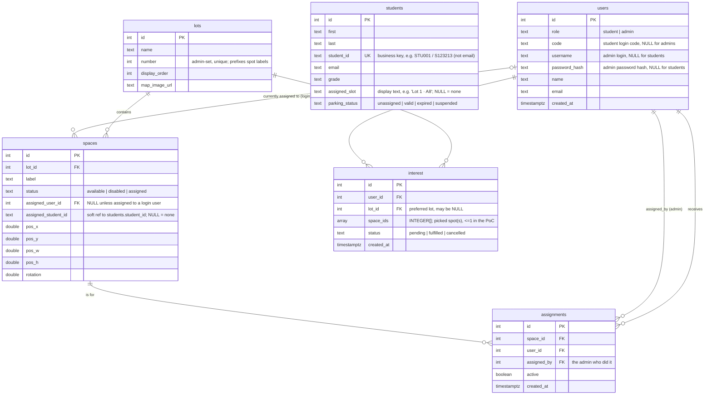

# LTRide — Backend Development Guide

> **Who this is for:** someone brand new to coding. Follow it **literally, line by line**. Gray boxes are commands you type into the **Terminal**. Type one line, press Enter, wait, then the next.
>
> **What you are building:** the "backend" — a program (written in Python with a framework called **Flask**) that runs on a server, stores data in a **database**, and answers requests from the website over the internet as **JSON**. The website (frontend) has its own guide: [`../ui/ui-development-guide.md`](https://github.com/LTRide2/lt-parking-site-project/blob/main/plan/ui/ui-development-guide.md). Read the [overall plan](../plan.md) first.
>
> **Where this doc sits:** this is the **backend design + implementation guide**, one of the docs in `plan/` — see the [document map in plan.md §0](../plan.md#0-start-here--which-document-do-i-read). `../plan.md` is the master/orchestrator; the sibling frontend guide is `../ui/ui-development-guide.md`; **deployment now has its own guide** at [`../deploy/deployment-guide.md`](../deploy/deployment-guide.md).
>
> **This guide builds the backend on your own computer (CRs B0–B9), one small CR at a time.** When it's working locally and you're ready to put it on AWS, switch to the [Deployment Guide](../deploy/deployment-guide.md) (CRs D0–D4).

---

## Run it & check your changes

One script brings up the whole stack — Postgres, the Flask API, and the React UI —
so you can see your changes running end-to-end:

```bash
scripts/local.sh up        # first run also sets up the database + dependencies
scripts/local.sh restart   # re-run this after you change code
scripts/local.sh down      # stop everything
```

- **UI:** http://localhost:5173
- **API health:** http://localhost:8000/api/health
- **Seeded logins (local dev only):** `admin` / `admin123`, or student codes `STU001`–`STU004`

Full runbook and troubleshooting: [`running-the-poc.md`](running-the-poc.md).

## The source structure you're building toward

Before you touch anything, here's the map. **The left side is what's in the repo today; the right side is where you're heading.** Each CR moves a little of the left into the right.

### What exists today (a course-template scaffold)

```
lt-parking-site-project/     # the repo root (you run most commands here)
├── backend/
│   ├── webapp/               # the real app lives here
│   │   ├── App/
│   │   │   ├── __init__.py   # Flask app factory (create_app)
│   │   │   ├── config.py     # settings (currently a hard-coded secret — B0 fixes this)
│   │   │   ├── model.py      # DB connection (currently SQLite)
│   │   │   └── views/        # the route handlers (endpoints)
│   │   │       ├── index.py  # placeholder routes from the template
│   │   │       ├── root.py
│   │   │       └── images.py
│   │   ├── sql/               # database SQL files
│   │   └── requirements.txt   # the Python libraries to install (§0.5)
│   └── .venv/                 # your Python virtual environment (created in §0.4)
├── frontend/                 # the React UI — its own guide: ../ui/ui-development-guide.md
├── deploy/                   # AWS deployment artifacts (docs: ../deploy/deployment-guide.md)
│   ├── params/prod.json     # your AWS settings
│   ├── server/              # nginx + systemd + provision.sh (CR D1b)
│   └── cfn/                 # 01-network / 02-database / 03-compute / 04-dns (CR D1)
├── scripts/                  # deploy orchestration — one entrypoint, four concerns
│   └── deploy.sh            # scripts/deploy.sh <secrets|infra|db|app> (creates infra + ships code)
├── plan/                    # the design docs (master + one per component)
│   ├── plan.md              #   the master/orchestrator design doc
│   ├── backend/backend-development-guide.md   # this guide
│   ├── ui/ui-development-guide.md              # the frontend guide
│   └── deploy/deployment-guide.md             # the deployment guide (D0–D4 + reference)
└── backend/webapp/var/ , *.pem   # local data & a key file — leave the .pem alone
```

> **One app, one place.** Everything backend lives under **`backend/webapp/`** in this single repo — there's no separate app copy to ignore and no separate backend repo to clone; `deploy/` and `plan/` are siblings of `backend/` at the repo root.

### What it becomes as you finish the CRs (the target)

This is the same `backend/webapp/App/` folder, filled in. Each file maps to a CR so you always know *where* new code goes:

```
backend/webapp/
├── App/
│   ├── __init__.py          # registers all the blueprints below + CORS + error handling
│   ├── config.py            # reads SECRET_KEY, DATABASE_URL, CORS_ORIGINS from .env   (B0)
│   ├── db.py                # connects to PostgreSQL, returns rows as dicts            (B3)
│   ├── auth.py              # makes/checks login tokens (JWT), @require_role decorator (B3)
│   ├── serialize.py         # shared SPACE_SELECT/INTEREST_SELECT + row->dict funcs    (B4)
│   ├── static/uploads/      # lot map images uploaded via B9's map endpoint
│   └── views/               # one file per feature area — these are the "endpoints"
│       ├── health.py        # GET /api/health                                          (B1)
│       ├── auth.py          # POST /api/auth/student | /admin , GET /api/auth/me        (B3)
│       ├── lots.py          # GET /api/lots , GET /api/lots/<id>/spaces                 (B4)
│       │                    # + PUT /api/lots/<id>/layout (B8)
│       │                    # + POST/DELETE /api/lots , POST /api/lots/<id>/map (B9)
│       ├── spaces.py        # PATCH /api/spaces , PATCH /api/spaces/<id>                (B5)
│       ├── interest.py      # POST/GET /api/interest , GET/DELETE /api/interest/me      (B6)
│       ├── assignments.py   # POST /api/assignments , DELETE /api/assignments/<id>
│       │                    # + POST /api/assignments/move                             (B7)
│       └── students.py      # roster CRUD/import/assign — extension (B13/B14)
├── sql/
│   ├── migrations/
│   │   └── 001_init.sql     # all tables incl. students, spaces.pos_*/assigned_student_id (B2)
│   └── seed.sql             # sample lots, spaces, an admin, students + roster           (B2)
├── .env                     # your local secrets — never committed                     (B0)
├── .env.example             # a template of .env — safe to commit                      (B0)
└── requirements.txt         # the Python libraries
```

> **How to read this:** a **"view" / "blueprint"** is just a Python file holding a group of related endpoints. When the guide says *"add `views/auth.py`"*, you're adding one of these files and then telling `__init__.py` about it. The full per-endpoint request/response spec for every route lives in [**Appendix A — Backend API Reference**](#appendix-a--backend-api-reference-v1) at the end of this guide (moved here from `plan.md §7`).

---

## Part 0 — One-time setup

### 0.1 Install the tools

1. **VS Code** — <https://code.visualstudio.com> (same editor as the frontend).
2. **Python 3.11+** — macOS may already have it. Check:

   **macOS / Linux**
   ```bash
   python3 --version
   ```
   **Windows (PowerShell)**
   ```powershell
   python --version
   ```
   If it's missing or older than 3.11, install with Homebrew (see 0.2) via `brew install python@3.12`. **Windows:** `winget install Python.Python.3.12`.
3. **Homebrew** (the macOS app installer we'll reuse for everything) — if `brew --version` fails, install it from <https://brew.sh> (paste their one-line command). **Windows** has no Homebrew equivalent needed here — the steps below use `winget` (bundled with Windows 10/11) instead.
4. **Git** — check `git --version` (same as the frontend guide).
5. **PostgreSQL** — the database itself *and* its command-line tools (`psql`, `createdb`). Install it now; you'll **start it and put it on your PATH** in CR B2 (there's a full step-by-step box there):

   **macOS / Linux**
   ```bash
   brew install postgresql@16
   ```
   **Windows (PowerShell)**
   ```powershell
   winget install PostgreSQL.PostgreSQL.16   # installs & starts the "postgresql-x64-16" service
   ```
   > `psql` is the terminal program for talking to the database; `createdb` makes a new database. They arrive with this install but need two extra one-time steps (start the server + add to PATH) — all covered in the **"Installing and starting PostgreSQL"** box in CR B2. (On Windows, `winget install` starts the service and installs the tools, but you'll still need the PATH step there — see that box for the `C:\Program Files\PostgreSQL\16\bin` addition.)

### 0.2 Tell Git who you are (skip if you already did this for the frontend)

```bash
git config --global user.name "Your Name"
git config --global user.email "you@example.com"
```

### 0.3 Get the backend project

**macOS / Linux**
```bash
cd ~/workspace
cd lt-parking-site-project
ls
```
**Windows (PowerShell)**
```powershell
cd $HOME\workspace
cd lt-parking-site-project
ls
```
You should see folders like `backend/`, `frontend/`, `plan/`, `deploy/`. This is a single monorepo — the backend lives in `backend/`, alongside the frontend, the deploy scripts, and these plan docs.

### 0.4 Make a "virtual environment" (Python's private toolbox)

A **virtual environment** (venv) is a private folder of Python libraries just for this project, so it never clashes with the rest of your computer. It lives at `backend/.venv` (all backend commands below assume you're at the repo root and reference paths inside `backend/` explicitly).

**macOS / Linux**
```bash
python3 -m venv backend/.venv
source backend/.venv/bin/activate
```
**Windows (PowerShell)**
```powershell
python -m venv backend\.venv
backend\.venv\Scripts\Activate.ps1
```
> If activation fails with a script-execution error, run `Set-ExecutionPolicy -Scope Process RemoteSigned` first, then retry.

After the second line your prompt shows `(.venv)` at the start. That means it's active. **You must activate the venv every time you open a new terminal** to work on the backend, from the repo root (`source backend/.venv/bin/activate` on macOS/Linux, `backend\.venv\Scripts\Activate.ps1` on Windows).

To turn it off later: type `deactivate`.

### 0.5 Install the backend's libraries

The list of libraries lives in **`backend/webapp/requirements.txt`**. From the repo root (`~/workspace/lt-parking-site-project`), with the venv active, run:

**macOS / Linux**
```bash
pip install -r backend/webapp/requirements.txt
```
**Windows (PowerShell)**
```powershell
pip install -r backend\webapp\requirements.txt
```

> **Tip:** if you'd rather not type the `backend/webapp/` path each time, you can `cd backend/webapp` first and then run `pip install -r requirements.txt`. Just remember which folder you're in — `pwd` tells you (both platforms — PowerShell has a `pwd` alias too).

---

## Part 1 — Build the backend, CR by CR

> **The same Git routine as the frontend** (see [`../ui/ui-development-guide.md`](https://github.com/LTRide2/lt-parking-site-project/blob/main/plan/ui/ui-development-guide.md) Part B/C). Each backend CR is `cr/b<N>-<slug>` and **branches off the previous backend CR**. Every PR uses the CR description template and includes a local testing guide. The full stacked-CR strategy and the live [CR status tracker](../plan.md#82-cr-status-tracker) are in [`../plan.md §8`](../plan.md#8-implementation-strategy-stacked-crs).
>
> **How you'll test the backend without a browser:** with a tool called `curl` (sends a request from the terminal) and your terminal output. Each CR below gives you the exact `curl` command and what you should see back.

### Vocabulary

- **Endpoint / route** — a URL the backend answers, like `GET /api/lots`. "GET" / "POST" / "PATCH" / "DELETE" are the *method* (read / create / update / delete).
- **JSON** — the text format data travels in: `{"name": "Lot 1"}`.
- **Database** — where data is permanently stored, in tables (like spreadsheets).
- **Migration** — a `.sql` file that creates or changes database tables. We number them so they run in order.
- **Environment variable** — a setting read from outside the code (like a password) so secrets aren't written in the code.

---

### The "☁️ Cloud check" recipe (deploy a CR and test it on the real server)

Each CR below ends with two test passes:
- **Local testing guide** — test on your laptop (always do this first; it's fast and free).
- **☁️ Cloud check** — *optionally* push the same CR to the real AWS server and confirm it works there too. This catches "works on my machine" problems (missing env var, migration not applied, CORS) early instead of all at once at the end.

**One-time prerequisite (do this once, before your first cloud check).** The AWS server has to exist before you can deploy to it. That setup lives in **Part 2** — jump ahead and do **D0** (AWS account + CLI), **D1** (templates), and **D2** (`scripts/deploy.sh infra up`) one time. It takes ~15 min and ~a few dollars/month while it's running (or `scripts/deploy.sh infra down` between sessions). Come back here once `scripts/deploy.sh infra outputs` prints a public IP.

**The repeatable recipe — run this after committing any CR you want to verify in the cloud:**

> **Windows note:** `scripts/deploy.sh` is a `#!/bin/bash` script — run it from **Git Bash** (bundled with [Git for Windows](https://git-scm.com/download/win)) or **WSL**, not PowerShell/`cmd`. This applies everywhere this recipe is referenced below.

**macOS / Linux (and Git Bash / WSL on Windows)**
```bash
# 1) make sure your CR is committed and pushed (the app concern deploys the commit on the box's branch)
git push

# 2) if this CR added a migration, apply it FIRST — a separate concern; `app` does NOT migrate
cd ~/workspace/lt-parking-site-project
scripts/deploy.sh db migrate       # only when sql/migrations/ changed

# 3) ship the code to the server (backend-only builds nothing; restarts gunicorn)
scripts/deploy.sh app backend      # use `scripts/deploy.sh app all` once the frontend is also ready

# 4) find your server address
scripts/deploy.sh infra outputs    # note the ElasticIp / PublicIp
```
**Windows (PowerShell), if you'd rather set up the path before dropping into Git Bash**
```powershell
cd $HOME\workspace\lt-parking-site-project
# then run steps 1-3 above from Git Bash or WSL
```
Then run that CR's **☁️ Cloud check** line below, swapping `http://localhost:8000` for `http://<ElasticIp>`. That's the only difference from local testing — same endpoints, real server. On Windows, prefer `Invoke-RestMethod http://<ElasticIp>/api/...` over `curl` for a plain GET (see the note in each CR's cloud check).

> **Tip:** if a cloud check fails but the local test passed, it's almost always (a) a migration that didn't run on the server, (b) a missing env var in the server's `.env`, or (c) CORS. See **Part 3 — Operating & troubleshooting**.

---

### CR B0 — Clean slate & safety (do this first)

**Goal:** make the project safe and tidy before building features. (This is the deferred security cleanup — **do not touch the `aws-tutorial.pem` key**; that one is being handled separately.)

**Branch:**
```bash
git checkout main
git pull
git checkout -b cr/b0-hygiene
```

**Steps:**

1. **Stop committing secrets and junk.** Create (or open) the file `.gitignore` at the repo root and make sure it contains **exactly** these lines (add any that are missing — order doesn't matter):
   ```gitignore
   # Python
   .venv/
   env/
   __pycache__/
   *.pyc

   # local database files (if you ever use SQLite)
   *.sqlite3

   # secrets & local settings — NEVER commit these
   .env

   # the AWS key file (handled separately — do not touch the key itself)
   *.pem

   # build output / dependencies
   node_modules/
   dist/
   ```

2. **Replace `backend/webapp/requirements.txt` entirely.** It still carries stale course-template pins (`Flask==2.2.2`, `Werkzeug==2.2.2`, `pytest==7.2.1`, …) left over from the scaffold — old enough that they fail to install on a modern Python. Delete everything in the file and replace it with **exactly** these seven lines:
   ```text
   Flask>=2.2
   flask-cors>=4.0
   psycopg[binary]>=3.1
   PyJWT>=2.8
   python-dotenv>=1.0
   Werkzeug>=2.2
   gunicorn>=21.2
   ```
   Then install them (venv active):

   **macOS / Linux**
   ```bash
   pip install -r backend/webapp/requirements.txt
   ```
   **Windows (PowerShell)**
   ```powershell
   pip install -r backend\webapp\requirements.txt
   ```
   > **Troubleshooting — install errors on a modern Python.** If `pip install` fails with build errors or "no matching distribution," you likely still have old pinned lines (`Flask==2.2.2`, `Werkzeug==2.2.2`, …) mixed in below the new ones — those exact old versions don't install on current Python. Re-open the file and confirm it holds **only** the seven `>=` lines above, nothing else.

3. **Move the secret key out of the code.** Open `backend/webapp/App/config.py`. Find the hard-coded line that looks like `SECRET_KEY = "some-literal-string"` and replace the whole file's settings with this env-driven version:
   ```python
   # backend/webapp/App/config.py
   """All settings come from environment variables (loaded from .env locally)."""
   import os

   # Loads variables from a local .env file if present. On the real server the
   # variables are set by systemd, so this is a no-op there.
   from dotenv import load_dotenv
   load_dotenv()

   # Required — the app refuses to start if these are missing.
   SECRET_KEY = os.environ["SECRET_KEY"]
   DATABASE_URL = os.environ["DATABASE_URL"]

   # Optional — sensible defaults for local development.
   CORS_ORIGINS = os.environ.get("CORS_ORIGINS", "http://localhost:5173")
   JWT_EXP_HOURS = int(os.environ.get("JWT_EXP_HOURS", "12"))
   ```
   > **Why `os.environ[...]` (square brackets) and not `.get(...)`?** Square brackets make the app crash immediately with a clear error if a required secret is missing — far better than starting up "half-configured" and failing mysteriously later.

4. **Create a `.env` file** inside `backend/` (it's git-ignored, so it stays on your machine only). This holds your *local* secrets:
   ```dotenv
   SECRET_KEY=dev-only-change-me-to-anything-long-and-random
   DATABASE_URL=postgresql://localhost/ltride
   CORS_ORIGINS=http://localhost:5173
   JWT_EXP_HOURS=12
   ```

5. **Create `.env.example`** inside `backend/` — same keys, but **no real secrets**. This one *is* committed so the next person knows what to fill in:
   ```dotenv
   SECRET_KEY=
   DATABASE_URL=postgresql://localhost/ltride
   CORS_ORIGINS=http://localhost:5173
   JWT_EXP_HOURS=12
   ```

**Local testing guide:**
1. Setup: `source backend/.venv/bin/activate`; create the `.env` file from step 4.
2. Steps:
   ```bash
   git status                                  # what would be committed?
   cd backend
   python -c "import webapp.App.config as c; print('SECRET loaded:', bool(c.SECRET_KEY))"
   ```
3. Expected:
   - `git status` does **not** list `.venv/`, `__pycache__`, `.env`, or any `*.pem` file.
   - The `python -c ...` line prints `SECRET loaded: True` (proves the secret comes from `.env`, not the code).
   - If you temporarily rename `.env`, that same command crashes with `KeyError: 'SECRET_KEY'` — that's the intended "fail loud" behavior.

**Commit & push:**
```bash
git add -A
git commit -m "B0: gitignore junk, move SECRET_KEY/DATABASE_URL to env, add .env.example"
git push -u origin cr/b0-hygiene
```
PR base = `main`.

---

### CR B1 — Health check (prove the server runs)

**Depends on:** B0. **Branch off B0.**

**Goal:** one tiny endpoint, `GET /api/health`, that returns `{"data":{"status":"ok"}}`. This proves the whole setup works before adding anything complex.

**Branch:**
```bash
git checkout cr/b0-hygiene
git checkout -b cr/b1-health
```

**Steps:**

1. **Clear the old template routes.** `backend/webapp/App/` still has dead weight from the course-template scaffold that would otherwise conflict with the factory you're about to write. Delete it now:

   **macOS / Linux**
   ```bash
   rm backend/webapp/App/model.py backend/webapp/App/index.py
   rm backend/webapp/App/views/index.py backend/webapp/App/views/root.py backend/webapp/App/views/images.py
   ```
   **Windows (PowerShell)**
   ```powershell
   Remove-Item backend\webapp\App\model.py, backend\webapp\App\index.py
   Remove-Item backend\webapp\App\views\index.py, backend\webapp\App\views\root.py, backend\webapp\App\views\images.py
   ```
   > `Remove-Item` needs a comma-separated list for multiple paths (unlike bash `rm`'s space-separated args), and forward slashes become backslashes.

   Then replace `backend/webapp/App/views/__init__.py` with a one-line docstring (it just marks the folder as a package — each view module below registers its own routes):
   ```python
   # backend/webapp/App/views/__init__.py
   """Route blueprints, one module per feature area (health, auth, lots, ...)."""
   ```

2. **Create the health route.** In `backend/webapp/App/views/`, create a new file `health.py`:
   ```python
   # backend/webapp/App/views/health.py
   from datetime import datetime, timezone
   from flask import Blueprint, jsonify

   # A "Blueprint" is a group of related routes. We register it in __init__.py.
   bp = Blueprint("health", __name__)

   @bp.get("/api/health")
   def health():
       now = datetime.now(timezone.utc).isoformat()
       return jsonify({"data": {"status": "ok", "time": now}})
   ```

3. **Write the app factory.** Open `backend/webapp/App/__init__.py` and replace its contents with this. `create_app()` is the standard Flask pattern: one function that builds and returns the app.
   ```python
   # backend/webapp/App/__init__.py
   from flask import Flask, jsonify
   from flask_cors import CORS

   from . import config


   def create_app():
       app = Flask(__name__)
       app.config["SECRET_KEY"] = config.SECRET_KEY

       # Allow the React dev server (and later the real site) to call this API.
       CORS(app, origins=config.CORS_ORIGINS.split(","), supports_credentials=True)

       # Register every blueprint (group of routes). We add more in later CRs.
       from .views import health
       app.register_blueprint(health.bp)

       # Turn any uncaught error into our standard JSON error envelope so the
       # frontend always gets predictable shapes.
       @app.errorhandler(404)
       def not_found(_e):
           return jsonify({"error": {"code": "not_found", "message": "Not found"}}), 404

       @app.errorhandler(500)
       def server_error(_e):
           return jsonify({"error": {"code": "server_error", "message": "Server error"}}), 500

       return app


   # Lets `flask run` find the app via FLASK_APP=webapp.App
   app = create_app()
   ```

**Run the server.** `FLASK_APP=webapp.App` is a Python **module path**, not a filesystem path — it only resolves with your current directory set to `backend/` (that's where the `webapp` package lives). `cd` there first, venv still active, in its own terminal:

**macOS / Linux**
```bash
cd backend
export FLASK_APP=webapp.App
flask run --port 8000
```
**Windows (PowerShell)**
```powershell
cd backend
$env:FLASK_APP = "webapp.App"
flask run --port 8000
```
> If you get `ModuleNotFoundError: webapp`, you're in the wrong folder — run it from `~/workspace/lt-parking-site-project/backend` (where the `webapp/` folder is visible with `ls`). **Windows:** `cd $HOME\workspace\lt-parking-site-project\backend`.
>
> **Troubleshooting — `ImportError: cannot import name 'index' from 'App.views'` (or similar for `root`/`images`).** Something still references a template route you deleted in step 1 — usually a stray `.pyc` in `__pycache__` or `views/__init__.py` not yet reduced to the one-line docstring. Delete `backend/webapp/App/**/__pycache__` and confirm `views/__init__.py` holds only the docstring, then retry.

**Local testing guide:**
1. Setup: venv active; `.env` exists (from B0); `flask run --port 8000` in one terminal.
2. Steps: in a **second** terminal:

   **macOS / Linux**
   ```bash
   curl -i http://localhost:8000/api/health
   curl -i http://localhost:8000/api/does-not-exist
   ```
   **Windows (PowerShell)**
   ```powershell
   Invoke-RestMethod http://localhost:8000/api/health
   curl.exe -i http://localhost:8000/api/does-not-exist
   ```
   > **Why `curl.exe` for the second line?** `Invoke-RestMethod` throws an exception on any non-2xx response instead of printing the body, so it can't show you a `404`. `curl.exe` (bundled with Windows 10+) behaves like Linux `curl` and prints the status + body as-is — use it whenever a step is deliberately checking an error status code. Later CRs reuse this same split.
3. Expected:
   - The first returns `200` and `{"data":{"status":"ok","time":"...."}}`.
   - The second returns `404` and `{"error":{"code":"not_found","message":"Not found"}}` — proving the error envelope works.

**☁️ Cloud check (optional):** run the recipe (`git push` → `scripts/deploy.sh app backend` → `scripts/deploy.sh infra outputs`), then:

**macOS / Linux**
```bash
curl -i http://<ElasticIp>/api/health     # expect 200 {"data":{"status":"ok",...}}
```
**Windows (PowerShell)**
```powershell
Invoke-RestMethod http://<ElasticIp>/api/health     # expect {"data":{"status":"ok",...}}
```
This is the best first cloud check — if `/api/health` works on the server, your whole deploy pipeline (git pull → gunicorn → nginx) is healthy.

---

### CR B2 — Database schema & seed data

**Depends on:** B1. **Branch off B1.**

**Goal:** create the real tables and put a little test data in so later CRs have something to read.

**Branch:**
```bash
git checkout cr/b1-health
git checkout -b cr/b2-schema
```

#### The database diagram (what you're building)

These are the six tables and how they connect. An arrow `A → B` means "a row in A points at a row in B" (a *foreign key*). `spaces.assigned_student_id` is a **soft** reference (no FK constraint) so a spot can be held by a roster student with no login account.



**The fixed value sets (enums):**
- `users.role` ∈ `{student, admin}`
- `spaces.status` ∈ `{available, disabled, assigned}`
- `interest.status` ∈ `{pending, fulfilled, cancelled}` (a student *withdraws* a pending request → `cancelled`; matches plan.md §5.1 / §7.1 and the frontend `interestSlice`)
- `students.parking_status` ∈ `{unassigned, valid, expired, suspended}`

#### Step 1 — Create the database (one time)

**macOS / Linux**
```bash
createdb ltride
```
**Windows (PowerShell)**
```powershell
createdb ltride
```
> If `createdb` says "command not found", Postgres isn't on your PATH yet — see the **"Installing and starting PostgreSQL"** box at the end of this CR, do that, then come back. (Windows: add `C:\Program Files\PostgreSQL\16\bin` to your `PATH`.)

#### Step 2 — Write the schema file

Create the folder and file `backend/webapp/sql/migrations/001_init.sql` with **exactly** this content (verified against the shipped file, `backend/webapp/sql/migrations/001_init.sql:1`). Read the comments — they explain each choice.

> **Ignore the stray `backend/webapp/sql/schema.sql` and `backend/webapp/sql/data.sql`.** These are leftover course-template scaffolding (an old SQLite `developer` table), not part of LTRide. Nothing reads them; the only SQL this project runs is `migrations/001_init.sql` and `seed.sql`.

```sql
-- backend/webapp/sql/migrations/001_init.sql
-- Initial schema for LTRide. Safe to re-run: it drops then recreates everything.

BEGIN;

DROP TABLE IF EXISTS assignments CASCADE;
DROP TABLE IF EXISTS interest    CASCADE;
DROP TABLE IF EXISTS spaces      CASCADE;
DROP TABLE IF EXISTS lots        CASCADE;
DROP TABLE IF EXISTS students    CASCADE;
DROP TABLE IF EXISTS users       CASCADE;

-- USERS: both students and admins live here, told apart by `role`.
--   students  -> have a `code`, no username/password
--   admins    -> have username + password_hash, no code
CREATE TABLE users (
    id            SERIAL PRIMARY KEY,
    role          TEXT NOT NULL CHECK (role IN ('student', 'admin')),
    code          TEXT UNIQUE,                 -- student login code (e.g. STU001)
    username      TEXT UNIQUE,                 -- admin login name
    password_hash TEXT,                        -- admin password (hashed, never plain)
    name          TEXT NOT NULL,
    email         TEXT,
    created_at    TIMESTAMPTZ NOT NULL DEFAULT now()
);

-- STUDENTS: the admin-managed roster, separate from the login/auth user.
--   student_id is the business primary key; CSV upserts and slot assignments
--   are keyed on it. A roster row may exist with no matching login user.
CREATE TABLE students (
    id             SERIAL PRIMARY KEY,
    first          TEXT NOT NULL,
    last           TEXT NOT NULL,
    student_id     TEXT NOT NULL UNIQUE,       -- e.g. STU001 / S123213
    email          TEXT,
    grade          TEXT,                        -- stored as text (mirrors the UI)
    assigned_slot  TEXT,                        -- display text, e.g. "Lot 1 · A8"; NULL = none
    parking_status TEXT NOT NULL DEFAULT 'unassigned'
                   CHECK (parking_status IN ('unassigned', 'valid', 'expired', 'suspended'))
);

-- LOTS: a parking lot / area.
--   number is the admin-assigned lot number, unique, used to prefix spot labels.
CREATE TABLE lots (
    id            SERIAL PRIMARY KEY,
    name          TEXT NOT NULL,
    number        INTEGER UNIQUE,              -- admin-assigned lot number (label prefix)
    display_order INTEGER NOT NULL DEFAULT 0,
    map_image_url TEXT
);

-- SPACES: one parking space, belongs to a lot.
--   pos_x / pos_y are where the space sits on the map (normalized 0..1 fractions).
--   pos_w / pos_h are the slot's size as fractions of the map, so it keeps its
--   ratio at any zoom. NULL position/size = "no authored layout yet".
--   assigned_student_id is a soft reference to students.student_id, so a spot can
--   be held by a roster student who has no login account.
CREATE TABLE spaces (
    id                  SERIAL PRIMARY KEY,
    lot_id              INTEGER NOT NULL REFERENCES lots(id) ON DELETE CASCADE,
    label               TEXT NOT NULL,
    status              TEXT NOT NULL DEFAULT 'available'
                        CHECK (status IN ('available', 'disabled', 'assigned')),
    assigned_user_id    INTEGER REFERENCES users(id) ON DELETE SET NULL,
    assigned_student_id TEXT,                  -- roster student_id (soft ref); NULL = none
    pos_x               DOUBLE PRECISION CHECK (pos_x IS NULL OR (pos_x >= 0 AND pos_x <= 1)),
    pos_y               DOUBLE PRECISION CHECK (pos_y IS NULL OR (pos_y >= 0 AND pos_y <= 1)),
    pos_w               DOUBLE PRECISION CHECK (pos_w IS NULL OR (pos_w >= 0 AND pos_w <= 1)),
    pos_h               DOUBLE PRECISION CHECK (pos_h IS NULL OR (pos_h >= 0 AND pos_h <= 1)),
    rotation            DOUBLE PRECISION,      -- degrees; NULL treated as 0
    UNIQUE (lot_id, label)
);

-- INTEREST: a student registering that they want a spot.
--   space_ids holds the specific spots the student picked (their preference);
--   a request holds at most one, kept as an array for forward-compatibility.
CREATE TABLE interest (
    id         SERIAL PRIMARY KEY,
    user_id    INTEGER NOT NULL REFERENCES users(id) ON DELETE CASCADE,
    lot_id     INTEGER REFERENCES lots(id) ON DELETE SET NULL,
    space_ids  INTEGER[] NOT NULL DEFAULT '{}',
    status     TEXT NOT NULL DEFAULT 'pending'
               CHECK (status IN ('pending', 'fulfilled', 'cancelled')),
    created_at TIMESTAMPTZ NOT NULL DEFAULT now()
);

-- Stop a student having two *active* (pending) requests at once.
CREATE UNIQUE INDEX one_active_interest_per_user
    ON interest (user_id)
    WHERE status = 'pending';

-- ASSIGNMENTS: an admin gave a space to a student. History is kept (active flag).
CREATE TABLE assignments (
    id          SERIAL PRIMARY KEY,
    space_id    INTEGER NOT NULL REFERENCES spaces(id) ON DELETE CASCADE,
    user_id     INTEGER NOT NULL REFERENCES users(id) ON DELETE CASCADE,
    assigned_by INTEGER NOT NULL REFERENCES users(id),   -- the admin
    active      BOOLEAN NOT NULL DEFAULT TRUE,
    created_at  TIMESTAMPTZ NOT NULL DEFAULT now()
);

-- A space can have at most ONE active assignment at a time.
CREATE UNIQUE INDEX one_active_assignment_per_space
    ON assignments (space_id)
    WHERE active;

COMMIT;
```

> **Why the partial unique indexes?** They let the *database itself* enforce the rules ("one pending request per student", "one active assignment per space") so you can't get into a bad state even if there's a bug in the Python code. The `WHERE` clause means the rule only applies to the rows that matter (e.g. only `pending` interest).

> **Why `pos_x/pos_y/pos_w/pos_h/rotation` are here from the start.** These columns aren't used until [CR B8](#cr-b8--save-lot-layout-spot-positions) (the drag-and-drop layout editor, frontend [U8](https://github.com/LTRide2/lt-parking-site-project/blob/main/plan/ui/ui-development-guide.md#cr-u8--place--arrange-parking-spots-drag-and-drop-layout-editor)) — but this is a fresh schema that hasn't shipped anywhere, so we **design them in now** rather than bolt them on with a later migration. A column can exist before the feature that fills it; that's normal, and it keeps the data model honest (spot placement — position *and* size — is a real property of a space, per plan.md §5.1). Migrations earn their keep once `001_init.sql` has actually run on a live database — from that point on you add new migration files instead of editing this one.

> **These columns/tables ship in `001_init.sql` from day one — not as later migrations.** The PoC (see the provenance note at the top of this guide) built the whole schema above — including `students`, `assigned_student_id`, `space_ids`, and `lots.number` — in one pass; there is no separate `002_students.sql`. If you're following the stacked-CR path, CR B2 already gives you every column the extension CRs need; those CRs (their own lessons, e.g. `lessons/B13-manage-student-roster.md`) add only the **endpoints and business logic** on top of what's already here. The full unified data model is [plan.md §5.1](../plan.md#51-data-model-entities); each extension maps to a CR in [plan.md §8.2](../plan.md#82-cr-status-tracker):
> - **`students` roster (B13)** — full CRUD + CSV import against the table above, keyed on **`student_id`** (a school id string, e.g. `STU001` — *not* email). Distinct from `users`; linked by `users.code = students.student_id`. CSV import also **provisions a login** in `users` for each imported student (identity only — metadata stays in `students`), so they can sign in without a separate step.
> - **`spaces.assigned_student_id` (B14)** — `POST /api/students/:id/assign` points a roster student (with or without a login) at a space — the dual assignment identity this column exists for.
> - **`interest.space_ids` "pick a spot" (B15)** — `POST /api/interest` upserts the caller's one active request with a specific chosen spot; `DELETE /api/interest/me` withdraws (→ `cancelled`).
> - **`POST /api/assignments/move` (B16)** — no schema change; a transactional endpoint that frees a space and re-queues its request as `pending` in another lot.

#### Step 3 — Make the admin password hash

We never store a plain password. Generate a hash for the admin's password (`admin123` for local dev) using the same library the app will use to check it:

```bash
python -c "from werkzeug.security import generate_password_hash; print(generate_password_hash('admin123'))"
```
This prints a long string starting with `scrypt:` or `pbkdf2:`. **Copy that whole string** — you'll paste it into the seed file in the next step.

> **Alternative — `backend/webapp/bin/add-admin`.** Once the schema exists you can skip hand-editing a hash into the seed file and instead run `./backend/webapp/bin/add-admin --username admin --name "Admin" --email admin@lt.edu` (it prompts for the password twice, hashes it the same way, and upserts the `users` row directly). See [`running-the-poc.md` §3](running-the-poc.md) for the full flag reference. The seed file below still hand-embeds a hash so you see how the hash gets there the first time.

#### Step 4 — Write the seed file

Create `backend/webapp/sql/seed.sql`. Replace `PASTE_HASH_HERE` with the string you just copied. This mirrors the shipped `backend/webapp/sql/seed.sql:1` — same lots, layout, roster, and interest rows.

```sql
-- backend/webapp/sql/seed.sql
-- Sample data for local development. Re-runnable (clears the tables first).

BEGIN;

TRUNCATE assignments, interest, spaces, lots, students, users RESTART IDENTITY CASCADE;

-- One admin. password is 'admin123' (only for local dev!).
INSERT INTO users (role, username, password_hash, name, email) VALUES
    ('admin', 'admin', 'PASTE_HASH_HERE', 'Admin', 'admin@lt.edu');

-- Student login accounts. They log in with their code (no password).
--   ids 2..5 => STU001 Alice, STU002 Bob, STU003 Andrew, STU004 Olivia.
INSERT INTO users (role, code, name, email) VALUES
    ('student', 'STU001', 'Alice',  'alice@lt.edu'),
    ('student', 'STU002', 'Bob',    'bob@lt.edu'),
    ('student', 'STU003', 'Andrew', 'andrew@lt.edu'),
    ('student', 'STU004', 'Olivia', 'olivia@lt.edu');

-- Six lots, each with an admin-assigned number that prefixes its spot labels.
INSERT INTO lots (name, number, display_order, map_image_url) VALUES
    ('Lot 1',   1, 1, '/lots/lot1.jpg'),
    ('Lot 4',   4, 2, '/lots/lot4.jpg'),
    ('Lot 5',   5, 3, '/lots/lot5.jpg'),
    ('Lot 11', 11, 4, '/lots/lot11.jpg'),
    ('Lot 13', 13, 5, '/lots/lot13.jpg'),
    ('Lot 17', 17, 6, '/lots/lot17.jpg');

-- Lot 1 (id 1) — an authored layout (normalized x/y, default size), the U8 showcase.
--   A4 is disabled; A8 is assigned to Alice (user 2 / STU001) and rotated 90 deg.
INSERT INTO spaces (lot_id, label, status, assigned_user_id, assigned_student_id,
                    pos_x, pos_y, pos_w, pos_h, rotation) VALUES
    (1, 'A1', 'available', NULL,   NULL,     0.20, 0.22, 0.05, 0.03, 0),
    (1, 'A2', 'available', NULL,   NULL,     0.35, 0.22, 0.05, 0.03, 0),
    (1, 'A3', 'available', NULL,   NULL,     0.50, 0.22, 0.05, 0.03, 0),
    (1, 'A4', 'disabled',  NULL,   NULL,     0.65, 0.22, 0.05, 0.03, 0),
    (1, 'A5', 'available', NULL,   NULL,     0.20, 0.55, 0.05, 0.03, 0),
    (1, 'A6', 'available', NULL,   NULL,     0.35, 0.55, 0.05, 0.03, 0),
    (1, 'A7', 'available', NULL,   NULL,     0.50, 0.55, 0.05, 0.03, 0),
    (1, 'A8', 'assigned',  2,      'STU001', 0.65, 0.55, 0.05, 0.03, 90);

-- Other lots — positionless spaces (they fall back to the grid renderer).
--   Labels are "<lot number>-<index>"; the 2nd space in each lot starts disabled.
INSERT INTO spaces (lot_id, label, status)
SELECT 2, '4-'  || g, CASE WHEN g = 2 THEN 'disabled' ELSE 'available' END FROM generate_series(1, 10) AS g;
INSERT INTO spaces (lot_id, label, status)
SELECT 3, '5-'  || g, CASE WHEN g = 2 THEN 'disabled' ELSE 'available' END FROM generate_series(1, 8)  AS g;
INSERT INTO spaces (lot_id, label, status)
SELECT 4, '11-' || g, CASE WHEN g = 2 THEN 'disabled' ELSE 'available' END FROM generate_series(1, 14) AS g;
INSERT INTO spaces (lot_id, label, status)
SELECT 5, '13-' || g, CASE WHEN g = 2 THEN 'disabled' ELSE 'available' END FROM generate_series(1, 12) AS g;
INSERT INTO spaces (lot_id, label, status)
SELECT 6, '17-' || g, CASE WHEN g = 2 THEN 'disabled' ELSE 'available' END FROM generate_series(1, 20) AS g;

-- The A8 assignment (Alice), so the seed has one live assignment on record.
INSERT INTO assignments (space_id, user_id, assigned_by, active)
SELECT id, 2, 1, TRUE FROM spaces WHERE lot_id = 1 AND label = 'A8';

-- Interest: Alice already holds Lot 1 (one active request per student, so she
-- has no second row); Bob and Olivia both wait on Lot 4 (id 2), so Manual
-- Assign shows a real choice between two pending requests.
INSERT INTO interest (user_id, lot_id, status, created_at) VALUES
    (2, 1, 'fulfilled', '2026-08-01T09:00:00Z'),
    (3, 2, 'pending',   '2026-08-20T09:00:00Z'),
    (5, 2, 'pending',   '2026-08-22T09:00:00Z');

-- The roster. STU001/STU002 match login users' `code` so slot assignments sync
-- onto them; Alice already holds Lot 1 · A8.
INSERT INTO students (first, last, student_id, email, grade, assigned_slot, parking_status) VALUES
    ('Alice',  'Anderson', 'STU001', 'alice@lt.edu',  '11', 'Lot 1 · A8', 'valid'),
    ('Bob',    'Baker',    'STU002', 'bob@lt.edu',    '12', NULL,         'unassigned'),
    ('Andrew', 'Adams',    'STU003', 'andrew@lt.edu', '9',  NULL,         'unassigned'),
    ('Sarah',  'Smith',    'S123213','sarah@lt.edu',  '10', NULL,         'suspended'),
    ('Olivia', 'Owens',    'STU004', 'olivia@lt.edu', '11', NULL,         'unassigned');

COMMIT;
```

> **`generate_series(1, 10)`** is a Postgres trick that produces the numbers 1..10, so we insert that many spaces without writing one `INSERT` per row. `'4-' || g` glues the text label together (`||` is "join strings" in SQL); the `CASE WHEN g = 2 THEN 'disabled' ELSE 'available' END` gives each of these lots one pre-disabled spot so B5's testing guide has something to exercise beyond Lot 1.

#### Step 5 — Run them

**macOS / Linux**
```bash
psql ltride -f backend/webapp/sql/migrations/001_init.sql
psql ltride -f backend/webapp/sql/seed.sql
```
**Windows (PowerShell)**
```powershell
psql ltride -f backend\webapp\sql\migrations\001_init.sql
psql ltride -f backend\webapp\sql\seed.sql
```
Each should print a list of `CREATE TABLE` / `INSERT` lines and no `ERROR`.

**Local testing guide:**
1. Setup: Postgres running (**macOS/Linux:** `brew services start postgresql@16`; **Windows:** `net start postgresql-x64-16`); both files run with no error.
2. Steps: (identical on both OSes — `psql` takes the same arguments)
   ```bash
   psql ltride -c "\dt"                                          # list tables
   psql ltride -c "SELECT label, status, rotation FROM spaces WHERE lot_id=1 ORDER BY id;"
   psql ltride -c "SELECT code, name FROM users WHERE role='student';"
   psql ltride -c "SELECT student_id, assigned_slot, parking_status FROM students;"
   psql ltride -c "SELECT count(*) AS lot1_spaces FROM spaces WHERE lot_id=1;"
   ```
3. Expected:
   - `\dt` lists all six tables: `assignments, interest, lots, spaces, students, users`.
   - The spaces query shows `A1..A8`; `A4` is `disabled`; `A8` is `assigned` with `rotation` `90`.
   - The users query shows `STU001 Alice`, `STU002 Bob`, `STU003 Andrew`, `STU004 Olivia`.
   - The students query shows five rows incl. `S123213` (Sarah, `suspended`) and `STU001` (`Lot 1 · A8`, `valid`).
   - `lot1_spaces` = `8`.

**☁️ Cloud check (optional):** the schema/seed run against the **server's** database (RDS), not your laptop's. Migrations are their own concern — `scripts/deploy.sh db migrate` applies `sql/migrations/*.sql` on RDS (shipping code with `app` does **not** migrate); the **seed** is manual (you don't want dev data on a real site). To verify on the server:
```bash
scripts/deploy.sh db migrate               # applies 001_init.sql on RDS
ssh -i ~/.ssh/ltride-key.pem ubuntu@<ElasticIp>
sudo -u ltride bash -c 'set -a; . /home/ltride/app/backend/.env; set +a; psql "$DATABASE_URL" -c "\dt"'
# expect the six tables. To seed dev data on the server too (optional):
#   psql "$DATABASE_URL" -f /home/ltride/app/backend/webapp/sql/seed.sql
exit
```
Expect `\dt` to list the same six tables on RDS.

**Commit & push:**
```bash
git add backend/webapp/sql/
git commit -m "B2: add schema migration + dev seed data"
git push -u origin cr/b2-schema
```
> Double-check: the real admin hash is fine to commit here because it's a throwaway *local-dev* password. Never commit a hash of a real production password.

---

> #### 📦 Installing and starting PostgreSQL (do this once, if `createdb`/`psql` aren't found)
>
> `psql` and `createdb` are command-line tools that come **with PostgreSQL**. In §0.1 you ran `brew install postgresql@16`, which installs them — but two things often trip people up: the database **server isn't running yet**, and the tools **aren't on your PATH**. Fix both:
>
> **macOS / Linux:**
> 1. **Start the database server** (and have it auto-start on login):
>    ```bash
>    brew services start postgresql@16
>    ```
> 2. **Put the tools on your PATH.** Homebrew installs this version "keg-only", meaning you must add it yourself. Run the line for your Mac:
>    ```bash
>    # Apple Silicon (M1/M2/M3) Macs:
>    echo 'export PATH="/opt/homebrew/opt/postgresql@16/bin:$PATH"' >> ~/.zshrc
>    # Intel Macs:
>    echo 'export PATH="/usr/local/opt/postgresql@16/bin:$PATH"' >> ~/.zshrc
>    ```
>    Then reload your shell: `source ~/.zshrc` (or just open a new Terminal window).
> 3. **Verify:**
>    ```bash
>    psql --version        # should print "psql (PostgreSQL) 16.x"
>    createdb --version
>    ```
> 4. The very first connection sometimes fails with *"role does not exist"*. If so, create a database user matching your Mac username once:
>    ```bash
>    createuser -s "$(whoami)"
>    ```
>
> **Windows (PowerShell):**
> 1. `winget install PostgreSQL.PostgreSQL.16` installs the tools **and** starts the `postgresql-x64-16` service (no separate start step, unlike Homebrew). If it's ever stopped, restart with `net start postgresql-x64-16` or from `services.msc`.
> 2. **Put the tools on your PATH:** add `C:\Program Files\PostgreSQL\16\bin` to your `PATH` environment variable (Windows Settings → "Edit environment variables for your account", or `[Environment]::SetEnvironmentVariable("PATH", "$env:PATH;C:\Program Files\PostgreSQL\16\bin", "User")` in PowerShell), then open a new terminal.
> 3. **Verify:**
>    ```powershell
>    psql --version        # should print "psql (PostgreSQL) 16.x"
>    createdb --version
>    ```
> 4. If the first connection fails with *"role does not exist"*, create a database user matching your Windows username once:
>    ```powershell
>    createuser -s "$env:USERNAME"
>    ```
>
> **What is `psql`?** It's the interactive PostgreSQL client — a terminal program for talking to the database. `psql ltride` opens a session connected to the `ltride` database; `psql ltride -f file.sql` runs a file against it; `psql ltride -c "SQL..."` runs one command. Type `\q` to quit an interactive session.

---

### CR B3 — Authentication (login)

**Depends on:** B2. **Branch off B2.** **Unblocks frontend U1.**

**Goal:** the three auth endpoints so people can log in:
- `POST /api/auth/student` — body `{"code":"STU001"}` → returns a token + user.
- `POST /api/auth/admin` — body `{"username","password"}` → returns a token + user.
- `GET /api/auth/me` — returns the logged-in user (reads the `Authorization: Bearer <token>` header).

**Branch:**
```bash
git checkout cr/b2-schema
git checkout -b cr/b3-auth
```

#### Step 1 — Database helper (`backend/webapp/App/db.py`)

This is the **one place** that opens a connection to PostgreSQL. Everything else asks it for a connection. Create `backend/webapp/App/db.py`:
```python
# backend/webapp/App/db.py
"""Database access: one connection per request, rows returned as dicts."""
import psycopg
from psycopg.rows import dict_row
from flask import g

from . import config


def get_db():
    """Return this request's DB connection, opening one if needed."""
    if "db" not in g:
        g.db = psycopg.connect(config.DATABASE_URL, row_factory=dict_row)
    return g.db


def close_db(_e=None):
    """Close the connection at the end of the request (wired in __init__.py)."""
    db = g.pop("db", None)
    if db is not None:
        db.close()


def query(sql, params=()):
    """Run a SELECT, return a list of dict rows."""
    with get_db().cursor() as cur:
        cur.execute(sql, params)
        return cur.fetchall()


def query_one(sql, params=()):
    """Run a SELECT, return the first dict row or None."""
    with get_db().cursor() as cur:
        cur.execute(sql, params)
        return cur.fetchone()


def execute(sql, params=()):
    """Run an INSERT/UPDATE/DELETE and commit. Returns the first row if the
    SQL ends in RETURNING, else None."""
    db = get_db()
    with db.cursor() as cur:
        cur.execute(sql, params)
        row = cur.fetchone() if cur.description else None
    db.commit()
    return row
```
Then wire `close_db` into the app factory. In `backend/webapp/App/__init__.py`, inside `create_app()`, add after `CORS(...)`:
```python
    from . import db
    app.teardown_appcontext(db.close_db)
```

#### Step 2 — Auth service (`backend/webapp/App/auth.py`)

This creates and checks **tokens** (a JWT is a signed string that proves who you are) and provides the `@require_role` guard. Create `backend/webapp/App/auth.py`:
```python
# backend/webapp/App/auth.py
"""Token creation/verification and the route guards."""
from datetime import datetime, timedelta, timezone
from functools import wraps

import jwt
from flask import request, jsonify, g

from . import config
from .db import query_one


def issue_token(user):
    """Make a signed token that says who this user is and when it expires."""
    payload = {
        "user_id": user["id"],
        "role": user["role"],
        "exp": datetime.now(timezone.utc) + timedelta(hours=config.JWT_EXP_HOURS),
    }
    return jwt.encode(payload, config.SECRET_KEY, algorithm="HS256")


def _current_user():
    """Read the Bearer token, verify it, and load the user. None if invalid."""
    header = request.headers.get("Authorization", "")
    if not header.startswith("Bearer "):
        return None
    token = header.split(" ", 1)[1]
    try:
        payload = jwt.decode(token, config.SECRET_KEY, algorithms=["HS256"])
    except jwt.PyJWTError:
        return None
    return query_one("SELECT id, role, name, email FROM users WHERE id = %s",
                     (payload["user_id"],))


def _error(code, message, status):
    return jsonify({"error": {"code": code, "message": message}}), status


def require_auth(fn):
    """Allow any logged-in user. Stashes the user on flask.g."""
    @wraps(fn)
    def wrapper(*args, **kwargs):
        user = _current_user()
        if user is None:
            return _error("unauthorized", "Login required", 401)
        g.user = user
        return fn(*args, **kwargs)
    return wrapper


def require_role(role):
    """Allow only a given role (e.g. 'admin')."""
    def decorator(fn):
        @wraps(fn)
        def wrapper(*args, **kwargs):
            user = _current_user()
            if user is None:
                return _error("unauthorized", "Login required", 401)
            if user["role"] != role:
                return _error("forbidden", f"{role} only", 403)
            g.user = user
            return fn(*args, **kwargs)
        return wrapper
    return decorator
```

#### Step 3 — Auth routes (`backend/webapp/App/views/auth.py`)

Create `backend/webapp/App/views/auth.py`:
```python
# backend/webapp/App/views/auth.py
from flask import Blueprint, request, jsonify, g
from werkzeug.security import check_password_hash

from ..db import query_one
from ..auth import issue_token, require_auth

bp = Blueprint("auth", __name__)


def _err(code, message, status):
    return jsonify({"error": {"code": code, "message": message}}), status


def _public_user(u):
    return {"id": u["id"], "role": u["role"], "name": u["name"], "email": u.get("email")}


@bp.post("/api/auth/student")
def student_login():
    body = request.get_json(silent=True) or {}
    code = body.get("code")
    if not code:
        return _err("bad_request", "code is required", 400)
    user = query_one(
        "SELECT id, role, name, email FROM users WHERE role='student' AND code = %s", (code,))
    if user is None:
        return _err("unauthorized", "Unknown code", 401)
    return jsonify({"data": {"token": issue_token(user), "user": _public_user(user)}})


@bp.post("/api/auth/admin")
def admin_login():
    body = request.get_json(silent=True) or {}
    username, password = body.get("username"), body.get("password")
    if not username or not password:
        return _err("bad_request", "username and password are required", 400)
    user = query_one(
        "SELECT id, role, name, email, password_hash FROM users "
        "WHERE role='admin' AND username = %s", (username,))
    if user is None or not check_password_hash(user["password_hash"], password):
        return _err("unauthorized", "Bad credentials", 401)
    return jsonify({"data": {"token": issue_token(user), "user": _public_user(user)}})


@bp.post("/api/auth/logout")
def logout():
    # Tokens are stateless, so the client just discards it. 204 = "done, no body".
    return "", 204


@bp.get("/api/auth/me")
@require_auth
def me():
    return jsonify({"data": _public_user(g.user)})
```

#### Step 4 — Register the blueprint

In `backend/webapp/App/__init__.py`, next to where you registered `health`, add:
```python
    from .views import auth
    app.register_blueprint(auth.bp)
```

**Local testing guide:**
1. Setup: DB seeded (B2); `flask run --port 8000` running.
2. Steps:

   **macOS / Linux**
   ```bash
   # valid student
   curl -i -X POST http://localhost:8000/api/auth/student \
     -H 'Content-Type: application/json' -d '{"code":"STU001"}'
   # invalid student
   curl -i -X POST http://localhost:8000/api/auth/student \
     -H 'Content-Type: application/json' -d '{"code":"NOPE"}'
   # admin (password from B2 seed)
   curl -i -X POST http://localhost:8000/api/auth/admin \
     -H 'Content-Type: application/json' -d '{"username":"admin","password":"admin123"}'
   ```
   **Windows (PowerShell)** — using `curl.exe` since these deliberately check a `401`:
   ```powershell
   curl.exe -i -X POST http://localhost:8000/api/auth/student `
     -H "Content-Type: application/json" -d '{"code":"STU001"}'
   curl.exe -i -X POST http://localhost:8000/api/auth/student `
     -H "Content-Type: application/json" -d '{"code":"NOPE"}'
   curl.exe -i -X POST http://localhost:8000/api/auth/admin `
     -H "Content-Type: application/json" -d '{"username":"admin","password":"admin123"}'
   ```
   Copy the `token` value from a successful response, then:

   **macOS / Linux**
   ```bash
   curl -i http://localhost:8000/api/auth/me -H "Authorization: Bearer <paste-token>"
   curl -i http://localhost:8000/api/auth/me     # no token
   ```
   **Windows (PowerShell)**
   ```powershell
   curl.exe -i http://localhost:8000/api/auth/me -H "Authorization: Bearer <paste-token>"
   curl.exe -i http://localhost:8000/api/auth/me     # no token
   ```
3. Expected:
   - Valid student/admin → `200` with `{"data":{"token":"...","user":{...}}}`.
   - Wrong code / wrong password → `401` `{"error":{"code":"unauthorized",...}}`.
   - `/me` with token → `200` and your user; `/me` without token → `401`.

**☁️ Cloud check (optional):** after `scripts/deploy.sh app backend`, repeat the login against the server (the seed must have been run on RDS — see B2's cloud check):

**macOS / Linux**
```bash
curl -i -X POST http://<ElasticIp>/api/auth/student \
  -H 'Content-Type: application/json' -d '{"code":"STU001"}'
```
**Windows (PowerShell)**
```powershell
Invoke-RestMethod -Method Post http://<ElasticIp>/api/auth/student `
  -ContentType application/json -Body '{"code":"STU001"}'
```
Expect `200` with a token. A `500` here usually means `SECRET_KEY`/`DATABASE_URL` aren't set in the server's `.env` (`Part 3`).

**Commit & push:**
```bash
git add -A
git commit -m "B3: db helper, JWT auth service, student/admin login + /me"
git push -u origin cr/b3-auth
```

---

### CR B4 — Read lots & spaces

**Depends on:** B3. **Branch off B3.** **Unblocks frontend U3.**

**Goal:**
- `GET /api/lots` → all lots (with capacity + available counts).
- `GET /api/lots/:id/spaces` → spaces in one lot.

**Branch:**
```bash
git checkout cr/b3-auth
git checkout -b cr/b4-lots
```

**Step 1 — Create the shared serializer module, `backend/webapp/App/serialize.py`.** Every view module from here on needs to turn the same DB rows (a space, an interest row, a student) into the same JSON shape. Instead of re-writing that mapping in each view file — and risking two files drifting to different field names — this one module owns it. `SPACE_SELECT`/`INTEREST_SELECT` are shared SELECTs any view can extend with its own `WHERE`/`ORDER BY`; `lot()`/`space()`/`interest()`/`student()`/`public_user()` turn a fetched row into the exact response dict.

```python
# backend/webapp/App/serialize.py
"""Turn database rows into the exact JSON shapes the frontend slices consume.

The frontend contract is snake_case for response fields (see the store slices in
the SPA repo). Each function takes a row dict whose keys are the SQL column names
and returns the API dict. Keeping these here avoids drift across the view modules.
"""

# Shared SELECTs so every view reads a space/interest the same way. Callers append
# their own WHERE/ORDER BY and pass the rows straight to space()/interest().
SPACE_SELECT = """
    SELECT s.id, s.lot_id, s.label, s.status,
           s.assigned_user_id, s.assigned_student_id,
           s.pos_x, s.pos_y, s.pos_w, s.pos_h, s.rotation,
           COALESCE(u.name, st.first || ' ' || st.last) AS assigned_user_name
    FROM spaces s
    LEFT JOIN users u ON u.id = s.assigned_user_id
    LEFT JOIN students st ON st.student_id = s.assigned_student_id
"""

INTEREST_SELECT = """
    SELECT i.id, i.user_id, u.name AS user_name, i.lot_id, l.name AS lot_name,
           i.space_ids, i.status, i.created_at,
           ARRAY(SELECT sp.label FROM spaces sp WHERE sp.id = ANY(i.space_ids)) AS space_labels
    FROM interest i
    JOIN users u ON u.id = i.user_id
    LEFT JOIN lots l ON l.id = i.lot_id
"""


def public_user(row):
    """The safe, public view of a user (never exposes password_hash)."""
    return {"id": row["id"], "role": row["role"], "name": row["name"], "email": row.get("email")}


def lot(row):
    """A lot with its live capacity/availability counts."""
    return {
        "id": row["id"], "name": row["name"], "number": row["number"],
        "display_order": row["display_order"], "map_image_url": row["map_image_url"],
        "capacity": row["capacity"], "available_count": row["available_count"],
    }


def space(row):
    """A parking space; positions/size are normalized fractions (NULL if unset)."""
    return {
        "id": row["id"], "lot_id": row["lot_id"], "label": row["label"], "status": row["status"],
        "x": row["pos_x"], "y": row["pos_y"], "w": row["pos_w"], "h": row["pos_h"],
        "rotation": row["rotation"], "assigned_user_id": row["assigned_user_id"],
        "assigned_user_name": row.get("assigned_user_name"),
        "assigned_student_id": row["assigned_student_id"],
    }


def interest(row):
    """A student's request, including their preferred spot ids and labels."""
    created_at = row["created_at"]
    return {
        "id": row["id"], "user_id": row["user_id"], "user_name": row.get("user_name"),
        "lot_id": row["lot_id"], "lot_name": row.get("lot_name"),
        "space_ids": row["space_ids"] or [], "space_labels": row.get("space_labels") or [],
        "status": row["status"],
        "created_at": created_at.isoformat() if hasattr(created_at, "isoformat") else created_at,
    }


def student(row):
    """A roster student (business key is student_id, not id)."""
    return {
        "id": row["id"], "first": row["first"], "last": row["last"],
        "student_id": row["student_id"], "email": row["email"], "grade": row["grade"],
        "assigned_slot": row["assigned_slot"], "parking_status": row["parking_status"],
    }
```
> `interest()` and `student()` aren't consumed until [B6](#cr-b6--student-registers-interest) and the students CRs — they live here from the start because they're part of the same one shared module (`backend/webapp/App/serialize.py:1`), not because they're used yet.

**Step 2 — Create `backend/webapp/App/views/lots.py`**, importing `serialize` instead of hand-building dicts:
```python
# backend/webapp/App/views/lots.py
from flask import Blueprint, jsonify

from ..db import query, query_one
from ..auth import require_auth
from .. import serialize

bp = Blueprint("lots", __name__)


def _err(code, message, status):
    return jsonify({"error": {"code": code, "message": message}}), status


def _lot_spaces(lot_id):
    """Every space in a lot, serialized, ordered by id."""
    rows = query(serialize.SPACE_SELECT + " WHERE s.lot_id = %s ORDER BY s.id", (lot_id,))
    return [serialize.space(row) for row in rows]


@bp.get("/api/lots")
@require_auth
def list_lots():
    rows = query("""
        SELECT l.id, l.name, l.number, l.display_order, l.map_image_url,
               count(s.id)                                     AS capacity,
               count(s.id) FILTER (WHERE s.status='available') AS available_count
        FROM lots l
        LEFT JOIN spaces s ON s.lot_id = l.id
        GROUP BY l.id
        ORDER BY l.display_order, l.id
    """)
    return jsonify({"data": [serialize.lot(row) for row in rows]})


@bp.get("/api/lots/<int:lot_id>/spaces")
@require_auth
def lot_spaces(lot_id):
    if query_one("SELECT id FROM lots WHERE id = %s", (lot_id,)) is None:
        return _err("not_found", "Lot not found", 404)
    return jsonify({"data": _lot_spaces(lot_id)})
```
> **`GET /api/lots/:id/spaces` returns a bare array under `data`** — `{"data": [...]}`, *not* `{"data": {"lotId": ..., "spaces": [...]}}`. The lot id is already in the URL, so wrapping it again in the body would be redundant (`backend/webapp/App/views/lots.py:49`).

**Step 3 — Register it** in `backend/webapp/App/__init__.py`:
```python
    from .views import lots
    app.register_blueprint(lots.bp)
```

**Local testing guide:**
1. Setup: server running; a token from B3 (`export T=<token>` makes the commands shorter — **Windows:** `$T = "<token>"`, no `export` needed; PowerShell double-quoted strings interpolate `$T` the same way, so the `curl.exe`/`Invoke-RestMethod` lines below work unchanged with this variable. Later CRs use the same `$T`/`$A`/`$S` pattern without repeating this note).
2. Steps:

   **macOS / Linux**
   ```bash
   curl -i http://localhost:8000/api/lots -H "Authorization: Bearer $T"
   curl -i http://localhost:8000/api/lots/1/spaces -H "Authorization: Bearer $T"
   curl -i http://localhost:8000/api/lots/999/spaces -H "Authorization: Bearer $T"
   curl -i http://localhost:8000/api/lots          # no token
   ```
   **Windows (PowerShell)** — `curl.exe` since these check `404`/`401`:
   ```powershell
   curl.exe -i http://localhost:8000/api/lots -H "Authorization: Bearer $T"
   curl.exe -i http://localhost:8000/api/lots/1/spaces -H "Authorization: Bearer $T"
   curl.exe -i http://localhost:8000/api/lots/999/spaces -H "Authorization: Bearer $T"
   curl.exe -i http://localhost:8000/api/lots          # no token
   ```
3. Expected:
   - `/api/lots` → `200`; Lot 1 shows `"number":1, "capacity":8, "available_count":6` (A4 disabled, A8 assigned).
   - `/api/lots/1/spaces` → `200` with a bare array of 8 spaces; A8 shows `"status":"assigned","rotation":90,"assigned_user_id":2,"assigned_user_name":"Alice","assigned_student_id":"STU001"`; the rest are `null` for those fields.
   - Lot `999` → `404`; no token → `401`.

**☁️ Cloud check (optional):** after `scripts/deploy.sh app backend`, with a token from the server's `/api/auth/student`:

**macOS / Linux**
```bash
curl -s http://<ElasticIp>/api/lots -H "Authorization: Bearer $T"
```
**Windows (PowerShell)**
```powershell
Invoke-RestMethod http://<ElasticIp>/api/lots -Headers @{Authorization="Bearer $T"}
```
Expect the same lots JSON the local server returned (assuming RDS was seeded).

**Commit & push:**
```bash
git add -A && git commit -m "B4: read lots and spaces" && git push -u origin cr/b4-lots
```

---

### CR B5 — Admin enables/disables spaces

**Depends on:** B4. **Branch off B4.** **Unblocks frontend U4.**

**Goal:**
- `PATCH /api/spaces/:id` — change one space's status (`available` or `disabled`).
- `PATCH /api/spaces` — change many at once, body `{"ids":[...],"status":"disabled"}`.

Both require admin (`@require_role("admin")`). You **cannot** disable a space that is currently `assigned`: the single-space endpoint returns `409`, and the bulk endpoint rejects the **whole call** with `409` the moment *any* target is `assigned` — there is no per-id `skipped` list; none of the ids are touched.

**Branch:**
```bash
git checkout cr/b4-lots
git checkout -b cr/b5-spaces
```

**Step 1 — Create `backend/webapp/App/views/spaces.py`**, reusing `serialize` from B4:
```python
# backend/webapp/App/views/spaces.py
from flask import Blueprint, request, jsonify

from ..db import query, query_one, get_db
from ..auth import require_role
from .. import serialize

bp = Blueprint("spaces", __name__)
ALLOWED = {"available", "disabled"}   # admins toggle these; 'assigned' is set by the assign flow


def _err(code, message, status):
    return jsonify({"error": {"code": code, "message": message}}), status


def _space(space_id):
    row = query_one(serialize.SPACE_SELECT + " WHERE s.id = %s", (space_id,))
    return serialize.space(row) if row else None


@bp.patch("/api/spaces/<int:space_id>")
@require_role("admin")
def update_space(space_id):
    body = request.get_json(silent=True) or {}
    status = body.get("status")
    if status not in ALLOWED:
        return _err("bad_request", "status must be 'available' or 'disabled'", 400)

    space = query_one("SELECT id, status FROM spaces WHERE id = %s", (space_id,))
    if space is None:
        return _err("not_found", "Space not found", 404)
    if space["status"] == "assigned":
        return _err("conflict", "Space is assigned; unassign it first", 409)

    connection = get_db()
    with connection.cursor() as cursor:
        cursor.execute("UPDATE spaces SET status = %s WHERE id = %s", (status, space_id))
    connection.commit()
    return jsonify({"data": _space(space_id)})


@bp.patch("/api/spaces")
@require_role("admin")
def bulk_update_spaces():
    body = request.get_json(silent=True) or {}
    ids, status = body.get("ids"), body.get("status")
    if not isinstance(ids, list) or status not in ALLOWED:
        return _err("bad_request", "ids (array) and status (available|disabled) required", 400)

    targets = query("SELECT id, status FROM spaces WHERE id = ANY(%s)", (ids,))
    if any(row["status"] == "assigned" for row in targets):
        return _err("conflict", "cannot change an assigned space", 409)

    connection = get_db()
    with connection.cursor() as cursor:
        cursor.execute("UPDATE spaces SET status = %s WHERE id = ANY(%s)", (status, ids))
    connection.commit()

    rows = query(serialize.SPACE_SELECT + " WHERE s.id = ANY(%s) ORDER BY s.id", (ids,))
    return jsonify({"data": [serialize.space(row) for row in rows]})
```
> **The bulk endpoint returns the updated spaces, not an `updated`/`skipped` split.** Checking *every* target's status before writing anything (`targets`/`any(...)`) means the call either fully succeeds or fully fails — never half-applies (`backend/webapp/App/views/spaces.py:42`).

**Step 2 — Register it** in `backend/webapp/App/__init__.py`:
```python
    from .views import spaces
    app.register_blueprint(spaces.bp)
```

**Local testing guide:**
1. Setup: server running. Get an **admin** token (`export A=<admin-token>`) and a **student** token (`export S=<student-token>` — **Windows:** `$A = "<admin-token>"` / `$S = "<student-token>"`, no `export`).
2. Steps:

   **macOS / Linux**
   ```bash
   # bulk disable spaces 1,2,3 (A1,A2,A3 — all available) as admin
   curl -i -X PATCH http://localhost:8000/api/spaces \
     -H "Authorization: Bearer $A" -H 'Content-Type: application/json' \
     -d '{"ids":[1,2,3],"status":"disabled"}'
   # confirm it stuck
   curl -s http://localhost:8000/api/lots/1/spaces -H "Authorization: Bearer $A"
   # single re-enable
   curl -i -X PATCH http://localhost:8000/api/spaces/1 \
     -H "Authorization: Bearer $A" -H 'Content-Type: application/json' -d '{"status":"available"}'
   # bulk including an ASSIGNED space (8 = A8) -> whole call rejected, nothing changes
   curl -i -X PATCH http://localhost:8000/api/spaces \
     -H "Authorization: Bearer $A" -H 'Content-Type: application/json' \
     -d '{"ids":[2,8],"status":"disabled"}'
   # a student must NOT be allowed
   curl -i -X PATCH http://localhost:8000/api/spaces/2 \
     -H "Authorization: Bearer $S" -H 'Content-Type: application/json' -d '{"status":"available"}'
   ```
   **Windows (PowerShell)** — `curl.exe` since these check `409`/`403`:
   ```powershell
   curl.exe -i -X PATCH http://localhost:8000/api/spaces `
     -H "Authorization: Bearer $A" -H "Content-Type: application/json" `
     -d '{"ids":[1,2,3],"status":"disabled"}'
   curl.exe -s http://localhost:8000/api/lots/1/spaces -H "Authorization: Bearer $A"
   curl.exe -i -X PATCH http://localhost:8000/api/spaces/1 `
     -H "Authorization: Bearer $A" -H "Content-Type: application/json" -d '{"status":"available"}'
   curl.exe -i -X PATCH http://localhost:8000/api/spaces `
     -H "Authorization: Bearer $A" -H "Content-Type: application/json" `
     -d '{"ids":[2,8],"status":"disabled"}'
   curl.exe -i -X PATCH http://localhost:8000/api/spaces/2 `
     -H "Authorization: Bearer $S" -H "Content-Type: application/json" -d '{"status":"available"}'
   ```
3. Expected:
   - Bulk `[1,2,3]` → `200` with the three serialized spaces, all now `disabled`.
   - Single re-enable → `200`, space 1 back to `available`.
   - Bulk `[2,8]` (8 is `assigned`) → `409`; re-reading shows space `2` untouched (still `disabled`, not further changed).
   - Student token → `403` `{"error":{"code":"forbidden",...}}`; invalid status (e.g. `{"status":"banana"}`) → `400`.

**☁️ Cloud check (optional):** after `scripts/deploy.sh app backend`, repeat the bulk-disable against `http://<ElasticIp>` with a server admin token, then re-read the lot to confirm it persisted in RDS.

**Commit & push:**
```bash
git add -A && git commit -m "B5: admin enable/disable single + bulk spaces" && git push -u origin cr/b5-spaces
```

---

### CR B6 — Student registers interest

**Depends on:** B4. **Branch off B5.** **Unblocks frontend U5.**

**Goal:**
- `POST /api/interest` — the student **picks a spot**: body `{"lotId":2,"spaceIds":[<one space id>]}`. That spot must be `available` in that lot (`409` otherwise). A student who **already holds a spot** (a `fulfilled` request) is rejected with `409 "You already have a parking spot assigned"` — one active request per student, period. Otherwise, if the caller already has a `pending` request it is **updated** in place (`200`); if not, a new one is **inserted** (`201`) — an upsert, not a reject-on-duplicate.
- `GET /api/interest/me` — the caller's latest non-cancelled request as a **single object**, or `null`.
- `DELETE /api/interest/me` — withdraw: the caller's `pending` request → `cancelled`. Always `204`.
- `GET /api/interest` — admin sees all requests (optional `?status=` filter), including who wants which spot.

**Branch:**
```bash
git checkout cr/b5-spaces
git checkout -b cr/b6-interest
```

**Step 1 — Create `backend/webapp/App/views/interest.py`**, reusing `serialize` from B4:
```python
# backend/webapp/App/views/interest.py
from flask import Blueprint, request, jsonify, g

from ..db import query, query_one, get_db
from ..auth import require_role
from .. import serialize

bp = Blueprint("interest", __name__)


def _err(code, message, status):
    return jsonify({"error": {"code": code, "message": message}}), status


def _interest(interest_id):
    row = query_one(serialize.INTEREST_SELECT + " WHERE i.id = %s", (interest_id,))
    return serialize.interest(row) if row else None


def _coerce_ids(raw):
    """Turn an incoming spaceIds value into a list of ints, dropping non-numbers."""
    if not isinstance(raw, list):
        return []
    ids = []
    for value in raw:
        if isinstance(value, bool):
            continue
        if isinstance(value, int):
            ids.append(value)
        elif isinstance(value, str) and value.strip().lstrip("-").isdigit():
            ids.append(int(value))
    return ids


@bp.post("/api/interest")
@require_role("student")
def create_interest():
    body = request.get_json(silent=True) or {}
    lot_id = body.get("lotId")
    if not isinstance(lot_id, int) or query_one("SELECT id FROM lots WHERE id = %s", (lot_id,)) is None:
        return _err("bad_request", "Unknown lot", 400)

    requested_ids = _coerce_ids(body.get("spaceIds"))
    if len(requested_ids) == 0:
        return _err("bad_request", "Pick an available spot", 400)
    if len(requested_ids) > 1:
        return _err("bad_request", "Only one spot can be requested", 400)
    available = query(
        "SELECT id FROM spaces WHERE lot_id = %s AND status = 'available' AND id = ANY(%s)",
        (lot_id, requested_ids))
    if len(available) != len(requested_ids):
        return _err("conflict", "The chosen spot is no longer available", 409)

    # One active request per student: an assigned student (fulfilled request)
    # cannot open a second request while still holding a spot.
    if query_one("SELECT id FROM interest WHERE user_id = %s AND status = 'fulfilled'", (g.user["id"],)):
        return _err("conflict", "You already have a parking spot assigned", 409)

    existing = query_one(
        "SELECT id FROM interest WHERE user_id = %s AND status = 'pending'", (g.user["id"],))
    connection = get_db()
    try:
        with connection.cursor() as cursor:
            if existing:
                cursor.execute(
                    "UPDATE interest SET lot_id = %s, space_ids = %s, created_at = now() "
                    "WHERE id = %s RETURNING id",
                    (lot_id, requested_ids, existing["id"]))
                status_code = 200
            else:
                cursor.execute(
                    "INSERT INTO interest (user_id, lot_id, space_ids, status) "
                    "VALUES (%s, %s, %s, 'pending') RETURNING id",
                    (g.user["id"], lot_id, requested_ids))
                status_code = 201
            interest_id = cursor.fetchone()["id"]
        connection.commit()
    except Exception:
        connection.rollback()
        raise
    return jsonify({"data": _interest(interest_id)}), status_code


@bp.get("/api/interest/me")
@require_role("student")
def my_interest():
    row = query_one(
        serialize.INTEREST_SELECT + " WHERE i.user_id = %s AND i.status <> 'cancelled' "
        "ORDER BY i.id DESC LIMIT 1", (g.user["id"],))
    return jsonify({"data": serialize.interest(row) if row else None})


@bp.delete("/api/interest/me")
@require_role("student")
def withdraw_interest():
    connection = get_db()
    with connection.cursor() as cursor:
        cursor.execute(
            "UPDATE interest SET status = 'cancelled' "
            "WHERE user_id = %s AND status = 'pending'", (g.user["id"],))
    connection.commit()
    return "", 204


@bp.get("/api/interest")
@require_role("admin")
def list_interest():
    status = request.args.get("status")
    sql = serialize.INTEREST_SELECT
    params = ()
    if status:
        sql += " WHERE i.status = %s"
        params = (status,)
    sql += " ORDER BY i.created_at ASC, i.id ASC"
    rows = query(sql, params)
    return jsonify({"data": [serialize.interest(row) for row in rows]})
```
> **Why upsert instead of reject-duplicate.** A student changing their mind about which spot they want shouldn't have to withdraw first — `create_interest` reuses their existing `pending` row (`200`) instead of erroring, and only ever leaves at most one `pending` row per user, same as the DB index from B2 (`backend/webapp/App/views/interest.py:59`).

**Step 2 — Register it** in `backend/webapp/App/__init__.py`:
```python
    from .views import interest
    app.register_blueprint(interest.bp)
```

**Local testing guide:**
1. Setup: server running; `$S` = student token, `$A` = admin token (**Windows:** same `$S`/`$A` variable-assignment note as B4/B5). Lot 4 (id 2) has open spots.
2. Steps:

   **macOS / Linux**
   ```bash
   curl -i -X POST http://localhost:8000/api/interest \
     -H "Authorization: Bearer $S" -H 'Content-Type: application/json' \
     -d '{"lotId":2,"spaceIds":[9]}'
   curl -i -X POST http://localhost:8000/api/interest \
     -H "Authorization: Bearer $S" -H 'Content-Type: application/json' \
     -d '{"lotId":2,"spaceIds":[10]}'   # change of mind -> updates the same row
   curl -s http://localhost:8000/api/interest/me -H "Authorization: Bearer $S"
   curl -s "http://localhost:8000/api/interest?status=pending" -H "Authorization: Bearer $A"
   curl -i -X DELETE http://localhost:8000/api/interest/me -H "Authorization: Bearer $S"
   curl -s http://localhost:8000/api/interest/me -H "Authorization: Bearer $S"
   ```
   **Windows (PowerShell)** — all happy-path calls, so `Invoke-RestMethod` is fine throughout:
   ```powershell
   Invoke-RestMethod -Method Post http://localhost:8000/api/interest `
     -Headers @{Authorization="Bearer $S"} -ContentType application/json `
     -Body '{"lotId":2,"spaceIds":[9]}'
   Invoke-RestMethod -Method Post http://localhost:8000/api/interest `
     -Headers @{Authorization="Bearer $S"} -ContentType application/json `
     -Body '{"lotId":2,"spaceIds":[10]}'   # change of mind -> updates the same row
   Invoke-RestMethod http://localhost:8000/api/interest/me -Headers @{Authorization="Bearer $S"}
   Invoke-RestMethod "http://localhost:8000/api/interest?status=pending" -Headers @{Authorization="Bearer $A"}
   Invoke-RestMethod -Method Delete http://localhost:8000/api/interest/me -Headers @{Authorization="Bearer $S"}
   Invoke-RestMethod http://localhost:8000/api/interest/me -Headers @{Authorization="Bearer $S"}
   ```
3. Expected:
   - First POST → `201`, `status:"pending"`, `space_ids:[9]`.
   - Second POST (same student) → `200`, same interest `id`, now `space_ids:[10]`.
   - `/interest/me` shows that one object; `/interest?status=pending` (admin) shows it with `user_name`, `lot_name`, `space_ids`, `space_labels`.
   - `DELETE /interest/me` → `204`; a follow-up `GET /interest/me` → `{"data":null}`.
   - An admin hitting `POST /api/interest` → `403`; a student hitting `GET /api/interest` → `403`; requesting an already-`assigned` spot (e.g. `8`) → `409`.

**☁️ Cloud check (optional):** after `scripts/deploy.sh app backend`, POST an interest to `http://<ElasticIp>/api/interest` with a server student token, then read it back with `/api/interest/me`. (This is the backend half of the full E2E flow in **Part 1E** — running it in the cloud means UI CR **U5** can be tested against the live server too.)

**Commit & push:**
```bash
git add -A && git commit -m "B6: student interest register + list (self/admin)" && git push -u origin cr/b6-interest
```

---

### CR B7 — Admin assigns a space

**Depends on:** B5 + B6. **Branch off B6.** **Unblocks frontend U6.**

**Goal:**
- `POST /api/assignments` — body `{"spaceId","userId"}` (optional `"interestId"`) → marks the space `assigned`, sets `assigned_user_id` **and** `assigned_student_id` (the user's `code`), flips the matching interest to `fulfilled`, syncs the roster's `assigned_slot`/`parking_status`, records who assigned it. Response is a minimal echo: `{"space_id","user_id","interest_id"}`.
- `DELETE /api/assignments/:id` — undo an assignment. **The path param is the SPACE id, not an assignment id.** Frees the space, re-queues the (fulfilled) interest back to `pending`, clears the roster slot.
- `POST /api/assignments/move` — body `{"fromSpaceId","toLotId"}` → frees the source space and re-queues the occupant's request as `pending` in the new lot, so the admin can pick a fresh spot there. This is **not** an auto-assign — it never marks a new space `assigned`.

All three are admin-only. We do all the writes inside **one database transaction** so they either *all* succeed or *all* roll back — you can never end up with a space marked assigned but no assignment row.

> **📸 Note — the frontend prototype also has a "student self-claim".** The UI prototype currently lets a *student* click an open spot and claim it directly (see the UI guide's U6 note). **That's not what this CR builds** — B7 is the planned flow: a student *registers interest* (B6), then an *admin* assigns the spot. `POST /api/assignments` here is **admin-only** on purpose.
>
> If the team later decides students should be able to self-claim for real (not just in the browser), that's a **separate future backend CR**, not part of B7. It would need its own student-facing endpoint — e.g. `POST /api/claims` — with its own rules: the caller must be a `student`, the space must be `available` (not disabled/assigned), and a student may hold **at most one** active claim (enforce it with a partial unique index, the same trick B6 uses for interest). Don't loosen this B7 endpoint to allow students — keep admin-assign and student-claim as distinct paths so each keeps its own authorization.

**Branch:**
```bash
git checkout cr/b6-interest
git checkout -b cr/b7-assignments
```

**Step 1 — Create `backend/webapp/App/views/assignments.py`:**
```python
# backend/webapp/App/views/assignments.py
import psycopg
from flask import Blueprint, request, jsonify, g

from ..db import query_one, get_db
from ..auth import require_role

bp = Blueprint("assignments", __name__)


def _err(code, message, status):
    return jsonify({"error": {"code": code, "message": message}}), status


def _resolve_student_id(cursor, student_id, user_id):
    """The roster student behind a space: direct student_id, else the login user's code."""
    if student_id:
        cursor.execute("SELECT student_id FROM students WHERE student_id = %s", (student_id,))
        if cursor.fetchone():
            return student_id
    if user_id is not None:
        cursor.execute("SELECT code FROM users WHERE id = %s", (user_id,))
        row = cursor.fetchone()
        if row and row["code"]:
            cursor.execute("SELECT student_id FROM students WHERE student_id = %s", (row["code"],))
            if cursor.fetchone():
                return row["code"]
    return None


def _set_roster_slot(cursor, student_id, user_id, slot_text):
    """Point a roster student at a slot (valid) or clear it (unassigned)."""
    resolved = _resolve_student_id(cursor, student_id, user_id)
    if resolved is None:
        return
    parking_status = "valid" if slot_text else "unassigned"
    cursor.execute(
        "UPDATE students SET assigned_slot = %s, parking_status = %s WHERE student_id = %s",
        (slot_text, parking_status, resolved))


@bp.post("/api/assignments")
@require_role("admin")
def create_assignment():
    body = request.get_json(silent=True) or {}
    space_id, user_id = body.get("spaceId"), body.get("userId")
    interest_id = body.get("interestId")
    if not isinstance(space_id, int) or not isinstance(user_id, int):
        return _err("bad_request", "spaceId and userId (integers) are required", 400)

    space = query_one("SELECT id, lot_id, status FROM spaces WHERE id = %s", (space_id,))
    if space is None:
        return _err("not_found", "Space not found", 404)
    user = query_one("SELECT id, code FROM users WHERE id = %s", (user_id,))
    if user is None:
        return _err("not_found", "User not found", 404)
    if space["status"] != "available":
        return _err("conflict", f"Space is {space['status']}, not assignable", 409)

    connection = get_db()
    try:
        with connection.cursor() as cursor:
            cursor.execute(
                "INSERT INTO assignments (space_id, user_id, assigned_by, active) "
                "VALUES (%s, %s, %s, TRUE)", (space_id, user_id, g.user["id"]))
            cursor.execute(
                "UPDATE spaces SET status='assigned', assigned_user_id=%s, "
                "assigned_student_id=%s WHERE id=%s",
                (user_id, user["code"], space_id))
            if isinstance(interest_id, int):
                cursor.execute("UPDATE interest SET status='fulfilled' WHERE id=%s", (interest_id,))
            else:
                cursor.execute(
                    "UPDATE interest SET status='fulfilled' "
                    "WHERE user_id=%s AND status='pending'", (user_id,))
            cursor.execute("SELECT name FROM lots WHERE id = %s", (space["lot_id"],))
            lot_row = cursor.fetchone()
            lot_name = lot_row["name"] if lot_row else f"Lot {space['lot_id']}"
            slot_text = f"{lot_name} · {_label(cursor, space_id)}"
            _set_roster_slot(cursor, user["code"], user_id, slot_text)
        connection.commit()
    except psycopg.errors.UniqueViolation:
        connection.rollback()
        return _err("conflict", "Space already has an active assignment", 409)
    except Exception:
        connection.rollback()
        raise

    return jsonify({"data": {"space_id": space_id, "user_id": user_id,
                             "interest_id": interest_id if isinstance(interest_id, int) else None}}), 201


@bp.post("/api/assignments/move")
@require_role("admin")
def move_assignment():
    body = request.get_json(silent=True) or {}
    from_space_id, to_lot_id = body.get("fromSpaceId"), body.get("toLotId")
    if not isinstance(from_space_id, int) or not isinstance(to_lot_id, int):
        return _err("bad_request", "fromSpaceId and toLotId (integers) are required", 400)

    space = query_one(
        "SELECT id, lot_id, status, assigned_user_id, assigned_student_id FROM spaces WHERE id = %s",
        (from_space_id,))
    if space is None:
        return _err("not_found", "Space not found", 404)
    if query_one("SELECT id FROM lots WHERE id = %s", (to_lot_id,)) is None:
        return _err("not_found", "Lot not found", 404)
    if space["status"] != "assigned":
        return _err("conflict", "Source space is not assigned", 409)

    freed_user_id = space["assigned_user_id"]
    freed_student_id = space["assigned_student_id"]
    connection = get_db()
    try:
        with connection.cursor() as cursor:
            cursor.execute(
                "UPDATE assignments SET active=FALSE WHERE space_id=%s AND active", (from_space_id,))
            cursor.execute(
                "UPDATE spaces SET status='available', assigned_user_id=NULL, "
                "assigned_student_id=NULL WHERE id=%s", (from_space_id,))
            _set_roster_slot(cursor, freed_student_id, freed_user_id, None)
            # Re-queue the occupant's request as PENDING in the new lot (admin
            # then picks a spot there). Open a fresh request if they had none.
            if freed_user_id is not None:
                cursor.execute(
                    "UPDATE interest SET lot_id=%s, space_ids='{}', status='pending' "
                    "WHERE user_id=%s AND lot_id=%s AND status='fulfilled'",
                    (to_lot_id, freed_user_id, space["lot_id"]))
                if cursor.rowcount == 0:
                    cursor.execute(
                        "INSERT INTO interest (user_id, lot_id, space_ids, status) "
                        "VALUES (%s, %s, '{}', 'pending') "
                        "ON CONFLICT DO NOTHING", (freed_user_id, to_lot_id))
        connection.commit()
    except Exception:
        connection.rollback()
        raise
    return jsonify({"data": {"from_space_id": from_space_id, "to_lot_id": to_lot_id}})


@bp.delete("/api/assignments/<int:space_id>")
@require_role("admin")
def delete_assignment(space_id):
    space = query_one(
        "SELECT id, lot_id, status, assigned_user_id, assigned_student_id FROM spaces WHERE id = %s",
        (space_id,))
    if space is None:
        return _err("not_found", "Assignment not found", 404)

    freed_user_id = space["assigned_user_id"]
    freed_student_id = space["assigned_student_id"]
    connection = get_db()
    try:
        with connection.cursor() as cursor:
            cursor.execute(
                "UPDATE assignments SET active=FALSE WHERE space_id=%s AND active", (space_id,))
            cursor.execute(
                "UPDATE spaces SET status='available', assigned_user_id=NULL, "
                "assigned_student_id=NULL WHERE id=%s", (space_id,))
            # Put the student's request back in the pending queue so they can be
            # reassigned, and clear their roster slot. One-active-request-per-
            # student (enforced at registration) guarantees no rival pending row.
            if freed_user_id is not None:
                cursor.execute(
                    "UPDATE interest SET status='pending' "
                    "WHERE user_id=%s AND lot_id=%s AND status='fulfilled'",
                    (freed_user_id, space["lot_id"]))
            _set_roster_slot(cursor, freed_student_id, freed_user_id, None)
        connection.commit()
    except Exception:
        connection.rollback()
        raise
    return "", 204


def _label(cursor, space_id):
    cursor.execute("SELECT label FROM spaces WHERE id = %s", (space_id,))
    row = cursor.fetchone()
    return row["label"] if row else ""
```
> **The DELETE path param is a space id, not an assignment id.** There's no assignment-id-facing API at all — every caller (admin UI, this guide) always has the space in hand, so keying the undo off the space it frees is simpler than tracking a separate assignment id (`backend/webapp/App/views/assignments.py:141`).

**Step 2 — Register it** in `backend/webapp/App/__init__.py`:
```python
    from .views import assignments
    app.register_blueprint(assignments.bp)
```

**Local testing guide:**
1. Setup: server running; `$A` = admin token; first register interest as a student (B6) so there's a `pending` request. Use a known student (Andrew, user id `4`, pending on Lot 4) and an available space id there (e.g. `10`).
2. Steps:

   **macOS / Linux**
   ```bash
   curl -i -X POST http://localhost:8000/api/assignments \
     -H "Authorization: Bearer $A" -H 'Content-Type: application/json' \
     -d '{"spaceId":10,"userId":4}'
   # space 10 should now be 'assigned'
   curl -s http://localhost:8000/api/lots/2/spaces -H "Authorization: Bearer $A"
   # the student's request should now be 'fulfilled'
   curl -s http://localhost:8000/api/interest/me -H "Authorization: Bearer $S"
   # try to assign the SAME space again -> 409
   curl -i -X POST http://localhost:8000/api/assignments \
     -H "Authorization: Bearer $A" -H 'Content-Type: application/json' \
     -d '{"spaceId":10,"userId":3}'
   # move: free space 10, re-queue Andrew as pending in Lot 5 (id 3)
   curl -i -X POST http://localhost:8000/api/assignments/move \
     -H "Authorization: Bearer $A" -H 'Content-Type: application/json' \
     -d '{"fromSpaceId":10,"toLotId":3}'
   # undo an existing assignment (space id, not assignment id) -- e.g. seeded A8 (space 8)
   curl -i -X DELETE http://localhost:8000/api/assignments/8 -H "Authorization: Bearer $A"
   ```
   **Windows (PowerShell)** — `curl.exe` for the line that checks `409`; `Invoke-RestMethod` is fine for the rest:
   ```powershell
   Invoke-RestMethod -Method Post http://localhost:8000/api/assignments `
     -Headers @{Authorization="Bearer $A"} -ContentType application/json `
     -Body '{"spaceId":10,"userId":4}'
   Invoke-RestMethod http://localhost:8000/api/lots/2/spaces -Headers @{Authorization="Bearer $A"}
   Invoke-RestMethod http://localhost:8000/api/interest/me -Headers @{Authorization="Bearer $S"}
   # try to assign the SAME space again -> 409
   curl.exe -i -X POST http://localhost:8000/api/assignments `
     -H "Authorization: Bearer $A" -H "Content-Type: application/json" `
     -d '{"spaceId":10,"userId":3}'
   Invoke-RestMethod -Method Post http://localhost:8000/api/assignments/move `
     -Headers @{Authorization="Bearer $A"} -ContentType application/json `
     -Body '{"fromSpaceId":10,"toLotId":3}'
   Invoke-RestMethod -Method Delete http://localhost:8000/api/assignments/8 -Headers @{Authorization="Bearer $A"}
   ```
3. Expected:
   - POST → `201` `{"space_id":10,"user_id":4,"interest_id":...}`; space 10 becomes `assigned` with `assigned_user_id:4`, `assigned_student_id` set to Andrew's code; his roster row gets `assigned_slot`/`parking_status:"valid"`; his interest becomes `fulfilled`.
   - Re-assigning space 10 → `409`.
   - Move → `200` `{"from_space_id":10,"to_lot_id":3}`; space 10 back to `available`; Andrew's interest now `pending` in Lot 5 (not auto-assigned to any space there).
   - DELETE `/api/assignments/8` → `204`; re-reading Lot 1 shows space 8 (A8) back to `available`, Alice's fulfilled interest re-queued to `pending`, her roster slot cleared.

**☁️ Cloud check (optional):** after `scripts/deploy.sh app backend`, run the assign → read → fulfilled sequence against `http://<ElasticIp>`. With B7 deployed, the **whole backend is live in the cloud** — now run the full two-window browser story from **Part 1E** against the deployed site (`scripts/deploy.sh app all`) as your real end-to-end cloud test.

**Commit & push:**
```bash
git add -A && git commit -m "B7: transactional assign + unassign" && git push -u origin cr/b7-assignments
```

---

### CR B8 — Save lot layout (spot positions)

**Depends on:** B7. **Branch off B7.** **Unblocks frontend U8.**

**Goal:**
- `PUT /api/lots/:id/layout` — admin-only, **full-replace** of a lot's spot set inside **one transaction**: upsert the spaces in the payload, delete the ones the payload omits. It **refuses (409)** to delete a space that is currently `assigned`, so re-arranging can never orphan a student's spot.

The columns this writes — `spaces.pos_x`, `pos_y`, `pos_w`, `pos_h`, `rotation` — are **already in the schema from B2** (they were designed in from the start; see the `spaces` table in CR B2), so B8 adds **no migration** — just the endpoint. Why normalized coordinates? Storing a fraction (`0.42`) instead of a pixel (`537px`) means the layout still lines up when the map is zoomed, resized, or shown on a phone; the front end multiplies by the rendered image size at paint time. This is the data that replaces the prototype's hard-coded `LOT_CONFIGS`/`LOT_MAP_CONFIGS` position tables.

> **Why `PUT` (full-replace) and not a pile of `POST`/`PATCH`/`DELETE`s?** The admin edits the whole lot on one canvas and hits **Save Layout** once. Sending the complete desired set and letting the server reconcile (add / move / remove) is **idempotent** — saving the same layout twice is a no-op — and it keeps the client simple: it doesn't have to track which individual spots it created, moved, or deleted. → [MDN: PUT](https://developer.mozilla.org/en-US/docs/Web/HTTP/Methods/PUT).

**Branch:**
```bash
git checkout cr/b7-assignments
git checkout -b cr/b8-layout
```

**Step 1 — Add the endpoint to `backend/webapp/App/views/lots.py`** (the blueprint you created in B4 — reuse its `bp`, `_err`, `serialize`, and imports; add two size defaults):
```python
# add to backend/webapp/App/views/lots.py
from ..db import query, query_one, get_db   # extend the existing import
from ..auth import require_role

# Default slot size as a fraction of the map, for spots saved without a size.
DEFAULT_SPOT_W = 0.05
DEFAULT_SPOT_H = 0.03


def _lot_spaces(lot_id):
    """Every space in a lot, serialized, ordered by id."""
    rows = query(serialize.SPACE_SELECT + " WHERE s.lot_id = %s ORDER BY s.id", (lot_id,))
    return [serialize.space(row) for row in rows]


@bp.put("/api/lots/<int:lot_id>/layout")
@require_role("admin")
def save_layout(lot_id):
    if query_one("SELECT id FROM lots WHERE id = %s", (lot_id,)) is None:
        return _err("not_found", "Lot not found", 404)

    body = request.get_json(silent=True) or {}
    incoming = body.get("spaces")
    if not isinstance(incoming, list):
        return _err("bad_request", "spaces (array) is required", 400)

    # Validate every entry BEFORE opening the transaction (fail fast).
    clean = []
    for entry in incoming:
        label = entry.get("label")
        x, y, rotation = entry.get("x"), entry.get("y"), entry.get("rotation")
        w, h = entry.get("w"), entry.get("h")
        if not isinstance(label, str) or not label.strip():
            return _err("bad_request", "each space needs a non-empty label", 400)
        if not _is_frac(x) or not _is_frac(y):
            return _err("bad_request", "x and y must be numbers in 0..1", 400)
        clean.append({
            "id": entry.get("id"),                    # None => new space
            "label": label.strip(),
            "x": float(x), "y": float(y),
            "w": float(w) if _is_frac(w) else DEFAULT_SPOT_W,
            "h": float(h) if _is_frac(h) else DEFAULT_SPOT_H,
            "rotation": float(rotation) if isinstance(rotation, (int, float)) else 0.0,
        })

    keep_ids = {c["id"] for c in clean if isinstance(c["id"], int)}
    existing = query("SELECT id, status FROM spaces WHERE lot_id = %s", (lot_id,))
    to_delete = [row["id"] for row in existing if row["id"] not in keep_ids]
    # Refuse to delete a space that's currently assigned to a student.
    blocked = [row["id"] for row in existing
               if row["id"] in to_delete and row["status"] == "assigned"]
    if blocked:
        return _err("conflict",
                    f"cannot delete assigned space(s): {blocked}", 409)

    connection = get_db()
    try:
        with connection.cursor() as cursor:
            for c in clean:
                if isinstance(c["id"], int):
                    cursor.execute(
                        "UPDATE spaces SET label=%s, pos_x=%s, pos_y=%s, pos_w=%s, "
                        "pos_h=%s, rotation=%s WHERE id=%s AND lot_id=%s",
                        (c["label"], c["x"], c["y"], c["w"], c["h"], c["rotation"],
                         c["id"], lot_id))
                else:
                    cursor.execute(
                        "INSERT INTO spaces (lot_id, label, pos_x, pos_y, pos_w, pos_h, rotation) "
                        "VALUES (%s, %s, %s, %s, %s, %s, %s)",
                        (lot_id, c["label"], c["x"], c["y"], c["w"], c["h"], c["rotation"]))
            if to_delete:
                cursor.execute("DELETE FROM spaces WHERE id = ANY(%s)", (to_delete,))
        connection.commit()
    except Exception:
        connection.rollback()
        raise

    return jsonify({"data": {"lot_id": lot_id, "spaces": _lot_spaces(lot_id)}})


def _is_frac(value):
    return isinstance(value, (int, float)) and 0 <= value <= 1
```

**Explanation, piece by piece:**
- **Validate before the transaction.** Every label/coordinate check runs on plain reads first, so the transaction only ever contains writes already known to be valid — the same fail-fast shape as B7. The `CHECK (pos_x/pos_y in 0..1)` constraint on the `spaces` table (from B2) is the database-level backstop if a bad value ever slips past the Python check.
- **`w`/`h` default when absent or out of range.** Most spots are drawn the same size, so the client only sends `w`/`h` when a spot is deliberately larger/smaller; `_is_frac` rejects anything outside `0..1` and falls back to `DEFAULT_SPOT_W`/`DEFAULT_SPOT_H` (`backend/webapp/App/views/lots.py:14`).
- **Full-replace by reconciliation.** `keep_ids` are the spaces the client still wants; anything in the lot *not* in that set is `to_delete`. Payload entries **with** an `id` are `UPDATE`d (a move/relabel), entries **without** one are `INSERT`ed (a newly placed spot). → [PostgreSQL: UPDATE](https://www.postgresql.org/docs/current/sql-update.html) · [INSERT](https://www.postgresql.org/docs/current/sql-insert.html).
- **The 409 guard is the safety rule.** Before deleting anything, we check whether any to-be-deleted space is `assigned`; if so we bail with `409` and write nothing (this is [R8](../plan.md#12-risks--mitigations) in the plan). An admin can't accidentally delete a space a student is parked in — they'd have to unassign it first (B7's `DELETE`).
- **One transaction.** All the upserts and the delete run inside a single `with connection.cursor()` block and one `commit()`, so a mid-save failure rolls the whole layout back — you never get half a saved map. Same transactional pattern as B7.
- **`= ANY(%s)`** lets one statement delete a whole list of ids; psycopg adapts a Python list to a Postgres array. → [psycopg: lists/arrays](https://www.psycopg.org/psycopg3/docs/basic/adapt.html#lists-adaptation).

**Local testing guide:**
1. Setup: server running; `$A` = admin token; `$S` = student token; pick a lot id (e.g. `1`).
2. Steps:

   **macOS / Linux**
   ```bash
   # save a two-spot layout (no ids => both are new spaces; A2 uses a custom size)
   curl -i -X PUT http://localhost:8000/api/lots/1/layout \
     -H "Authorization: Bearer $A" -H 'Content-Type: application/json' \
     -d '{"spaces":[{"label":"A1","x":0.25,"y":0.4,"rotation":0},
                     {"label":"A2","x":0.6,"y":0.4,"w":0.08,"h":0.05,"rotation":90}]}'
   # re-read: positions + sizes persisted
   curl -s http://localhost:8000/api/lots/1/spaces -H "Authorization: Bearer $A"
   # a student may not save a layout -> 403
   curl -i -X PUT http://localhost:8000/api/lots/1/layout \
     -H "Authorization: Bearer $S" -H 'Content-Type: application/json' -d '{"spaces":[]}'
   # out-of-range coordinate -> 400
   curl -i -X PUT http://localhost:8000/api/lots/1/layout \
     -H "Authorization: Bearer $A" -H 'Content-Type: application/json' \
     -d '{"spaces":[{"label":"X","x":9,"y":0.1}]}'
   ```
   **Windows (PowerShell)** — `curl.exe` for the lines that check `403`/`400`:
   ```powershell
   Invoke-RestMethod -Method Put http://localhost:8000/api/lots/1/layout `
     -Headers @{Authorization="Bearer $A"} -ContentType application/json `
     -Body '{"spaces":[{"label":"A1","x":0.25,"y":0.4,"rotation":0},{"label":"A2","x":0.6,"y":0.4,"w":0.08,"h":0.05,"rotation":90}]}'
   Invoke-RestMethod http://localhost:8000/api/lots/1/spaces -Headers @{Authorization="Bearer $A"}
   curl.exe -i -X PUT http://localhost:8000/api/lots/1/layout `
     -H "Authorization: Bearer $S" -H "Content-Type: application/json" -d '{"spaces":[]}'
   curl.exe -i -X PUT http://localhost:8000/api/lots/1/layout `
     -H "Authorization: Bearer $A" -H "Content-Type: application/json" `
     -d '{"spaces":[{"label":"X","x":9,"y":0.1}]}'
   ```
3. Expected:
   - PUT with valid spaces → `200` `{"data":{"lot_id":1,"spaces":[...]}}`; re-GET shows the saved `x`/`y`/`w`/`h`/`rotation` (A1 falls back to the `0.05`/`0.03` defaults, A2 keeps its custom `0.08`/`0.05`).
   - Omitting a previously-saved space's id deletes it — **unless** it's `assigned`, which returns `409` and changes nothing.
   - Student token → `403`; `x`/`y` outside `0..1` → `400`.

**☁️ Cloud check (optional):** after `scripts/deploy.sh app backend`, save a layout for a lot on the live server, then re-read it — positions persist in RDS. Best done end-to-end with the U8 editor once it's built (`scripts/deploy.sh app all`).

**Commit & push:**
```bash
git add -A && git commit -m "B8: save lot layout (positions/sizes) + spaces.pos_x/pos_y/pos_w/pos_h/rotation" && git push -u origin cr/b8-layout
```

---

### CR B9 — Create a parking lot

**Depends on:** B8. **Branch off B8.** **Unblocks frontend U9.**

**Goal:**
- `POST /api/lots` — admin-only. Body `{ "name", "number"?, "capacity"?, "display_order"? }`. Inserts the lot and, if `capacity` is given, that many positionless `available` spaces labeled `<number>-<index>` (the admin places them later with B8's layout editor). Rejects a blank name (`400`), a duplicate name, or a duplicate `number` (`409`).
- `DELETE /api/lots/:id` — admin-only. Rejects (`409`) if the lot has any `assigned` space; otherwise deletes the lot's interest rows, then the lot (its spaces and their assignments cascade).
- `POST /api/lots/:id/map` — admin-only, `multipart/form-data` field `file`. Only PNG/JPG images are accepted; the file is saved under `backend/webapp/App/static/uploads/` and `map_image_url` is set to an **absolute** URL (so the cross-origin SPA can load it directly).

This is the first endpoint that **creates a brand-new top-level resource** from the UI — it's what frees the app from the hard-coded "17 lots" seed loop and lets the school add lot 18 without a code change.

**Branch:**
```bash
git checkout cr/b8-layout
git checkout -b cr/b9-create-lot
```

**Step 1 — Add the endpoints to `backend/webapp/App/views/lots.py`** (extend the `import os` and `secure_filename` imports alongside the existing ones):
```python
# add to backend/webapp/App/views/lots.py
import os
from werkzeug.utils import secure_filename
from flask import current_app

@bp.post("/api/lots")
@require_role("admin")
def create_lot():
    body = request.get_json(silent=True) or {}
    name = (body.get("name") or "").strip()
    number = body.get("number")
    capacity = body.get("capacity")
    display_order = body.get("display_order")
    if not name:
        return _err("bad_request", "name is required", 400)
    if number is not None and (not isinstance(number, int) or number < 0):
        return _err("bad_request", "number must be a non-negative integer", 400)
    if capacity is not None and (not isinstance(capacity, int) or capacity < 0):
        return _err("bad_request", "capacity must be a non-negative integer", 400)
    if query_one("SELECT id FROM lots WHERE lower(name) = lower(%s)", (name,)):
        return _err("conflict", "A lot with that name already exists", 409)

    connection = get_db()
    try:
        with connection.cursor() as cursor:
            # Default display_order to the end, and the lot number to that order.
            cursor.execute("SELECT COALESCE(MAX(display_order), 0) + 1 AS next FROM lots")
            next_order = cursor.fetchone()["next"]
            resolved_order = display_order if isinstance(display_order, int) else next_order
            resolved_number = number if isinstance(number, int) else resolved_order
            cursor.execute("SELECT id FROM lots WHERE number = %s", (resolved_number,))
            if cursor.fetchone():
                connection.rollback()
                return _err("conflict", f"Lot number {resolved_number} is already in use", 409)
            cursor.execute(
                "INSERT INTO lots (name, number, display_order) VALUES (%s, %s, %s) "
                "RETURNING id, name, number, display_order, map_image_url",
                (name, resolved_number, resolved_order))
            lot = cursor.fetchone()
            for index in range(1, (capacity or 0) + 1):
                cursor.execute(
                    "INSERT INTO spaces (lot_id, label) VALUES (%s, %s)",
                    (lot["id"], f"{resolved_number}-{index}"))
        connection.commit()
    except Exception:
        connection.rollback()
        raise

    lot["capacity"] = capacity or 0
    lot["available_count"] = capacity or 0
    return jsonify({"data": serialize.lot(lot)}), 201


@bp.delete("/api/lots/<int:lot_id>")
@require_role("admin")
def delete_lot(lot_id):
    if query_one("SELECT id FROM lots WHERE id = %s", (lot_id,)) is None:
        return _err("not_found", "Lot not found", 404)
    assigned = query(
        "SELECT label FROM spaces WHERE lot_id = %s AND status = 'assigned'", (lot_id,))
    if assigned:
        labels = ", ".join(row["label"] for row in assigned)
        return _err("conflict", f"cannot remove a lot with assigned space(s): {labels}", 409)

    connection = get_db()
    try:
        with connection.cursor() as cursor:
            # Drop this lot's interest rows first; spaces (and their assignments)
            # cascade when the lot is deleted.
            cursor.execute("DELETE FROM interest WHERE lot_id = %s", (lot_id,))
            cursor.execute("DELETE FROM lots WHERE id = %s", (lot_id,))
        connection.commit()
    except Exception:
        connection.rollback()
        raise
    return "", 204


@bp.post("/api/lots/<int:lot_id>/map")
@require_role("admin")
def upload_map(lot_id):
    if query_one("SELECT id FROM lots WHERE id = %s", (lot_id,)) is None:
        return _err("not_found", "Lot not found", 404)

    uploaded = request.files.get("file")
    if uploaded is None or not uploaded.filename:
        return _err("bad_request", "a file is required", 400)
    if uploaded.mimetype not in ("image/png", "image/jpeg"):
        return _err("bad_request", "Only PNG or JPG images are allowed", 400)

    extension = ".png" if uploaded.mimetype == "image/png" else ".jpg"
    filename = secure_filename(f"lot_{lot_id}{extension}")
    uploads_dir = os.path.join(current_app.static_folder, "uploads")
    os.makedirs(uploads_dir, exist_ok=True)
    uploaded.save(os.path.join(uploads_dir, filename))

    # Store an absolute URL so the SPA (served from another origin) can load it.
    # Use execute (not query_one) so the UPDATE is committed, not rolled back.
    url = request.host_url.rstrip("/") + "/static/uploads/" + filename
    row = execute(
        "UPDATE lots SET map_image_url = %s WHERE id = %s "
        "RETURNING id, name, number, display_order, map_image_url", (url, lot_id))
    counts = query_one(
        "SELECT count(*) AS capacity, "
        "count(*) FILTER (WHERE status='available') AS available_count "
        "FROM spaces WHERE lot_id = %s", (lot_id,))
    row["capacity"] = counts["capacity"]
    row["available_count"] = counts["available_count"]
    return jsonify({"data": serialize.lot(row)})
```

**Explanation:**
- **Name required, then de-duplicated.** A blank name is `400`; a name that already exists (case-insensitive) is `409` — the client blocks blanks for UX, but the server is the real boundary. → [OWASP: Input validation](https://cheatsheetseries.owasp.org/cheatsheets/Input_Validation_Cheat_Sheet.html).
- **`number` defaults to the resolved `display_order`, both auto-appending.** If the caller passes neither, `resolved_order` puts the lot at the end of the nav order and `resolved_number` reuses it — that's why the seeded lots' numbers (1, 4, 5, 11, 13, 17) line up with real-world lot signage rather than 1..6.
- **Optional capacity seeds blank, numbered spaces.** When `capacity` is given, the loop inserts that many `available` spaces labeled `<number>-<index>` with **no** position (`pos_x`/`pos_y` stay `NULL`) — the admin arranges them in B8/U8. The lot-plus-spaces insert is one transaction, so a failure creates neither.
- **Delete is blocked while any space is `assigned`.** Same "unassign first" rule as B8's layout delete — an admin can't remove a lot out from under a parked student.
- **Map upload validates by mimetype, not filename extension**, and always writes to a filename derived from the lot's own id (`lot_<id>.png`/`.jpg`) — a re-upload simply overwrites the old file, so there's never an orphaned image on disk.

> **Note — race-proofing the unique name/number.** The app-level `SELECT` checks have a tiny time-of-check/time-of-use gap (two admins creating "North Lot" at the same instant). For a school-scale app that's acceptable; to make the database enforce it, catch `psycopg.errors.UniqueViolation` → `409` the same way B7 does for assignments. Deferred to the hardening CRs unless you want it now.

**Local testing guide:**
1. Setup: server running; `$A` = admin token; `$S` = student token.
2. Steps:

   **macOS / Linux**
   ```bash
   curl -i -X POST http://localhost:8000/api/lots \
     -H "Authorization: Bearer $A" -H 'Content-Type: application/json' \
     -d '{"name":"North Lot","number":20,"capacity":10}'
   curl -s http://localhost:8000/api/lots -H "Authorization: Bearer $A"   # new lot listed
   # blank name -> 400 ; duplicate name -> 409 ; duplicate number -> 409 ; student -> 403
   curl -i -X POST http://localhost:8000/api/lots -H "Authorization: Bearer $A" \
     -H 'Content-Type: application/json' -d '{"name":"   "}'
   curl -i -X POST http://localhost:8000/api/lots -H "Authorization: Bearer $A" \
     -H 'Content-Type: application/json' -d '{"name":"North Lot"}'
   curl -i -X POST http://localhost:8000/api/lots -H "Authorization: Bearer $A" \
     -H 'Content-Type: application/json' -d '{"name":"Another Lot","number":20}'
   curl -i -X POST http://localhost:8000/api/lots -H "Authorization: Bearer $S" \
     -H 'Content-Type: application/json' -d '{"name":"Sneaky"}'
   # upload a map for the new lot (use the id from the first response, e.g. 7)
   curl -i -X POST http://localhost:8000/api/lots/7/map \
     -H "Authorization: Bearer $A" -F "file=@lot20.jpg;type=image/jpeg"
   # delete it (no assigned spaces yet)
   curl -i -X DELETE http://localhost:8000/api/lots/7 -H "Authorization: Bearer $A"
   # deleting a lot with an assigned space -> 409 (Lot 1)
   curl -i -X DELETE http://localhost:8000/api/lots/1 -H "Authorization: Bearer $A"
   ```

   **Windows (PowerShell)** — `curl.exe` (bundled with Windows 10+) keeps the `-i` status view and the `-F` upload identical; only `curl`→`curl.exe` and the line-continuation char (`` ` `` instead of `\`) change. The single-quoted JSON bodies pass through PowerShell literally, and `$A`/`$S` interpolate the same way:
   ```powershell
   curl.exe -i -X POST http://localhost:8000/api/lots `
     -H "Authorization: Bearer $A" -H "Content-Type: application/json" `
     -d '{"name":"North Lot","number":20,"capacity":10}'
   curl.exe -s http://localhost:8000/api/lots -H "Authorization: Bearer $A"   # new lot listed
   # blank name -> 400 ; duplicate name -> 409 ; duplicate number -> 409 ; student -> 403
   curl.exe -i -X POST http://localhost:8000/api/lots -H "Authorization: Bearer $A" `
     -H "Content-Type: application/json" -d '{"name":"   "}'
   curl.exe -i -X POST http://localhost:8000/api/lots -H "Authorization: Bearer $A" `
     -H "Content-Type: application/json" -d '{"name":"North Lot"}'
   curl.exe -i -X POST http://localhost:8000/api/lots -H "Authorization: Bearer $A" `
     -H "Content-Type: application/json" -d '{"name":"Another Lot","number":20}'
   curl.exe -i -X POST http://localhost:8000/api/lots -H "Authorization: Bearer $S" `
     -H "Content-Type: application/json" -d '{"name":"Sneaky"}'
   # upload a map for the new lot (use the id from the first response, e.g. 7)
   curl.exe -i -X POST http://localhost:8000/api/lots/7/map `
     -H "Authorization: Bearer $A" -F "file=@lot20.jpg;type=image/jpeg"
   # delete it (no assigned spaces yet)
   curl.exe -i -X DELETE http://localhost:8000/api/lots/7 -H "Authorization: Bearer $A"
   # deleting a lot with an assigned space -> 409 (Lot 1)
   curl.exe -i -X DELETE http://localhost:8000/api/lots/1 -H "Authorization: Bearer $A"
   ```
3. Expected:
   - First POST → `201` with the new lot (`number:20`); `GET /api/lots` now lists it and `GET /api/lots/<newId>/spaces` returns 10 positionless spaces labeled `20-1`..`20-10`.
   - Blank name → `400`; duplicate name → `409`; duplicate number → `409`; student token → `403`.
   - Map upload → `200` with `map_image_url` now an absolute `http://.../static/uploads/lot_7.jpg` URL.
   - Delete with no assigned spaces → `204`; deleting Lot 1 (has A8 assigned) → `409` listing `A8`.

**☁️ Cloud check (optional):** after `scripts/deploy.sh app backend`, create a lot on the live server, upload its map, and re-list — it all persists in RDS. Full loop with the UI: create a lot (U9) → upload its map (U7) → arrange its spots (U8).

**Commit & push:**
```bash
git add -A && git commit -m "B9: create/delete a lot + upload its map (POST/DELETE /api/lots, POST /api/lots/:id/map)" && git push -u origin cr/b9-create-lot
```

---

### How the backend CRs and frontend CRs line up

| Build this backend CR | …then this frontend CR can be done |
|---|---|
| B3 (auth) | U1 (real login) |
| B4 (read lots/spaces) | U3 (data-driven map) |
| B5 (enable/disable) | U4 (persisted disable) |
| B6 (interest, incl. pick-a-spot + withdraw — folds in **B15**) | U5 (student registers interest) |
| B7 (assignments, incl. move — folds in **B16**) | U6 (admin assigns) |
| B8 (save layout) | U8 (drag-and-drop arrange spots) |
| B9 (create/delete lot + map upload) | U9 (add a lot from the UI) |
| B13 (student roster CRUD + CSV import, extension — folds in **B14**'s direct assign/move) | U10 (roster/admin tooling) |

Build the backend CR first (or at least open its PR), because the frontend needs the endpoint to exist to test against. *(U7 — map upload — has no dedicated backend CR here; its `POST /api/lots/:id/map` endpoint is built as part of B9.)*

**The extension rows (B13–B16).** The PoC also validated four features beyond the core B0–B9 plan ([plan.md §8.2](../plan.md#82-cr-status-tracker)). Only **B13** gets its own lesson, [`lessons/B13-manage-student-roster.md`](lessons/B13-manage-student-roster.md) — it also covers **B14** (direct assign/move a roster student), since both live in `students.py`. **B15** (pick-a-spot interest + withdraw) and **B16** (move an assigned request) aren't separate lessons: they're folded into the B6 and B7 sections above, matching how they shipped in the same view modules (`interest.py`, `assignments.py`).

---

### Part 1E — End-to-end (E2E) test: backend + frontend together

Each CR above had a "Local testing guide" that poked **one endpoint** with `curl`. An **end-to-end test** runs the **real backend and the real frontend at the same time** and walks the whole user story through the browser. It's the truest check that everything fits: API, database transactions, auth tokens, and the UI.

> Do this once after **B7** is merged (both core features exist), and again before every deploy. This mirrors **Part F2** in the UI guide — same flow, described from the backend side.

#### Step 1 — Start PostgreSQL + the backend (Terminal 1)

**macOS / Linux**
```bash
cd ~/workspace/lt-parking-site-project/backend
brew services start postgresql@16          # the version you installed in B2

source .venv/bin/activate                  # virtualenv from Part 0
# reset to clean, predictable data so the login codes/passwords are known:
psql "$DATABASE_URL" -f webapp/sql/migrations/001_init.sql
psql "$DATABASE_URL" -f webapp/sql/seed.sql

export FLASK_APP=webapp.App
flask run --port 8000
```

**Windows (PowerShell)**
```powershell
cd $HOME\workspace\lt-parking-site-project\backend
net start postgresql-x64-16                # the service from B2 (usually already running)

.venv\Scripts\Activate.ps1                 # virtualenv from Part 0
# reset to clean, predictable data so the login codes/passwords are known:
psql $env:DATABASE_URL -f webapp\sql\migrations\001_init.sql
psql $env:DATABASE_URL -f webapp\sql\seed.sql

$env:FLASK_APP = "webapp.App"
flask run --port 8000
```
Sanity check (new terminal):

**macOS / Linux**
```bash
curl -s http://localhost:8000/api/health        # -> {"data":{"status":"ok"}}
```
**Windows (PowerShell)**
```powershell
Invoke-RestMethod http://localhost:8000/api/health   # -> {"data":{"status":"ok"}}
```

#### Step 2 — Confirm the API works on its own (no UI yet)

Before bringing in the browser, prove the full chain with `curl`. This isolates "is it the backend or the frontend?" if anything later fails.

**macOS / Linux**
```bash
# 1) student logs in -> capture the token
STU_TOKEN=$(curl -s -X POST http://localhost:8000/api/auth/student \
  -H 'Content-Type: application/json' -d '{"code":"STU001"}' | python3 -c "import sys,json;print(json.load(sys.stdin)['data']['token'])")

# 2) student picks a spot in lot 1 (space id 1 = A1, available)
curl -s -X POST http://localhost:8000/api/interest \
  -H "Authorization: Bearer $STU_TOKEN" -H 'Content-Type: application/json' \
  -d '{"lotId":1,"spaceIds":[1]}'

# 3) admin logs in -> capture token
ADM_TOKEN=$(curl -s -X POST http://localhost:8000/api/auth/admin \
  -H 'Content-Type: application/json' -d '{"username":"admin","password":"admin123"}' | python3 -c "import sys,json;print(json.load(sys.stdin)['data']['token'])")

# 4) admin sees the pending request
curl -s "http://localhost:8000/api/interest?status=pending" -H "Authorization: Bearer $ADM_TOKEN"
```

**Windows (PowerShell)** — `Invoke-RestMethod` parses the JSON for you, so `.data.token` replaces the `python3` extraction pipeline:
```powershell
# 1) student logs in -> capture the token
$STU_TOKEN = (Invoke-RestMethod -Method Post http://localhost:8000/api/auth/student `
  -ContentType application/json -Body '{"code":"STU001"}').data.token

# 2) student picks a spot in lot 1 (space id 1 = A1, available)
Invoke-RestMethod -Method Post http://localhost:8000/api/interest `
  -Headers @{ Authorization = "Bearer $STU_TOKEN" } -ContentType application/json `
  -Body '{"lotId":1,"spaceIds":[1]}'

# 3) admin logs in -> capture token
$ADM_TOKEN = (Invoke-RestMethod -Method Post http://localhost:8000/api/auth/admin `
  -ContentType application/json -Body '{"username":"admin","password":"admin123"}').data.token

# 4) admin sees the pending request
Invoke-RestMethod "http://localhost:8000/api/interest?status=pending" -Headers @{ Authorization = "Bearer $ADM_TOKEN" }
```
Expect: step 2 returns the new interest with `"status":"pending"`; step 4 lists it. If these work, the backend is sound and any later failure is in the UI wiring.

#### Step 3 — Start the frontend (Terminal 2)

**macOS / Linux**
```bash
cd ~/workspace/lt-parking-site-project/frontend
# frontend/.env must contain: VITE_API_URL=http://localhost:8000
npm run dev
```

**Windows (PowerShell)**
```powershell
cd $HOME\workspace\lt-parking-site-project\frontend
# frontend\.env must contain: VITE_API_URL=http://localhost:8000
npm run dev
```
Open `http://localhost:5173`.

> **CORS:** the backend `.env` `CORS_ORIGINS` must include `http://localhost:5173` (set in B0/B1). A CORS error in the browser console means fix `.env` and restart Terminal 1.

#### Step 4 — Walk the full story (two browser windows)

Normal window = student, incognito window = admin (so both stay logged in).

| # | Window | Action | Expected |
|---|--------|--------|----------|
| 1 | Normal | Log in as `STU001` | Student dashboard, availability list |
| 2 | Normal | Register interest in a lot | "pending" shown |
| 3 | Incognito | Log in `admin` / `admin123` | Admin control board |
| 4 | Incognito | Manual Assign → pick the request → click a white space | Space turns blue; request leaves pending |
| 5 | Normal | Refresh | Request now **fulfilled** ✅ |

Watch **Terminal 1** while you click — you'll see the Flask request log (`POST /api/interest`, `POST /api/assignments`, …). That log is your proof the browser actually reached the backend.

#### Step 5 — Tear down

**macOS / Linux**
```bash
# Terminal 2: Ctrl-C   (Vite)
# Terminal 1: Ctrl-C   (Flask)
brew services stop postgresql@16     # optional
```

**Windows (PowerShell)**
```powershell
# Terminal 2: Ctrl-C   (Vite)
# Terminal 1: Ctrl-C   (Flask)
net stop postgresql-x64-16     # optional
```

#### If something fails

- **`flask run` exits immediately** — usually `DATABASE_URL` unset or PostgreSQL not started. Re-check Step 1; run `psql "$DATABASE_URL" -c '\dt'` to confirm the tables exist.
- **Browser shows CORS / "Failed to fetch"** — backend down, wrong `VITE_API_URL`, or `CORS_ORIGINS` missing the Vite origin.
- **curl works but the UI doesn't** — the problem is frontend wiring, not the backend (that's exactly what Step 2 isolates).
- **Data is messy** — re-run Step 1's migrate + seed for a clean slate.

---

## Part 2 — Deploy to AWS → see the Deployment Guide

Deployment now lives in its own sibling document: **[`../deploy/deployment-guide.md`](../deploy/deployment-guide.md)**. It holds the full step-by-step deploy tutorial (CRs **D0–D4**), live-server operations & troubleshooting, and the architecture / IaC / cost reference.

- **Deploy the app to AWS (D0–D4):** [Deployment Guide → Part 1](../deploy/deployment-guide.md#part-1--deploy-to-aws-step-by-step-crs-d0d4)
- **Operate & troubleshoot the live server:** [Deployment Guide → Part 2](../deploy/deployment-guide.md#part-2--operating--troubleshooting-the-live-server)
- **Architecture, CloudFormation stacks & cost model:** [Deployment Guide → Part 3](../deploy/deployment-guide.md#part-3--reference-architecture-iac--cost-model)
- **Runnable templates & scripts:** repo-root [`deploy/`](../../deploy/README.md)

> You should have a working backend locally (through **B1**) before deploying.

---

## Part 4 — Daily backend checklist

1. `cd ~/workspace/lt-parking-site-project/backend`  *(Windows: `cd $HOME\workspace\lt-parking-site-project\backend`)*
2. `source .venv/bin/activate` (prompt shows `(.venv)`)  *(Windows: `.venv\Scripts\Activate.ps1`)*
3. `git status` (right branch? clean?)
4. `flask run --port 8000` in one terminal; test with `curl` in another *(Windows: `Invoke-RestMethod`)*.
5. Commit often: `git add -A && git commit -m "..."`.
6. `git push` when the CR is ready → open the PR against the parent branch.
7. To deploy: `cd ~/workspace/lt-parking-site-project && scripts/deploy.sh app all`.

**Already have a server built and just need to run it?** All of B0–B9 plus the student-roster/interest/assignment extensions above were also proven out in a single PoC pass (67/67 checks in `backend/webapp/tests/smoke_api.py`) — the fastest way to stand that up locally is the runbook **[`running-the-poc.md`](running-the-poc.md)**, which covers `backend/webapp/bin/server` (start/stop/status) and `backend/webapp/bin/add-admin` (create/reset the admin login without hand-editing seed data).

---

## Appendix A — Backend API Reference (v1)

> **Moved here from `plan.md §7.1`** as part of the doc reorg — this is the backend design contract behind the step-by-step CRs above. The master plan links here from [`../plan.md §7`](../plan.md#7-implementation-details-live-in-the-two-guides); the frontend code that *calls* these endpoints is documented in the UI guide's [Frontend architecture reference](https://github.com/LTRide2/lt-parking-site-project/blob/main/plan/ui/ui-development-guide.md#appendix--frontend-architecture-reference). The class/layer view is [`../plan.md §5.2`](../plan.md#52-backend-layering-component-classes).

### A.1 Target application structure

The clean target the CRs converge on — matches `backend/webapp/App/` as actually shipped. `deploy/` and `plan/` are siblings of `backend/` at the repo root (`lt-parking-site-project/`), not shown below.
```
backend/
  webapp/
    App/
      __init__.py        # create_app(), CORS, blueprint + error registration
      config.py          # env-driven (SECRET_KEY, DATABASE_URL, CORS_ORIGINS, JWT_EXP_HOURS)
      db.py              # get_db(), dict row factory, teardown, query()/query_one()/execute()
      auth.py            # JWT issue/verify, @require_auth/@require_role, password hashing
      serialize.py       # SPACE_SELECT/INTEREST_SELECT + lot()/space()/interest()/student() (B4)
      views/
        health.py        # /api/health
        auth.py           # /api/auth/*
        lots.py           # /api/lots*, /api/lots/:id/layout, /api/lots/:id/map
        spaces.py         # PATCH /api/spaces, PATCH /api/spaces/<id>
        interest.py       # /api/interest*
        assignments.py    # /api/assignments*
        students.py       # /api/students* (roster — B13/B14 extension)
      static/uploads/     # lot map images, written by lots.py:upload_map
    sql/
      migrations/001_init.sql   # tables from plan.md §5.1 (incl. students, B2)
      seed.sql                  # 6 lots + spaces + 1 admin + 4 student logins + roster
    tests/smoke_api.py    # stdlib end-to-end harness, 67 checks
    bin/server, bin/add-admin, bin/add_admin.py
    requirements.txt
```

### A.2 Conventions

- All endpoints return JSON; consistent envelope: success `{data: ...}`, error `{error: {code, message, details}}`.
- Auth: **JWT** in `Authorization: Bearer <token>`; `issue_token` signs `{user_id, role, exp}` with `SECRET_KEY`; `@require_role('admin')` guards admin routes (built in **B3**).
- Passwords: `werkzeug.security.generate_password_hash` / `check_password_hash` (admins only; students use codes).
- DB access via thin helpers in `db.py` (parametrized SQL); multi-table writes (the assignment flow) run in **one transaction** (**B7**).
- Validation: per-endpoint payload checks; reject unknown/oversized input; `400` with details.
- CORS: restrict to the SPA origin via env `CORS_ORIGINS`.

### A.3 Cross-cutting (backend side)

- **Config:** all settings come from env (loaded from `.env` locally, systemd `EnvironmentFile` on the server); never commit secrets (**B0**).
- **Seed data:** lots, sample spaces, one admin account, and a handful of student codes (**B2**, `seed.sql`).
- **Observability:** gunicorn `--access-logfile`/`--error-logfile` stream to the systemd journal (`journalctl -u ltride`); each line traces one request (`METHOD /api/... status`), the server end of the trace whose browser end is the UI's console/toast. Blast-radius signal for on-call = the rate of `5xx` and `401/403` lines in the journal.

### A.4 API surface (v1)

| Method | Path | Auth | Purpose | Built in |
|---|---|---|---|---|
| GET | `/api/health` | — | liveness | [B1](#cr-b1--health-check-prove-the-server-runs) |
| POST | `/api/auth/student` | — | login by code | [B3](#cr-b3--authentication-login) |
| POST | `/api/auth/admin` | — | login by username/password | [B3](#cr-b3--authentication-login) |
| POST | `/api/auth/logout` | any | invalidate/clear | [B3](#cr-b3--authentication-login) |
| GET | `/api/auth/me` | any | current user | [B3](#cr-b3--authentication-login) |
| GET | `/api/lots` | any | list lots | [B4](#cr-b4--read-lots--spaces) |
| GET | `/api/lots/:id/spaces` | any *(login-gated)* | bare array of spaces + status (+ positions, + assigned name/student) | [B4](#cr-b4--read-lots--spaces) |
| POST | `/api/lots` | admin | create a lot (+ optional blank, numbered spaces) | [B9](#cr-b9--create-a-parking-lot) |
| DELETE | `/api/lots/:id` | admin | delete a lot (409 if any space is assigned) | [B9](#cr-b9--create-a-parking-lot) |
| POST | `/api/lots/:id/map` | admin | upload/replace map image (multipart `file`, PNG/JPG) | [B9](#cr-b9--create-a-parking-lot) |
| PUT | `/api/lots/:id/layout` | admin | save spot positions + sizes (full-replace) | [B8](#cr-b8--save-lot-layout-spot-positions) |
| PATCH | `/api/spaces/:id` | admin | enable/disable one | [B5](#cr-b5--admin-enablesdisables-spaces) |
| PATCH | `/api/spaces` | admin | bulk enable/disable (rejects whole call if any target assigned) | [B5](#cr-b5--admin-enablesdisables-spaces) |
| POST | `/api/interest` | student | pick a spot & register interest (`{lotId, spaceIds}`); upserts the caller's pending request | [B6](#cr-b6--student-registers-interest) |
| GET | `/api/interest` | admin | list all interest | [B6](#cr-b6--student-registers-interest) |
| GET | `/api/interest/me` | student | own latest active request, or `null` | [B6](#cr-b6--student-registers-interest) |
| DELETE | `/api/interest/me` | student | withdraw own pending request → `cancelled` | [B6](#cr-b6--student-registers-interest) *(folds in B15)* |
| POST | `/api/assignments` | admin | assign space → user (syncs roster slot) | [B7](#cr-b7--admin-assigns-a-space) |
| DELETE | `/api/assignments/:id` | admin | unassign — **`:id` is a SPACE id**, not an assignment id | [B7](#cr-b7--admin-assigns-a-space) |
| POST | `/api/assignments/move` | admin | free a space and re-queue its occupant as pending in another lot | [B7](#cr-b7--admin-assigns-a-space) *(folds in B16)* |
| GET | `/api/students` | admin | list roster (optional `?q=` search) | [B13](lessons/B13-manage-student-roster.md) *(PoC extension)* |
| POST | `/api/students` | admin | add a roster student | [B13](lessons/B13-manage-student-roster.md) *(PoC extension)* |
| PATCH | `/api/students/:id` | admin | edit a roster student — **`:id` is the numeric PK**, not `student_id` | [B13](lessons/B13-manage-student-roster.md) *(PoC extension)* |
| DELETE | `/api/students/:id` | admin | remove a roster student — **`:id` is the numeric PK**; no 409 even if assigned | [B13](lessons/B13-manage-student-roster.md) *(PoC extension)* |
| POST | `/api/students/import` | admin | bulk upsert roster (CSV, multipart `file`) | [B13](lessons/B13-manage-student-roster.md) *(PoC extension)* |
| GET | `/api/students/export` | admin | export roster (CSV) — **not implemented**, future work | — *(not built)* |
| POST | `/api/students/:id/assign` | admin | assign/move a space to a roster student — **`:id` is the numeric PK** | [B13](lessons/B13-manage-student-roster.md) *(folds in B14)* |

### A.5 Request / response contracts

All requests/responses are `application/json`. Authenticated calls send `Authorization: Bearer <token>`. Errors use the envelope `{ "error": { "code": string, "message": string, "details"?: object } }` with the listed status codes.

#### `GET /api/health`
- **Request:** none.
- **200:** `{ "data": { "status": "ok", "time": "2026-06-29T12:00:00Z" } }`

#### `POST /api/auth/student`
- **Request:** `{ "code": "STU001" }`
- **200:** `{ "data": { "token": "<jwt>", "user": { "id": 2, "role": "student", "name": "Alice", "email": "alice@lt.edu" } } }`
- **400** missing code · **401** unknown code.

#### `POST /api/auth/admin`
- **Request:** `{ "username": "admin", "password": "admin123" }`
- **200:** `{ "data": { "token": "<jwt>", "user": { "id": 1, "role": "admin", "name": "Admin", "email": "admin@lt.edu" } } }`
- **400** missing username/password · **401** bad credentials.

#### `POST /api/auth/logout`
- **Request:** none.
- **204:** no content. (Tokens are stateless — the client just discards it.)

#### `GET /api/auth/me`
- **Request:** none (Bearer token).
- **200:** `{ "data": { "id": 2, "role": "student", "name": "Alice", "email": "alice@lt.edu" } }`
- **401** missing/expired token.

#### `GET /api/lots`
- **Request:** none (Bearer token, any role).
- **200:** `{ "data": [ { "id": 1, "name": "Lot 1", "number": 1, "display_order": 1, "map_image_url": "/lots/lot1.jpg", "capacity": 8, "available_count": 6 } ] }` (Lot 1: 8 spaces, A4 disabled + A8 assigned → 6 available.)

#### `GET /api/lots/:id/spaces`
- **Request:** none. Path param `id` (lot id). **Auth: any authenticated user** (login-gated, *not* admin-only) — students must read a lot's layout to see and pick spots. **Returns a bare array**, not `{lotId, spaces}`.
- **200:** `{ "data": [ { "id": 8, "lot_id": 1, "label": "A8", "status": "assigned", "x": 0.7, "y": 0.22, "w": 0.05, "h": 0.03, "rotation": 90, "assigned_user_id": 2, "assigned_user_name": "Alice", "assigned_student_id": "STU001" } ] }` — `assigned_user_name` reads from the login `users` row or, if the spot is held by a login-less roster student, from `students.first||' '||last`; `x`/`y`/`w`/`h`/`rotation` are `null` for positionless spaces (other lots' `generate_series` seed spots).
- **401** missing/expired token · **404** lot not found.

#### `POST /api/lots` *(admin)*
- **Request:** `{ "name": "North Lot", "number"?: 20, "capacity"?: 10, "display_order"?: 5 }` — `name` required (non-blank, unique, case-insensitive); `number` optional (defaults to the resolved `display_order`; must be unique); `capacity` optional (≥ 0, seeds that many positionless `available` spaces labeled `<number>-<index>`); `display_order` optional (defaults to end).
- **201:** `{ "data": { "id": 7, "name": "North Lot", "number": 20, "display_order": 7, "map_image_url": null, "capacity": 10, "available_count": 10 } }`
- **400** blank/invalid name, number, or capacity · **403** not admin · **409** duplicate name (case-insensitive) or duplicate number.

#### `DELETE /api/lots/:id` *(admin)*
- **Request:** none. Path param `id` (lot id).
- **204:** no content. Deletes the lot's `interest` rows first, then the lot; its `spaces` (and their `assignments`) cascade.
- **403** not admin · **404** lot not found · **409** the lot has one or more `assigned` spaces (message lists their labels — unassign first).

#### `POST /api/lots/:id/map` *(admin)*
- **Request:** `multipart/form-data` with field `file` — **PNG or JPG only** (checked by mimetype, `image/png`/`image/jpeg`). No size limit is enforced in code.
- **200:** `{ "data": { "id": 1, "name": "Lot 1", "number": 1, "display_order": 1, "map_image_url": "http://<host>/static/uploads/lot_1.jpg", "capacity": 8, "available_count": 6 } }` — `map_image_url` is an **absolute** URL (built from `request.host_url`) so the cross-origin SPA can load it; the file is saved to `backend/webapp/App/static/uploads/lot_<id>.<ext>`, overwriting any previous upload for that lot.
- **400** missing file or unsupported mimetype · **403** not admin · **404** lot not found.

#### `PUT /api/lots/:id/layout` *(admin)*
- **Request:** `{ "spaces": [ { "id"?: 12, "label": "A1", "x": 0.25, "y": 0.4, "w"?: 0.05, "h"?: 0.03, "rotation"?: 0 } ] }` — full desired set. Entries **with** `id` are moved/relabeled; entries **without** `id` are created; existing spaces **omitted** from the array are deleted. `x`/`y` are normalized fractions in `0..1`; `w`/`h` default to `0.05`/`0.03` when absent or out of range; `rotation` is degrees (defaults to 0).
- **200:** `{ "data": { "lot_id": 1, "spaces": [ { "id": 12, "lot_id": 1, "label": "A1", "status": "available", "x": 0.25, "y": 0.4, "w": 0.05, "h": 0.03, "rotation": 0, "assigned_user_id": null, "assigned_user_name": null, "assigned_student_id": null } ] } }` (the full saved set).
- **400** missing `spaces` array / label / out-of-range `x`/`y` · **403** not admin · **404** lot not found · **409** an omitted (to-be-deleted) space is currently `assigned` (nothing is written).

#### `PATCH /api/spaces/:id` *(admin)*
- **Request:** `{ "status": "disabled" }` — `status ∈ {available, disabled}`.
- **200:** `{ "data": { "id": 1, "lot_id": 1, "label": "A1", "status": "disabled", "x": 0.2, "y": 0.22, "w": 0.05, "h": 0.03, "rotation": 0, "assigned_user_id": null, "assigned_user_name": null, "assigned_student_id": null } }`
- **400** invalid status · **403** not admin · **404** space not found · **409** space is currently `assigned`.

#### `PATCH /api/spaces` *(admin, bulk)*
- **Request:** `{ "ids": [1, 2, 3], "status": "disabled" }`
- **200:** `{ "data": [ <serialized space for id 1>, <id 2>, <id 3> ] }` — the updated spaces, in the same shape as above.
- **400** `ids` not a list / invalid status · **403** not admin · **409** **any** target space is currently `assigned` — the **whole call** is rejected and nothing is written (no per-id `skipped` list).

#### `POST /api/interest` *(student)*
- **Request:** `{ "lotId": 2, "spaceIds": [9] }` — the student's **picked spot**. `lotId` must be an existing lot; `spaceIds` is an array for forward-compatibility but must hold **exactly one** id, and that spot must be `available` in that lot. **One active request per student:** a caller who already holds a spot (a `fulfilled` request) is rejected with `409`. **Upsert semantics:** otherwise, if the caller already has a `pending` request it is updated in place (`200`); if not, a new one is inserted (`201`).
- **200 / 201:** `{ "data": { "id": 12, "user_id": 3, "user_name": "Andrew", "lot_id": 2, "lot_name": "Lot 4", "space_ids": [9], "space_labels": ["4-1"], "status": "pending", "created_at": "2026-06-29T12:00:00Z" } }`
- **400** unknown lot / empty `spaceIds` / more than one id · **403** not student · **409** the chosen spot is not available, **or** the caller already holds a spot ("You already have a parking spot assigned").

#### `GET /api/interest` *(admin)*
- **Request:** optional query `?status=pending|fulfilled|cancelled`. Ordered `created_at ASC`.
- **200:** `{ "data": [ { "id": 12, "user_id": 3, "user_name": "Andrew", "lot_id": 2, "lot_name": "Lot 4", "space_ids": [9], "space_labels": ["4-1"], "status": "pending", "created_at": "2026-06-29T12:00:00Z" } ] }`
- **403** not admin.

#### `GET /api/interest/me` *(student)*
- **Request:** none (Bearer token). Returns the caller's **latest non-cancelled request as a single object**, or `null` — never an array.
- **200:** `{ "data": { "id": 12, "user_id": 3, "user_name": "Andrew", "lot_id": 2, "lot_name": "Lot 4", "space_ids": [9], "space_labels": ["4-1"], "status": "pending", "created_at": "2026-06-29T12:00:00Z" } }` or `{ "data": null }`.

#### `DELETE /api/interest/me` *(student)*
- **Request:** none (Bearer token). Sets the caller's `pending` request → `cancelled`.
- **204:** no content. Always `204`, even if the caller had no pending request.

#### `POST /api/assignments` *(admin)*
- **Request:** `{ "spaceId": 9, "userId": 3 }` — optionally `{ "interestId": 12 }` to fulfill a specific request instead of the caller's latest pending one.
- **201:** `{ "data": { "space_id": 9, "user_id": 3, "interest_id": 12 } }` — a minimal echo (not the full assignment row). Also, in one transaction: sets the space → `assigned` with `assigned_user_id` and `assigned_student_id` (the user's `code`); flips the interest → `fulfilled`; syncs the roster row (by matching `code`) with `assigned_slot = "<lot name> · <label>"` and `parking_status = "valid"`.
- **400** `spaceId`/`userId` not integers · **403** not admin · **404** space/user not found · **409** space not `available` (disabled or already assigned; the DB unique index also guards this race with "Space already has an active assignment").

#### `POST /api/assignments/move` *(admin)*
- **Request:** `{ "fromSpaceId": 9, "toLotId": 3 }` — frees the source space (available, clears `assigned_user_id`/`assigned_student_id`, clears the roster slot) and **re-queues** the occupant's request as `pending` in `toLotId` (inserting a fresh one if they had none). **Not an auto-assign** — no new space is ever marked `assigned` by this call.
- **200:** `{ "data": { "from_space_id": 9, "to_lot_id": 3 } }`
- **400** `fromSpaceId`/`toLotId` not integers · **403** not admin · **404** source space or target lot not found · **409** source space is not currently `assigned`.

#### `DELETE /api/assignments/:id` *(admin)*
- **Request:** none. **Path param `id` is a SPACE id, not an assignment id** — there is no assignment-id-facing route.
- **204:** no content. Frees the space, deactivates its assignment, flips the (fulfilled) interest back to `pending`, clears the roster slot. This is a plain one-row flip with no conflict handling — safe because `POST /api/interest` enforces one active request per student, so the freed student can never already hold a rival `pending` row.
- **403** not admin · **404** the space id is unknown (message "Assignment not found").

#### `GET /api/students` *(admin)* — PoC extension, see [B13](lessons/B13-manage-student-roster.md)
- **Request:** optional query `?q=<term>` (matches "first last" or `student_id`, case-insensitive). Ordered by last, first.
- **200:** `{ "data": [ { "id": 1, "first": "Alice", "last": "Anderson", "student_id": "STU001", "email": "alice@lt.edu", "grade": "11", "assigned_slot": "Lot 1 · A8", "parking_status": "valid" } ] }` — `grade` is stored/returned as text; `parking_status ∈ {unassigned, valid, expired, suspended}`.
- **403** not admin.

#### `POST /api/students` *(admin)* — PoC extension, see [B13](lessons/B13-manage-student-roster.md)
- **Request:** `{ "first", "last", "student_id" }` required; `email`, `grade` optional. `student_id` is the roster's own business key (often matching a login `user.code`, but not required to).
- **201:** `{ "data": { "id": 6, "first": "Ada", "last": "Lovelace", "student_id": "STU006", "email": "ada@lt.edu", "grade": "12", "assigned_slot": null, "parking_status": "unassigned" } }`
- **400** missing first/last/student_id · **403** not admin · **409** duplicate `student_id` (case-insensitive).

#### `PATCH /api/students/:id` *(admin)* — PoC extension, see [B13](lessons/B13-manage-student-roster.md)
- **Request:** any subset of `{ "student_id", "first", "last", "email", "grade", "parking_status" }`. **Path param `id` is the numeric primary key, not `student_id`.**
- **200:** the updated student (same shape as `GET /api/students` rows).
- **400** blank `student_id` · **403** not admin · **404** student not found · **409** duplicate `student_id`. An invalid `parking_status` value is silently ignored, not rejected.

#### `DELETE /api/students/:id` *(admin)* — PoC extension, see [B13](lessons/B13-manage-student-roster.md)
- **Request:** none. **Path param `id` is the numeric primary key, not `student_id`.**
- **204:** no content.
- **403** not admin · **404** student not found. **The shipped code does not block deleting a student who holds an assignment — there is no 409 here.**

#### `POST /api/students/import` *(admin)* — PoC extension, see [B13](lessons/B13-manage-student-roster.md)
- **Request:** `multipart/form-data` with field `file` (CSV columns `First,Last,studentId,email,grade`; a header row is auto-skipped when the first two cells are `first`,`last`). Upserts the roster by `student_id`, **and provisions a login** for each row — a `users` row (`role='student'`, `code=student_id`, `name`) upserted `ON CONFLICT (code)`, so an imported student can immediately sign in via `POST /api/auth/student`. The login holds only identity; all metadata (email, grade, status) stays in `students`.
- **200:** `{ "data": { "added": 3, "updated": 1, "errors": ["Row 7: need First, Last and studentId"] } }` — `errors` is a list of human-readable strings for rows missing required fields (not applied, not fatal to the rest of the file).
- **400** missing file / empty CSV · **403** not admin.

#### `GET /api/students/export` — **not implemented in the PoC**
The API surface once listed this route; `students.py` has **no export handler**. Treat it as future work, not a working endpoint, anywhere it's mentioned.

#### `POST /api/students/:id/assign` *(admin)* — PoC extension, see [B13](lessons/B13-manage-student-roster.md) *(folds in B14)*
- **Request:** `{ "spaceId": 9 }`. **Path param `id` is the numeric primary key, not `student_id`.** Move semantics: frees any spot the student already holds (re-queuing a linked login's interest to `pending`), then assigns the new space — `assigned_student_id` = the student's `student_id`, and `assigned_user_id` too if a login exists with a matching `code`. Fulfills that login's pending interest when one exists.
- **200:** `{ "data": { "id": 9, "lot_id": 1, "label": "A8", "status": "assigned", "x": 0.7, "y": 0.22, "w": 0.05, "h": 0.03, "rotation": 90, "assigned_user_id": 2, "assigned_user_name": "Alice", "assigned_student_id": "STU001" } }` (the serialized space); also sets the student's `assigned_slot`/`parking_status: "valid"`.
- **400** `spaceId` not an integer · **403** not admin · **404** student/space not found · **409** space not `available`.

---

## Appendix B — AWS Deployment Reference → moved

The AWS deployment reference (architecture, IaC layout, per-stack CloudFormation snippets, the AWS-services inventory + diagram, and the monthly + professional cost model) moved to the Deployment Guide: **[`../deploy/deployment-guide.md` → Part 3 (Reference)](../deploy/deployment-guide.md#part-3--reference-architecture-iac--cost-model)**.
