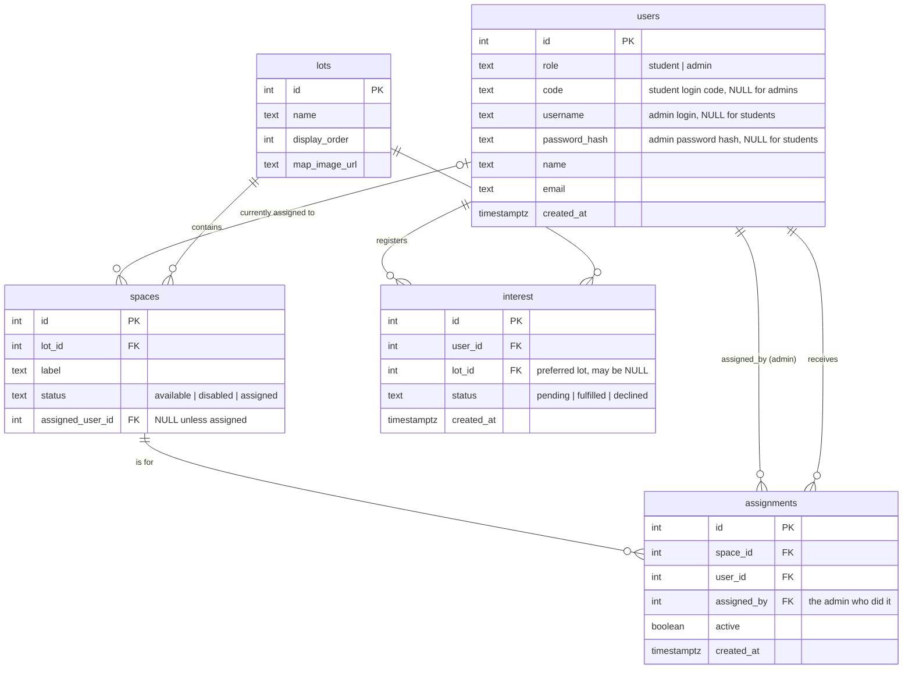

# Lesson B2 — Database schema & seed data

> **Track:** Backend · **Lesson 3 of 8** (B0 → B7)
> **⏱ Time:** ~60 min · **🎚 Difficulty:** moderate (new tool — PostgreSQL — plus your first SQL)
> **🧩 Prerequisites:** you've done [Lesson B1 — Health check](B1-health-check.md) (the server runs and `/api/health` works).
> **🌿 CR branch:** `cr/b2-schema` (off `cr/b1-health`) · **📄 Source CR:** [backend guide → CR B2](../backend-development-guide.md#cr-b2--database-schema--seed-data) · **🗺 Big picture:** [plan.md §8](../../plan.md#8-implementation-strategy-stacked-crs)

---

## 🎯 Goal — what you'll have at the end

A real **PostgreSQL database** with the five tables LTRide needs, plus a little sample data so later lessons (login, reading lots, assigning spaces) have something to work against. Concretely, by the end of this hour you will have:

- PostgreSQL **installed, running, and on your PATH**.
- A local database named `ltride_dev`.
- A migration file (`webapp/sql/migrations/001_init.sql`) that creates five tables: `users`, `lots`, `spaces`, `interest`, `assignments`.
- A seed file (`webapp/sql/seed.sql`) that fills those tables with one admin, three students, two lots, and a bunch of parking spaces.

**✅ Done when (your deliverable checklist):**
- [ ] `psql ltride_dev -c "\dt"` lists all five tables.
- [ ] `psql ltride_dev -c "SELECT count(*) FROM spaces WHERE lot_id=1;"` returns `20`.
- [ ] `psql ltride_dev -c "SELECT code, name FROM users WHERE role='student';"` shows `STU001 Jane Doe`, `STU002 John Smith`, `STU003 Amy Lee`.
- [ ] Your work is committed on branch `cr/b2-schema` and pushed, PR base = `cr/b1-health`.

---

## 🤔 Why this lesson matters

So far your backend can say "I'm alive" (B1), but it has nowhere to keep anything — no users, no parking lots, no spaces. A **database** is where an app permanently stores data so it's still there after you restart the server (unlike a Python variable, which vanishes the moment the program stops).

We're using **PostgreSQL**, a real production-grade database (the same *kind* of database — not the exact same install — that will run on your AWS server later). Two ideas make this lesson matter beyond "just typing SQL":

1. **Migrations.** Instead of clicking around in a database tool, you write the table-creation steps as a numbered `.sql` file (`001_init.sql`). That file is checked into Git, so anyone — including your future self, including the AWS server — can recreate the exact same tables by running one command. This is how real teams keep a database's structure in sync with the code that expects it.
2. **The database enforces its own rules.** You'll see constraints like `CHECK (role IN ('student', 'admin'))` and a *partial unique index* that says "a student may have at most one pending request." These rules live in the database itself, so even a buggy line of Python later can't sneak the data into an impossible state. That's a much stronger guarantee than "the Python code promises to check."

Get the schema right now, and every later lesson (B3 login, B4 reading lots, B6 interest, B7 assignments) has solid ground to build on.

---

## 🧠 Concepts you'll meet (with links to learn more)

| Concept | One-line meaning | Learn more |
|---|---|---|
| **PostgreSQL** | The database system itself — stores your tables and answers queries. | [PostgreSQL documentation](https://www.postgresql.org/docs/current/) |
| **`psql`** | The terminal program you use to talk to a PostgreSQL database. | [psql reference](https://www.postgresql.org/docs/current/app-psql.html) |
| **`createdb`** | The command-line tool that creates a new, empty database. | [createdb reference](https://www.postgresql.org/docs/current/app-createdb.html) |
| **Migration** | A numbered `.sql` file that creates or changes tables, so the schema is tracked in Git like any other code. | [Wikipedia: Schema migration](https://en.wikipedia.org/wiki/Schema_migration) |
| **`CREATE TABLE`** | The SQL statement that defines a table's columns and rules. | [PostgreSQL: CREATE TABLE](https://www.postgresql.org/docs/current/sql-createtable.html) |
| **Foreign key** | A column that points at another table's row (e.g. a space points at its lot). | [PostgreSQL: Foreign Keys](https://www.postgresql.org/docs/current/ddl-constraints.html#DDL-CONSTRAINTS-FK) |
| **`CHECK` constraint** | A rule the database enforces on every row, e.g. "role must be student or admin." | [PostgreSQL: Check Constraints](https://www.postgresql.org/docs/current/ddl-constraints.html#DDL-CONSTRAINTS-CHECK-CONSTRAINTS) |
| **Partial unique index** | A uniqueness rule that only applies to rows matching a condition. | [PostgreSQL: Partial Indexes](https://www.postgresql.org/docs/current/indexes-partial.html) |
| **Seed data** | Sample rows inserted after the tables exist, so you have something to test against. | [Wikipedia: Database seeding](https://en.wikipedia.org/wiki/Database_seeding) |
| **ER diagram** | A picture of tables and how they connect via foreign keys. | [Mermaid: Entity Relationship Diagrams](https://mermaid.js.org/syntax/entityRelationshipDiagram.html) |

---

## ✅ Before you start

**Time budget for the hour:** install & start Postgres (10 min, skip if already done) → branch + create the database (5) → migration file (15) → password hash + seed file (10) → run them (5) → test & commit (15).

**Open your terminal, activate the virtual environment, and make your branch.** B2 branches off B1, not off `main` — you're stacking this CR on top of the health-check work.

```bash
source .venv/bin/activate         # your prompt should now start with (.venv)
git checkout cr/b1-health
git checkout -b cr/b2-schema      # create + switch to this lesson's branch
```

**What this does & why:** branching off `cr/b1-health` (instead of `main`) means this CR includes B1's work plus your new schema, so it can be tested and reviewed as the next link in the chain. → Reference: [Git Branching basics](https://git-scm.com/book/en/v2/Git-Branching-Branches-in-a-Nutshell).

---

## 🛠 Build it, step by step

### Step 0 — Install and start PostgreSQL (~10 min, skip if already running)

If you already ran `brew install postgresql@16` back in [Part 0 setup](../backend-development-guide.md#01-install-the-tools), you still need two one-time steps: **start the server** and **put its tools on your PATH**. Do this now if `psql --version` doesn't work yet.

1. **Install it** (skip if already installed):
   ```bash
   brew install postgresql@16
   ```
2. **Start the database server** (and have it auto-start whenever you log in):
   ```bash
   brew services start postgresql@16
   ```
3. **Put the tools on your PATH.** Homebrew installs this version "keg-only," meaning you have to add it to your PATH yourself. Run the line for your Mac:
   ```bash
   # Apple Silicon (M1/M2/M3) Macs:
   echo 'export PATH="/opt/homebrew/opt/postgresql@16/bin:$PATH"' >> ~/.zshrc
   # Intel Macs:
   echo 'export PATH="/usr/local/opt/postgresql@16/bin:$PATH"' >> ~/.zshrc
   ```
   Then reload your shell: `source ~/.zshrc` (or just open a new Terminal window).
4. **Verify it worked:**
   ```bash
   psql --version        # should print "psql (PostgreSQL) 16.x"
   createdb --version
   ```
5. **First-connection fix (only if you hit it):** the very first connection sometimes fails with *"role does not exist."* If so, create a database user matching your Mac username, once:
   ```bash
   createuser -s "$(whoami)"
   ```

**What this does & why:** `brew services start` runs Postgres as a background service instead of you having to launch it by hand every time. The PATH lines tell your shell where to find `psql`/`createdb`, since Homebrew deliberately doesn't put this version on the PATH automatically (so it doesn't clash with a system Postgres). → Reference: [PostgreSQL documentation](https://www.postgresql.org/docs/current/).

> **What is `psql`?** It's the interactive PostgreSQL client — a terminal program for talking to the database. `psql ltride_dev` opens a session connected to the `ltride_dev` database; `psql ltride_dev -f file.sql` runs a file against it; `psql ltride_dev -c "SQL..."` runs one command. Type `\q` to quit an interactive session. → Reference: [psql reference](https://www.postgresql.org/docs/current/app-psql.html).

### Step 1 — Create the database (~5 min)

```bash
createdb ltride_dev
```

**What this does & why:** `createdb` is a thin wrapper that creates a new, empty database — here named `ltride_dev` ("LTRide, development"). Nothing exists inside it yet; that's what the migration in Step 2 is for. If it says "command not found," go back and finish Step 0. → Reference: [createdb reference](https://www.postgresql.org/docs/current/app-createdb.html).

### Step 2 — Look at what you're building (the ER diagram)

Before writing SQL, see the shape of it. These are the five tables and how they connect — an arrow `A → B` means "a row in A points at a row in B" (a *foreign key*):



**How to read it:** `users` is one table but holds **both** students and admins, told apart by the `role` column — a student has a `code` and no password; an admin has a `username`/`password_hash` and no code. `spaces` belong to a `lot`. `interest` is a student saying "I want a spot." `assignments` is an admin actually giving a space to a student. → Reference: [Mermaid: Entity Relationship Diagrams](https://mermaid.js.org/syntax/entityRelationshipDiagram.html).

**The three fixed value sets (enums) you'll enforce with `CHECK`:**
- `users.role` ∈ `{student, admin}`
- `spaces.status` ∈ `{available, disabled, assigned}`
- `interest.status` ∈ `{pending, fulfilled, declined}`

### Step 3 — Write the migration file (~15 min)

Create the folder and file `webapp/sql/migrations/001_init.sql` with **exactly** this content:

```sql
-- webapp/sql/migrations/001_init.sql
-- Initial schema for LTRide. Safe to re-run: it drops then recreates everything.

BEGIN;

DROP TABLE IF EXISTS assignments CASCADE;
DROP TABLE IF EXISTS interest    CASCADE;
DROP TABLE IF EXISTS spaces      CASCADE;
DROP TABLE IF EXISTS lots        CASCADE;
DROP TABLE IF EXISTS users       CASCADE;

-- USERS: both students and admins live here, told apart by `role`.
--   students  -> have a `code`, no username/password
--   admins    -> have username + password_hash, no code
CREATE TABLE users (
    id            SERIAL PRIMARY KEY,
    role          TEXT NOT NULL CHECK (role IN ('student', 'admin')),
    code          TEXT UNIQUE,                 -- student login code (e.g. STU001)
    username      TEXT UNIQUE,                 -- admin login name
    password_hash TEXT,                        -- admin password (hashed, never plain)
    name          TEXT NOT NULL,
    email         TEXT,
    created_at    TIMESTAMPTZ NOT NULL DEFAULT now()
);

-- LOTS: a parking lot / area.
CREATE TABLE lots (
    id            SERIAL PRIMARY KEY,
    name          TEXT NOT NULL,
    display_order INTEGER NOT NULL DEFAULT 0,
    map_image_url TEXT
);

-- SPACES: one parking space, belongs to a lot.
CREATE TABLE spaces (
    id               SERIAL PRIMARY KEY,
    lot_id           INTEGER NOT NULL REFERENCES lots(id) ON DELETE CASCADE,
    label            TEXT NOT NULL,            -- human label, e.g. "1-0-3"
    status           TEXT NOT NULL DEFAULT 'available'
                     CHECK (status IN ('available', 'disabled', 'assigned')),
    assigned_user_id INTEGER REFERENCES users(id) ON DELETE SET NULL,
    UNIQUE (lot_id, label)                     -- no two spaces share a label in a lot
);

-- INTEREST: a student registering that they want a spot.
CREATE TABLE interest (
    id         SERIAL PRIMARY KEY,
    user_id    INTEGER NOT NULL REFERENCES users(id) ON DELETE CASCADE,
    lot_id     INTEGER REFERENCES lots(id) ON DELETE SET NULL,  -- preferred lot (optional)
    status     TEXT NOT NULL DEFAULT 'pending'
               CHECK (status IN ('pending', 'fulfilled', 'declined')),
    created_at TIMESTAMPTZ NOT NULL DEFAULT now()
);

-- Stop a student having two *active* (pending) requests at once.
-- (Used by B6's "duplicate request -> 409" rule.)
CREATE UNIQUE INDEX one_active_interest_per_user
    ON interest (user_id)
    WHERE status = 'pending';

-- ASSIGNMENTS: an admin gave a space to a student. History is kept (active flag).
CREATE TABLE assignments (
    id          SERIAL PRIMARY KEY,
    space_id    INTEGER NOT NULL REFERENCES spaces(id) ON DELETE CASCADE,
    user_id     INTEGER NOT NULL REFERENCES users(id) ON DELETE CASCADE,
    assigned_by INTEGER NOT NULL REFERENCES users(id),   -- the admin
    active      BOOLEAN NOT NULL DEFAULT TRUE,
    created_at  TIMESTAMPTZ NOT NULL DEFAULT now()
);

-- A space can have at most ONE active assignment at a time.
CREATE UNIQUE INDEX one_active_assignment_per_space
    ON assignments (space_id)
    WHERE active;

COMMIT;
```

**Explanation, section by section:**
- `BEGIN;` / `COMMIT;` — everything between them runs as **one transaction**: either every statement succeeds, or (if something errors) none of them take effect. That's what makes this file safe to re-run. → [PostgreSQL: Transactions](https://www.postgresql.org/docs/current/tutorial-transactions.html).
- `DROP TABLE IF EXISTS ... CASCADE` — deletes each table (and anything that depends on it, like foreign keys) if it already exists, so you always start from a clean slate. Order matters: drop the tables *other* tables point at last.
- `SERIAL PRIMARY KEY` — an auto-incrementing integer ID (1, 2, 3, …) and the table's unique row identifier. → [PostgreSQL: `serial` type](https://www.postgresql.org/docs/current/datatype-numeric.html#DATATYPE-SERIAL).
- `CHECK (role IN ('student', 'admin'))` — the database itself refuses to insert a row with any other value in `role`. → [PostgreSQL: Check Constraints](https://www.postgresql.org/docs/current/ddl-constraints.html#DDL-CONSTRAINTS-CHECK-CONSTRAINTS).
- `REFERENCES lots(id) ON DELETE CASCADE` — `lot_id` in `spaces` must match a real row in `lots`; if that lot is ever deleted, its spaces are deleted too ("cascade"). `ON DELETE SET NULL` (used on `assigned_user_id`) instead clears the pointer rather than deleting the space. → [PostgreSQL: Foreign Keys](https://www.postgresql.org/docs/current/ddl-constraints.html#DDL-CONSTRAINTS-FK).
- `UNIQUE (lot_id, label)` — a **combined** uniqueness rule: two spaces can share a label only if they're in different lots.
- `CREATE UNIQUE INDEX ... WHERE status = 'pending'` — a **partial** unique index: uniqueness is only enforced on the rows matching the `WHERE` clause. Here it means "at most one *pending* interest row per user" — a student can have many old `fulfilled`/`declined` rows, just not two `pending` ones at the same time. → [PostgreSQL: Partial Indexes](https://www.postgresql.org/docs/current/indexes-partial.html).

> **Why put these rules in the database instead of just checking them in Python?** Because the database enforces them for *every* write, no matter what code path touches it — even a bug, even a script you write later by hand. It's a second, independent safety net underneath the Python checks you'll write in later lessons.

### Step 4 — Make the admin's password hash (~5 min)

We never store a plain password anywhere — not even in a seed file. Generate a **hash** (a one-way scrambled version) of the admin's local-dev password (`admin123`) using the same library the app will use later to check it:

```bash
python -c "from werkzeug.security import generate_password_hash; print(generate_password_hash('admin123'))"
```

**What this does & why:** `generate_password_hash` runs the password through a slow, salted hashing algorithm (scrypt or pbkdf2) — the result is a long string starting with `scrypt:` or `pbkdf2:` that can be checked against a guess later, but can't be reversed back into the original password. **Copy that whole string** — you'll paste it into the seed file next. → Reference: [Werkzeug: `generate_password_hash`](https://werkzeug.palletsprojects.com/en/stable/utils/#werkzeug.security.generate_password_hash).

### Step 5 — Write the seed file (~5 min)

Create `webapp/sql/seed.sql`. Replace `PASTE_HASH_HERE` with the string you just copied:

```sql
-- webapp/sql/seed.sql
-- Sample data for local development. Re-runnable (clears the tables first).

BEGIN;

TRUNCATE assignments, interest, spaces, lots, users RESTART IDENTITY CASCADE;

-- One admin. password is 'admin123' (only for local dev!).
INSERT INTO users (role, username, password_hash, name, email) VALUES
    ('admin', 'admin', 'PASTE_HASH_HERE', 'Site Admin', 'admin@school.edu');

-- A few students. They log in with their code (no password).
INSERT INTO users (role, code, name, email) VALUES
    ('student', 'STU001', 'Jane Doe',   'jane@school.edu'),
    ('student', 'STU002', 'John Smith', 'john@school.edu'),
    ('student', 'STU003', 'Amy Lee',    'amy@school.edu');

-- Two lots.
INSERT INTO lots (name, display_order) VALUES
    ('Lot 1', 1),
    ('Lot 2', 2);

-- ~20 spaces in Lot 1 (ids/labels 1-0-1 .. 1-0-20), all available to start.
INSERT INTO spaces (lot_id, label, status)
SELECT 1, '1-0-' || g, 'available'
FROM generate_series(1, 20) AS g;

-- A handful in Lot 2 so the lot switcher has something to show.
INSERT INTO spaces (lot_id, label, status)
SELECT 2, '2-0-' || g, 'available'
FROM generate_series(1, 6) AS g;

COMMIT;
```

**Explanation, section by section:**
- `TRUNCATE ... RESTART IDENTITY CASCADE` — empties all five tables and resets the auto-incrementing IDs back to 1, so re-running this file always produces the exact same ids (handy for the `curl` tests in later lessons). → [PostgreSQL: `TRUNCATE`](https://www.postgresql.org/docs/current/sql-truncate.html).
- `INSERT INTO users (...) VALUES (...)` — adds rows; each parenthesized group is one row, matched to the column list by position.
- `generate_series(1, 20) AS g` — a Postgres function that produces the numbers 1 through 20 as rows, so `SELECT 1, '1-0-' || g, 'available' FROM generate_series(1, 20) AS g` inserts 20 spaces without writing 20 separate `INSERT` lines. → [PostgreSQL: Set Returning Functions](https://www.postgresql.org/docs/current/functions-srf.html).
- `'1-0-' || g` — `||` is SQL's "join strings together" operator, so this glues the text `"1-0-"` and the number `g` into a label like `"1-0-7"`.

> **Why is committing this admin hash okay, but committing a real secret isn't?** `admin123` is a throwaway password that only exists for local development — anyone who clones the repo is meant to know it. Never commit a hash (or anything else) derived from a real production password.

### Step 6 — Run the migration and seed files (~5 min)

```bash
psql ltride_dev -f webapp/sql/migrations/001_init.sql
psql ltride_dev -f webapp/sql/seed.sql
```

**What this does & why:** `psql <database> -f <file>` opens a connection to `ltride_dev` and runs every statement in the file in order, printing each result (`DROP TABLE`, `CREATE TABLE`, `INSERT 0 1`, …) as it goes. Run the migration first (it builds the empty tables), then the seed (it fills them in). Each should print a list of results with **no `ERROR`** — if you see one, re-check the file against Steps 3/5 before moving on. → Reference: [psql reference](https://www.postgresql.org/docs/current/app-psql.html).

---

## 🧪 Prove it works — testing guide

**Setup:** PostgreSQL running (`brew services start postgresql@16`); both files from Step 6 ran with no error.

**Steps:**
```bash
psql ltride_dev -c "\dt"                                          # list tables
psql ltride_dev -c "SELECT label, status FROM spaces WHERE lot_id=1 LIMIT 5;"
psql ltride_dev -c "SELECT code, name FROM users WHERE role='student';"
psql ltride_dev -c "SELECT count(*) AS lot1_spaces FROM spaces WHERE lot_id=1;"
```

**Expected:**
- `\dt` lists all five tables: `assignments, interest, lots, spaces, users`.
- The spaces query shows labels like `1-0-1 … 1-0-5`, all `available`.
- The users query shows `STU001 Jane Doe`, `STU002 John Smith`, `STU003 Amy Lee`.
- `lot1_spaces` = `20`.

### ☁️ Cloud check (optional)

The schema/seed you just ran only touched **your laptop's** database. `release.sh` (the deploy script from the [Deployment Guide](../../deploy/deployment-guide.md)) automatically applies `sql/migrations/*.sql` to the server's real database (RDS) on every deploy — but the **seed data** is manual on purpose (you don't want fake dev data on a real site). To verify the schema on the server:

```bash
cd ~/workspace/LTR-Backend/deploy
./release.sh backend                       # applies 001_init.sql on RDS
ssh -i ~/.ssh/ltride-key.pem ubuntu@<ElasticIp>
sudo -u ltride bash -c 'set -a; . /home/ltride/app/.env; set +a; psql "$DATABASE_URL" -c "\dt"'
# expect the five tables. To seed dev data on the server too (optional):
#   psql "$DATABASE_URL" -f /home/ltride/app/sql/seed.sql
exit
```

Expect `\dt` to list the same five tables on RDS. (This step needs the AWS server already running — see [Part 2 of the backend guide](../backend-development-guide.md#part-2--deploy-to-aws--see-the-deployment-guide) if you haven't set it up yet; it's fine to skip this cloud check for now and come back once the server exists.)

---

## 🚀 Save your work (commit & open the CR)

```bash
git add webapp/sql/
git commit -m "B2: add schema migration + dev seed data"
git push -u origin cr/b2-schema
```

Then open a Pull Request on GitHub with **base = `cr/b1-health`** (this CR stacks on B1, not on `main`). Use the CR description template and paste your "Prove it works" output as the testing evidence. → Reference: [GitHub: Creating a pull request](https://docs.github.com/en/pull-requests/collaborating-with-pull-requests/proposing-changes-to-your-work-with-pull-requests/creating-a-pull-request). The [CR status tracker in plan.md §8.2](../../plan.md#82-cr-status-tracker) is where this CR's status is recorded.

> **Double-check:** the admin password hash in `seed.sql` is fine to commit here because it's a throwaway *local-dev* password. Never commit a hash of a real production password.

---

## 🧯 If something breaks

- **`createdb: command not found` or `psql: command not found`** — Postgres isn't on your PATH yet. Redo Step 0's PATH lines, then open a new terminal (or `source ~/.zshrc`).
- **`psql: error: connection to server ... failed`** — the Postgres service isn't running. Run `brew services start postgresql@16` and try again.
- **`FATAL: role "yourname" does not exist`** — run `createuser -s "$(whoami)"` once (Step 0.5), then retry.
- **`ERROR: relation "lots" does not exist` when running `seed.sql`** — you skipped or mis-ran the migration. Re-run `psql ltride_dev -f webapp/sql/migrations/001_init.sql` first.
- **Seed file errors on `PASTE_HASH_HERE`** — you forgot to swap in the real hash from Step 4. Regenerate it and paste the whole `scrypt:...` or `pbkdf2:...` string in place of the placeholder.

---

## 📝 Recap

- You installed, started, and PATH-configured **PostgreSQL**, and created your first local database.
- You wrote your first **migration** — a numbered `.sql` file that builds the five tables and lets the database itself enforce rules like "role must be student or admin" and "at most one pending request per student."
- You wrote a **seed** file that fills those tables with realistic sample data you'll use to test every remaining backend lesson.
- You practiced the **stacked-CR git routine** again, this time branching off the *previous* lesson's branch instead of `main`.

---

## 📚 References

- [PostgreSQL documentation](https://www.postgresql.org/docs/current/) — the database system itself.
- [psql reference](https://www.postgresql.org/docs/current/app-psql.html) and [createdb reference](https://www.postgresql.org/docs/current/app-createdb.html).
- [PostgreSQL: CREATE TABLE](https://www.postgresql.org/docs/current/sql-createtable.html), [Foreign Keys](https://www.postgresql.org/docs/current/ddl-constraints.html#DDL-CONSTRAINTS-FK), and [Check Constraints](https://www.postgresql.org/docs/current/ddl-constraints.html#DDL-CONSTRAINTS-CHECK-CONSTRAINTS).
- [PostgreSQL: Partial Indexes](https://www.postgresql.org/docs/current/indexes-partial.html) and [Transactions](https://www.postgresql.org/docs/current/tutorial-transactions.html).
- [PostgreSQL: Set Returning Functions](https://www.postgresql.org/docs/current/functions-srf.html) (`generate_series`) and [`TRUNCATE`](https://www.postgresql.org/docs/current/sql-truncate.html).
- [Wikipedia: Schema migration](https://en.wikipedia.org/wiki/Schema_migration) and [Database seeding](https://en.wikipedia.org/wiki/Database_seeding).
- [Mermaid: Entity Relationship Diagrams](https://mermaid.js.org/syntax/entityRelationshipDiagram.html).
- [Werkzeug: `generate_password_hash`](https://werkzeug.palletsprojects.com/en/stable/utils/#werkzeug.security.generate_password_hash).
- Source of truth for this lesson: [backend guide → CR B2](../backend-development-guide.md#cr-b2--database-schema--seed-data).

---

## ➡️ Next lesson

**[Lesson B3 — Authentication (login)](B3-authentication-login.md).** You'll write the database helper and the three login endpoints — student login by code, admin login by username/password, and `GET /api/auth/me`. → [source CR](../backend-development-guide.md#cr-b3--authentication-login).
