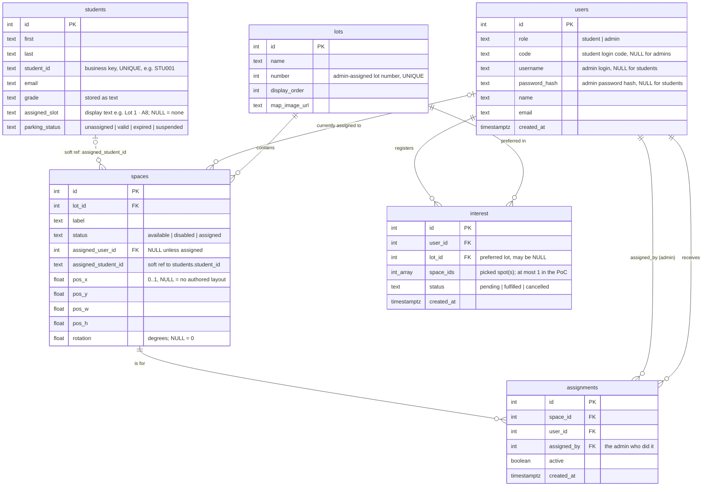

# Lesson B2 — Database schema & seed data

> **Track:** Backend · **Lesson 3 of 10** (B0 → B9)
> **⏱ Time:** ~60 min · **🎚 Difficulty:** moderate (new tool — PostgreSQL — plus your first SQL)
> **🧩 Prerequisites:** you've done [Lesson B1 — Health check](B1-health-check.md) (the server runs and `/api/health` works).
> **🌿 CR branch:** `cr/b2-schema` (off `cr/b1-health`) · **📄 Source CR:** [backend guide → CR B2](../backend-development-guide.md#cr-b2--database-schema--seed-data) · **🗺 Big picture:** [plan.md §8](../../plan.md#8-implementation-strategy-stacked-crs)

---

## 🎯 Goal — what you'll have at the end

A real **PostgreSQL database** with the six tables LTRide needs, plus a little sample data so later lessons (login, reading lots, assigning spaces) have something to work against. Concretely, by the end of this hour you will have:

- PostgreSQL **installed, running, and on your PATH**.
- A local database named `ltride_dev`.
- A migration file (`webapp/sql/migrations/001_init.sql`) that creates six tables: `users`, `students`, `lots`, `spaces`, `interest`, `assignments`.
- A seed file (`webapp/sql/seed.sql`) that fills those tables with one admin, four student logins, six lots (Lot 1 with a fully laid-out 8-space showcase), a live assignment, a couple of pending requests, and a five-student roster.

**✅ Done when (your deliverable checklist):**
- [ ] `psql ltride_dev -c "\dt"` lists all six tables.
- [ ] `psql ltride_dev -c "SELECT count(*) FROM spaces WHERE lot_id=1;"` returns `8`.
- [ ] `psql ltride_dev -c "SELECT code, name FROM users WHERE role='student';"` shows `STU001 Alice`, `STU002 Bob`, `STU003 Andrew`, `STU004 Olivia`.
- [ ] `psql ltride_dev -c "SELECT student_id, parking_status FROM students WHERE last='Smith';"` shows `S123213 | suspended`.
- [ ] Your work is committed on branch `cr/b2-schema` and pushed, PR base = `cr/b1-health`.

---

## 🤔 Why this lesson matters

So far your backend can say "I'm alive" (B1), but it has nowhere to keep anything — no users, no parking lots, no spaces. A **database** is where an app permanently stores data so it's still there after you restart the server (unlike a Python variable, which vanishes the moment the program stops).

We're using **PostgreSQL**, a real production-grade database (the same *kind* of database — not the exact same install — that will run on your AWS server later). Three ideas make this lesson matter beyond "just typing SQL":

1. **Migrations.** Instead of clicking around in a database tool, you write the table-creation steps as a numbered `.sql` file (`001_init.sql`). That file is checked into Git, so anyone — including your future self, including the AWS server — can recreate the exact same tables by running one command. This is how real teams keep a database's structure in sync with the code that expects it.
2. **The database enforces its own rules.** You'll see constraints like `CHECK (role IN ('student', 'admin'))` and a *partial unique index* that says "a student may have at most one pending request." These rules live in the database itself, so even a buggy line of Python later can't sneak the data into an impossible state. That's a much stronger guarantee than "the Python code promises to check."
3. **Two identities for one person.** A student can show up as a **login account** (`users`, `role='student'`, keyed by a login `code` like `STU001`) *and/or* as a **roster row** (`students`, keyed by a `student_id` business key like `STU001` or `S123213`). The roster is what the front office manages — grade, parking status — the login is what lets someone sign in and pick a spot. They're linked only by matching that code/`student_id` string, **not** a database foreign key, because a roster student might not have a login yet (or ever).

Get the schema right now, and every later lesson (B3 login, B4 reading lots, B6 interest, B7 assignments) has solid ground to build on.

---

## 🧠 Concepts you'll meet (with links to learn more)

| Concept | One-line meaning | Learn more |
|---|---|---|
| **PostgreSQL** | The database system itself — stores your tables and answers queries. | [PostgreSQL documentation](https://www.postgresql.org/docs/current/) |
| **`psql`** | The terminal program you use to talk to a PostgreSQL database. | [psql reference](https://www.postgresql.org/docs/current/app-psql.html) |
| **`createdb`** | The command-line tool that creates a new, empty database. | [createdb reference](https://www.postgresql.org/docs/current/app-createdb.html) |
| **Migration** | A numbered `.sql` file that creates or changes tables, so the schema is tracked in Git like any other code. | [Wikipedia: Schema migration](https://en.wikipedia.org/wiki/Schema_migration) |
| **`CREATE TABLE`** | The SQL statement that defines a table's columns and rules. | [PostgreSQL: CREATE TABLE](https://www.postgresql.org/docs/current/sql-createtable.html) |
| **Foreign key** | A column that points at another table's row (e.g. a space points at its lot), enforced by the database. | [PostgreSQL: Foreign Keys](https://www.postgresql.org/docs/current/ddl-constraints.html#DDL-CONSTRAINTS-FK) |
| **`CHECK` constraint** | A rule the database enforces on every row, e.g. "role must be student or admin." | [PostgreSQL: Check Constraints](https://www.postgresql.org/docs/current/ddl-constraints.html#DDL-CONSTRAINTS-CHECK-CONSTRAINTS) |
| **Partial unique index** | A uniqueness rule that only applies to rows matching a condition. | [PostgreSQL: Partial Indexes](https://www.postgresql.org/docs/current/indexes-partial.html) |
| **Array column** | A column that stores a *list* of values (e.g. `INTEGER[]`) in one field, instead of a separate join table. | [PostgreSQL: Arrays](https://www.postgresql.org/docs/current/arrays.html) |
| **Seed data** | Sample rows inserted after the tables exist, so you have something to test against. | [Wikipedia: Database seeding](https://en.wikipedia.org/wiki/Database_seeding) |
| **ER diagram** | A picture of tables and how they connect via foreign keys. | [Mermaid: Entity Relationship Diagrams](https://mermaid.js.org/syntax/entityRelationshipDiagram.html) |

---

## ✅ Before you start

**Time budget for the hour:** install & start Postgres (10 min, skip if already done) → branch + create the database (5) → migration file (15) → password hash + seed file (10) → run them (5) → test & commit (15).

**Open your terminal, activate the virtual environment, and make your branch.** B2 branches off B1, not off `main` — you're stacking this CR on top of the health-check work.

**macOS / Linux**

```bash
source .venv/bin/activate         # your prompt should now start with (.venv)
git checkout cr/b1-health
git checkout -b cr/b2-schema      # create + switch to this lesson's branch
```

**Windows (PowerShell)**

```powershell
.venv\Scripts\Activate.ps1        # your prompt should now start with (.venv)
                                   # blocked by execution policy? run once: Set-ExecutionPolicy -Scope Process RemoteSigned
git checkout cr/b1-health
git checkout -b cr/b2-schema      # create + switch to this lesson's branch
```

**What this does & why:** branching off `cr/b1-health` (instead of `main`) means this CR includes B1's work plus your new schema, so it can be tested and reviewed as the next link in the chain. → Reference: [Git Branching basics](https://git-scm.com/book/en/v2/Git-Branching-Branches-in-a-Nutshell).

---

## 🛠 Build it, step by step

### Step 0 — Install and start PostgreSQL (~10 min, skip if already running)

If you already ran `brew install postgresql@16` back in [Part 0 setup](../backend-development-guide.md#01-install-the-tools), you still need two one-time steps: **start the server** and **put its tools on your PATH**. Do this now if `psql --version` doesn't work yet.

1. **Install it** (skip if already installed):

   **macOS / Linux**

   ```bash
   brew install postgresql@16
   ```

   **Windows (PowerShell)**

   ```powershell
   winget install PostgreSQL.PostgreSQL.16   # installs & starts the "postgresql-x64-16" service
   ```

2. **Start the database server** (and have it auto-start whenever you log in):

   **macOS / Linux**

   ```bash
   brew services start postgresql@16
   ```

   **Windows (PowerShell)** — the `winget install` above already installs and starts
   the `postgresql-x64-16` service; nothing to run here. If it's ever stopped, restart
   it with `net start postgresql-x64-16`.

3. **Put the tools on your PATH.** Homebrew installs this version "keg-only," meaning you have to add it to your PATH yourself. Run the line for your Mac:
   ```bash
   # Apple Silicon (M1/M2/M3) Macs:
   echo 'export PATH="/opt/homebrew/opt/postgresql@16/bin:$PATH"' >> ~/.zshrc
   # Intel Macs:
   echo 'export PATH="/usr/local/opt/postgresql@16/bin:$PATH"' >> ~/.zshrc
   ```
   Then reload your shell: `source ~/.zshrc` (or just open a new Terminal window).

   > **Windows note:** the installer normally adds Postgres to `PATH` for you. If
   > `psql`/`createdb` still aren't found, add `C:\Program Files\PostgreSQL\16\bin`
   > to your `PATH` (Settings → System → About → Advanced system settings →
   > Environment Variables), then open a new PowerShell window.

4. **Verify it worked:**

   **macOS / Linux**

   ```bash
   psql --version        # should print "psql (PostgreSQL) 16.x"
   createdb --version
   ```

   **Windows (PowerShell)**

   ```powershell
   psql --version        # should print "psql (PostgreSQL) 16.x"
   createdb --version
   ```

5. **First-connection fix (only if you hit it):** the very first connection sometimes fails with *"role does not exist."* If so, create a database user matching your username, once:

   **macOS / Linux**

   ```bash
   createuser -s "$(whoami)"
   ```

   **Windows (PowerShell)**

   ```powershell
   createuser -s $env:USERNAME
   ```

**What this does & why:** `brew services start` (macOS/Linux) — or the `winget` installer on Windows — runs Postgres as a background service instead of you having to launch it by hand every time. The PATH lines tell your shell where to find `psql`/`createdb`, since Homebrew deliberately doesn't put this version on the PATH automatically (so it doesn't clash with a system Postgres); the Windows installer normally does this for you. → Reference: [PostgreSQL documentation](https://www.postgresql.org/docs/current/).

> **What is `psql`?** It's the interactive PostgreSQL client — a terminal program for talking to the database. `psql ltride_dev` opens a session connected to the `ltride_dev` database; `psql ltride_dev -f file.sql` runs a file against it; `psql ltride_dev -c "SQL..."` runs one command. Type `\q` to quit an interactive session. → Reference: [psql reference](https://www.postgresql.org/docs/current/app-psql.html).

### Step 1 — Create the database (~5 min)

**macOS / Linux**

```bash
createdb ltride_dev
```

**Windows (PowerShell)**

```powershell
createdb ltride_dev
```

**What this does & why:** `createdb` is a thin wrapper that creates a new, empty database — here named `ltride_dev` ("LTRide, development"). Nothing exists inside it yet; that's what the migration in Step 2 is for. If it says "command not found," go back and finish Step 0. → Reference: [createdb reference](https://www.postgresql.org/docs/current/app-createdb.html).

### Step 2 — Look at what you're building (the ER diagram)

Before writing SQL, see the shape of it. These are the six tables and how they connect — an arrow `A → B` means "a row in A points at a row in B" (a *foreign key*). The one dashed link (`students` → `spaces`) is **not** a real foreign key — it's a soft reference by matching string, explained below.



**How to read it:** `users` is one table but holds **both** students and admins, told apart by the `role` column — a student has a `code` and no password; an admin has a `username`/`password_hash` and no code. `students` is a *separate* admin-managed roster (grade, parking status) keyed by its own `student_id`. `spaces` belong to a `lot`. `interest` is a student saying "I want a spot." `assignments` is an admin actually giving a space to a student. → Reference: [Mermaid: Entity Relationship Diagrams](https://mermaid.js.org/syntax/entityRelationshipDiagram.html).

**The four fixed value sets (enums) you'll enforce with `CHECK`:**
- `users.role` ∈ `{student, admin}`
- `spaces.status` ∈ `{available, disabled, assigned}`
- `interest.status` ∈ `{pending, fulfilled, cancelled}`
- `students.parking_status` ∈ `{unassigned, valid, expired, suspended}`

### Step 3 — Write the migration file (~15 min)

Create the folder and file `webapp/sql/migrations/001_init.sql` with **exactly** this content:

> **Heads up — stray template files in `webapp/sql/`.** The course template left two unrelated files in this folder: `schema.sql` and `data.sql` (an old SQLite `developer` table). Nothing in this project reads them — they're dead scaffolding. Ignore them, or delete them, so the only SQL that matters is `migrations/001_init.sql` (this step) and `seed.sql` (Step 5).

```sql
-- webapp/sql/migrations/001_init.sql
-- Initial schema for LTRide. Safe to re-run: it drops then recreates everything.

BEGIN;

DROP TABLE IF EXISTS assignments CASCADE;
DROP TABLE IF EXISTS interest    CASCADE;
DROP TABLE IF EXISTS spaces      CASCADE;
DROP TABLE IF EXISTS lots        CASCADE;
DROP TABLE IF EXISTS students    CASCADE;
DROP TABLE IF EXISTS users       CASCADE;

-- USERS: both students and admins live here, told apart by `role`.
--   students  -> have a `code`, no username/password
--   admins    -> have username + password_hash, no code
CREATE TABLE users (
    id            SERIAL PRIMARY KEY,
    role          TEXT NOT NULL CHECK (role IN ('student', 'admin')),
    code          TEXT UNIQUE,                 -- student login code (e.g. STU001)
    username      TEXT UNIQUE,                 -- admin login name
    password_hash TEXT,                        -- admin password (hashed, never plain)
    name          TEXT NOT NULL,
    email         TEXT,
    created_at    TIMESTAMPTZ NOT NULL DEFAULT now()
);

-- STUDENTS: the admin-managed roster, separate from the login/auth user.
--   student_id is the business primary key; CSV upserts and slot assignments
--   are keyed on it. A roster row may exist with no matching login user.
CREATE TABLE students (
    id             SERIAL PRIMARY KEY,
    first          TEXT NOT NULL,
    last           TEXT NOT NULL,
    student_id     TEXT NOT NULL UNIQUE,       -- e.g. STU001 / S123213
    email          TEXT,
    grade          TEXT,                        -- stored as text (mirrors the UI)
    assigned_slot  TEXT,                        -- display text, e.g. "Lot 1 · A8"; NULL = none
    parking_status TEXT NOT NULL DEFAULT 'unassigned'
                   CHECK (parking_status IN ('unassigned', 'valid', 'expired', 'suspended'))
);

-- LOTS: a parking lot / area.
--   number is the admin-assigned lot number, unique, used to prefix spot labels.
CREATE TABLE lots (
    id            SERIAL PRIMARY KEY,
    name          TEXT NOT NULL,
    number        INTEGER UNIQUE,              -- admin-assigned lot number (label prefix)
    display_order INTEGER NOT NULL DEFAULT 0,
    map_image_url TEXT
);

-- SPACES: one parking space, belongs to a lot.
--   pos_x / pos_y are where the space sits on the map (normalized 0..1 fractions).
--   pos_w / pos_h are the slot's size as fractions of the map, so it keeps its
--   ratio at any zoom. NULL position/size = "no authored layout yet".
--   assigned_student_id is a soft reference to students.student_id, so a spot can
--   be held by a roster student who has no login account.
CREATE TABLE spaces (
    id                  SERIAL PRIMARY KEY,
    lot_id              INTEGER NOT NULL REFERENCES lots(id) ON DELETE CASCADE,
    label               TEXT NOT NULL,
    status              TEXT NOT NULL DEFAULT 'available'
                        CHECK (status IN ('available', 'disabled', 'assigned')),
    assigned_user_id    INTEGER REFERENCES users(id) ON DELETE SET NULL,
    assigned_student_id TEXT,                  -- roster student_id (soft ref); NULL = none
    pos_x               DOUBLE PRECISION CHECK (pos_x IS NULL OR (pos_x >= 0 AND pos_x <= 1)),
    pos_y               DOUBLE PRECISION CHECK (pos_y IS NULL OR (pos_y >= 0 AND pos_y <= 1)),
    pos_w               DOUBLE PRECISION CHECK (pos_w IS NULL OR (pos_w >= 0 AND pos_w <= 1)),
    pos_h               DOUBLE PRECISION CHECK (pos_h IS NULL OR (pos_h >= 0 AND pos_h <= 1)),
    rotation            DOUBLE PRECISION,      -- degrees; NULL treated as 0
    UNIQUE (lot_id, label)
);

-- INTEREST: a student registering that they want a spot.
--   space_ids holds the specific spots the student picked (their preference);
--   a request holds at most one, kept as an array for forward-compatibility.
CREATE TABLE interest (
    id         SERIAL PRIMARY KEY,
    user_id    INTEGER NOT NULL REFERENCES users(id) ON DELETE CASCADE,
    lot_id     INTEGER REFERENCES lots(id) ON DELETE SET NULL,
    space_ids  INTEGER[] NOT NULL DEFAULT '{}',
    status     TEXT NOT NULL DEFAULT 'pending'
               CHECK (status IN ('pending', 'fulfilled', 'cancelled')),
    created_at TIMESTAMPTZ NOT NULL DEFAULT now()
);

-- Stop a student having two *active* (pending) requests at once.
CREATE UNIQUE INDEX one_active_interest_per_user
    ON interest (user_id)
    WHERE status = 'pending';

-- ASSIGNMENTS: an admin gave a space to a student. History is kept (active flag).
CREATE TABLE assignments (
    id          SERIAL PRIMARY KEY,
    space_id    INTEGER NOT NULL REFERENCES spaces(id) ON DELETE CASCADE,
    user_id     INTEGER NOT NULL REFERENCES users(id) ON DELETE CASCADE,
    assigned_by INTEGER NOT NULL REFERENCES users(id),   -- the admin
    active      BOOLEAN NOT NULL DEFAULT TRUE,
    created_at  TIMESTAMPTZ NOT NULL DEFAULT now()
);

-- A space can have at most ONE active assignment at a time.
CREATE UNIQUE INDEX one_active_assignment_per_space
    ON assignments (space_id)
    WHERE active;

COMMIT;
```

This is the exact file the shipped app runs — `webapp/sql/migrations/001_init.sql:1`. All six tables, both extra roster fields, and both partial indexes are built here in **one pass**; there's no later migration that adds them.

**Explanation, section by section:**
- `BEGIN;` / `COMMIT;` — everything between them runs as **one transaction**: either every statement succeeds, or (if something errors) none of them take effect. That's what makes this file safe to re-run. → [PostgreSQL: Transactions](https://www.postgresql.org/docs/current/tutorial-transactions.html).
- `DROP TABLE IF EXISTS ... CASCADE` — deletes each table (and anything that depends on it, like foreign keys) if it already exists, so you always start from a clean slate. Order matters: drop the tables *other* tables point at last (`webapp/sql/migrations/001_init.sql:6`).
- `SERIAL PRIMARY KEY` — an auto-incrementing integer ID (1, 2, 3, …) and the table's unique row identifier. → [PostgreSQL: `serial` type](https://www.postgresql.org/docs/current/datatype-numeric.html#DATATYPE-SERIAL).
- `CHECK (role IN ('student', 'admin'))` — the database itself refuses to insert a row with any other value in `role`. → [PostgreSQL: Check Constraints](https://www.postgresql.org/docs/current/ddl-constraints.html#DDL-CONSTRAINTS-CHECK-CONSTRAINTS).
- `students` (`webapp/sql/migrations/001_init.sql:30`) is a whole separate table from `users` — the admin-managed roster (`first`, `last`, `grade`, `parking_status`) keyed by its own `student_id`, not by the `users.id` primary key. A student can have a roster row with no login, a login with no roster row, or (usually) both, matched only because `users.code` happens to equal `students.student_id`.
- `lots.number` (`webapp/sql/migrations/001_init.sql:47`) is `UNIQUE` — it's the admin-assigned lot number that prefixes every spot's label in that lot (e.g. Lot 4's spots are `4-1`, `4-2`, …).
- `assigned_student_id` (`webapp/sql/migrations/001_init.sql:65`) is **not** a `REFERENCES` foreign key — it's a soft reference, just a `TEXT` column that *happens* to match a real `students.student_id` when set. That's deliberate: a spot can be handed to a roster student who has never logged in and therefore has no `users` row for a hard FK to point at.
- `pos_x/pos_y/pos_w/pos_h` (`webapp/sql/migrations/001_init.sql:66`) are each their own nullable column, checked to be `NULL` or in `0..1` — position (`pos_x`,`pos_y`) and size (`pos_w`,`pos_h`) as fractions of the map image, so the layout keeps its proportions no matter how the map is zoomed or resized.
- `REFERENCES lots(id) ON DELETE CASCADE` — `lot_id` in `spaces` must match a real row in `lots`; if that lot is ever deleted, its spaces are deleted too ("cascade"). `ON DELETE SET NULL` (used on `assigned_user_id`) instead clears the pointer rather than deleting the space. → [PostgreSQL: Foreign Keys](https://www.postgresql.org/docs/current/ddl-constraints.html#DDL-CONSTRAINTS-FK).
- `UNIQUE (lot_id, label)` — a **combined** uniqueness rule: two spaces can share a label only if they're in different lots.
- `space_ids INTEGER[] NOT NULL DEFAULT '{}'` (`webapp/sql/migrations/001_init.sql:81`) — an **array column**: instead of a separate join table, `interest` just stores the list of space ids the student picked directly on the row. The PoC only ever puts one id in it; the array leaves room to pick more than one later without a schema change. → [PostgreSQL: Arrays](https://www.postgresql.org/docs/current/arrays.html).
- `CREATE UNIQUE INDEX ... WHERE status = 'pending'` — a **partial** unique index: uniqueness is only enforced on the rows matching the `WHERE` clause. Here it means "at most one *pending* interest row per user" — a student can have many old `fulfilled`/`cancelled` rows, just not two `pending` ones at the same time. → [PostgreSQL: Partial Indexes](https://www.postgresql.org/docs/current/indexes-partial.html).

> **Why put these rules in the database instead of just checking them in Python?** Because the database enforces them for *every* write, no matter what code path touches it — even a bug, even a script you write later by hand. It's a second, independent safety net underneath the Python checks you'll write in later lessons.

### Step 4 — Make the admin's password hash (~5 min)

We never store a plain password anywhere — not even in a seed file. Generate a **hash** (a one-way scrambled version) of the admin's local-dev password (`admin123`) using the same library the app will use later to check it:

**macOS / Linux**

```bash
python -c "from werkzeug.security import generate_password_hash; print(generate_password_hash('admin123'))"
```

**Windows (PowerShell)**

```powershell
python -c "from werkzeug.security import generate_password_hash; print(generate_password_hash('admin123'))"
```

**What this does & why:** `generate_password_hash` runs the password through a slow, salted hashing algorithm (scrypt or pbkdf2) — the result is a long string starting with `scrypt:` or `pbkdf2:` that can be checked against a guess later, but can't be reversed back into the original password. → Reference: [Werkzeug: `generate_password_hash`](https://werkzeug.palletsprojects.com/en/stable/utils/#werkzeug.security.generate_password_hash).

**Heads up:** every hash this command prints is different — it's salted with fresh random bytes each run — so your string won't byte-match the one below, and that's fine; any valid hash of `admin123` works identically. Step 5's seed file already has one baked in (`webapp/sql/seed.sql:11`); you can paste it as-is, or swap in the one you just generated.

> Once your server exists (from B1), there's also a **scripted** way to create or reset an admin login without hand-editing SQL at all: `webapp/bin/add-admin --username admin --force`. It prompts for the password (never on the command line), hashes it the same way, and writes the row straight into `users`. That's what you'd reach for later; the seed file below is only for this from-scratch bootstrap, before there's even a running server to talk to the database for you. (This is a `#!/bin/bash` script — on Windows, run it from **Git Bash** or **WSL**, not PowerShell.)

### Step 5 — Write the seed file (~5 min)

Create `webapp/sql/seed.sql` with **exactly** this content (`webapp\sql\seed.sql` on Windows):

```sql
-- webapp/sql/seed.sql
-- Sample data for local development. Re-runnable (clears the tables first).
-- Mirrors the frontend mock seed (src/api/mock/backend.ts) so the two POCs match.

BEGIN;

TRUNCATE assignments, interest, spaces, lots, students, users RESTART IDENTITY CASCADE;

-- One admin. password is 'admin123' (only for local dev!).
INSERT INTO users (role, username, password_hash, name, email) VALUES
    ('admin', 'admin', '<paste your hash from Step 4 here>', 'Admin', 'admin@lt.edu');

-- Student login accounts. They log in with their code (no password).
--   ids 2..5 => STU001 Alice, STU002 Bob, STU003 Andrew, STU004 Olivia.
INSERT INTO users (role, code, name, email) VALUES
    ('student', 'STU001', 'Alice',  'alice@lt.edu'),
    ('student', 'STU002', 'Bob',    'bob@lt.edu'),
    ('student', 'STU003', 'Andrew', 'andrew@lt.edu'),
    ('student', 'STU004', 'Olivia', 'olivia@lt.edu');

-- Six lots, each with an admin-assigned number that prefixes its spot labels.
INSERT INTO lots (name, number, display_order, map_image_url) VALUES
    ('Lot 1',   1, 1, '/lots/lot1.jpg'),
    ('Lot 4',   4, 2, '/lots/lot4.jpg'),
    ('Lot 5',   5, 3, '/lots/lot5.jpg'),
    ('Lot 11', 11, 4, '/lots/lot11.jpg'),
    ('Lot 13', 13, 5, '/lots/lot13.jpg'),
    ('Lot 17', 17, 6, '/lots/lot17.jpg');

-- Lot 1 (id 1) — an authored layout (normalized x/y, default size), the U8 showcase.
--   A4 is disabled; A8 is assigned to Alice (user 2 / STU001) and rotated 90 deg.
INSERT INTO spaces (lot_id, label, status, assigned_user_id, assigned_student_id,
                    pos_x, pos_y, pos_w, pos_h, rotation) VALUES
    (1, 'A1', 'available', NULL,   NULL,     0.20, 0.22, 0.05, 0.03, 0),
    (1, 'A2', 'available', NULL,   NULL,     0.35, 0.22, 0.05, 0.03, 0),
    (1, 'A3', 'available', NULL,   NULL,     0.50, 0.22, 0.05, 0.03, 0),
    (1, 'A4', 'disabled',  NULL,   NULL,     0.65, 0.22, 0.05, 0.03, 0),
    (1, 'A5', 'available', NULL,   NULL,     0.20, 0.55, 0.05, 0.03, 0),
    (1, 'A6', 'available', NULL,   NULL,     0.35, 0.55, 0.05, 0.03, 0),
    (1, 'A7', 'available', NULL,   NULL,     0.50, 0.55, 0.05, 0.03, 0),
    (1, 'A8', 'assigned',  2,      'STU001', 0.65, 0.55, 0.05, 0.03, 90);

-- Other lots — positionless spaces (they fall back to the grid renderer).
--   Labels are "<lot number>-<index>"; the 2nd space in each lot starts disabled.
INSERT INTO spaces (lot_id, label, status)
SELECT 2, '4-'  || g, CASE WHEN g = 2 THEN 'disabled' ELSE 'available' END FROM generate_series(1, 10) AS g;
INSERT INTO spaces (lot_id, label, status)
SELECT 3, '5-'  || g, CASE WHEN g = 2 THEN 'disabled' ELSE 'available' END FROM generate_series(1, 8)  AS g;
INSERT INTO spaces (lot_id, label, status)
SELECT 4, '11-' || g, CASE WHEN g = 2 THEN 'disabled' ELSE 'available' END FROM generate_series(1, 14) AS g;
INSERT INTO spaces (lot_id, label, status)
SELECT 5, '13-' || g, CASE WHEN g = 2 THEN 'disabled' ELSE 'available' END FROM generate_series(1, 12) AS g;
INSERT INTO spaces (lot_id, label, status)
SELECT 6, '17-' || g, CASE WHEN g = 2 THEN 'disabled' ELSE 'available' END FROM generate_series(1, 20) AS g;

-- The A8 assignment (Alice), so the seed has one live assignment on record.
INSERT INTO assignments (space_id, user_id, assigned_by, active)
SELECT id, 2, 1, TRUE FROM spaces WHERE lot_id = 1 AND label = 'A8';

-- Interest: Alice already holds Lot 1 (one active request per student, so she
-- has no second row); Bob and Olivia both wait on Lot 4 (id 2), so Manual
-- Assign shows a real choice between two pending requests.
INSERT INTO interest (user_id, lot_id, status, created_at) VALUES
    (2, 1, 'fulfilled', '2026-08-01T09:00:00Z'),
    (3, 2, 'pending',   '2026-08-20T09:00:00Z'),
    (5, 2, 'pending',   '2026-08-22T09:00:00Z');

-- The roster. STU001/STU002 match login users' `code` so slot assignments sync
-- onto them; Alice already holds Lot 1 · A8.
INSERT INTO students (first, last, student_id, email, grade, assigned_slot, parking_status) VALUES
    ('Alice',  'Anderson', 'STU001', 'alice@lt.edu',  '11', 'Lot 1 · A8', 'valid'),
    ('Bob',    'Baker',    'STU002', 'bob@lt.edu',    '12', NULL,         'unassigned'),
    ('Andrew', 'Adams',    'STU003', 'andrew@lt.edu', '9',  NULL,         'unassigned'),
    ('Sarah',  'Smith',    'S123213','sarah@lt.edu',  '10', NULL,         'suspended'),
    ('Olivia', 'Owens',    'STU004', 'olivia@lt.edu', '11', NULL,         'unassigned');

COMMIT;
```

Replace `<paste your hash from Step 4 here>` with the string you just copied (or with the exact committed hash `scrypt:32768:8:1$Vaf2FTiYuB3xMYWB$119092e01ad2ef9f9d3b50fe30a1909f6ae178e01c719c15888e0f2f9af41583e1600ed6ea5e8d944054f4f0c3fd4871713ef7e93038ae6f9c9507869e48571c` from the shipped `webapp/sql/seed.sql:11` — either works). This is otherwise the exact file the app ships with.

**Explanation, section by section:**
- `TRUNCATE ... RESTART IDENTITY CASCADE` (`webapp/sql/seed.sql:7`) — empties all **six** tables and resets the auto-incrementing IDs back to 1, so re-running this file always produces the exact same ids (handy for the `curl` tests in later lessons). → [PostgreSQL: `TRUNCATE`](https://www.postgresql.org/docs/current/sql-truncate.html).
- The two `INSERT INTO users` statements (`webapp/sql/seed.sql:10-19`) create the admin (id 1) and the four student logins (ids 2-5) — each parenthesized group is one row, matched to the column list by position.
- `INSERT INTO lots` (`webapp/sql/seed.sql:22-28`) creates all six lots up front, each with its `number` already set, so the space-seeding statements below can reference `lot_id` 1-6 directly.
- The first `INSERT INTO spaces` (`webapp/sql/seed.sql:32-41`) hand-authors Lot 1's eight spots with real coordinates — this is the layout the map view actually renders pixel-for-pixel. `A8`'s row sets `assigned_user_id`/`assigned_student_id`/`status='assigned'`/`rotation=90` all at once, since it's meant to already be occupied.
- The five `generate_series` inserts (`webapp/sql/seed.sql:45-54`) fill the other five lots with plain, positionless spaces (`pos_x`/`pos_y`/etc. stay `NULL`) — the UI falls back to a simple grid for lots with no authored layout. `generate_series(1, 10) AS g` produces the numbers 1-10 as rows; `CASE WHEN g = 2 THEN 'disabled' ELSE 'available' END` makes the 2nd space in every lot start disabled, and `'4-' || g` (`||` glues strings together) builds labels like `4-1`, `4-2`, … → [PostgreSQL: Set Returning Functions](https://www.postgresql.org/docs/current/functions-srf.html).
- `INSERT INTO assignments ... SELECT id, 2, 1, TRUE FROM spaces WHERE lot_id = 1 AND label = 'A8'` (`webapp/sql/seed.sql:57-58`) — since `spaces.id` is auto-generated, this looks A8's id up by `(lot_id, label)` at insert time instead of hardcoding a guessed number, and records that Alice (user 2) holds it, assigned by the admin (user 1).
- `INSERT INTO interest` (`webapp/sql/seed.sql:63-66`) gives Alice a single `fulfilled` request on Lot 1 (the spot she already has — one active request per student means she has *no* second row) and two competing `pending` requests on Lot 4 — one from Bob, one from Olivia — with explicit `created_at` timestamps so later lessons can test "oldest first" ordering. Bob and Olivia (not Alice) are the two waiters precisely because an assigned student can't also hold a live request. → [Lesson B6](B6-student-registers-interest.md) enforces that invariant at registration.
- `INSERT INTO students` (`webapp/sql/seed.sql:69-74`) is the separate roster: five rows, only two of which (`STU001`, `STU002`) match a login `code`. Sarah Smith (`S123213`) has **no** matching login at all — a roster row with no `users` row, on purpose, to prove `assigned_student_id`'s soft reference works without one.

> **Why is committing this admin hash okay, but committing a real secret isn't?** `admin123` is a throwaway password that only exists for local development — anyone who clones the repo is meant to know it. Never commit a hash (or anything else) derived from a real production password.

### Step 6 — Run the migration and seed files (~5 min)

**macOS / Linux**

```bash
psql ltride_dev -f webapp/sql/migrations/001_init.sql
psql ltride_dev -f webapp/sql/seed.sql
```

**Windows (PowerShell)**

```powershell
psql ltride_dev -f webapp\sql\migrations\001_init.sql
psql ltride_dev -f webapp\sql\seed.sql
```

**What this does & why:** `psql <database> -f <file>` opens a connection to `ltride_dev` and runs every statement in the file in order, printing each result (`DROP TABLE`, `CREATE TABLE`, `INSERT 0 1`, …) as it goes. Run the migration first (it builds the empty tables), then the seed (it fills them in). Each should print a list of results with **no `ERROR`** — if you see one, re-check the file against Steps 3/5 before moving on. → Reference: [psql reference](https://www.postgresql.org/docs/current/app-psql.html).

---

## 🧪 Prove it works — testing guide

**Setup:** PostgreSQL running (macOS/Linux: `brew services start postgresql@16`; Windows: `net start postgresql-x64-16`); both files from Step 6 ran with no error.

**Steps:**

**macOS / Linux**

```bash
psql ltride_dev -c "\dt"                                          # list tables
psql ltride_dev -c "SELECT label, status, rotation FROM spaces WHERE lot_id=1 ORDER BY label;"
psql ltride_dev -c "SELECT code, name FROM users WHERE role='student';"
psql ltride_dev -c "SELECT first, last, student_id, parking_status FROM students ORDER BY last;"
psql ltride_dev -c "SELECT count(*) AS lot1_spaces FROM spaces WHERE lot_id=1;"
```

**Windows (PowerShell)**

```powershell
psql ltride_dev -c "\dt"                                          # list tables
psql ltride_dev -c "SELECT label, status, rotation FROM spaces WHERE lot_id=1 ORDER BY label;"
psql ltride_dev -c "SELECT code, name FROM users WHERE role='student';"
psql ltride_dev -c "SELECT first, last, student_id, parking_status FROM students ORDER BY last;"
psql ltride_dev -c "SELECT count(*) AS lot1_spaces FROM spaces WHERE lot_id=1;"
```

**Expected:**
- `\dt` lists all six tables: `assignments, interest, lots, spaces, students, users`.
- The Lot 1 spaces query shows `A1`…`A8`; `A4` is `disabled`, `A8` is `assigned` with `rotation=90`, the rest are `available` with `rotation=0`.
- The users query shows `STU001 Alice`, `STU002 Bob`, `STU003 Andrew`, `STU004 Olivia`.
- The students query (ordered by last name) shows `Adams`/`STU003`/`unassigned`, `Anderson`/`STU001`/`valid`, `Baker`/`STU002`/`unassigned`, `Owens`/`STU004`/`unassigned`, `Smith`/`S123213`/`suspended`.
- `lot1_spaces` = `8`.

### ☁️ Cloud check (optional)

The schema/seed you just ran only touched **your laptop's** database. `release.sh` (the deploy script from the [Deployment Guide](../../deploy/deployment-guide.md)) automatically applies `sql/migrations/*.sql` to the server's real database (RDS) on every deploy — but the **seed data** is manual on purpose (you don't want fake dev data on a real site). To verify the schema on the server:

```bash
cd ~/workspace/LTR-Backend/deploy
./release.sh backend                       # applies 001_init.sql on RDS
ssh -i ~/.ssh/ltride-key.pem ubuntu@<ElasticIp>
sudo -u ltride bash -c 'set -a; . /home/ltride/app/.env; set +a; psql "$DATABASE_URL" -c "\dt"'
# expect the six tables. To seed dev data on the server too (optional):
#   psql "$DATABASE_URL" -f /home/ltride/app/sql/seed.sql
# or create the real admin login without seed data at all:
#   /home/ltride/app/webapp/bin/add-admin --username admin
exit
```

Expect `\dt` to list the same six tables on RDS. (This step needs the AWS server already running — see [Part 2 of the backend guide](../backend-development-guide.md#part-2--deploy-to-aws--see-the-deployment-guide) if you haven't set it up yet; it's fine to skip this cloud check for now and come back once the server exists.)

---

## 🚀 Save your work (commit & open the CR)

```bash
git add webapp/sql/
git commit -m "B2: add schema migration + dev seed data"
git push -u origin cr/b2-schema
```

Then open a Pull Request on GitHub with **base = `cr/b1-health`** (this CR stacks on B1, not on `main`). Use the CR description template and paste your "Prove it works" output as the testing evidence. → Reference: [GitHub: Creating a pull request](https://docs.github.com/en/pull-requests/collaborating-with-pull-requests/proposing-changes-to-your-work-with-pull-requests/creating-a-pull-request). The [CR status tracker in plan.md §8.2](../../plan.md#82-cr-status-tracker) is where this CR's status is recorded.

> **Double-check:** the admin password hash in `seed.sql` is fine to commit here because it's a throwaway *local-dev* password. Never commit a hash of a real production password.

---

## 🧯 If something breaks

- **`createdb: command not found` or `psql: command not found`** — Postgres isn't on your PATH yet. macOS/Linux: redo Step 0's PATH lines, then open a new terminal (or `source ~/.zshrc`). Windows: add `C:\Program Files\PostgreSQL\16\bin` to your `PATH`, then open a new PowerShell window.
- **`psql: error: connection to server ... failed`** — the Postgres service isn't running. macOS/Linux: run `brew services start postgresql@16`. Windows: run `net start postgresql-x64-16`. Then try again.
- **`FATAL: role "yourname" does not exist`** — macOS/Linux: run `createuser -s "$(whoami)"` once (Step 0.5). Windows: run `createuser -s $env:USERNAME`. Then retry.
- **`ERROR: relation "lots" does not exist` when running `seed.sql`** — you skipped or mis-ran the migration. Re-run `psql ltride_dev -f webapp/sql/migrations/001_init.sql` (Windows: `psql ltride_dev -f webapp\sql\migrations\001_init.sql`) first.
- **Seed file errors on the hash placeholder** — you forgot to swap in the real hash from Step 4 (or the committed one from `webapp/sql/seed.sql:11`). Paste the whole `scrypt:...` or `pbkdf2:...` string in place of the placeholder.

---

## 📝 Recap

- You installed, started, and PATH-configured **PostgreSQL**, and created your first local database.
- You wrote your first **migration** — a numbered `.sql` file that builds all six tables in one pass and lets the database itself enforce rules like "role must be student or admin," "parking status must be one of four values," and "at most one pending request per student."
- You met a **soft reference** (`spaces.assigned_student_id`) and an **array column** (`interest.space_ids`) — two ways to model a relationship without a strict foreign key.
- You wrote a **seed** file that fills those tables with realistic sample data — including a fully laid-out showcase lot, a live assignment, competing pending requests, and a five-student roster — that you'll use to test every remaining backend lesson.
- You practiced the **stacked-CR git routine** again, this time branching off the *previous* lesson's branch instead of `main`.

---

## 📚 References

- [PostgreSQL documentation](https://www.postgresql.org/docs/current/) — the database system itself.
- [psql reference](https://www.postgresql.org/docs/current/app-psql.html) and [createdb reference](https://www.postgresql.org/docs/current/app-createdb.html).
- [PostgreSQL: CREATE TABLE](https://www.postgresql.org/docs/current/sql-createtable.html), [Foreign Keys](https://www.postgresql.org/docs/current/ddl-constraints.html#DDL-CONSTRAINTS-FK), and [Check Constraints](https://www.postgresql.org/docs/current/ddl-constraints.html#DDL-CONSTRAINTS-CHECK-CONSTRAINTS).
- [PostgreSQL: Partial Indexes](https://www.postgresql.org/docs/current/indexes-partial.html), [Arrays](https://www.postgresql.org/docs/current/arrays.html), and [Transactions](https://www.postgresql.org/docs/current/tutorial-transactions.html).
- [PostgreSQL: Set Returning Functions](https://www.postgresql.org/docs/current/functions-srf.html) (`generate_series`) and [`TRUNCATE`](https://www.postgresql.org/docs/current/sql-truncate.html).
- [Wikipedia: Schema migration](https://en.wikipedia.org/wiki/Schema_migration) and [Database seeding](https://en.wikipedia.org/wiki/Database_seeding).
- [Mermaid: Entity Relationship Diagrams](https://mermaid.js.org/syntax/entityRelationshipDiagram.html).
- [Werkzeug: `generate_password_hash`](https://werkzeug.palletsprojects.com/en/stable/utils/#werkzeug.security.generate_password_hash).
- Source of truth for this lesson: [backend guide → CR B2](../backend-development-guide.md#cr-b2--database-schema--seed-data).

---

## ➡️ Next lesson

**[Lesson B3 — Authentication (login)](B3-authentication-login.md).** You'll write the database helper and the three login endpoints — student login by code, admin login by username/password, and `GET /api/auth/me`. → [source CR](../backend-development-guide.md#cr-b3--authentication-login).
