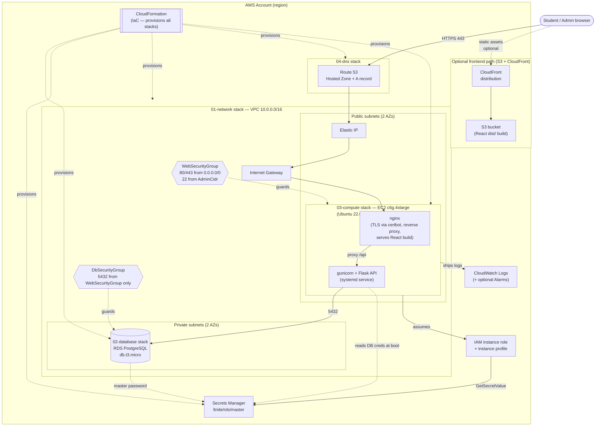

and# LTRide — Deployment Guide (AWS)

> **Where this doc sits.** This is the **deployment** design + implementation doc, a sibling of the [UI guide](../ui/ui-development-guide.md) and the [backend guide](https://github.com/LTRide2/LTR-Backend/blob/main/plan/backend/backend-development-guide.md), all orchestrated by [`../plan.md`](../plan.md). It owns everything about getting the app **onto AWS and keeping it running**: the step-by-step deploy CRs (D0–D4), live-server operations, and the full architecture/IaC/cost reference. The master plan links here from [`../plan.md` §10](../plan.md#10-aws-deployment--ec2--rds-via-cloudformation).
>
> - **Backend build** (the app these steps deploy) → [backend guide](https://github.com/LTRide2/LTR-Backend/blob/main/plan/backend/backend-development-guide.md)
> - **Frontend build & serve** (the SPA nginx serves) → [UI guide → Deployment (frontend)](../ui/ui-development-guide.md#part-f3--deployment-frontend)
> - **Runnable artifacts** (templates, scripts, server config) → repo-root [`deploy/`](../../deploy/README.md)
> - **CR ordering & status** → [`../plan.md` §8.2 tracker](../plan.md#82-cr-status-tracker)

This guide has three parts:

1. **[Deploy to AWS, step by step (CRs D0–D4)](#part-1--deploy-to-aws-step-by-step-crs-d0d4)** — the click-by-click tutorial: account setup, templates, provisioning, releasing code, DNS + HTTPS.
2. **[Operating & troubleshooting the live server](#part-2--operating--troubleshooting-the-live-server)** — day-to-day ops once it's live.
3. **[Reference: architecture, IaC & cost model](#part-3--reference-architecture-iac--cost-model)** — the design detail behind the steps: target architecture, every CloudFormation stack, the AWS-services inventory, and the monthly + professional cost model.

---

## Part 1 — Deploy to AWS, step by step (CRs D0–D4)

> **Big picture:** we rent one small Linux computer from Amazon (**EC2**) to run the Flask backend, and one managed database (**RDS PostgreSQL**) for the data. We describe all of this in code (**CloudFormation**, called "IaC" = infrastructure as code) so it's repeatable. Two scripts do the work for you:
> - `deploy/deploy.sh` — creates/updates the AWS infrastructure (the server, the database, networking, DNS).
> - `deploy/release.sh` — ships your latest code (backend + frontend) onto that server.
>
> You should have finished at least backend B1 (a working backend locally, see the [backend guide](https://github.com/LTRide2/LTR-Backend/blob/main/plan/backend/backend-development-guide.md#cr-b1--health-check-prove-the-server-runs)) before deploying. The full deep-dive on each CloudFormation stack — architecture, IaC layout, every stack's snippets, the AWS-services inventory, and the cost model — lives in [**Part 3 — Reference**](#part-3--reference-architecture-iac--cost-model) below. This Part 1 is the click-by-click version.

> **💻 Windows note (applies to this whole guide).** The commands below are written for **macOS / Linux**; the handful that differ on Windows show a **PowerShell** block alongside. Three rules cover almost everything:
> 1. **`git`, `ssh`, `scp`, and `curl` all ship with Windows 10/11** (curl is invoked as `curl.exe` in PowerShell). Only the SSH key *path* changes — `$HOME\.ssh\ltride-key.pem` instead of `~/.ssh/ltride-key.pem`.
> 2. **The repo's `.sh` scripts (`deploy.sh`, `release.sh`) can't run in PowerShell** — run them from **Git Bash** or **WSL**, where the macOS/Linux commands work verbatim.
> 3. **Everything you run *after* `ssh`-ing into the server is on the Ubuntu box** — those commands are identical no matter what your laptop runs. And **all AWS provisioning happens on Amazon's Linux servers**, so the whole architecture below is unaffected by your OS.
>
> Two local swaps worth memorizing: use **`Resolve-DnsName`** wherever this guide shows `dig`, and `$HOME\` wherever it shows `~/`.

### Deployment vocabulary

- **EC2** — a virtual computer in Amazon's data center.
- **RDS** — a database Amazon runs and backs up for you.
- **CloudFormation / stack** — a YAML file describing AWS resources; a "stack" is one deployed copy of it.
- **Security group** — a firewall: which ports/IPs may connect.
- **Elastic IP** — a fixed public address for your server.
- **SSH** — a secure way to log into the server from your terminal.
- **Secrets Manager** — where AWS stores the database password safely.

---

### D0 — One-time AWS account setup (not a code CR, but do it once)

1. **Create an AWS account** at <https://aws.amazon.com> (a credit card is required; the small instances we use cost a few dollars a month — **remember to run `./deploy.sh down` when you're done experimenting** to stop charges).
2. **Create an admin IAM user** (don't use the root account day-to-day). In the AWS Console → IAM → Users → create a user with programmatic access and `AdministratorAccess` (for a school project this is acceptable; tighten later). Save the **Access key ID** and **Secret access key**.
3. **Install & configure the AWS CLI.** Our script installs it for you (on macOS via brew), but you must give it your keys. `deploy.sh` is a shell script — run it from Git Bash/WSL on Windows.

   **macOS / Linux (bash/zsh):**
   ```bash
   cd ~/workspace/LTR-Backend/deploy
   ./deploy.sh validate           # this auto-installs awscli via brew if missing
   aws configure                  # paste your Access key, Secret, region us-east-1, output json
   ```
   **Windows:** install the AWS CLI yourself (`winget install -e --id Amazon.AWSCLI`, or the MSI from AWS), then run the script from **Git Bash / WSL**:
   ```bash
   cd $HOME/workspace/LTR-Backend/deploy
   ./deploy.sh validate           # from Git Bash or WSL (PowerShell can't run .sh)
   aws configure                  # same on every OS — paste keys, region us-east-1, output json
   ```
4. **Create an SSH key pair** named `ltride-key` (AWS Console → EC2 → Key Pairs → Create), download `ltride-key.pem`, and move it where the scripts expect:

   **macOS / Linux (bash/zsh):**
   ```bash
   mv ~/Downloads/ltride-key.pem ~/.ssh/ltride-key.pem
   chmod 600 ~/.ssh/ltride-key.pem
   ```
   **Windows (PowerShell):** move it into `%USERPROFILE%\.ssh`, then lock it down with `icacls` (the Windows equivalent of `chmod 600` — remove inherited permissions, grant read to just you):
   ```powershell
   New-Item -ItemType Directory -Force $HOME\.ssh | Out-Null
   Move-Item $HOME\Downloads\ltride-key.pem $HOME\.ssh\ltride-key.pem
   icacls $HOME\.ssh\ltride-key.pem /inheritance:r /grant:r "$($env:USERNAME):R"
   ```
5. **Fill in `deploy/params/prod.json`** with your real values:
   - `AdminCidr` — your home IP followed by `/32` (find it at <https://whatismyip.com>); this restricts SSH to you.
   - `KeyName` — `ltride-key` (must match step 4).
   - `DomainName` / `HostedZoneId` — only if you own a domain; otherwise you'll use the raw IP and can skip the DNS stack for now.

---

### CR D1 — Write the CloudFormation templates (the infrastructure code)

**Depends on:** nothing in the app. **Branch:** `cr/d1-cfn-templates` (off `main`).

**Goal:** have the four template files the scripts expect, in `deploy/cfn/`. These are now **already written and committed** (heavily commented so you can read what every resource does); your job in this CR is to understand them and confirm they validate. The four files:

- `deploy/cfn/01-network.yaml` — VPC, two public subnets (RDS needs two AZs), internet gateway, and the web + database security groups (firewalls).
- `deploy/cfn/02-database.yaml` — RDS PostgreSQL + a Secrets-Manager-generated password (so the DB password is never written in plaintext).
- `deploy/cfn/03-compute.yaml` — the EC2 instance + Elastic IP + an IAM role that may read only the DB secret + UserData that installs Python/nginx/gunicorn and writes `.env` from the secret on first boot.
- `deploy/cfn/04-dns.yaml` — Route 53 A record (domain → Elastic IP). It is guarded by a `HasHostedZone` condition: while `HostedZoneId` is still the placeholder in `params/prod.json`, the stack creates nothing, so the deploy succeeds even before you own a domain.

> **Two non-obvious rules these templates follow** (worth knowing if you edit them):
> 1. `deploy.sh` passes the *entire* `params/prod.json` to *every* stack, and CloudFormation rejects an override for a parameter a template doesn't declare. So **every template declares all six keys** (`AdminCidr`, `KeyName`, `DomainName`, `HostedZoneId`, `WebInstanceType`, `DbInstanceClass`) — the unused ones are simply never referenced, which is allowed.
> 2. There is no output→param wiring between stacks, so cross-stack values travel via **`Export` / `Fn::ImportValue`** (e.g. the network stack exports `ltride-VpcId`, the compute stack imports `ltride-DbEndpoint`). Rename an export → update its importers.

**One thing you MUST change before deploying:** in `03-compute.yaml`, the `RepoUrl` near the bottom of the UserData block is `https://github.com/YOUR_ORG/LTR-Backend.git` — set it to your repo's real clone URL, or the instance can't fetch the code on boot.

**Local testing guide:**
1. Setup: AWS CLI configured (D0); `cd deploy`.
2. Steps (on Windows, run from Git Bash / WSL — `deploy.sh` is a shell script):
   ```bash
   ./deploy.sh validate
   ```
3. Expected: prints `valid: 01-network.yaml` … through all four. No template errors. **No AWS resources are created by `validate`** — it's a dry check that just asks AWS "is this template well-formed?".

---

### CR D1b — Server configuration files (nginx, gunicorn/systemd, provisioning)

**Depends on:** D1. **Branch off D1** (`cr/d1b-server-config`).

**Goal:** create the files that turn a bare Ubuntu box into a working LTRide server. The CloudFormation compute stack (D1's `03-compute.yaml`) runs these at first boot via **UserData**; they also let you re-provision or fix a server by hand. They live in `deploy/server/`:

| File | Goes on the server at | Job |
|---|---|---|
| `nginx-ltride.conf` | `/etc/nginx/sites-available/ltride` | Serve the React build **and** reverse-proxy `/api` to gunicorn |
| `ltride.service` | `/etc/systemd/system/ltride.service` | Keep gunicorn (Flask) running & restart on crash/reboot |
| `provision.sh` | run once as root | Install packages, create the user, build the venv, wire the two files above, start everything |

> **The request journey (why we need all three):**
> ```
> Browser ──HTTP(S)──▶ nginx :80/:443 ──┬─ /…       → serve files from /var/www/ltride (the React app)
>                                        └─ /api/…   → proxy to gunicorn 127.0.0.1:8000 → Flask → RDS
> ```
> nginx is the only thing exposed to the internet. gunicorn listens on localhost only, so the API can't be reached except *through* nginx — one hardened front door.

#### File 1 — `deploy/server/nginx-ltride.conf` (the web server / reverse proxy)

```nginx
server {
    listen 80;
    listen [::]:80;
    server_name _;                 # matches any hostname (until a domain + certbot set a real one)

    client_max_body_size 10M;      # allow map-image uploads (nginx default is 1M → 413 errors)

    root /var/www/ltride;          # where release.sh puts the built React files
    index index.html;

    location / {
        try_files $uri $uri/ /index.html;   # SPA fallback: refresh of /admin serves index.html
    }

    location /assets/ {            # Vite's hashed bundles — safe to cache forever
        expires 1y;
        add_header Cache-Control "public, immutable";
    }

    location /api/ {
        proxy_pass http://127.0.0.1:8000;                    # forward to gunicorn
        proxy_set_header Host              $host;
        proxy_set_header X-Real-IP         $remote_addr;
        proxy_set_header X-Forwarded-For   $proxy_add_x_forwarded_for;
        proxy_set_header X-Forwarded-Proto $scheme;
        proxy_read_timeout 30s;
    }
}
```
**Line-by-line, the parts that matter most:**
- **`server_name _;`** — `_` is nginx's "match any hostname." Fine when you only reach the box by IP. When you add a domain, `certbot` edits this to your real name so it can issue a certificate for it.
- **`client_max_body_size 10M;`** — nginx rejects request bodies over **1 MB by default** with `413 Request Entity Too Large`. Map uploads (U7) need more, so we raise it. This is the single most common "works locally, 413 in the cloud" gotcha.
- **`root` + `index`** — where the static React files live and the default file to serve.
- **`location / { try_files $uri $uri/ /index.html; }`** — the **SPA fallback**. React Router invents URLs like `/admin` that aren't files on disk. `try_files` tries the literal file, then a folder, and **falls back to `index.html`** so the React app boots and routes the URL itself. Without this, refreshing `/admin` returns a 404. (This is exactly the "deep-link 404" warning in UI CR **U2**.)
- **`location /assets/ { expires 1y; immutable }`** — Vite fingerprints bundle filenames with a hash, so a new deploy = a new filename. That makes it safe to tell browsers to cache them forever; users still get new code instantly because the filename changed.
- **`location /api/ { proxy_pass … }`** — the **reverse proxy**. Everything under `/api/` is forwarded to gunicorn on `127.0.0.1:8000`. The `proxy_set_header` lines pass the *real* visitor's host/IP/scheme through to Flask (otherwise your logs would just show `127.0.0.1`, i.e. nginx talking to itself). `X-Forwarded-Proto` tells Flask whether the original request was http or https.

#### File 2 — `deploy/server/ltride.service` (gunicorn under systemd)

```ini
[Unit]
Description=LTRide backend (gunicorn)
After=network.target

[Service]
User=ltride
Group=ltride
WorkingDirectory=/home/ltride/app
EnvironmentFile=/home/ltride/app/.env
ExecStart=/home/ltride/app/.venv/bin/gunicorn \
    --workers 3 \
    --bind 127.0.0.1:8000 \
    --access-logfile - \
    --error-logfile - \
    webapp.App:app
Restart=always
RestartSec=3

[Install]
WantedBy=multi-user.target
```
**What each line buys you:**
- **`After=network.target`** — don't start before networking is up (we connect to RDS over the network).
- **`User=ltride` / `Group=ltride`** — run as an unprivileged service account, **never root**. If the app is compromised, the damage is limited to this one account.
- **`EnvironmentFile=…/.env`** — the production secrets (`SECRET_KEY`, `DATABASE_URL`, `CORS_ORIGINS`). This is the server's equivalent of your local `.env` — it lives only on the box, readable only by `ltride`, never committed.
- **`ExecStart=…/gunicorn …`** — the actual command. Uses the **venv's** gunicorn (not system Python). `--workers 3` runs 3 processes for concurrency (rule of thumb: `2 × CPU + 1`). `--bind 127.0.0.1:8000` = listen on localhost only (nginx is the public door). `webapp.App:app` = import module `webapp.App`, use the object `app` (the `app = create_app()` from B1). The `-` logfiles send logs to the journal so `journalctl` can show them.
- **`Restart=always` / `RestartSec=3`** — if gunicorn dies, systemd restarts it after 3s. Survives crashes and reboots.
- **`WantedBy=multi-user.target`** — lets `systemctl enable ltride` make it start automatically on every boot.

**Operating it** (on the server):
```bash
sudo systemctl status ltride        # active (running)?
sudo journalctl -u ltride -n 50     # last 50 log lines (your #1 debugging tool)
sudo systemctl restart ltride       # apply a config/code change
sudo systemctl daemon-reload        # after EDITING the .service file itself
```

#### File 3 — `deploy/server/provision.sh` (first-boot setup)

This is what `03-compute.yaml`'s UserData runs (roughly) on a fresh instance, and what you can run by hand to (re)build a box. In order, it: ① `apt-get install` python/nginx/git/`postgresql-client`; ② create the system user `ltride`; ③ clone the repo and build the `.venv`; ④ write a `.env` template (real secrets come from Secrets Manager in the CFN flow); ⑤ install File 2 into systemd and File 1 into nginx (symlinking it into `sites-enabled` and removing nginx's default welcome page); ⑥ run the SQL migrations against RDS; ⑦ start `ltride` and reload nginx.

> **Set `REPO_URL`** at the top of `provision.sh` to your repo before first use. The script installs only the postgres **client** (`psql`) — the database itself is RDS, managed by AWS, not on this box.

**Local testing guide:**
1. Setup: `cd deploy/server`.
2. Steps (these use `bash`/`nginx`; on Windows run them from Git Bash / WSL, or just skip them — the real validation is on the Ubuntu server after D2/D3):
   ```bash
   # config files are static — validate them without a server:
   bash -n provision.sh                 # shell-syntax check (no execution)
   # if you have nginx locally (brew install nginx), you can sanity-test the config:
   nginx -t -c "$PWD/nginx-ltride.conf" 2>&1 | head    # may warn about paths off-server; syntax is what matters
   ```
3. Expected: `bash -n` prints nothing (valid). The real proof is on the server: after D2/D3, SSH in and run `sudo nginx -t` (→ "syntax is ok, test is successful") and `systemctl status ltride` (→ active).

**Commit & push:**
```bash
git add deploy/server/
git commit -m "D1b: nginx + systemd + provisioning config for the server"
git push -u origin cr/d1b-server-config
```
PR base = `cr/d1-cfn-templates`.

---

### CR D2 — Stand up the infrastructure

**Depends on:** D1. **Branch off D1** (`cr/d2-provision`). *(This CR is mostly running commands and recording outputs; the "code" is any small fixes you make to the templates.)*

**Goal:** actually create the network, database, and server in AWS.

**Steps** (`deploy.sh` is a shell script — on Windows run these from Git Bash / WSL, using `$HOME` for `~`):
```bash
cd ~/workspace/LTR-Backend/deploy
./deploy.sh up            # validates, then creates all stacks in order
./deploy.sh status        # watch until each says CREATE_COMPLETE
./deploy.sh outputs       # note the EC2 public IP / Elastic IP
```
This takes ~10–15 minutes (RDS is slow to create). If a stack fails, open the AWS Console → CloudFormation → click the stack → **Events** tab to see the red error, fix the template, and re-run `./deploy.sh up` (it updates in place).

**Local testing guide:**
1. Setup: D0 complete; templates valid (D1).
2. Steps: run the three commands above; then SSH in to confirm (`ssh` ships with Windows — in PowerShell use the key path `$HOME\.ssh\ltride-key.pem`):
   ```bash
   ssh -i ~/.ssh/ltride-key.pem ubuntu@<ElasticIp-from-outputs>
   # Windows (PowerShell): ssh -i $HOME\.ssh\ltride-key.pem ubuntu@<ElasticIp-from-outputs>
   ```
3. Expected: all stacks reach `CREATE_COMPLETE`; `outputs` shows a public IP; you can SSH into the server. Type `exit` to leave.

> 💸 **Cost control:** when you're done for the day and don't need it live, `./deploy.sh down` deletes everything (RDS keeps a final snapshot). Re-create anytime with `./deploy.sh up`.

---

### CR D3 — Release the application code

**Depends on:** D2, and backend through at least B1 (ideally B7) merged. **Branch off D2** (`cr/d3-release`).

**Goal:** put your actual backend + frontend onto the running server using `release.sh`.

**Steps** (`release.sh` is a shell script — on Windows run these from Git Bash / WSL):
```bash
cd ~/workspace/LTR-Backend/deploy
./release.sh all          # builds the UI, ships both, migrates DB, restarts services
# or one at a time:
./release.sh backend
./release.sh frontend
```
What it does (so you understand it, from `release.sh`):
- **Backend:** SSHes in, `git pull`, installs requirements, runs any `sql/migrations/*.sql`, restarts the `ltride` service (gunicorn), and curls `/api/health`.
- **Frontend:** runs `npm run build` with the production API URL, then copies `dist/` into nginx's web root and reloads nginx.

**Local testing guide:**
1. Setup: D2 done (`./deploy.sh outputs` shows an IP); your code committed and pushed.
2. Steps (run `release.sh` from Git Bash/WSL on Windows; `curl` is `curl.exe` in PowerShell):
   ```bash
   ./release.sh all
   curl http://<ElasticIp>/api/health      # Windows PowerShell: curl.exe http://<ElasticIp>/api/health
   ```
   Then open `http://<ElasticIp>` (or your domain) in a browser and log in as a seeded student.
3. Expected: the health curl returns `{"data":{"status":"ok"}}`; the website loads; login works against the real server.

---

### CR D4 — Buy a domain, wire it to Route 53, and turn on HTTPS

**Depends on:** D3 (a working site reachable at `http://<ElasticIp>`). **Branch off D3** (`cr/d4-dns-tls`).

**Goal:** replace the bare IP with a real address like `https://ltride.example.com`, with a padlock (TLS).

> **The mental model — three separate things that must all line up:**
> 1. **Registrar** — the company you *buy* the domain name from (it's a yearly rental, ~$10–15/yr). Examples: Amazon Route 53, Namecheap, Cloudflare, Google Domains/Squarespace.
> 2. **DNS hosting (the "hosted zone")** — the phone book that maps your name → your server's IP. We use **AWS Route 53** for this so it lives next to the rest of our infrastructure.
> 3. **Nameservers (NS)** — the pointer that tells the *internet* "ask Route 53 for this domain's records." You set these **at the registrar**, pointing them at the Route 53 hosted zone. This is the step beginners miss.
>
> If you buy the domain **at Route 53**, steps 2 & 3 are automatic. If you buy it **elsewhere**, you must manually copy Route 53's nameservers back to the registrar. Both paths are below — **pick ONE**.

---

#### Step 0 — Choose where to buy the domain

| Option | When to pick it | Trade-off |
|---|---|---|
| **Buy at Route 53** (recommended here) | You want the simplest wiring; everything in AWS | Slightly pricier; pay via AWS bill |
| **Buy at a 3rd-party registrar** (Namecheap, Cloudflare, etc.) | You already have one, or want the cheapest price | You must hand-copy nameservers to Route 53 (Step 2B) |

Either way the **DNS records live in Route 53** — only *where you bought the name* differs.

---

#### Step 1 — Create a Route 53 hosted zone (both paths do this)

A "hosted zone" is the container in Route 53 that holds your domain's DNS records.

**Console way (easiest to see what's happening):**
1. AWS Console → **Route 53** → **Hosted zones** → **Create hosted zone**.
2. **Domain name:** your domain, e.g. `example.com` (use the *root* domain, even if your site will live at `ltride.example.com`).
3. **Type:** Public hosted zone → **Create**.
4. AWS immediately shows an **NS record** with **4 nameservers** like:
   ```
   ns-123.awsdns-45.com
   ns-678.awsdns-90.net
   ns-901.awsdns-12.org
   ns-234.awsdns-56.co.uk
   ```
   **Copy these four** — you need them in Step 2. Also copy the **Hosted zone ID** (looks like `Z0123456789ABCDEFGHIJ`).

**CLI way (equivalent).** The `aws` commands are identical everywhere; only the "unique string" trick in `--caller-reference` differs:

**macOS / Linux (bash/zsh):**
```bash
aws route53 create-hosted-zone --name example.com --caller-reference "ltride-$(date +%s)"
# then read the nameservers + zone id back:
aws route53 get-hosted-zone --id <HostedZoneId> --query 'DelegationSet.NameServers'
```
**Windows (PowerShell):**
```powershell
aws route53 create-hosted-zone --name example.com --caller-reference "ltride-$([DateTimeOffset]::Now.ToUnixTimeSeconds())"
aws route53 get-hosted-zone --id <HostedZoneId> --query 'DelegationSet.NameServers'
```

Put the Hosted zone ID into `deploy/params/prod.json` so the DNS stack and `release.sh` can find it:
```json
[
  "DomainName=ltride.example.com",
  "HostedZoneId=Z0123456789ABCDEFGHIJ",
  ...
]
```

---

#### Step 2A — If you bought the domain AT Route 53

Buying through Route 53 (**Route 53 → Registered domains → Register domains**) **auto-creates the hosted zone and auto-sets the nameservers** for you. There's nothing to copy — skip to Step 3. (If you did Step 1 manually *and* registered separately, make sure the registered domain points at the hosted zone you created; delete the duplicate zone if AWS made one.)

---

#### Step 2B — If you bought the domain ELSEWHERE (the nameserver hand-off)

This is the step that actually "connects" your purchased name to Route 53. You're telling your registrar: *"don't use your own DNS — delegate to these AWS nameservers."*

1. Log into your **registrar** (Namecheap / Cloudflare / GoDaddy / etc.).
2. Find the domain's **Nameservers** setting (often under "Domain" → "Nameservers" or "DNS"). Choose **Custom nameservers**.
3. **Delete** the registrar's default nameservers and **paste the 4 from Step 1** (no trailing dots needed; one per field):
   ```
   ns-123.awsdns-45.com
   ns-678.awsdns-90.net
   ns-901.awsdns-12.org
   ns-234.awsdns-56.co.uk
   ```
4. **Save.** Propagation usually takes minutes but can take **up to 24–48 hours**. Check progress:
   ```bash
   dig NS example.com +short                 # macOS/Linux — should list the 4 awsdns nameservers
   ```
   ```powershell
   Resolve-DnsName example.com -Type NS      # Windows equivalent
   ```
   When it shows the AWS nameservers, the hand-off is done — the internet now asks Route 53 for your domain.

> **Common mistake:** people add an "A record" at the registrar AND set Route 53 nameservers. Don't. Once you delegate nameservers to Route 53, the registrar's own DNS records are ignored — **all records go in Route 53** from now on (Step 3).

---

#### Step 3 — Point the domain at your server (A record in Route 53)

Now create the record that maps your name → your server's Elastic IP. Our `04-dns.yaml` stack does this from `params/prod.json` (`deploy.sh` is a shell script — run from Git Bash/WSL on Windows):
```bash
cd ~/workspace/LTR-Backend/deploy
./deploy.sh up            # picks up 04-dns.yaml using DomainName + HostedZoneId
```
`04-dns.yaml` creates an **A record** `ltride.example.com → <ElasticIp>` (the Elastic IP from the compute stack, so it's stable across restarts).

**Or do it by hand** in the Console: Route 53 → your hosted zone → **Create record** → Record name `ltride` (or leave blank for the root), Type **A**, Value = your Elastic IP, TTL 300 → Create.

Verify (`dig` → `Resolve-DnsName`, `curl` → `curl.exe` on Windows):

**macOS / Linux (bash/zsh):**
```bash
dig ltride.example.com +short    # should print your Elastic IP
curl -I http://ltride.example.com/api/health   # should reach your server (200)
```
**Windows (PowerShell):**
```powershell
Resolve-DnsName ltride.example.com -Type A       # should print your Elastic IP
curl.exe -I http://ltride.example.com/api/health # should reach your server (200)
```

---

#### Step 4 — Update the app for the new hostname, then add HTTPS

1. **Tell the backend to trust the new origin.** Edit the server's `.env` `CORS_ORIGINS` to include `https://ltride.example.com`, then `sudo systemctl restart ltride`. (Locally you set this in `params`/`.env`; on the server it's in `/home/ltride/app/.env`.)
2. **Rebuild the frontend** so it calls the domain, not the IP: `release.sh` already builds the UI with `VITE_API_URL=https://<DomainName>` when `DomainName` is set in `params/prod.json`. Re-run (from Git Bash/WSL on Windows):
   ```bash
   ./release.sh frontend
   ```
3. **Get a free TLS certificate** with certbot (Let's Encrypt). SSH in and run (`ssh` ships with Windows; in PowerShell use `-i $HOME\.ssh\ltride-key.pem`):
   ```bash
   ssh -i ~/.ssh/ltride-key.pem ubuntu@<ElasticIp>   # Windows: -i $HOME\.ssh\ltride-key.pem
   # --- the two commands below run on the Ubuntu server, identical on every OS ---
   sudo apt-get install -y certbot python3-certbot-nginx
   sudo certbot --nginx -d ltride.example.com
   ```
   certbot edits the nginx config (File 1 from D1b): it adds a `listen 443 ssl` block, fills in `server_name ltride.example.com`, wires the certificate, and adds an **HTTP→HTTPS redirect**. It also installs a cron/timer to auto-renew every 90 days. Answer its prompts (email, agree to terms, choose "redirect").

---

**Local testing guide:**
1. Setup: hosted zone created (Step 1); nameservers delegated (Step 2, if 3rd-party) and `dig NS` shows AWS; A record live (Step 3); certbot run (Step 4).
2. Steps:

   **macOS / Linux (bash/zsh):**
   ```bash
   dig ltride.example.com +short                 # → your Elastic IP
   curl -I https://ltride.example.com/api/health # → HTTP/2 200, valid cert
   curl -I http://ltride.example.com             # → 301 redirect to https
   ```
   **Windows (PowerShell):**
   ```powershell
   Resolve-DnsName ltride.example.com -Type A        # → your Elastic IP
   curl.exe -I https://ltride.example.com/api/health # → HTTP/2 200, valid cert
   curl.exe -I http://ltride.example.com             # → 301 redirect to https
   ```
   Then open `https://ltride.example.com` in a browser and log in.
3. Expected:
   - `dig` resolves to your IP; the browser shows a **padlock** (valid Let's Encrypt cert).
   - Plain `http://` **redirects** to `https://`.
   - Login and the full app work over HTTPS (no CORS errors — because you added the https origin in Step 4.1).

**If something's wrong:**
- **`dig NS` doesn't show AWS nameservers** — Step 2B not done, or still propagating (wait; can take up to 48h). Until this resolves, nothing else will work.
- **`dig` shows the IP but the browser can't connect** — security group isn't allowing port 80/443 (check `01-network.yaml`), or nginx isn't running.
- **certbot fails "challenge failed"** — the domain must already resolve to this server over **port 80** before certbot can verify it. Finish Step 3 (and open port 80) first.
- **Padlock works but API calls fail with CORS** — you forgot Step 4.1 (`CORS_ORIGINS` must include the `https://` domain) or didn't restart the backend.

**Commit & push:**
```bash
git add deploy/params/prod.json deploy/cfn/04-dns.yaml
git commit -m "D4: Route 53 hosted zone + A record + HTTPS via certbot"
git push -u origin cr/d4-dns-tls
```
PR base = `cr/d3-release`.


---

## Part 2 — Operating & troubleshooting the live server

**Log into the server** (`ssh` ships with Windows — in PowerShell use `-i $HOME\.ssh\ltride-key.pem`):
```bash
ssh -i ~/.ssh/ltride-key.pem ubuntu@<ElasticIp>
```

**Useful commands once you're on the server** (these all run on the Ubuntu box, so they're identical no matter what your laptop runs):
```bash
sudo systemctl status ltride       # is the backend running?
sudo journalctl -u ltride -n 50    # last 50 lines of backend logs
sudo systemctl restart ltride      # restart the backend
sudo nginx -t && sudo systemctl reload nginx   # test + reload the web server
```

> **Where the config lives on the server** (created in **D1b**): nginx site at `/etc/nginx/sites-available/ltride` (→ symlinked into `sites-enabled/`), gunicorn service at `/etc/systemd/system/ltride.service`, app secrets at `/home/ltride/app/.env`. After editing the nginx file run `sudo nginx -t && sudo systemctl reload nginx`; after editing the `.service` file run `sudo systemctl daemon-reload && sudo systemctl restart ltride`; after editing `.env` just `sudo systemctl restart ltride`.

**Common problems:**
- **`502 Bad Gateway` in the browser** — the backend (gunicorn) crashed; check `journalctl -u ltride`. Usually a missing env var or a DB connection error.
- **Website loads but API calls fail** — the frontend was built with the wrong `VITE_API_URL`; re-run `./release.sh frontend`.
- **Can't SSH** — your home IP changed; update `AdminCidr` in `params/prod.json` and `./deploy.sh up`.
- **Database connection refused** — check the RDS endpoint and that the EC2 security group is allowed to reach RDS ([Part 3 §B.3–§B.4](#b3-network-stack-01-networkyaml)).


---

## Part 3 — Reference: architecture, IaC & cost model

> **What this is.** [Part 1](#part-1--deploy-to-aws-step-by-step-crs-d0d4) above is the *click-by-click* deployment tutorial. This part is the **reference/design** companion: the target architecture, the Infrastructure-as-Code layout, the CloudFormation snippets each stack is built from, the full AWS-services inventory, and the **cost model** (infrastructure + professional labor). The actual templates and scripts live in the repo-root [`deploy/`](../../deploy/README.md) folder. The orchestrator ([`../plan.md` §10](../plan.md#10-aws-deployment--ec2--rds-via-cloudformation)) links here as the authoritative deployment design.

**Architecture:** Flask served by **gunicorn** behind **nginx** on a single **EC2** instance; **PostgreSQL on RDS**; the React static bundle served from the same nginx (simplest) or from **S3 + CloudFront**. HTTPS via **Let's Encrypt (certbot)** on a domain managed in **Route 53**. **All infrastructure is provisioned and managed with AWS CloudFormation (IaC)** — no manual console clicks for the resources below.

```
                 ┌──────── EC2 c6g.4xlarge (Ubuntu 22.04, arm64) ──────┐
 Internet ──443──┤ nginx (TLS, reverse proxy, serves React build)      │
   (Route 53)    │   │                                                  │
                 │   └─ proxy /api ─▶ gunicorn (systemd) ─▶ Flask app   │
                 └───────────────────────────┬──────────────────────────┘
                                              │ 5432 (private SG)
                                     ┌────────▼─────────┐
                                     │ RDS PostgreSQL   │
                                     └──────────────────┘
```

### B.1 Prerequisites
- AWS account with admin/IAM access; AWS CLI configured locally (`aws configure`).
- A registered domain with a **Route 53 hosted zone** (note its `HostedZoneId`).
- Backend prepared per CRs **B0–B10** (B10 = Postgres-ready connection layer).
- A fresh EC2 **key pair** created once (`aws ec2 create-key-pair`), referenced by name as a stack parameter (**not** the leaked `aws-tutorial.pem`).
- The RDS master password stored in **AWS Secrets Manager** (CloudFormation references it dynamically; it is never written into the template or git).

### B.2 IaC layout
Keep deployment code in the repo under `deploy/`, split into composable nested/standalone stacks so they can be updated independently:
```
deploy/
  cfn/
    01-network.yaml     # VPC, 2 public + 2 private subnets, IGW, route tables, SGs
    02-database.yaml    # RDS PostgreSQL, DB subnet group, Secrets Manager secret
    03-compute.yaml     # EC2 + Elastic IP + IAM instance role, UserData bootstrap
    04-dns.yaml         # Route 53 A record → Elastic IP
  params/
    prod.json           # stack parameters (instance type, domain, key name, ...)
  deploy.sh             # wrapper: aws cloudformation deploy for each stack in order
```
Rather than typing four `aws cloudformation deploy` commands, **`deploy/deploy.sh` wraps them all** — it validates every template, then creates/updates the stacks in dependency order, adds `CAPABILITY_NAMED_IAM` only where needed, and prints the stack outputs:
```bash
./deploy/deploy.sh up        # validate + create/update all stacks (env defaults to prod)
./deploy/deploy.sh validate  # validate templates only, no changes
./deploy/deploy.sh status    # show each stack's status
./deploy/deploy.sh outputs   # print each stack's Outputs
./deploy/deploy.sh down      # delete all stacks in reverse order (DB leaves a final snapshot)
```
Region/profile come from `AWS_REGION` / `AWS_PROFILE`; stack parameters live in `deploy/params/<env>.json` (e.g. `AdminCidr`, `KeyName`, `DomainName`, `HostedZoneId`). Cross-stack wiring uses `Outputs` + `Fn::ImportValue` (e.g. network exports `VpcId`, `WebSubnetId`, `WebSecurityGroupId`, `DbSecurityGroupId`; database exports the RDS endpoint).

The script is self-bootstrapping: a `preflight` step checks for the AWS CLI and **only installs it (via `brew install awscli`) if it is missing on macOS** — an existing AWS CLI is detected and left untouched. It also verifies credentials (`sts get-caller-identity`) before making any changes.

> **On Windows:** `deploy.sh`/`release.sh` are Bash scripts — run them from **Git Bash** or **WSL** (PowerShell can't execute `.sh`). The brew auto-install is macOS-only, so install the AWS CLI yourself first (`winget install -e --id Amazon.AWSCLI`, or the MSI); the script then detects it and proceeds. Once inside Git Bash/WSL, every command in this section works verbatim.

### B.3 Network stack (`01-network.yaml`)
Provisions: a VPC (`10.0.0.0/16`), two public subnets + two private subnets across two AZs, an Internet Gateway + public route table, and two security groups:
- **`WebSecurityGroup`** (EC2): inbound `443` and `80` from `0.0.0.0/0`, `22` from a parameterized `AdminCidr` (your IP).
- **`DbSecurityGroup`** (RDS): inbound `5432` whose `SourceSecurityGroupId` = `WebSecurityGroup` (not a CIDR). No public ingress.

```yaml
  DbSecurityGroup:
    Type: AWS::EC2::SecurityGroup
    Properties:
      GroupDescription: RDS access from web tier only
      VpcId: !Ref Vpc
      SecurityGroupIngress:
        - IpProtocol: tcp
          FromPort: 5432
          ToPort: 5432
          SourceSecurityGroupId: !Ref WebSecurityGroup
```

### B.4 Database stack (`02-database.yaml`)
Provisions a **Secrets Manager** secret (auto-generated password), a DB subnet group across the two private subnets, and the RDS instance. `MasterUserPassword` is resolved from the secret at deploy time — never in plaintext.

```yaml
  DbSecret:
    Type: AWS::SecretsManager::Secret
    Properties:
      Name: ltride/rds/master
      GenerateSecretString:
        SecretStringTemplate: '{"username":"ltride_admin"}'
        GenerateStringKey: password
        ExcludePunctuation: true
        PasswordLength: 32

  Database:
    Type: AWS::RDS::DBInstance
    DeletionPolicy: Snapshot
    Properties:
      Engine: postgres
      DBInstanceClass: !Ref DbInstanceClass     # db.t3.micro (free tier)
      AllocatedStorage: "20"
      DBName: ltride
      MasterUsername: ltride_admin
      MasterUserPassword: !Sub '{{resolve:secretsmanager:${DbSecret}:SecretString:password}}'
      DBSubnetGroupName: !Ref DbSubnetGroup
      VPCSecurityGroups: [ !ImportValue ltride-network-DbSecurityGroupId ]
      PubliclyAccessible: false
      BackupRetentionPeriod: 7
      MultiAZ: false
    # Outputs: DB endpoint address + the secret ARN (consumed by compute UserData)
```

### B.5 Compute stack (`03-compute.yaml`) — EC2 + bootstrap
Provisions an Elastic IP, an IAM instance role (read the DB secret + write CloudWatch logs), and the EC2 instance whose **`UserData`** bootstraps the server on first boot — so the box is reproducible from the template, not hand-configured. UserData performs the same steps that were previously manual:

```yaml
  WebServer:
    Type: AWS::EC2::Instance
    Properties:
      ImageId: !Ref UbuntuAmiId          # SSM-resolved Ubuntu 22.04 AMI (arm64 — c6g is Graviton2)
      InstanceType: !Ref WebInstanceType  # c6g.4xlarge (16 vCPU, 32 GiB, arm64/Graviton2)
      KeyName: !Ref KeyName
      IamInstanceProfile: !Ref WebInstanceProfile
      SubnetId: !ImportValue ltride-network-PublicSubnet1Id
      SecurityGroupIds: [ !ImportValue ltride-network-WebSecurityGroupId ]
      UserData:
        Fn::Base64: !Sub |
          #!/bin/bash -xe
          apt update && apt install -y python3-venv nginx postgresql-client git jq awscli
          useradd -m -s /bin/bash ltride
          sudo -u ltride git clone https://github.com/LTRide2/LTR-Backend.git /home/ltride/app
          cd /home/ltride/app
          sudo -u ltride python3 -m venv .venv
          sudo -u ltride .venv/bin/pip install -r requirements.txt gunicorn psycopg2-binary
          # Pull DB creds from Secrets Manager and write the env file
          SECRET=$(aws secretsmanager get-secret-value --secret-id ltride/rds/master --query SecretString --output text --region ${AWS::Region})
          PW=$(echo "$SECRET" | jq -r .password)
          cat >/home/ltride/app/.env <<ENV
          FLASK_ENV=production
          SECRET_KEY=$(openssl rand -hex 32)
          DATABASE_URL=postgresql://ltride_admin:$PW@${DbEndpoint}:5432/ltride
          CORS_ORIGINS=https://${DomainName}
          ENV
          chmod 600 /home/ltride/app/.env && chown ltride:ltride /home/ltride/app/.env
          # Initialize schema + seed, then install services (see B.6–B.9)
          sudo -u ltride bash -c 'set -a; . .env; psql "$DATABASE_URL" -f sql/schema.sql -f sql/seed.sql'
          # ... systemd unit + nginx config installed here (B.6/B.8) ...
```

`DbEndpoint` and `DomainName` are passed in as parameters from the database/DNS stack outputs. The instance role grants `secretsmanager:GetSecretValue` on `ltride/rds/master` only.

### B.6 gunicorn as a systemd service
The UserData (B.5) writes this unit. It is shown standalone for clarity / manual ops:
`/etc/systemd/system/ltride.service`:
```ini
[Unit]
Description=LTRide Flask API
After=network.target

[Service]
User=ltride
Group=www-data
WorkingDirectory=/home/ltride/app
EnvironmentFile=/home/ltride/app/.env
ExecStart=/home/ltride/app/.venv/bin/gunicorn \
    --workers 3 --bind 127.0.0.1:8000 "app:create_app()"
Restart=always

[Install]
WantedBy=multi-user.target
```
```bash
sudo systemctl daemon-reload
sudo systemctl enable --now ltride
sudo systemctl status ltride        # verify active (running)
curl http://127.0.0.1:8000/api/health
```

### B.7 Build & place the frontend
The SPA build is an app artifact, not infrastructure, so it stays a CI step. The inline-env-var build syntax differs by shell (`release.sh` handles all of this for you — this manual form is for debugging):

**macOS / Linux (bash/zsh):**
```bash
VITE_API_URL=https://<your-domain> npm run build     # produces dist/
rsync -avz -e "ssh -i ltride-key.pem" dist/ ubuntu@<elastic-ip>:/tmp/dist/
```
**Windows (PowerShell):** PowerShell can't set an env var inline before a command, and `rsync` isn't native — set it separately, then ship with `scp` (which ships with Windows):
```powershell
$env:VITE_API_URL="https://<your-domain>"; npm run build   # produces dist/
scp -i ltride-key.pem -r dist/* ubuntu@<elastic-ip>:/tmp/dist/
```
Then, **on the server**, put the files in place (identical on every OS):
```bash
sudo mkdir -p /var/www/ltride && sudo cp -r /tmp/dist/* /var/www/ltride/
```
*(Alternative: a separate CloudFormation stack provisions an S3 bucket + CloudFront distribution; CI syncs `dist/` to S3 and invalidates the cache. nginx then only proxies `/api`.)* The frontend-side build/serve details also live in the [UI guide's Deployment section](../ui/ui-development-guide.md#part-f3--deployment-frontend).

### B.8 nginx reverse proxy + SPA
`/etc/nginx/sites-available/ltride`:
```nginx
server {
    listen 80;
    server_name <your-domain>;

    root /var/www/ltride;
    index index.html;

    location /api/ {
        proxy_pass http://127.0.0.1:8000;
        proxy_set_header Host $host;
        proxy_set_header X-Real-IP $remote_addr;
        proxy_set_header X-Forwarded-For $proxy_add_x_forwarded_for;
        proxy_set_header X-Forwarded-Proto $scheme;
    }

    location / {
        try_files $uri /index.html;   # SPA client-side routing
    }
}
```
```bash
sudo ln -s /etc/nginx/sites-available/ltride /etc/nginx/sites-enabled/
sudo rm -f /etc/nginx/sites-enabled/default
sudo nginx -t && sudo systemctl reload nginx
```

### B.9 DNS + HTTPS
- **DNS** is managed by the **DNS stack (`04-dns.yaml`)**: an `AWS::Route53::RecordSet` (A record) in the hosted zone pointing at the Elastic IP exported by the compute stack.
```yaml
  ApiRecord:
    Type: AWS::Route53::RecordSet
    Properties:
      HostedZoneId: !Ref HostedZoneId
      Name: !Ref DomainName
      Type: A
      TTL: "300"
      ResourceRecords: [ !ImportValue ltride-compute-ElasticIp ]
```
- **TLS** is obtained on the box via certbot (one-time, can run from UserData after DNS resolves):
```bash
sudo apt install -y certbot python3-certbot-nginx
sudo certbot --nginx -d <your-domain> --non-interactive --agree-tos -m admin@<your-domain>
sudo systemctl status certbot.timer   # auto-renewal enabled
```
*(For fully-managed certs without certbot, front the instance with an ALB + ACM certificate in a future stack revision.)*

### B.10 Deploy / update workflow
**Infrastructure changes** go through CloudFormation only — edit the template, preview a change set, then apply:
```bash
aws cloudformation deploy --stack-name ltride-compute --template-file deploy/cfn/03-compute.yaml \
  --parameter-overrides file://deploy/params/prod.json --capabilities CAPABILITY_NAMED_IAM
# inspect drift any time:
aws cloudformation detect-stack-drift --stack-name ltride-compute
```
**Application changes** (code, not infra) are shipped with **`deploy/release.sh`**, which resolves the EC2 host from the compute stack outputs and deploys both tiers over SSH:
```bash
./deploy/release.sh all        # deploy backend then frontend (env defaults to prod)
./deploy/release.sh backend    # backend only: git pull + pip install + DB migrate + restart gunicorn
./deploy/release.sh frontend   # frontend only: npm build (prod VITE_API_URL) + rsync dist/ to nginx
```
It reads the SSH key from `~/.ssh/<KeyName>.pem` (override with `SSH_KEY`), builds the UI from `UI_DIR` (default `../lt-parking-site-project`) pointing at `https://<DomainName>`, runs backend migrations, restarts gunicorn, and verifies `/api/health` before finishing.

The equivalent **manual steps** (useful for debugging on the box) remain:
```bash
# backend — on the server, as ltride
cd ~/app && git pull
. .venv/bin/activate && pip install -r requirements.txt
psql "$DATABASE_URL" -f sql/migrations/<new>.sql   # if schema changed
sudo systemctl restart ltride
# frontend — rebuild locally, rsync dist/ (or S3 sync), no service restart needed
```
**CI/CD (CR D2):** a GitHub Actions workflow on push to `main` runs `cloudformation deploy` for infra changes, then calls `release.sh` to deploy the application code.

### B.11 Operations & hardening
- **Backups:** RDS `BackupRetentionPeriod: 7` is set in the template; `DeletionPolicy: Snapshot` prevents data loss if the DB stack is deleted.
- **Logs:** `journalctl -u ltride -f` (app), `/var/log/nginx/` (web). The instance IAM role permits shipping to CloudWatch Logs via the agent (installed in UserData).
- **Monitoring:** add `AWS::CloudWatch::Alarm` resources (EC2 CPU, RDS free storage/connections) to the relevant stacks so alarms are version-controlled too.
- **Security:** SSH (`22`) restricted to `AdminCidr` in the template; secrets live only in Secrets Manager; `.env` is generated on-box (never in git); run `unattended-upgrades`.
- **Teardown:** `aws cloudformation delete-stack` in reverse order (dns → compute → database → network) cleanly removes everything (DB leaves a final snapshot).
- **Cost:** the web tier runs on **c6g.4xlarge** (16 vCPU / 32 GiB, Graviton2) — **not** free-tier; see the full monthly estimate in §B.13. RDS stays on `db.t3.micro`. Elastic IP is free while associated with a running instance.

### B.12 Deployment diagram — all AWS services

Every AWS resource the plan provisions, grouped by CloudFormation stack. Solid arrows are the request/data path; dashed arrows are provisioning/read-at-deploy dependencies. The **S3 + CloudFront** path is the optional alternative to nginx-served static files (§B.7).



**AWS services inventory**

| Service | Stack | Role in the system |
|---|---|---|
| CloudFormation | (all) | IaC engine that provisions/updates every resource below |
| VPC, subnets, Internet Gateway, route tables | `01-network` | Network isolation: 2 public + 2 private subnets across 2 AZs |
| Security Groups (Web, Db) | `01-network` | Firewall: web tier open on 80/443 (22 from AdminCidr); DB reachable only from the web SG |
| EC2 (c6g.4xlarge, 16 vCPU/32 GiB, Ubuntu 22.04 arm64) | `03-compute` | Runs nginx + gunicorn/Flask; bootstrapped via UserData |
| Elastic IP | `03-compute` | Stable public address bound to the EC2 instance |
| IAM role + instance profile | `03-compute` | Grants EC2 `secretsmanager:GetSecretValue` + CloudWatch Logs write |
| RDS PostgreSQL (db.t3.micro) | `02-database` | Managed database in private subnets; 7-day backups, Snapshot on delete |
| Secrets Manager | `02-database` | Auto-generated RDS master password; read by EC2 at boot |
| Route 53 | `04-dns` | Hosted zone + A record → Elastic IP |
| CloudWatch Logs (+ Alarms) | `03-compute` / ops | App/web log shipping; optional EC2/RDS alarms |
| S3 + CloudFront *(optional)* | future stack | Alternative static hosting for the React build instead of nginx |

### B.13 Monthly cost estimate (c6g.4xlarge)

**Assumptions:** region **us-east-1**, **on-demand** list prices, **730 hrs/month** (24×7), single-AZ RDS. Prices are AWS list rates and exclude taxes; actual bills vary by region, usage, and any Savings Plans/Reserved Instances.

> ⚠️ **This overrides the free-tier cost note in §B.11.** The plan's baseline assumed `t3.micro` (free tier); switching the web tier to **c6g.4xlarge** (16 vCPU / 32 GiB, Graviton2) makes EC2 the dominant cost — this is **not** a free-tier configuration.

| Line item | Spec | Unit price | Qty / month | Monthly cost |
|---|---|---|---|---|
| EC2 web server | c6g.4xlarge (16 vCPU, 32 GiB) | $0.544 / hr | 730 hrs | **$397.12** |
| EC2 root volume | EBS gp3, ~30 GB (assumed) | $0.08 / GB-mo | 30 GB | $2.40 |
| RDS instance | db.t3.micro PostgreSQL, single-AZ | $0.017 / hr | 730 hrs | $12.41 |
| RDS storage | gp2, 20 GB | $0.115 / GB-mo | 20 GB | $2.30 |
| RDS backups | 7-day retention (≤ DB size) | included | — | ~$0.00 |
| Secrets Manager | 1 secret (`ltride/rds/master`) | $0.40 / secret-mo | 1 | $0.40 |
| Route 53 | 1 hosted zone | $0.50 / zone-mo | 1 | $0.50 |
| CloudWatch Logs | low-volume app/web logs (est.) | $0.50 / GB ingest | ~1–2 GB | ~$1.00 |
| Elastic IP | attached to running instance | free while attached | 1 | $0.00 |
| Data transfer out | first 100 GB/mo free | $0.09 / GB after | < 100 GB | $0.00 |
| Domain registration | `.com` via Route 53, ~$13/yr amortized | $13 / yr | 1/12 | $1.08 |
| **Total** | | | | **≈ $417.21 / month** |

*(The table above is the **mid**-range scenario as specced: c6g.4xlarge on-demand + single-AZ db.t3.micro.)*

#### Minimum / mid / maximum monthly scenarios — sized for ~1000 concurrent users

**Load assumption: ~1000 concurrent users.** This is real production traffic, and it changes what each tier means: the total swings mostly with **EC2 size + count**, **RDS tier + HA**, **egress traffic** (1000 users pull real data), and whether a **load balancer** fronts the app. Three planning scenarios (all us-east-1, on-demand unless noted, 730 hrs/mo):

| Cost driver | **Minimum** (demo only) | **Mid** (as specced, sized for load) | **Maximum** (HA production) |
|---|---|---|---|
| Load balancer (ALB) | — (none) | — (single instance, specced) | ALB + LCUs — $22.00 |
| EC2 web tier | t4g.small (2 vCPU/2 GiB) — $12.26 | **c6g.4xlarge (16 vCPU/32 GiB) — $397.12** | 2× c6g.4xlarge — $794.24 |
| EC2 root volume | gp3 20 GB — $1.60 | gp3 30 GB — $2.40 | 2× gp3 30 GB — $4.80 |
| RDS instance | db.t3.micro single-AZ — $12.41 | db.t3.medium single-AZ — $49.64 | db.t3.large Multi-AZ — $198.56 |
| RDS storage | gp2 20 GB — $2.30 | gp2 50 GB — $5.75 | gp2 100 GB — $11.50 |
| Secrets Manager | $0.40 | $0.40 | $0.40 |
| Route 53 (zone + queries) | $0.50 | $1.00 | $2.00 |
| CloudWatch Logs (+ Alarms) | $0.50 | $5.00 | $15.00 |
| S3 + CloudFront (frontend) | — (nginx-served) | — (nginx-served) | ~$10.00 |
| Data transfer out | $0.00 (demo, < 100 GB free) | ~$18.00 (≈300 GB) | ~$70.00 (≈900 GB, via CloudFront) |
| Domain registration (amortized) | $1.08 | $1.08 | $1.08 |
| **AWS monthly total** | **≈ $31.05** | **≈ $480.39** | **≈ $1,127.58** |

**Why each tier costs what it does:**

- **Minimum — ≈ $31/mo (DEMO ONLY, does *not* serve 1000 concurrent users).** This is the cheapest way to stand the system up: a single small `t4g.small` instance, a free-tier-class `db.t3.micro`, nginx serving the static files, and near-zero traffic (under the 100 GB/mo free egress). It is deliberately under-provisioned — a `t4g.small` and a `db.t3.micro` would saturate CPU and exhaust DB connections well before 1000 concurrent users, and with a single instance any reboot is downtime. **Use this figure only for a demo, dev, or class-presentation environment, not for the stated 1000-user load.** It's included as the floor so you can see how cheaply the stack runs when it isn't carrying real traffic.

- **Mid — ≈ $480/mo (the specced architecture, sized to actually carry 1000 users).** This is the plan's single `c6g.4xlarge` (16 vCPU / 32 GiB) — its 16 cores run enough gunicorn workers to handle 1000 concurrent users of a lightweight API, and EC2 is by far the dominant line ($397). The DB is bumped from `db.t3.micro` to **`db.t3.medium`** because a micro can't hold the connection pool 1000 users generate. Real egress (~300 GB) now costs ~$18 since the free 100 GB is exceeded, and logging rises with traffic. The trade-off: **one instance = one point of failure** — a crash or reboot is an outage until it restarts.

- **Maximum — ≈ $1,128/mo (highly-available production).** This removes the single point of failure and adds headroom: an **ALB** spreads traffic across **two `c6g.4xlarge` instances** (so one can fail or be redeployed with no downtime), and RDS moves to a **Multi-AZ `db.t3.large`** with a hot standby in a second AZ. Static assets move to **S3 + CloudFront** (cheaper, faster egress at scale), egress rises to ~900 GB (~$70), and CloudWatch alarms/logs are fully on. This is what you'd run if the parking system were business-critical during a rush (e.g. start-of-semester).

> **Reserved capacity discount:** committing the `c6g.4xlarge` fleet to a **1-year Compute Savings Plan** (~$0.34/hr vs $0.544 on-demand) cuts each instance ~37% — bringing **mid ≈ $332** and **max ≈ $832**.

**Cost-reduction levers:**
- **c6g.4xlarge is likely oversized** for this workload (a small Flask API); a `t3.micro`/`t4g.small` would drop the EC2 line to single-digit dollars. Size it to measured load.
- A **1-year Compute Savings Plan / Reserved Instance** cuts the EC2 rate ~30–60% (≈ $160–280/mo for the c6g.4xlarge line).
- Optional **S3 + CloudFront** frontend hosting (§B.7) adds a few dollars/month but offloads static traffic from EC2.

### B.14 Actual professional costs (contractor build + maintenance)

The AWS figures above (§B.13) are **infrastructure only**. This section estimates the **professional software engineering cost** to actually build, deliver, and maintain the system — labor, not cloud bills.

**Assumptions:** US-based independent contractor / small agency, **blended rate $125/hr** (mid–senior full-stack; typical market range $100–160/hr). Effort is scoped from the CR plan in [`../plan.md` §8](../plan.md#8-implementation-strategy-stacked-crs) (B0–B10, U0–U9, D1–D4). One-time build is a project fee; maintenance is an ongoing monthly retainer **separate from AWS costs**.

#### One-time build cost

| Work package | Scope (CRs) | Est. hours | Cost @ $125/hr |
|---|---|---|---|
| Hygiene & foundations | B0, U0 (secret rotation, cleanup, tooling) | 20 | $2,500 |
| Backend API | B1–B7 (skeleton, schema/seed, auth, lots/spaces, interest, assignments) | 80 | $10,000 |
| Frontend wiring | U1–U7 (auth, routing, data-driven map, admin/student flows, map upload) | 90 | $11,250 |
| Hardening | B8/U8, B9/U9, B10 (validation, tests, Postgres migration) | 50 | $6,250 |
| Deployment / IaC | D1–D4 (gunicorn, CloudFormation stacks, CI/CD, provisioning) | 40 | $5,000 |
| PM, QA, code review, docs | cross-cutting (~15% overhead) | 30 | $3,750 |
| **Total one-time build** | | **310 hrs** | **≈ $38,750** |

> Typical delivery range **$30k–$50k** depending on rate, scope creep, and how much of the existing UI prototype is reused vs. rebuilt.

#### Monthly maintenance (retainer, separate from AWS)

Ongoing engineering support after launch — bug fixes, security patching, dependency upgrades, small feature requests, and monitoring/on-call. Priced as a retainer, independent of the AWS bill in §B.13.

| Maintenance item | Basis | Monthly cost |
|---|---|---|
| Support & bug fixes | ~8 hrs/mo @ $125/hr | $1,000 |
| Security & dependency patching | ~2 hrs/mo @ $125/hr | $250 |
| Monitoring / on-call availability | flat standby fee | $500 |
| Minor enhancements | ~2 hrs/mo @ $125/hr | $250 |
| **Total monthly maintenance (labor)** | ~12 hrs/mo | **≈ $2,000 / month** |

#### Combined monthly run-rate

| Component | Monthly cost |
|---|---|
| AWS infrastructure (§B.13, mid tier sized for 1000 users, incl. domain) | ≈ $480 |
| Professional maintenance (labor, above) | ≈ $2,000 |
| **Total monthly run-rate** | **≈ $2,480 / month** |

> **Year-one total of ownership** (one-time build + 12× combined run-rate) ≈ **$38,750 + $29,760 ≈ $68,510**. These are planning estimates at a $125/hr blended rate and the mid AWS tier — adjust for the actual contractor rate, region, chosen AWS tier, and negotiated scope.
