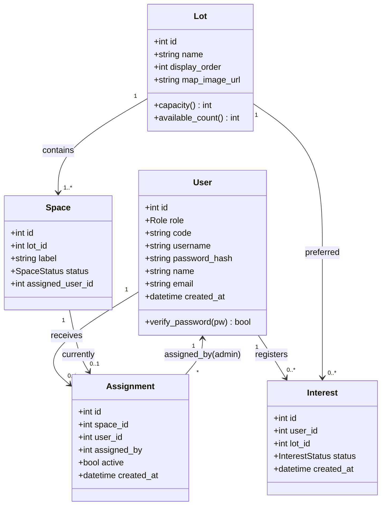
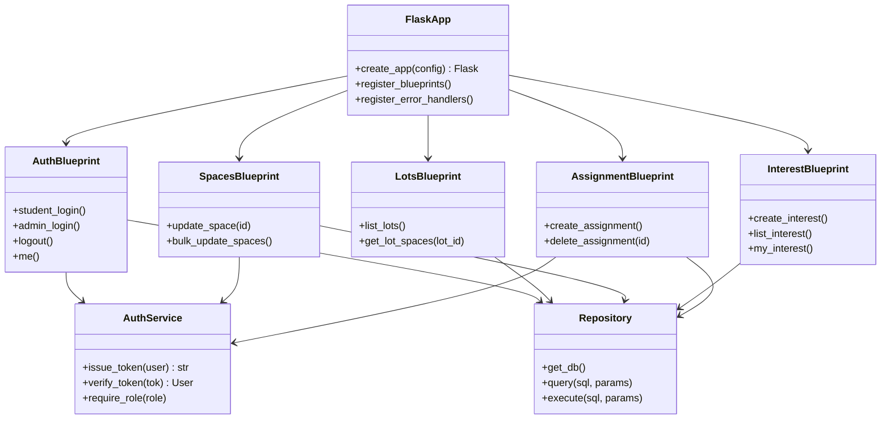
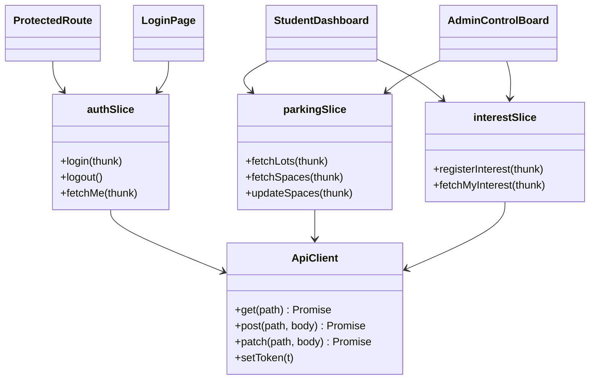
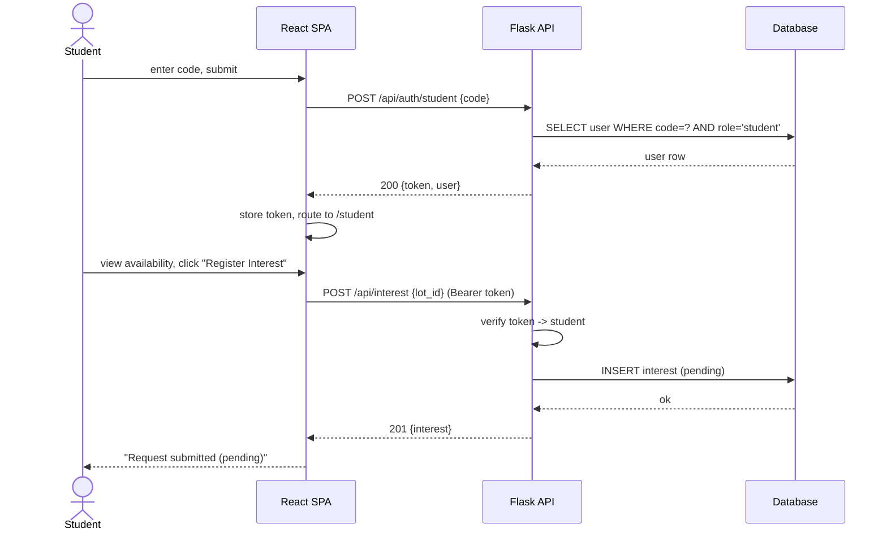
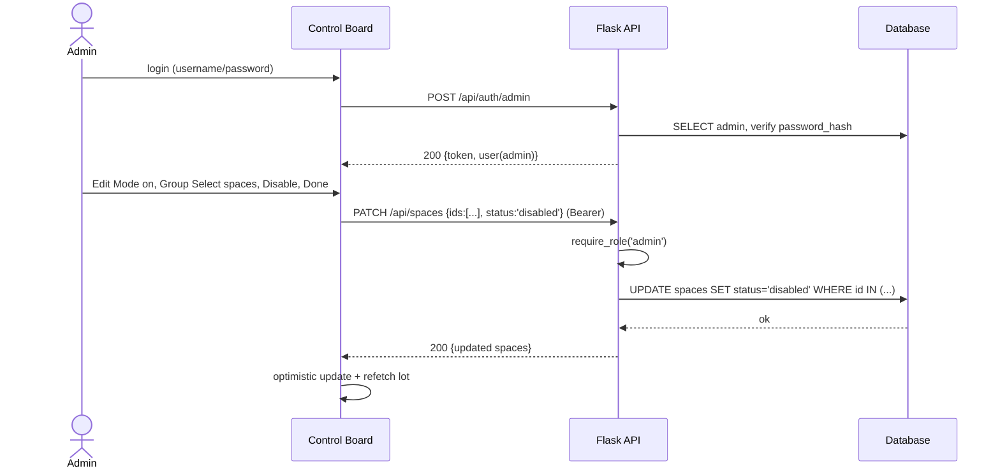
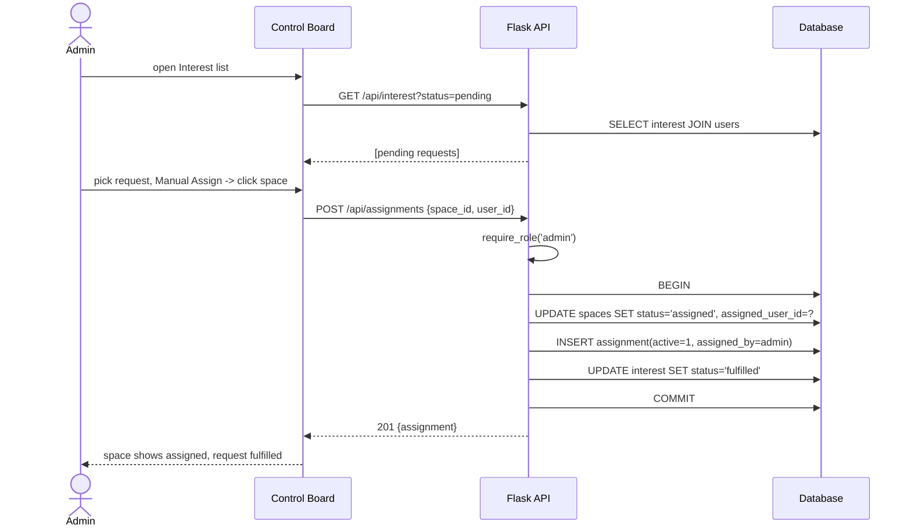

# LTRide — Parking Management Project Plan

A school parking management system with two goals:

1. **Students** register interest in a parking spot.
2. **Admins** manage parking allocation (enable/disable spaces, assign spots, review interest).

This document captures **what exists today**, the **gaps**, the **architecture (class diagrams + runtime views)**, **implementation details**, an **incremental CR-by-CR plan**, and **AWS deployment options**.

---

## 0. Start here — which document do I read?

There are **three documents** in this `plan/` folder. They work together:

| Document | What it is | Read it when |
|---|---|---|
| **`plan.md`** (this file) | The **master reference**: architecture, data model, diagrams, full API contracts, every CR listed, and the deep CloudFormation deployment detail (§10). | You want the big picture or the *precise* spec for any piece. |
| **`ui-development-guide.md`** | A **beginner, step-by-step guide to building the website (frontend)**, including every git command and a local test for each CR (U0–U7). | You're sitting down to write frontend code. |
| **`backend-development-guide.md`** | A **beginner, step-by-step guide to building the server + database (backend) and deploying to AWS**, with every git command and a local test for each CR (B0–B7, D1–D4). | You're sitting down to write backend code or push it live. |

**If you are brand new and just want to start building:** open `ui-development-guide.md` or `backend-development-guide.md` and follow it top to bottom. Come back to *this* file whenever a guide says "see plan.md §X" for the exact details.

**The golden rules (both guides follow them):**
1. **One CR = one small, complete change**, on its own branch named `cr/<id>-<slug>`.
2. **Each CR branches off the previous CR's branch** (stacked), so work continues while a PR is reviewed.
3. **Every PR uses the CR description template** (§8) and includes a **local testing guide**.
4. Build a backend endpoint *before* the frontend CR that depends on it (dependency map is in the backend guide).

---

## 1. Repositories

| Repo | Path | Stack | State |
|---|---|---|---|
| Frontend (UI) | `lt-parking-site-project` | Vite + React 19 + Redux Toolkit + TypeScript | UI prototype, ~35% |
| Backend | `LTR-Backend` (`github.com/LTRide2/LTR-Backend`) | Python / Flask + SQLite | Untouched course scaffold, ~5% |

**Overall completion ≈ 20%.**

---

## 2. What We Have in the UI (today)

The frontend is a working **client-only prototype** — all state lives in Redux and resets on refresh. There are **no API calls and no persistence yet**.

### Implemented
- **Login screen** (`src/Login.tsx`)
  - Selection between **Student** and **Admin**.
  - Student form: enter a **code**. Admin form: username + password fields.
- **Auth state** (`src/store/authSlice.ts`): `loginAsStudent(code)`, `loginAsAdmin()`, `logout()`.
- **Admin Control Board** (`src/ControlBoard.tsx`) — the most developed piece:
  - Campus map view ("Home") with **pan + zoom** (wheel zoom-to-cursor, drag to pan, "Reset View").
  - Lot navigation bar for **Home + Lot 1–17**.
  - **Lot 1** renders a parking-space grid (3 columns × 2 sides × 20 spaces).
  - **Edit Mode** toggle that gates the Admin Control Board.
  - Control actions: **Single Select, Group Select, Disable, Enable, Manual Assign, Update School Map** (UI wired; only select/enable/disable mutate local state).
  - Space states: selected (yellow), disabled (grey), available (white).
- **Parking state** (`src/store/parkingSlice.ts`): `selectedLot`, `isEditMode`, `editAction`, `selectedSpaces[]`, `disabledSpaces[]` + reducers.
- **Redux store** with typed hooks (`useAppDispatch`, `useAppSelector`).

### Partial / Stub
- **Student dashboard** — hard-coded "No spaces available"; no interest registration.
- **Admin actions** — *Manual Assign* / *Update School Map* are buttons with no behavior; enable/disable only mutate local state.
- **Lots 2–17** — placeholders; space layout hard-coded, not data-driven.

### Missing (UI)
Real authentication, API client layer, loading/error/empty states, routing (`react-router`), persistence, tests.

---

## 3. What We Have in the Backend (today)

`LTR-Backend` is a **generic Flask course template** (UMich "insta485" pattern), essentially unmodified for parking.

- Flask 2.2.2 + SQLite + a Webpack/React bundle served from Jinja templates.
- **Duplicated app** in two folders: `BK/` and `webapp/` (copy-paste scaffolding).
- Only DB table is a placeholder `developer (fullname, email, picture, password)`.
- `views/index.py` queries for `"John Doe"` and ignores the result.
- Returns **HTML templates, not JSON** — no REST API.
- No parking domain, no auth logic, no tests.

### 🚨 Security issues to fix first
- **`aws-tutorial.pem` (a private SSH key) is committed** — leaked secret. Remove from history **and rotate the key**.
- **`SECRET_KEY` is hard-coded** in `config.py` — move to environment variable.
- Committed `venv/`, `__pycache__/`, `.DS_Store`, `*.sqlite3` — should be gitignored.

---

## 4. Target Architecture

**Decoupled SPA + JSON API.** Frontend and backend deploy independently.

```
┌──────────────────┐      JSON / REST       ┌──────────────────┐       ┌────────────┐
│  React SPA       │  ───────────────────▶  │  Flask API       │  ───▶ │  Database  │
│  (Vite build)    │  ◀───────────────────  │  (JSON endpoints)│       │ SQLite→PG  │
└──────────────────┘                        └──────────────────┘       └────────────┘
```

- **Auth:** simple custom — students log in with a pre-issued **code**; admins with **username + password**; server issues a session/JWT token.
- **DB:** start on **SQLite**, designed so it can migrate to **PostgreSQL** for AWS.

> Open decisions (see §11) assume: **evolve Flask in place + decoupled SPA + SQLite→Postgres path + JWT**.

---

## 5. Domain / Class Diagram

### 5.1 Data model (entities)



**Enums:** `Role = {student, admin}`, `SpaceStatus = {available, disabled, assigned}`, `InterestStatus = {pending, fulfilled, declined}`.

### 5.2 Backend layering (component classes)



### 5.3 Frontend module structure



---

## 6. Runtime Views (sequence diagrams)

### 6.1 Student login + register interest



### 6.2 Admin disables spaces (bulk)



### 6.3 Admin assigns a space to a student (allocation)



---

## 7. Implementation Details

### 7.1 Backend (Flask)

**Proposed structure (single clean app — replaces `BK/` + `webapp/`):**
```
LTR-Backend/
  app/
    __init__.py        # create_app(), CORS, blueprint + error registration
    config.py          # env-driven (SECRET_KEY, DATABASE_URL, CORS_ORIGINS)
    db.py              # get_db(), dict row factory, teardown, init-db CLI
    auth.py            # JWT issue/verify, @require_role decorator, password hashing
    blueprints/
      auth.py          # /api/auth/*
      lots.py          # /api/lots, /api/lots/<id>/spaces
      spaces.py        # PATCH /api/spaces, PATCH /api/spaces/<id>
      interest.py      # /api/interest*
      assignments.py   # /api/assignments*
  sql/
    schema.sql         # tables from §5.1
    seed.sql           # lots 1-17 + spaces + one admin
  tests/               # pytest
  bin/db, bin/run
  requirements.txt
  Dockerfile
```

**Conventions:**
- All endpoints return JSON; consistent envelope: success `{data: ...}`, error `{error: {code, message, details}}`.
- Auth: **JWT** in `Authorization: Bearer <token>`; `AuthService.issue_token` signs `{user_id, role, exp}` with `SECRET_KEY`; `@require_role('admin')` decorator guards admin routes.
- Passwords: `werkzeug.security.generate_password_hash` / `check_password_hash` (admins only; students use codes).
- DB access via thin `Repository` (parametrized SQL, `PRAGMA foreign_keys=ON`); transactions for multi-table writes (assignment flow).
- Validation: per-endpoint payload checks; reject unknown/oversized input; 400 with details.
- CORS: restrict to the SPA origin via env `CORS_ORIGINS`.

**API surface (v1):**

| Method | Path | Auth | Purpose |
|---|---|---|---|
| GET | `/api/health` | — | liveness |
| POST | `/api/auth/student` | — | login by code |
| POST | `/api/auth/admin` | — | login by username/password |
| POST | `/api/auth/logout` | any | invalidate/clear |
| GET | `/api/auth/me` | any | current user |
| GET | `/api/lots` | any | list lots |
| GET | `/api/lots/:id/spaces` | any | spaces + status |
| PATCH | `/api/spaces/:id` | admin | enable/disable one |
| PATCH | `/api/spaces` | admin | bulk enable/disable |
| POST | `/api/lots/:id/map` | admin | upload/replace map image |
| POST | `/api/interest` | student | register interest |
| GET | `/api/interest` | admin | list all interest |
| GET | `/api/interest/me` | student | own interest |
| POST | `/api/assignments` | admin | assign space → student |
| DELETE | `/api/assignments/:id` | admin | unassign |

**Request / Response contracts.** All requests/responses are `application/json`. Authenticated calls send `Authorization: Bearer <token>`. Errors use the envelope `{ "error": { "code": string, "message": string, "details"?: object } }` with the listed status codes.

#### `GET /api/health`
- **Request:** none.
- **200:** `{ "data": { "status": "ok", "time": "2026-06-29T12:00:00Z" } }`

#### `POST /api/auth/student`
- **Request:** `{ "code": "ABC123" }`
- **200:** `{ "data": { "token": "<jwt>", "user": { "id": 1, "role": "student", "name": "Jane Doe" } } }`
- **400** invalid body · **401** unknown/invalid code.

#### `POST /api/auth/admin`
- **Request:** `{ "username": "admin", "password": "secret" }`
- **200:** `{ "data": { "token": "<jwt>", "user": { "id": 9, "role": "admin", "name": "Site Admin" } } }`
- **400** invalid body · **401** bad credentials.

#### `POST /api/auth/logout`
- **Request:** none (Bearer token).
- **204:** no content.

#### `GET /api/auth/me`
- **Request:** none (Bearer token).
- **200:** `{ "data": { "id": 1, "role": "student", "name": "Jane Doe", "email": "jane@school.edu" } }`
- **401** missing/expired token.

#### `GET /api/lots`
- **Request:** none.
- **200:** `{ "data": [ { "id": 1, "name": "Lot 1", "displayOrder": 1, "mapImageUrl": "/maps/lot1.jpg", "capacity": 120, "availableCount": 37 } ] }`

#### `GET /api/lots/:id/spaces`
- **Request:** none. Path param `id` (lot id).
- **200:** `{ "data": { "lotId": 1, "spaces": [ { "id": 1001, "label": "1-0-3", "status": "available", "assignedUserId": null } ] } }`
- **404** lot not found.

#### `PATCH /api/spaces/:id` *(admin)*
- **Request:** `{ "status": "disabled" }` — `status ∈ {available, disabled}`.
- **200:** `{ "data": { "id": 1001, "label": "1-0-3", "status": "disabled", "assignedUserId": null } }`
- **400** invalid status · **403** not admin · **404** space not found · **409** space is currently assigned.

#### `PATCH /api/spaces` *(admin, bulk)*
- **Request:** `{ "ids": [1001, 1002, 1003], "status": "disabled" }`
- **200:** `{ "data": { "updated": [ { "id": 1001, "status": "disabled" }, { "id": 1002, "status": "disabled" } ], "skipped": [ { "id": 1003, "reason": "assigned" } ] } }`
- **400** invalid body · **403** not admin.

#### `POST /api/lots/:id/map` *(admin)*
- **Request:** `multipart/form-data` with field `file` (png/jpg/jpeg/gif, ≤ 16 MB).
- **201:** `{ "data": { "lotId": 1, "mapImageUrl": "/maps/lot1-<hash>.jpg" } }`
- **400** missing/invalid file · **403** not admin · **413** too large.

#### `POST /api/interest` *(student)*
- **Request:** `{ "lotId": 1 }` — `lotId` optional (preferred lot).
- **201:** `{ "data": { "id": 55, "userId": 1, "lotId": 1, "status": "pending", "createdAt": "2026-06-29T12:00:00Z" } }`
- **400** invalid body · **403** not student · **409** active request already exists.

#### `GET /api/interest` *(admin)*
- **Request:** optional query `?status=pending|fulfilled|declined`.
- **200:** `{ "data": [ { "id": 55, "user": { "id": 1, "name": "Jane Doe", "code": "ABC123" }, "lotId": 1, "status": "pending", "createdAt": "2026-06-29T12:00:00Z" } ] }`
- **403** not admin.

#### `GET /api/interest/me` *(student)*
- **Request:** none (Bearer token).
- **200:** `{ "data": [ { "id": 55, "lotId": 1, "status": "pending", "createdAt": "2026-06-29T12:00:00Z" } ] }`

#### `POST /api/assignments` *(admin)*
- **Request:** `{ "spaceId": 1001, "userId": 1 }` — optionally `{ "interestId": 55 }` to fulfill a specific request.
- **201:** `{ "data": { "id": 200, "spaceId": 1001, "userId": 1, "assignedBy": 9, "active": true, "createdAt": "2026-06-29T12:00:00Z" } }` (also sets space → `assigned` and matching interest → `fulfilled`).
- **400** invalid body · **403** not admin · **404** space/user not found · **409** space not assignable (disabled or already assigned).

#### `DELETE /api/assignments/:id` *(admin)*
- **Request:** none. Path param `id` (assignment id).
- **200:** `{ "data": { "id": 200, "active": false, "spaceId": 1001, "spaceStatus": "available" } }` (frees the space).
- **403** not admin · **404** assignment not found.

### 7.2 Frontend (React)

- **API client** (`src/api/client.ts`): fetch wrapper, base URL from `import.meta.env.VITE_API_URL`, attaches Bearer token, normalizes errors.
- **State:** convert slices to use **`createAsyncThunk`** for server calls; keep `selectedLot`/`isEditMode`/`selectedSpaces` as UI-only state. Add `interestSlice`.
- **Routing:** `react-router-dom` — `/login`, `/student`, `/admin`; `ProtectedRoute` reads `auth.token` + `role`.
- **Data-driven map:** replace hard-coded Lot 1 grid with spaces fetched from `/api/lots/:id/spaces`; render `label`/`status` from data; keep existing pan/zoom for the "Home" campus map.
- **UX states:** loading spinners, empty ("No spaces available" only when truly empty), error toasts, optimistic updates with refetch on failure.

### 7.3 Cross-cutting
- **Config:** `.env` files both sides; never commit secrets.
- **Token storage:** in-memory + refresh on load via `/api/auth/me`; (optionally httpOnly cookie if Flask serves SPA).
- **Seed data:** lots 1–17, sample spaces, one admin account, a handful of student codes.

---

## 8. Incremental Delivery Plan (CRs)

Small, reviewable change requests. **B#** = backend, **U#** = frontend/UI. Ordered so each CR is shippable and unblocks the next.

Each CR lists a **Local test** — how to verify it on your machine before review. Backend assumes a venv + `flask run` (or `bin/run`) on `http://localhost:8000`; frontend assumes `npm run dev` on `http://localhost:5173` with `VITE_API_URL=http://localhost:8000`.

### CR workflow & branching strategy

**Stacked branches — each CR branches off the *previous* CR's branch, not `main`.** This lets you keep building (and deploying from a branch) while an earlier CR is still in review, instead of blocking on each merge.

- Branch naming: `cr/<id>-<slug>` (e.g. `cr/b1-app-skeleton`, `cr/u1-real-auth`).
- Base each branch on the one it depends on per the build order (§9):
  ```bash
  git checkout cr/b0-cleanup            # prior CR's branch
  git checkout -b cr/b1-app-skeleton    # new CR stacks on top
  # ...work, commit, open PR with base = cr/b0-cleanup (not main)
  ```
- **Open the PR against the parent branch** so the diff shows only this CR's changes (the reviewer isn't re-shown the parent's diff).
- **Keep the stack in sync after a review:** when a parent branch changes or merges, rebase the children onto the new base so fixes flow downstream:
  ```bash
  git rebase --onto cr/b0-cleanup <old-base> cr/b1-app-skeleton
  ```
- **Merge in order.** When a parent merges to `main`, GitHub auto-retargets the child PR's base to `main`; rebase to drop the now-merged commits, then merge. Use squash-merge to keep `main` history one-commit-per-CR.
- **Deploying while waiting for review:** `deploy.sh` / `release.sh` accept any checked-out branch, so you can ship a tip-of-stack branch to a staging instance for end-to-end validation before the PRs land. Only merged `main` deploys to production (CI in CR **D3**).

Independent CRs (no data dependency) may branch directly off `main` and merge in any order — e.g. **B0** and **U0** are parallel; backend `B#` and the matching frontend `U#` are stacked only where the UI consumes that endpoint.

### CR description template (every CR uses this)

Every CR — backend and frontend — ships with a PR description in this shape. The **Local testing guide** is mandatory and expands on the one-line *Local test* summary listed per CR below.

```markdown
## <CR id> — <title>
**Depends on:** <parent CR / branch>     **Base branch:** cr/<parent>

### What & why
<1–3 sentences: the change and the user-facing/architectural reason.>

### Changes
- <file/area> — <what changed>

### Local testing guide
1. Setup: <env vars, seed/migrate commands, services to start>
2. Steps: <exact commands / clicks to exercise the change>
3. Expected: <responses, status codes, UI states — incl. error/403/404/409 paths>

### Rollback
<how to revert safely — e.g. revert PR, run down-migration>
```

> **Which CRs get the detailed description + local testing guide? All of them.** It is a standing requirement, not specific to one CR. The per-CR **Local test** lines below are the seed for each CR's "Local testing guide" section.

### Phase 0 — Hygiene & foundations
- **B0 — Repo cleanup & secret rotation.** Remove `aws-tutorial.pem` from history, rotate the key, add `.gitignore`, delete the duplicate app folder (keep one), move `SECRET_KEY` to env. *(blocks everything)*
  - **Local test:** `git log --all --oneline -- aws-tutorial.pem` returns nothing; `git ls-files | grep -E 'pem|sqlite3|__pycache__'` is empty; app still starts with `SECRET_KEY` read from env.
- **U0 — Project hygiene.** Add `.env` handling, `react-router-dom`, ESLint/Prettier baseline, and an `api/` client module. No behavior change yet.
  - **Local test:** `npm install && npm run lint && npm run build` succeed; `npm run dev` renders the existing app unchanged.

### Phase 1 — Backend API foundation
- **B1 — App skeleton + health check.** Clean `create_app()`, `GET /api/health`, CORS, env config.
  - **Local test:** `curl localhost:8000/api/health` → `{"data":{"status":"ok",...}}`; a cross-origin `fetch` from the SPA origin succeeds (no CORS error in the browser console).
- **B2 — Schema + migrations + seed.** `schema.sql` (§5.1), `bin/db` seed (lots 1–17, spaces, admin, codes), dict connection helpers.
  - **Local test:** run `./bin/db reset` (or `flask init-db`), then `sqlite3 var/App.sqlite3 ".tables"` shows all tables and `SELECT count(*) FROM lots;` = 17.
- **B3 — Auth endpoints.** `/api/auth/student|admin|logout|me`, JWT issue/verify, password hashing, `@require_role`.
  - **Local test:** `curl -XPOST localhost:8000/api/auth/student -d '{"code":"ABC123"}' -H 'Content-Type: application/json'` returns a token; reuse it on `GET /api/auth/me` → 200; a bad code → 401; admin route without token → 401.

### Phase 2 — Core parking API
- **B4 — Lots & spaces read API.** `GET /api/lots`, `GET /api/lots/:id/spaces`.
  - **Local test:** `curl localhost:8000/api/lots` lists 17 lots; `curl localhost:8000/api/lots/1/spaces` returns spaces with `status`; unknown lot id → 404.
- **B5 — Admin space management.** `PATCH /api/spaces/:id`, bulk `PATCH /api/spaces` (admin-only).
  - **Local test:** with an admin token, `PATCH /api/spaces/1001 {"status":"disabled"}` → 200 and re-GET shows `disabled`; same call with a student token → 403; bulk PATCH returns `updated`/`skipped`.
- **B6 — Interest registration API.** `POST /api/interest`, `GET /api/interest`, `GET /api/interest/me`.
  - **Local test:** student token `POST /api/interest {"lotId":1}` → 201 `pending`; `GET /api/interest/me` shows it; admin `GET /api/interest?status=pending` lists it; duplicate active request → 409.
- **B7 — Assignment API.** `POST /api/assignments`, `DELETE /api/assignments/:id`, mark interest fulfilled (transactional, per §6.3).
  - **Local test:** admin `POST /api/assignments {"spaceId":1001,"userId":1,"interestId":55}` → 201; verify space is now `assigned` and interest `fulfilled`; assigning an already-assigned space → 409; `DELETE` frees the space (`available`).

### Phase 3 — Wire the UI to the API
- **U1 — Real auth flow.** Replace fake login with B3; token storage, auth guard, real logout, error states.
  - **Local test:** with backend running, log in as student with a seeded code → lands on dashboard; wrong code shows an error; refresh keeps you logged in (`/me`); logout returns to login; visiting `/admin` while logged out redirects.
- **U2 — Routing.** `react-router`; remove manual view switching.
  - **Local test:** `/login`, `/student`, `/admin` are directly navigable; back/forward buttons work; deep-linking to a protected route while logged out redirects to `/login`.
- **U3 — Data-driven lots & spaces.** Fetch from B4; render any lot's grid from data.
  - **Local test:** switching lots in the nav renders each lot's real grid (not just Lot 1) from the API; space colors reflect server `status`; loading + error states show when the API is slow/down.
- **U4 — Admin enable/disable persisted.** Connect Disable/Enable/Group Select to B5; optimistic update + refetch.
  - **Local test:** disable spaces as admin, **refresh the page** → they remain disabled (persisted); a forced API failure rolls back the optimistic update.
- **U5 — Student interest registration.** Real student dashboard: view availability, register interest (B6), see status.
  - **Local test:** as a student, register interest → status shows `pending`; the same request appears in the admin's interest list; re-registering is blocked/handled.
- **U6 — Admin allocation.** Implement *Manual Assign* against B7; interest list + assign; reflect assigned state on the map.
  - **Local test:** admin opens interest list, assigns a space to a student → space shows `assigned` on the map and the request flips to `fulfilled`; the assigned student sees their spot.
- **U7 — Update School Map.** Admin uploads/replaces a lot's map image (`POST /api/lots/:id/map`).
  - **Local test:** upload a PNG/JPG for a lot → the new image renders after refresh; a non-image or >16 MB file is rejected with a visible error.

### Phase 4 — Hardening
- **B8 / U8 — Validation & error handling.** Server validation, consistent error envelope, UI toasts/empty/loading states.
  - **Local test:** malformed/oversized payloads return 400 with the `{error:{code,message}}` envelope; the UI surfaces a toast instead of crashing; empty lists show an empty state.
- **B9 / U9 — Tests.** Backend: pytest (API + auth). Frontend: Vitest + Testing Library.
  - **Local test:** `pytest` is green (auth + each endpoint, incl. 401/403/409 paths); `npm run test` green for login, routing guard, and interest/assign flows.
- **B10 — Postgres migration path** (run schema on Postgres; swap connection layer via `DATABASE_URL`).
  - **Local test:** run a local Postgres (e.g. `docker run -e POSTGRES_PASSWORD=pw -p 5432:5432 postgres`), point `DATABASE_URL` at it, run `schema.sql`+`seed.sql`, and re-run `pytest` green against Postgres.

### Phase 5 — Deployment (EC2 + RDS via CloudFormation, see §10)
- **D1 — Build artifacts.** Production gunicorn config + `requirements.txt` pinned; frontend `npm run build` produces `dist/`.
  - **Local test:** `gunicorn "app:create_app()" --bind 127.0.0.1:8000` serves the API; `npm run build && npm run preview` serves the SPA hitting the local API.
- **D2 — CloudFormation templates** (`deploy/cfn/01-network, 02-database, 03-compute, 04-dns`) + `deploy.sh` + `params/prod.json`.
  - **Local test:** `aws cloudformation validate-template --template-body file://deploy/cfn/01-network.yaml` (etc.) passes for every template; `cfn-lint deploy/cfn/*.yaml` is clean; a `create-change-set` previews the expected resources without erroring.
- **D3 — CI/CD** (GitHub Actions): lint/test/build, then `cloudformation deploy` for infra + SSH/rsync for app artifacts.
  - **Local test:** run the workflow with `act` (or on a branch) and confirm lint/test/build/validate-template stages pass before any deploy step.
- **D4 — Provision & deploy on AWS** (deploy the four stacks per §10.2–10.9).
  - **Local test:** `curl http://<elastic-ip>/api/health` → ok; the SPA loads over the public IP and logs in against RDS-backed data; `https://<your-domain>/api/health` returns 200 with a valid cert; `detect-stack-drift` reports no drift.

---

## 9. Suggested Build Order (critical path)

```
B0 → B1 → B2 → B3 → U0/U1/U2  →  B4 → U3  →  B5 → U4  →  B6 → U5  →  B7 → U6  →  U7
                                                   → (Phase 4 hardening) → (Phase 5 deploy)
```

Demoable after **U5** (students register interest, admins manage spaces); feature-complete after **U7**.

---

## 10. AWS Deployment — EC2 + RDS via CloudFormation

**Architecture:** Flask served by **gunicorn** behind **nginx** on a single **EC2** instance; **PostgreSQL on RDS**; the React static bundle served from the same nginx (simplest) or from **S3 + CloudFront**. HTTPS via **Let's Encrypt (certbot)** on a domain managed in **Route 53**. **All infrastructure is provisioned and managed with AWS CloudFormation (IaC)** — no manual console clicks for the resources below.

```
                 ┌──────────────── EC2 (Ubuntu 22.04) ────────────────┐
 Internet ──443──┤ nginx (TLS, reverse proxy, serves React build)      │
   (Route 53)    │   │                                                  │
                 │   └─ proxy /api ─▶ gunicorn (systemd) ─▶ Flask app   │
                 └───────────────────────────┬──────────────────────────┘
                                              │ 5432 (private SG)
                                     ┌────────▼─────────┐
                                     │ RDS PostgreSQL   │
                                     └──────────────────┘
```

### 10.1 Prerequisites
- AWS account with admin/IAM access; AWS CLI configured locally (`aws configure`).
- A registered domain with a **Route 53 hosted zone** (note its `HostedZoneId`).
- Backend prepared per CRs **B0–B10** (B10 = Postgres-ready connection layer).
- A fresh EC2 **key pair** created once (`aws ec2 create-key-pair`), referenced by name as a stack parameter (**not** the leaked `aws-tutorial.pem`).
- The RDS master password stored in **AWS Secrets Manager** (CloudFormation references it dynamically; it is never written into the template or git).

### 10.2 IaC layout
Keep deployment code in the repo under `deploy/`, split into composable nested/standalone stacks so they can be updated independently:
```
deploy/
  cfn/
    01-network.yaml     # VPC, 2 public + 2 private subnets, IGW, route tables, SGs
    02-database.yaml    # RDS PostgreSQL, DB subnet group, Secrets Manager secret
    03-compute.yaml     # EC2 + Elastic IP + IAM instance role, UserData bootstrap
    04-dns.yaml         # Route 53 A record → Elastic IP
  params/
    prod.json           # stack parameters (instance type, domain, key name, ...)
  deploy.sh             # wrapper: aws cloudformation deploy for each stack in order
```
Rather than typing four `aws cloudformation deploy` commands, **`deploy/deploy.sh` wraps them all** — it validates every template, then creates/updates the stacks in dependency order, adds `CAPABILITY_NAMED_IAM` only where needed, and prints the stack outputs:
```bash
./deploy/deploy.sh up        # validate + create/update all stacks (env defaults to prod)
./deploy/deploy.sh validate  # validate templates only, no changes
./deploy/deploy.sh status    # show each stack's status
./deploy/deploy.sh outputs   # print each stack's Outputs
./deploy/deploy.sh down      # delete all stacks in reverse order (DB leaves a final snapshot)
```
Region/profile come from `AWS_REGION` / `AWS_PROFILE`; stack parameters live in `deploy/params/<env>.json` (e.g. `AdminCidr`, `KeyName`, `DomainName`, `HostedZoneId`). Cross-stack wiring uses `Outputs` + `Fn::ImportValue` (e.g. network exports `VpcId`, `WebSubnetId`, `WebSecurityGroupId`, `DbSecurityGroupId`; database exports the RDS endpoint).

The script is self-bootstrapping: a `preflight` step checks for the AWS CLI and **only installs it (via `brew install awscli`) if it is missing on macOS** — an existing AWS CLI is detected and left untouched. It also verifies credentials (`sts get-caller-identity`) before making any changes.

### 10.3 Network stack (`01-network.yaml`)
Provisions: a VPC (`10.0.0.0/16`), two public subnets + two private subnets across two AZs, an Internet Gateway + public route table, and two security groups:
- **`WebSecurityGroup`** (EC2): inbound `443` and `80` from `0.0.0.0/0`, `22` from a parameterized `AdminCidr` (your IP).
- **`DbSecurityGroup`** (RDS): inbound `5432` whose `SourceSecurityGroupId` = `WebSecurityGroup` (not a CIDR). No public ingress.

```yaml
  DbSecurityGroup:
    Type: AWS::EC2::SecurityGroup
    Properties:
      GroupDescription: RDS access from web tier only
      VpcId: !Ref Vpc
      SecurityGroupIngress:
        - IpProtocol: tcp
          FromPort: 5432
          ToPort: 5432
          SourceSecurityGroupId: !Ref WebSecurityGroup
```

### 10.4 Database stack (`02-database.yaml`)
Provisions a **Secrets Manager** secret (auto-generated password), a DB subnet group across the two private subnets, and the RDS instance. `MasterUserPassword` is resolved from the secret at deploy time — never in plaintext.

```yaml
  DbSecret:
    Type: AWS::SecretsManager::Secret
    Properties:
      Name: ltride/rds/master
      GenerateSecretString:
        SecretStringTemplate: '{"username":"ltride_admin"}'
        GenerateStringKey: password
        ExcludePunctuation: true
        PasswordLength: 32

  Database:
    Type: AWS::RDS::DBInstance
    DeletionPolicy: Snapshot
    Properties:
      Engine: postgres
      DBInstanceClass: !Ref DbInstanceClass     # db.t3.micro (free tier)
      AllocatedStorage: "20"
      DBName: ltride
      MasterUsername: ltride_admin
      MasterUserPassword: !Sub '{{resolve:secretsmanager:${DbSecret}:SecretString:password}}'
      DBSubnetGroupName: !Ref DbSubnetGroup
      VPCSecurityGroups: [ !ImportValue ltride-network-DbSecurityGroupId ]
      PubliclyAccessible: false
      BackupRetentionPeriod: 7
      MultiAZ: false
    # Outputs: DB endpoint address + the secret ARN (consumed by compute UserData)
```

### 10.5 Compute stack (`03-compute.yaml`) — EC2 + bootstrap
Provisions an Elastic IP, an IAM instance role (read the DB secret + write CloudWatch logs), and the EC2 instance whose **`UserData`** bootstraps the server on first boot — so the box is reproducible from the template, not hand-configured. UserData performs the same steps that were previously manual:

```yaml
  WebServer:
    Type: AWS::EC2::Instance
    Properties:
      ImageId: !Ref UbuntuAmiId          # SSM-resolved Ubuntu 22.04 AMI
      InstanceType: !Ref WebInstanceType  # t3.micro
      KeyName: !Ref KeyName
      IamInstanceProfile: !Ref WebInstanceProfile
      SubnetId: !ImportValue ltride-network-PublicSubnet1Id
      SecurityGroupIds: [ !ImportValue ltride-network-WebSecurityGroupId ]
      UserData:
        Fn::Base64: !Sub |
          #!/bin/bash -xe
          apt update && apt install -y python3-venv nginx postgresql-client git jq awscli
          useradd -m -s /bin/bash ltride
          sudo -u ltride git clone https://github.com/LTRide2/LTR-Backend.git /home/ltride/app
          cd /home/ltride/app
          sudo -u ltride python3 -m venv .venv
          sudo -u ltride .venv/bin/pip install -r requirements.txt gunicorn psycopg2-binary
          # Pull DB creds from Secrets Manager and write the env file
          SECRET=$(aws secretsmanager get-secret-value --secret-id ltride/rds/master --query SecretString --output text --region ${AWS::Region})
          PW=$(echo "$SECRET" | jq -r .password)
          cat >/home/ltride/app/.env <<ENV
          FLASK_ENV=production
          SECRET_KEY=$(openssl rand -hex 32)
          DATABASE_URL=postgresql://ltride_admin:$PW@${DbEndpoint}:5432/ltride
          CORS_ORIGINS=https://${DomainName}
          ENV
          chmod 600 /home/ltride/app/.env && chown ltride:ltride /home/ltride/app/.env
          # Initialize schema + seed, then install services (see 10.6–10.9)
          sudo -u ltride bash -c 'set -a; . .env; psql "$DATABASE_URL" -f sql/schema.sql -f sql/seed.sql'
          # ... systemd unit + nginx config installed here (10.6/10.8) ...
```

`DbEndpoint` and `DomainName` are passed in as parameters from the database/DNS stack outputs. The instance role grants `secretsmanager:GetSecretValue` on `ltride/rds/master` only.

### 10.6 gunicorn as a systemd service
The UserData (10.5) writes this unit. It is shown standalone for clarity / manual ops:
`/etc/systemd/system/ltride.service`:
```ini
[Unit]
Description=LTRide Flask API
After=network.target

[Service]
User=ltride
Group=www-data
WorkingDirectory=/home/ltride/app
EnvironmentFile=/home/ltride/app/.env
ExecStart=/home/ltride/app/.venv/bin/gunicorn \
    --workers 3 --bind 127.0.0.1:8000 "app:create_app()"
Restart=always

[Install]
WantedBy=multi-user.target
```
```bash
sudo systemctl daemon-reload
sudo systemctl enable --now ltride
sudo systemctl status ltride        # verify active (running)
curl http://127.0.0.1:8000/api/health
```

### 10.7 Build & place the frontend
The SPA build is an app artifact, not infrastructure, so it stays a CI step. On your machine (or in CI): `VITE_API_URL=https://<your-domain> npm run build` → produces `dist/`. Copy it to the server:
```bash
rsync -avz -e "ssh -i ltride-key.pem" dist/ ubuntu@<elastic-ip>:/tmp/dist/
sudo mkdir -p /var/www/ltride && sudo cp -r /tmp/dist/* /var/www/ltride/
```
*(Alternative: a separate CloudFormation stack provisions an S3 bucket + CloudFront distribution; CI syncs `dist/` to S3 and invalidates the cache. nginx then only proxies `/api`.)*

### 10.8 nginx reverse proxy + SPA
`/etc/nginx/sites-available/ltride`:
```nginx
server {
    listen 80;
    server_name <your-domain>;

    root /var/www/ltride;
    index index.html;

    location /api/ {
        proxy_pass http://127.0.0.1:8000;
        proxy_set_header Host $host;
        proxy_set_header X-Real-IP $remote_addr;
        proxy_set_header X-Forwarded-For $proxy_add_x_forwarded_for;
        proxy_set_header X-Forwarded-Proto $scheme;
    }

    location / {
        try_files $uri /index.html;   # SPA client-side routing
    }
}
```
```bash
sudo ln -s /etc/nginx/sites-available/ltride /etc/nginx/sites-enabled/
sudo rm -f /etc/nginx/sites-enabled/default
sudo nginx -t && sudo systemctl reload nginx
```

### 10.9 DNS + HTTPS
- **DNS** is managed by the **DNS stack (`04-dns.yaml`)**: an `AWS::Route53::RecordSet` (A record) in the hosted zone pointing at the Elastic IP exported by the compute stack.
```yaml
  ApiRecord:
    Type: AWS::Route53::RecordSet
    Properties:
      HostedZoneId: !Ref HostedZoneId
      Name: !Ref DomainName
      Type: A
      TTL: "300"
      ResourceRecords: [ !ImportValue ltride-compute-ElasticIp ]
```
- **TLS** is obtained on the box via certbot (one-time, can run from UserData after DNS resolves):
```bash
sudo apt install -y certbot python3-certbot-nginx
sudo certbot --nginx -d <your-domain> --non-interactive --agree-tos -m admin@<your-domain>
sudo systemctl status certbot.timer   # auto-renewal enabled
```
*(For fully-managed certs without certbot, front the instance with an ALB + ACM certificate in a future stack revision.)*

### 10.10 Deploy / update workflow
**Infrastructure changes** go through CloudFormation only — edit the template, preview a change set, then apply:
```bash
aws cloudformation deploy --stack-name ltride-compute --template-file deploy/cfn/03-compute.yaml \
  --parameter-overrides file://deploy/params/prod.json --capabilities CAPABILITY_NAMED_IAM
# inspect drift any time:
aws cloudformation detect-stack-drift --stack-name ltride-compute
```
**Application changes** (code, not infra) are shipped with **`deploy/release.sh`**, which resolves the EC2 host from the compute stack outputs and deploys both tiers over SSH:
```bash
./deploy/release.sh all        # deploy backend then frontend (env defaults to prod)
./deploy/release.sh backend    # backend only: git pull + pip install + DB migrate + restart gunicorn
./deploy/release.sh frontend   # frontend only: npm build (prod VITE_API_URL) + rsync dist/ to nginx
```
It reads the SSH key from `~/.ssh/<KeyName>.pem` (override with `SSH_KEY`), builds the UI from `UI_DIR` (default `../lt-parking-site-project`) pointing at `https://<DomainName>`, runs backend migrations, restarts gunicorn, and verifies `/api/health` before finishing.

The equivalent **manual steps** (useful for debugging on the box) remain:
```bash
# backend — on the server, as ltride
cd ~/app && git pull
. .venv/bin/activate && pip install -r requirements.txt
psql "$DATABASE_URL" -f sql/migrations/<new>.sql   # if schema changed
sudo systemctl restart ltride
# frontend — rebuild locally, rsync dist/ (or S3 sync), no service restart needed
```
**CI/CD (CR D2):** a GitHub Actions workflow on push to `main` runs `cloudformation deploy` for infra changes, then calls `release.sh` to deploy the application code.

### 10.11 Operations & hardening
- **Backups:** RDS `BackupRetentionPeriod: 7` is set in the template; `DeletionPolicy: Snapshot` prevents data loss if the DB stack is deleted.
- **Logs:** `journalctl -u ltride -f` (app), `/var/log/nginx/` (web). The instance IAM role permits shipping to CloudWatch Logs via the agent (installed in UserData).
- **Monitoring:** add `AWS::CloudWatch::Alarm` resources (EC2 CPU, RDS free storage/connections) to the relevant stacks so alarms are version-controlled too.
- **Security:** SSH (`22`) restricted to `AdminCidr` in the template; secrets live only in Secrets Manager; `.env` is generated on-box (never in git); run `unattended-upgrades`.
- **Teardown:** `aws cloudformation delete-stack` in reverse order (dns → compute → database → network) cleanly removes everything (DB leaves a final snapshot).
- **Cost (free-tier):** 1× `t3.micro` EC2 + 1× `db.t3.micro` RDS ≈ $0 within free-tier limits, then low single-digit $/mo afterward. Elastic IP is free while associated with a running instance.

---

## 11. Open Decisions to Confirm
1. **Backend base:** evolve `webapp/` in place vs clean Flask rebuild vs switch (FastAPI / Node). *(plan assumes evolve/clean Flask)*
2. **Frontend–backend coupling:** decoupled SPA + JSON API (assumed) vs Flask serves the React build.
3. **Database:** stay on SQLite for local dev with a Postgres-ready layer (assumed) — the EC2 + RDS deploy in §10 runs on PostgreSQL.
4. **Auth token:** JWT (assumed) vs session cookie.
