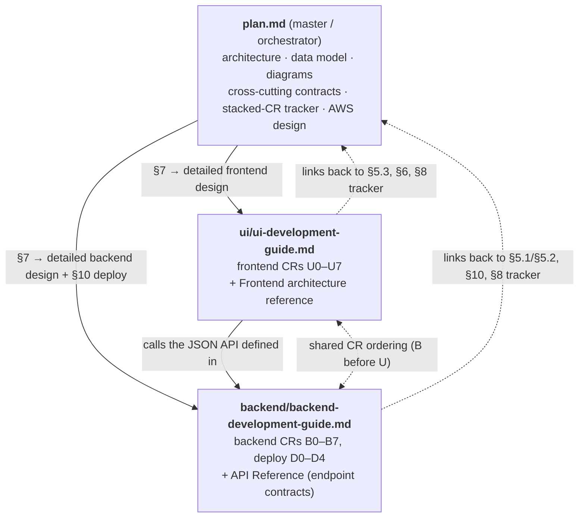
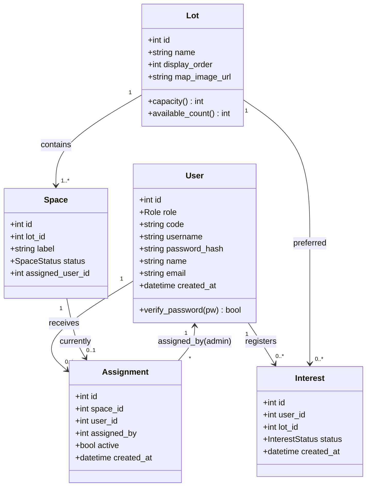
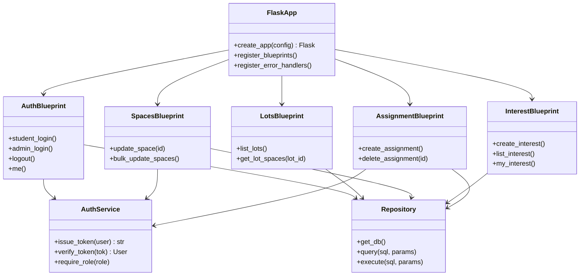
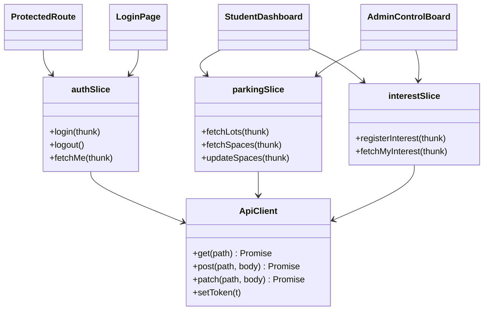
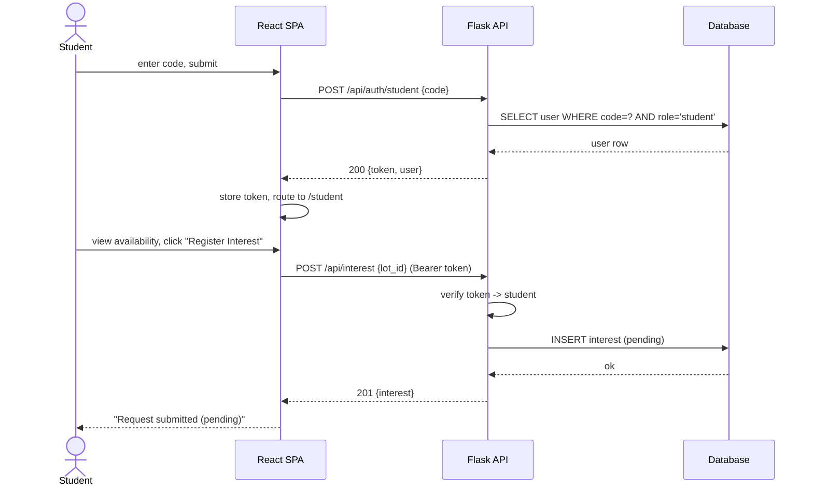
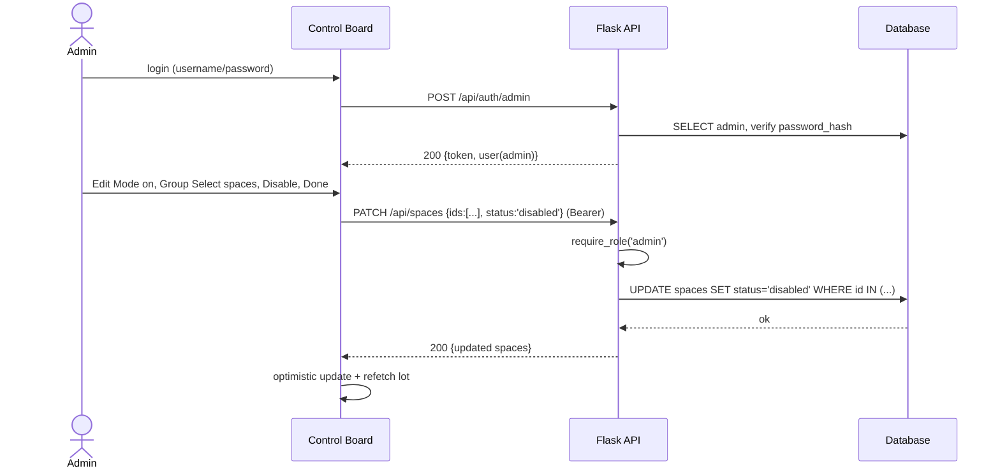
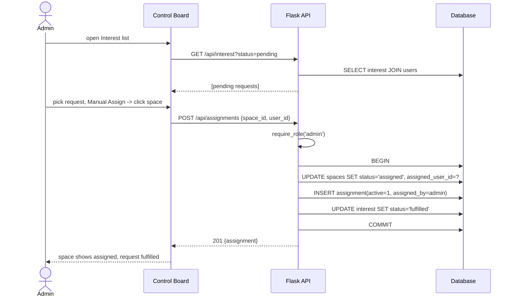
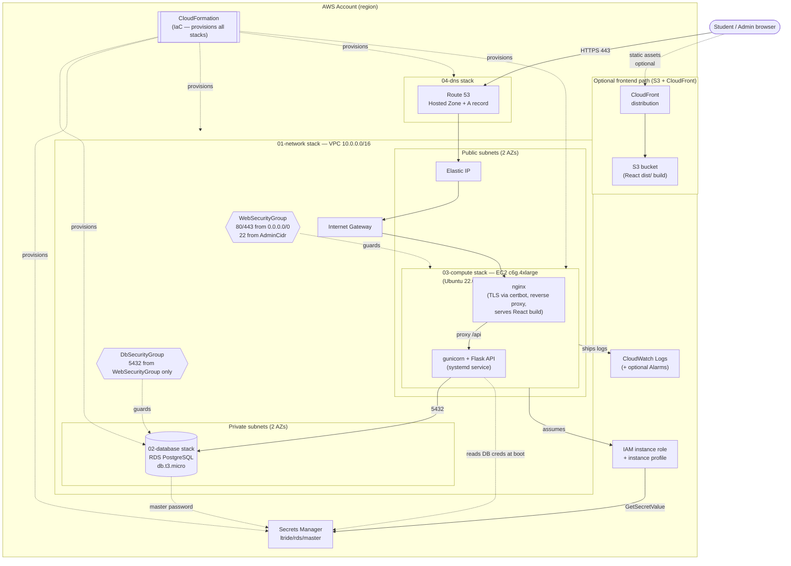

# LTRide — Parking Management Project Plan

## Executive Summary

LTRide is a school parking management system with two goals:

1. **Students** register interest in a parking spot.
2. **Admins** manage parking allocation (enable/disable spaces, assign spots, review interest).

This is the **master/orchestrator design doc**. It captures **what exists today**, the **gaps**, the **architecture (class diagrams + runtime views)**, the **cross-cutting contracts** that bind frontend and backend, an **incremental stacked-CR plan** (§8), and the **AWS deployment** design (§10). The step-by-step **implementation details** live in two sibling guides — one per component — which this doc orchestrates and links to:

- **Frontend:** [`ui/ui-development-guide.md`](ui/ui-development-guide.md)
- **Backend + deployment:** [`backend/backend-development-guide.md`](backend/backend-development-guide.md)

**Scope / out of scope.** In scope: a decoupled React SPA + Flask JSON API + relational DB, JWT auth, the parking domain (lots, spaces, interest, assignments), and a single-instance AWS deployment. Out of scope (for now): student *self-claim* as a real feature (the prototype has a local-only version — see §11), payments, notifications, multi-campus, and horizontal scale-out (the HA option is costed in §10.13 but not built).

---

## 0. Start here — which document do I read?

There are **three documents** in this `plan/` folder, each in its own place. They reference each other and work together:

```
plan/
├── plan.md                              ← master / orchestrator (this file)
├── ui/
│   └── ui-development-guide.md          ← frontend design + implementation
└── backend/
    └── backend-development-guide.md     ← backend design + implementation + AWS deploy
```

| Document | What it is | Read it when |
|---|---|---|
| **`plan.md`** (this file) | The **master reference / orchestrator**: architecture, data model, diagrams, cross-cutting contracts, the stacked-CR plan + [status tracker](#82-cr-status-tracker), and the deep CloudFormation deployment detail (§10). | You want the big picture, the CR ordering, or how the two halves fit together. |
| **[`ui/ui-development-guide.md`](ui/ui-development-guide.md)** | A **beginner, step-by-step guide to building the website (frontend)**, including every git command and a local test for each CR (U0–U7). Its [Frontend architecture reference](ui/ui-development-guide.md#appendix--frontend-architecture-reference) holds the frontend design detail (moved from this file's old §7.2). | You're sitting down to write frontend code. |
| **[`backend/backend-development-guide.md`](backend/backend-development-guide.md)** | A **beginner, step-by-step guide to building the server + database (backend) and deploying to AWS**, with every git command and a local test for each CR (B0–B7, D1–D4). Its [API Reference](backend/backend-development-guide.md#appendix-a--backend-api-reference-v1) holds the full endpoint contracts (moved from this file's old §7.1). | You're sitting down to write backend code or push it live. |

### How the three documents relate



**If you are brand new and just want to start building:** open [`ui/ui-development-guide.md`](ui/ui-development-guide.md) or [`backend/backend-development-guide.md`](backend/backend-development-guide.md) and follow it top to bottom. Come back to *this* file whenever a guide says "see plan.md §X" for the big picture, the CR ordering, or a shared contract.

**The golden rules (both guides follow them):**
1. **One CR = one small, complete change**, on its own branch named `cr/<id>-<slug>`.
2. **Each CR branches off the previous CR's branch** (stacked), so work continues while a PR is reviewed.
3. **Every PR uses the CR description template** (§8) and includes a **local testing guide**.
4. Build a backend endpoint *before* the frontend CR that depends on it (dependency map is in the backend guide).

---

## 1. Repositories

| Repo | Path | Stack | State |
|---|---|---|---|
| Frontend (UI) | `lt-parking-site-project` | Vite + React 19 + Redux Toolkit + TypeScript | UI prototype, ~45% |
| Backend | `LTR-Backend` (`github.com/LTRide2/LTR-Backend`) | Python / Flask + SQLite | Untouched course scaffold, ~5% |

**Overall completion ≈ 25%.**

---

## 2. What We Have in the UI (today)

The frontend is a working **client-only prototype** — all state lives in Redux and resets on refresh. There are **no API calls and no persistence yet**.

### Implemented
- **Login screen** (`src/Login.tsx`)
  - Selection between **Student** and **Admin**.
  - Student form: enter a **code**. Admin form: username + password fields.
- **Auth state** (`src/store/authSlice.ts`): `loginAsStudent(code)`, `loginAsAdmin()`, `logout()`.
- **Control Board** (`src/ControlBoard.tsx`) — the most developed piece; it is now the shared screen **both** admins and students land on (the view changes with `userType`):
  - Campus map view ("Home") with **pan + zoom** (wheel zoom-to-cursor, drag to pan, "Reset View").
  - Lot navigation bar for **Home + Lot 1–17**.
  - **All 17 lots** now draw their own parking-space grid — sizes/shapes come from a per-lot `LOT_CONFIGS` table (sections × sides × spaces × orientation), no longer just Lot 1.
  - Three drawing modes per lot: a **plain grid**; a **map-crop overlay** (`LOT_MAP_CONFIGS`) that positions the grid on a cropped photo of the real lot; and a **curved/radial "fan" layout** (`LOT_FAN_CONFIGS`) for lots whose aisles curve. Some lots are **map-only** (`MAP_ONLY_LOTS`) — photo shown, no clickable grid yet.
  - **Edit Mode** toggle (admins only) that gates the Admin Control Board.
  - Admin control actions: **Single Select, Group Select, Disable, Enable, Manual Assign, Update School Map**. Select/enable/disable **and now Manual Assign** mutate local state (Manual Assign = pick one space → type a student ID in a modal → assign). *Update School Map* is still a no-op button.
  - **Student self-claim:** a logged-in student can click an open spot to **claim** it (a "Claim Parking Spot?" confirmation modal pops up first), is limited to **one spot at a time**, and can click their own spot again to **unclaim** it. Students see only their own spot's ID; admins see every taken spot's ID.
  - Space states: selected (yellow), disabled (grey), available (blue), **assigned/claimed (red, showing the student ID)**.
- **Parking state** (`src/store/parkingSlice.ts`): `selectedLot`, `isEditMode`, `editAction`, `selectedSpaces[]`, `disabledSpaces[]`, **`assignedSpaces` (a `{spaceId: studentId}` map)** + reducers, including `assignSpace` / `unassignSpace`.
- **Redux store** with typed hooks (`useAppDispatch`, `useAppSelector`).

### Partial / Stub
- **Student experience** — lives inside `ControlBoard` (no separate dashboard yet); a student can claim/unclaim a spot but there is no "register interest / see availability list" screen.
- **Assignment & claim are local-only** — `assignedSpaces` lives in Redux and **resets on refresh**; nothing is saved to a server.
- **Admin actions** — *Update School Map* is a button with no behavior; enable/disable/assign only mutate local state.
- **Map-only lots** — several lots (`MAP_ONLY_LOTS`) show a photo crop but have no interactive grid yet.

### Missing (UI)
Real authentication, API client layer, loading/error/empty states, routing (`react-router`), persistence, tests.

---

## 3. What We Have in the Backend (today)

`LTR-Backend` is a **generic Flask course template** (UMich "insta485" pattern), essentially unmodified for parking.

- Flask 2.2.2 + SQLite + a Webpack/React bundle served from Jinja templates.
- **Duplicated app** in two folders: `BK/` and `webapp/` (copy-paste scaffolding).
- Only DB table is a placeholder `developer (fullname, email, picture, password)`.
- `views/index.py` queries for `"John Doe"` and ignores the result.
- Returns **HTML templates, not JSON** — no REST API.
- No parking domain, no auth logic, no tests.

### 🚨 Security issues to fix first
- **`aws-tutorial.pem` (a private SSH key) is committed** — leaked secret. Remove from history **and rotate the key**.
- **`SECRET_KEY` is hard-coded** in `config.py` — move to environment variable.
- Committed `venv/`, `__pycache__/`, `.DS_Store`, `*.sqlite3` — should be gitignored.

---

## 4. Target Architecture

**Decoupled SPA + JSON API.** Frontend and backend deploy independently.

```
┌──────────────────┐      JSON / REST       ┌──────────────────┐       ┌────────────┐
│  React SPA       │  ───────────────────▶  │  Flask API       │  ───▶ │  Database  │
│  (Vite build)    │  ◀───────────────────  │  (JSON endpoints)│       │ SQLite→PG  │
└──────────────────┘                        └──────────────────┘       └────────────┘
```

- **Auth:** simple custom — students log in with a pre-issued **code**; admins with **username + password**; server issues a session/JWT token.
- **DB:** start on **SQLite**, designed so it can migrate to **PostgreSQL** for AWS.

> Open decisions (see §11) assume: **evolve Flask in place + decoupled SPA + SQLite→Postgres path + JWT**.

---

## 5. Domain / Class Diagram

### 5.1 Data model (entities)



**Enums:** `Role = {student, admin}`, `SpaceStatus = {available, disabled, assigned}`, `InterestStatus = {pending, fulfilled, declined}`.

### 5.2 Backend layering (component classes)



### 5.3 Frontend module structure



---

## 6. Runtime Views (sequence diagrams)

### 6.1 Student login + register interest



### 6.2 Admin disables spaces (bulk)



### 6.3 Admin assigns a space to a student (allocation)



---

## 7. Implementation Details (live in the two guides)

The step-by-step implementation detail has been **moved out of this file** into the two component guides, so each guide is self-contained for the person building that half. This section is the orchestrator: it says *what* the contract is and *where* the detail lives.

| Detail | Lives in | Was previously |
|---|---|---|
| **Backend** app structure, conventions, full API surface + per-endpoint request/response contracts | [backend guide → Appendix A — API Reference](backend/backend-development-guide.md#appendix-a--backend-api-reference-v1) | plan.md §7.1 |
| **Frontend** module structure, API client, slices/thunks, routing, data-driven map, UX states | [UI guide → Frontend architecture reference](ui/ui-development-guide.md#appendix--frontend-architecture-reference) | plan.md §7.2 |
| **Backend cross-cutting** (config, seed data, server-side logging) | [backend guide → Appendix A.3](backend/backend-development-guide.md#a3-cross-cutting-backend-side) | plan.md §7.3 |
| **Frontend cross-cutting** (config, token storage, client-side logging) | [UI guide → Frontend architecture reference §C](ui/ui-development-guide.md#c-cross-cutting-frontend-side) | plan.md §7.3 |

### 7.1 The contract that binds the two halves (authoritative here)

Everything else about implementation is delegated to the guides, but these are the **shared contracts** both halves must agree on — so they are pinned in the orchestrator:

- **Transport & envelope:** JSON over HTTP. Success = `{ "data": ... }`; error = `{ "error": { "code", "message", "details"? } }` with a meaningful HTTP status. Both the Flask handlers and the React `api` client are written to this shape.
- **Auth:** JWT in `Authorization: Bearer <token>`, signed `{user_id, role, exp}` with `SECRET_KEY`. Admin routes are guarded by `@require_role('admin')`; the SPA guards routes by `auth.user.role`.
- **CORS:** the backend `CORS_ORIGINS` env must list every SPA origin (localhost dev + the deployed domain), or the browser blocks the calls.
- **Enums (shared vocabulary):** `Role = {student, admin}`, `SpaceStatus = {available, disabled, assigned}`, `InterestStatus = {pending, fulfilled, declined}` — see the data model in §5.1.
- **Correlation across the process boundary:** a request is traceable end-to-end by pairing the browser-side console/toast log (UI) with the Flask access-log line (backend) for the same `METHOD /api/...`. See each guide's cross-cutting/observability note.

The endpoint-by-endpoint realization of this contract is the [backend API Reference](backend/backend-development-guide.md#appendix-a--backend-api-reference-v1); the client-side realization is the [frontend reference](ui/ui-development-guide.md#appendix--frontend-architecture-reference).

---

## 8. Implementation Strategy (stacked CRs)

The work is broken into small, independently-reviewable **stacked CRs**. **B#** = backend, **U#** = frontend/UI, **D#** = deployment. Each CR is one small, complete, shippable change that unblocks the next; each branches off its *parent* CR's branch (not `main`) so review and building proceed in parallel. The per-CR step-by-step instructions live in the two guides — this section owns the **ordering, dependencies, and live status**; the [tracker](#82-cr-status-tracker) links each CR to its guide section, and each guide CR links back here.

> **This is the orchestrator's job.** plan.md keeps the CR list *short but complete* (id, ordering, dependency, status, and a link to the detail). The fleshed-out steps, code, and local tests are in the guide sections linked from the tracker — mirroring the reference model in `modules/hosted/plan/on-demand-jwt-token/plan.md`.

### 8.1 CR workflow & branching strategy

**Stacked branches — each CR branches off the *previous* CR's branch, not `main`.** This lets you keep building (and deploying from a branch) while an earlier CR is still in review, instead of blocking on each merge.

- Branch naming: `cr/<id>-<slug>` (e.g. `cr/b1-app-skeleton`, `cr/u1-real-auth`).
- Base each branch on the one it depends on per the build order (§9):
  ```bash
  git checkout cr/b0-cleanup            # prior CR's branch
  git checkout -b cr/b1-app-skeleton    # new CR stacks on top
  # ...work, commit, open PR with base = cr/b0-cleanup (not main)
  ```
- **Open the PR against the parent branch** so the diff shows only this CR's changes (the reviewer isn't re-shown the parent's diff).
- **Keep the stack in sync after a review:** when a parent branch changes or merges, rebase the children onto the new base so fixes flow downstream:
  ```bash
  git rebase --onto cr/b0-cleanup <old-base> cr/b1-app-skeleton
  ```
- **Merge in order.** When a parent merges to `main`, GitHub auto-retargets the child PR's base to `main`; rebase to drop the now-merged commits, then merge. Use squash-merge to keep `main` history one-commit-per-CR.
- **Deploying while waiting for review:** `deploy.sh` / `release.sh` accept any checked-out branch, so you can ship a tip-of-stack branch to a staging instance for end-to-end validation before the PRs land. Only merged `main` deploys to production (CI in CR **D3**).

Independent CRs (no data dependency) may branch directly off `main` and merge in any order — e.g. **B0** and **U0** are parallel; backend `B#` and the matching frontend `U#` are stacked only where the UI consumes that endpoint.

### 8.2 CR status tracker

Every CR that realizes this design, with its parent branch, cross-layer dependency, a link to its step-by-step guide section, and its live status. Keep this table updated as CRs open and merge (add the PR link, advance the status). **Status legend:** 📋 Proposed · 🔍 In Review · ✅ Merged.

> **Tracking note.** This is a public GitHub project, so CRs are tracked by **PR** (and optionally a GitHub Issue), not a GUS work item. Fill the **PR** column with the PR number/link when each CR opens.

**Backend (`B#`) — build in `backend/backend-development-guide.md`:**

| CR | Title | Branch | Parent | Also needs | Step-by-step | PR | Status |
|---|---|---|---|---|---|---|---|
| B0 | Clean slate & safety (gitignore, `SECRET_KEY`/`DATABASE_URL` → env) | `cr/b0-hygiene` | `main` | — | [B0](backend/backend-development-guide.md#cr-b0--clean-slate--safety-do-this-first) | — | 📋 |
| B1 | Health check + `create_app()` + CORS | `cr/b1-health` | B0 | — | [B1](backend/backend-development-guide.md#cr-b1--health-check-prove-the-server-runs) | — | 📋 |
| B2 | DB schema (migration) + seed data | `cr/b2-schema` | B1 | — | [B2](backend/backend-development-guide.md#cr-b2--database-schema--seed-data) | — | 📋 |
| B3 | Auth: JWT, `@require_role`, student/admin login + `/me` | `cr/b3-auth` | B2 | — | [B3](backend/backend-development-guide.md#cr-b3--authentication-login) | — | 📋 |
| B4 | Read lots & spaces | `cr/b4-lots` | B3 | — | [B4](backend/backend-development-guide.md#cr-b4--read-lots--spaces) | — | 📋 |
| B5 | Admin enable/disable spaces (single + bulk) | `cr/b5-spaces` | B4 | — | [B5](backend/backend-development-guide.md#cr-b5--admin-enablesdisables-spaces) | — | 📋 |
| B6 | Student registers interest (+ admin list) | `cr/b6-interest` | B5 | — | [B6](backend/backend-development-guide.md#cr-b6--student-registers-interest) | — | 📋 |
| B7 | Admin assigns a space (transactional) | `cr/b7-assignments` | B6 | — | [B7](backend/backend-development-guide.md#cr-b7--admin-assigns-a-space) | — | 📋 |

**Frontend (`U#`) — build in `ui/ui-development-guide.md`:**

| CR | Title | Branch | Parent | Also needs | Step-by-step | PR | Status |
|---|---|---|---|---|---|---|---|
| U0 | Project hygiene (router dep, API client, `.env`) | `cr/u0-hygiene` | `main` | — | [U0](ui/ui-development-guide.md#cr-u0--project-hygiene-foundation-no-visible-change) | — | 📋 |
| U1 | Real login + session restore + logout | `cr/u1-real-auth` | U0 | **B3** | [U1](ui/ui-development-guide.md#cr-u1--real-login-replaces-the-fake-login) | — | 📋 |
| U2 | Routing + role-guarded `ProtectedRoute` | `cr/u2-routing` | U1 | — | [U2](ui/ui-development-guide.md#cr-u2--routing-real-pages-with-urls) | — | 📋 |
| U3 | Data-driven lots & spaces from API | `cr/u3-real-lots` | U2 | **B4** | [U3](ui/ui-development-guide.md#cr-u3--show-real-lots-and-spaces-data-driven-map) | — | 📋 |
| U4 | Persist enable/disable (optimistic + rollback) | `cr/u4-save-status` | U3 | **B5** | [U4](ui/ui-development-guide.md#cr-u4--make-enabledisable-actually-save) | — | 📋 |
| U5 | Student dashboard + register interest | `cr/u5-student-interest` | U4 | **B6** | [U5](ui/ui-development-guide.md#cr-u5--student-registers-interest-core-feature-1) | — | 📋 |
| U6 | Admin interest panel + Manual Assign | `cr/u6-admin-assign` | U5 | **B7** | [U6](ui/ui-development-guide.md#cr-u6--admin-assigns-spaces-core-feature-2) | — | 📋 |
| U7 | Update school map image (multipart upload) | `cr/u7-map-upload` | U6 | map endpoint | [U7](ui/ui-development-guide.md#cr-u7--update-the-school-map-image) | — | 📋 |

**Deployment (`D#`) — run in `backend/backend-development-guide.md` Part 2:**

| CR | Title | Branch | Parent | Step-by-step | PR | Status |
|---|---|---|---|---|---|---|
| D0 | One-time AWS account + CLI setup *(not a code CR)* | — | — | [D0](backend/backend-development-guide.md#d0--one-time-aws-account-setup-not-a-code-cr-but-do-it-once) | — | 📋 |
| D1 | CloudFormation templates (network/db/compute/dns) | `cr/d1-cfn-templates` | `main` | [D1](backend/backend-development-guide.md#cr-d1--write-the-cloudformation-templates-the-infrastructure-code) | — | 📋 |
| D1b | Server config (nginx, systemd, provision.sh) | `cr/d1b-server-config` | D1 | [D1b](backend/backend-development-guide.md#cr-d1b--server-configuration-files-nginx-gunicornsystemd-provisioning) | — | 📋 |
| D2 | Stand up the infrastructure (`deploy.sh up`) | `cr/d2-provision` | D1 | [D2](backend/backend-development-guide.md#cr-d2--stand-up-the-infrastructure) | — | 📋 |
| D3 | Release the application code (`release.sh`) | `cr/d3-release` | D2 | [D3](backend/backend-development-guide.md#cr-d3--release-the-application-code) | — | 📋 |
| D4 | Domain + Route 53 + HTTPS (certbot) | `cr/d4-dns-tls` | D3 | [D4](backend/backend-development-guide.md#cr-d4--buy-a-domain-wire-it-to-route-53-and-turn-on-https) | — | 📋 |

**Hardening (`B8/U8`, `B9/U9`, `B10`) — planned, not yet expanded into guide sections.** Validation/error-envelope polish (B8/U8), automated tests — pytest + Vitest (B9/U9), and the SQLite→Postgres path (B10). *Note:* the guides already build directly on **PostgreSQL** from B2 onward, so B10 is largely satisfied by design; it remains listed for the explicit "run the suite against a second Postgres" check. These get their own guide sections + tracker rows when scheduled.

> **Ordering — the one hard cross-layer rule.** A frontend CR in the "Also needs" column **cannot be tested to green until its backend CR is merged (or at least deployed to a branch/staging instance)** — U1→B3, U3→B4, U4→B5, U5→B6, U6→B7. Build/open the backend CR first. Within a layer, the `Parent` column is a strict stack: rebase children when a parent changes (§8.1). The critical path that respects both is in §9.

### 8.3 CR description template (every CR uses this)

Every CR — backend and frontend — ships with a PR description in this shape. The **Local testing guide** is mandatory and expands on the one-line *Local test* summary listed per CR below.

```markdown
## <CR id> — <title>
**Depends on:** <parent CR / branch>     **Base branch:** cr/<parent>

### What & why
<1–3 sentences: the change and the user-facing/architectural reason.>

### Changes
- <file/area> — <what changed>

### Local testing guide
1. Setup: <env vars, seed/migrate commands, services to start>
2. Steps: <exact commands / clicks to exercise the change>
3. Expected: <responses, status codes, UI states — incl. error/403/404/409 paths>

### Rollback
<how to revert safely — e.g. revert PR, run down-migration>
```

> **Which CRs get the detailed description + local testing guide? All of them.** It is a standing requirement, not specific to one CR. The per-CR **Local test** lines below are the seed for each CR's "Local testing guide" section.

### 8.4 The CRs, phase by phase (narrative + local-test seed)

> **Authority.** The [tracker](#82-cr-status-tracker) (§8.2) and the two guides are the source of truth for branch names, dependencies, and the exact step-by-step. This subsection is the **narrative walkthrough** — why each phase exists and the one-line local test that seeds each CR's "Local testing guide". Where a number differs, the guides win.

#### Phase 0 — Hygiene & foundations
- **B0 — Repo cleanup & secret rotation.** Remove `aws-tutorial.pem` from history, rotate the key, add `.gitignore`, delete the duplicate app folder (keep one), move `SECRET_KEY` to env. *(blocks everything)*
  - **Local test:** `git log --all --oneline -- aws-tutorial.pem` returns nothing; `git ls-files | grep -E 'pem|sqlite3|__pycache__'` is empty; app still starts with `SECRET_KEY` read from env.
- **U0 — Project hygiene.** Add `.env` handling, `react-router-dom`, ESLint/Prettier baseline, and an `api/` client module. No behavior change yet.
  - **Local test:** `npm install && npm run lint && npm run build` succeed; `npm run dev` renders the existing app unchanged.

#### Phase 1 — Backend API foundation
- **B1 — App skeleton + health check.** Clean `create_app()`, `GET /api/health`, CORS, env config.
  - **Local test:** `curl localhost:8000/api/health` → `{"data":{"status":"ok",...}}`; a cross-origin `fetch` from the SPA origin succeeds (no CORS error in the browser console).
- **B2 — Schema + migrations + seed.** `schema.sql` (§5.1) on **PostgreSQL**, seed data (lots, spaces, admin, student codes), dict connection helpers. *(Exact seed set — see the [B2 guide section](backend/backend-development-guide.md#cr-b2--database-schema--seed-data).)*
  - **Local test:** run the migration + seed against the dev Postgres, then `\dt` in `psql` shows all tables and `SELECT count(*) FROM lots;` matches the seed.
- **B3 — Auth endpoints.** `/api/auth/student|admin|logout|me`, JWT issue/verify, password hashing, `@require_role`.
  - **Local test:** `curl -XPOST localhost:8000/api/auth/student -d '{"code":"ABC123"}' -H 'Content-Type: application/json'` returns a token; reuse it on `GET /api/auth/me` → 200; a bad code → 401; admin route without token → 401.

#### Phase 2 — Core parking API
- **B4 — Lots & spaces read API.** `GET /api/lots`, `GET /api/lots/:id/spaces`.
  - **Local test:** `curl localhost:8000/api/lots` lists the seeded lots; `curl localhost:8000/api/lots/1/spaces` returns spaces with `status`; unknown lot id → 404.
- **B5 — Admin space management.** `PATCH /api/spaces/:id`, bulk `PATCH /api/spaces` (admin-only).
  - **Local test:** with an admin token, `PATCH /api/spaces/1001 {"status":"disabled"}` → 200 and re-GET shows `disabled`; same call with a student token → 403; bulk PATCH returns `updated`/`skipped`.
- **B6 — Interest registration API.** `POST /api/interest`, `GET /api/interest`, `GET /api/interest/me`.
  - **Local test:** student token `POST /api/interest {"lotId":1}` → 201 `pending`; `GET /api/interest/me` shows it; admin `GET /api/interest?status=pending` lists it; duplicate active request → 409.
- **B7 — Assignment API.** `POST /api/assignments`, `DELETE /api/assignments/:id`, mark interest fulfilled (transactional, per §6.3).
  - **Local test:** admin `POST /api/assignments {"spaceId":1001,"userId":1,"interestId":55}` → 201; verify space is now `assigned` and interest `fulfilled`; assigning an already-assigned space → 409; `DELETE` frees the space (`available`).

#### Phase 3 — Wire the UI to the API
- **U1 — Real auth flow.** Replace fake login with B3; token storage, auth guard, real logout, error states.
  - **Local test:** with backend running, log in as student with a seeded code → lands on dashboard; wrong code shows an error; refresh keeps you logged in (`/me`); logout returns to login; visiting `/admin` while logged out redirects.
- **U2 — Routing.** `react-router`; remove manual view switching.
  - **Local test:** `/login`, `/student`, `/admin` are directly navigable; back/forward buttons work; deep-linking to a protected route while logged out redirects to `/login`.
- **U3 — Data-driven lots & spaces.** Fetch from B4; render any lot's grid from data.
  - **Local test:** switching lots in the nav renders each lot's real grid (not just Lot 1) from the API; space colors reflect server `status`; loading + error states show when the API is slow/down.
- **U4 — Admin enable/disable persisted.** Connect Disable/Enable/Group Select to B5; optimistic update + refetch.
  - **Local test:** disable spaces as admin, **refresh the page** → they remain disabled (persisted); a forced API failure rolls back the optimistic update.
- **U5 — Student interest registration.** Real student dashboard: view availability, register interest (B6), see status.
  - **Local test:** as a student, register interest → status shows `pending`; the same request appears in the admin's interest list; re-registering is blocked/handled.
- **U6 — Admin allocation.** Implement *Manual Assign* against B7; interest list + assign; reflect assigned state on the map.
  - **Local test:** admin opens interest list, assigns a space to a student → space shows `assigned` on the map and the request flips to `fulfilled`; the assigned student sees their spot.
- **U7 — Update School Map.** Admin uploads/replaces a lot's map image (`POST /api/lots/:id/map`).
  - **Local test:** upload a PNG/JPG for a lot → the new image renders after refresh; a non-image or >16 MB file is rejected with a visible error.

#### Phase 4 — Hardening *(planned; tracker rows B8/U8, B9/U9, B10)*
- **B8 / U8 — Validation & error handling.** Server validation, consistent error envelope, UI toasts/empty/loading states.
  - **Local test:** malformed/oversized payloads return 400 with the `{error:{code,message}}` envelope; the UI surfaces a toast instead of crashing; empty lists show an empty state.
- **B9 / U9 — Tests.** Backend: pytest (API + auth). Frontend: Vitest + Testing Library.
  - **Local test:** `pytest` is green (auth + each endpoint, incl. 401/403/409 paths); `npm run test` green for login, routing guard, and interest/assign flows.
- **B10 — Second-Postgres check** (run schema + suite against a fresh Postgres via `DATABASE_URL`). *The app is already Postgres-native from B2, so this is a portability check, not a migration.*
  - **Local test:** run a local Postgres (e.g. `docker run -e POSTGRES_PASSWORD=pw -p 5432:5432 postgres`), point `DATABASE_URL` at it, run the migration + seed, and re-run `pytest` green against it.

#### Phase 5 — Deployment (EC2 + RDS via CloudFormation, see §10)

Deployment CRs are **D0–D4** in the [tracker](#82-cr-status-tracker); the full step-by-step lives in the [backend guide, Part 2](backend/backend-development-guide.md#d0--one-time-aws-account-setup-not-a-code-cr-but-do-it-once).
- **D0 — One-time AWS account + CLI setup** *(not a code CR)*. Account, IAM user, AWS CLI, Route 53 hosted zone.
  - **Local test:** `aws sts get-caller-identity` returns your account; the hosted zone exists (`aws route53 list-hosted-zones`).
- **D1 — CloudFormation templates** (`deploy/cfn/` network/db/compute/dns) + `deploy.sh` + `params/prod.json`.
  - **Local test:** `aws cloudformation validate-template --template-body file://deploy/cfn/01-network.yaml` (etc.) passes for every template; `cfn-lint deploy/cfn/*.yaml` is clean; a `create-change-set` previews the expected resources without erroring.
- **D1b — Server configuration files** (nginx site, gunicorn systemd unit, `provision.sh`).
  - **Local test:** `nginx -t -c` against the rendered config passes; `systemd-analyze verify` accepts the unit file; `bash -n provision.sh` parses clean.
- **D2 — Stand up the infrastructure** (`deploy.sh up` — deploy the stacks).
  - **Local test:** stacks reach `CREATE_COMPLETE`; `curl http://<elastic-ip>/api/health` → ok once provisioning finishes; `detect-stack-drift` reports no drift.
- **D3 — Release the application code** (`release.sh` — build + rsync + restart).
  - **Local test:** the SPA loads over the public IP and logs in against RDS-backed data; `/api/health` returns ok from the released build.
- **D4 — Domain + Route 53 + HTTPS** (certbot).
  - **Local test:** `https://<your-domain>/api/health` returns 200 with a valid cert; HTTP redirects to HTTPS.

---

## 9. Suggested Build Order (critical path)

```
B0 → B1 → B2 → B3 → U0/U1/U2  →  B4 → U3  →  B5 → U4  →  B6 → U5  →  B7 → U6  →  U7
                                                   → (Phase 4 hardening) → (Phase 5 deploy)
```

Demoable after **U5** (students register interest, admins manage spaces); feature-complete after **U7**.

---

## 10. AWS Deployment — EC2 + RDS via CloudFormation

**Architecture:** Flask served by **gunicorn** behind **nginx** on a single **EC2** instance; **PostgreSQL on RDS**; the React static bundle served from the same nginx (simplest) or from **S3 + CloudFront**. HTTPS via **Let's Encrypt (certbot)** on a domain managed in **Route 53**. **All infrastructure is provisioned and managed with AWS CloudFormation (IaC)** — no manual console clicks for the resources below.

```
                 ┌──────── EC2 c6g.4xlarge (Ubuntu 22.04, arm64) ──────┐
 Internet ──443──┤ nginx (TLS, reverse proxy, serves React build)      │
   (Route 53)    │   │                                                  │
                 │   └─ proxy /api ─▶ gunicorn (systemd) ─▶ Flask app   │
                 └───────────────────────────┬──────────────────────────┘
                                              │ 5432 (private SG)
                                     ┌────────▼─────────┐
                                     │ RDS PostgreSQL   │
                                     └──────────────────┘
```

### 10.1 Prerequisites
- AWS account with admin/IAM access; AWS CLI configured locally (`aws configure`).
- A registered domain with a **Route 53 hosted zone** (note its `HostedZoneId`).
- Backend prepared per CRs **B0–B10** (B10 = Postgres-ready connection layer).
- A fresh EC2 **key pair** created once (`aws ec2 create-key-pair`), referenced by name as a stack parameter (**not** the leaked `aws-tutorial.pem`).
- The RDS master password stored in **AWS Secrets Manager** (CloudFormation references it dynamically; it is never written into the template or git).

### 10.2 IaC layout
Keep deployment code in the repo under `deploy/`, split into composable nested/standalone stacks so they can be updated independently:
```
deploy/
  cfn/
    01-network.yaml     # VPC, 2 public + 2 private subnets, IGW, route tables, SGs
    02-database.yaml    # RDS PostgreSQL, DB subnet group, Secrets Manager secret
    03-compute.yaml     # EC2 + Elastic IP + IAM instance role, UserData bootstrap
    04-dns.yaml         # Route 53 A record → Elastic IP
  params/
    prod.json           # stack parameters (instance type, domain, key name, ...)
  deploy.sh             # wrapper: aws cloudformation deploy for each stack in order
```
Rather than typing four `aws cloudformation deploy` commands, **`deploy/deploy.sh` wraps them all** — it validates every template, then creates/updates the stacks in dependency order, adds `CAPABILITY_NAMED_IAM` only where needed, and prints the stack outputs:
```bash
./deploy/deploy.sh up        # validate + create/update all stacks (env defaults to prod)
./deploy/deploy.sh validate  # validate templates only, no changes
./deploy/deploy.sh status    # show each stack's status
./deploy/deploy.sh outputs   # print each stack's Outputs
./deploy/deploy.sh down      # delete all stacks in reverse order (DB leaves a final snapshot)
```
Region/profile come from `AWS_REGION` / `AWS_PROFILE`; stack parameters live in `deploy/params/<env>.json` (e.g. `AdminCidr`, `KeyName`, `DomainName`, `HostedZoneId`). Cross-stack wiring uses `Outputs` + `Fn::ImportValue` (e.g. network exports `VpcId`, `WebSubnetId`, `WebSecurityGroupId`, `DbSecurityGroupId`; database exports the RDS endpoint).

The script is self-bootstrapping: a `preflight` step checks for the AWS CLI and **only installs it (via `brew install awscli`) if it is missing on macOS** — an existing AWS CLI is detected and left untouched. It also verifies credentials (`sts get-caller-identity`) before making any changes.

### 10.3 Network stack (`01-network.yaml`)
Provisions: a VPC (`10.0.0.0/16`), two public subnets + two private subnets across two AZs, an Internet Gateway + public route table, and two security groups:
- **`WebSecurityGroup`** (EC2): inbound `443` and `80` from `0.0.0.0/0`, `22` from a parameterized `AdminCidr` (your IP).
- **`DbSecurityGroup`** (RDS): inbound `5432` whose `SourceSecurityGroupId` = `WebSecurityGroup` (not a CIDR). No public ingress.

```yaml
  DbSecurityGroup:
    Type: AWS::EC2::SecurityGroup
    Properties:
      GroupDescription: RDS access from web tier only
      VpcId: !Ref Vpc
      SecurityGroupIngress:
        - IpProtocol: tcp
          FromPort: 5432
          ToPort: 5432
          SourceSecurityGroupId: !Ref WebSecurityGroup
```

### 10.4 Database stack (`02-database.yaml`)
Provisions a **Secrets Manager** secret (auto-generated password), a DB subnet group across the two private subnets, and the RDS instance. `MasterUserPassword` is resolved from the secret at deploy time — never in plaintext.

```yaml
  DbSecret:
    Type: AWS::SecretsManager::Secret
    Properties:
      Name: ltride/rds/master
      GenerateSecretString:
        SecretStringTemplate: '{"username":"ltride_admin"}'
        GenerateStringKey: password
        ExcludePunctuation: true
        PasswordLength: 32

  Database:
    Type: AWS::RDS::DBInstance
    DeletionPolicy: Snapshot
    Properties:
      Engine: postgres
      DBInstanceClass: !Ref DbInstanceClass     # db.t3.micro (free tier)
      AllocatedStorage: "20"
      DBName: ltride
      MasterUsername: ltride_admin
      MasterUserPassword: !Sub '{{resolve:secretsmanager:${DbSecret}:SecretString:password}}'
      DBSubnetGroupName: !Ref DbSubnetGroup
      VPCSecurityGroups: [ !ImportValue ltride-network-DbSecurityGroupId ]
      PubliclyAccessible: false
      BackupRetentionPeriod: 7
      MultiAZ: false
    # Outputs: DB endpoint address + the secret ARN (consumed by compute UserData)
```

### 10.5 Compute stack (`03-compute.yaml`) — EC2 + bootstrap
Provisions an Elastic IP, an IAM instance role (read the DB secret + write CloudWatch logs), and the EC2 instance whose **`UserData`** bootstraps the server on first boot — so the box is reproducible from the template, not hand-configured. UserData performs the same steps that were previously manual:

```yaml
  WebServer:
    Type: AWS::EC2::Instance
    Properties:
      ImageId: !Ref UbuntuAmiId          # SSM-resolved Ubuntu 22.04 AMI (arm64 — c6g is Graviton2)
      InstanceType: !Ref WebInstanceType  # c6g.4xlarge (16 vCPU, 32 GiB, arm64/Graviton2)
      KeyName: !Ref KeyName
      IamInstanceProfile: !Ref WebInstanceProfile
      SubnetId: !ImportValue ltride-network-PublicSubnet1Id
      SecurityGroupIds: [ !ImportValue ltride-network-WebSecurityGroupId ]
      UserData:
        Fn::Base64: !Sub |
          #!/bin/bash -xe
          apt update && apt install -y python3-venv nginx postgresql-client git jq awscli
          useradd -m -s /bin/bash ltride
          sudo -u ltride git clone https://github.com/LTRide2/LTR-Backend.git /home/ltride/app
          cd /home/ltride/app
          sudo -u ltride python3 -m venv .venv
          sudo -u ltride .venv/bin/pip install -r requirements.txt gunicorn psycopg2-binary
          # Pull DB creds from Secrets Manager and write the env file
          SECRET=$(aws secretsmanager get-secret-value --secret-id ltride/rds/master --query SecretString --output text --region ${AWS::Region})
          PW=$(echo "$SECRET" | jq -r .password)
          cat >/home/ltride/app/.env <<ENV
          FLASK_ENV=production
          SECRET_KEY=$(openssl rand -hex 32)
          DATABASE_URL=postgresql://ltride_admin:$PW@${DbEndpoint}:5432/ltride
          CORS_ORIGINS=https://${DomainName}
          ENV
          chmod 600 /home/ltride/app/.env && chown ltride:ltride /home/ltride/app/.env
          # Initialize schema + seed, then install services (see 10.6–10.9)
          sudo -u ltride bash -c 'set -a; . .env; psql "$DATABASE_URL" -f sql/schema.sql -f sql/seed.sql'
          # ... systemd unit + nginx config installed here (10.6/10.8) ...
```

`DbEndpoint` and `DomainName` are passed in as parameters from the database/DNS stack outputs. The instance role grants `secretsmanager:GetSecretValue` on `ltride/rds/master` only.

### 10.6 gunicorn as a systemd service
The UserData (10.5) writes this unit. It is shown standalone for clarity / manual ops:
`/etc/systemd/system/ltride.service`:
```ini
[Unit]
Description=LTRide Flask API
After=network.target

[Service]
User=ltride
Group=www-data
WorkingDirectory=/home/ltride/app
EnvironmentFile=/home/ltride/app/.env
ExecStart=/home/ltride/app/.venv/bin/gunicorn \
    --workers 3 --bind 127.0.0.1:8000 "app:create_app()"
Restart=always

[Install]
WantedBy=multi-user.target
```
```bash
sudo systemctl daemon-reload
sudo systemctl enable --now ltride
sudo systemctl status ltride        # verify active (running)
curl http://127.0.0.1:8000/api/health
```

### 10.7 Build & place the frontend
The SPA build is an app artifact, not infrastructure, so it stays a CI step. On your machine (or in CI): `VITE_API_URL=https://<your-domain> npm run build` → produces `dist/`. Copy it to the server:
```bash
rsync -avz -e "ssh -i ltride-key.pem" dist/ ubuntu@<elastic-ip>:/tmp/dist/
sudo mkdir -p /var/www/ltride && sudo cp -r /tmp/dist/* /var/www/ltride/
```
*(Alternative: a separate CloudFormation stack provisions an S3 bucket + CloudFront distribution; CI syncs `dist/` to S3 and invalidates the cache. nginx then only proxies `/api`.)*

### 10.8 nginx reverse proxy + SPA
`/etc/nginx/sites-available/ltride`:
```nginx
server {
    listen 80;
    server_name <your-domain>;

    root /var/www/ltride;
    index index.html;

    location /api/ {
        proxy_pass http://127.0.0.1:8000;
        proxy_set_header Host $host;
        proxy_set_header X-Real-IP $remote_addr;
        proxy_set_header X-Forwarded-For $proxy_add_x_forwarded_for;
        proxy_set_header X-Forwarded-Proto $scheme;
    }

    location / {
        try_files $uri /index.html;   # SPA client-side routing
    }
}
```
```bash
sudo ln -s /etc/nginx/sites-available/ltride /etc/nginx/sites-enabled/
sudo rm -f /etc/nginx/sites-enabled/default
sudo nginx -t && sudo systemctl reload nginx
```

### 10.9 DNS + HTTPS
- **DNS** is managed by the **DNS stack (`04-dns.yaml`)**: an `AWS::Route53::RecordSet` (A record) in the hosted zone pointing at the Elastic IP exported by the compute stack.
```yaml
  ApiRecord:
    Type: AWS::Route53::RecordSet
    Properties:
      HostedZoneId: !Ref HostedZoneId
      Name: !Ref DomainName
      Type: A
      TTL: "300"
      ResourceRecords: [ !ImportValue ltride-compute-ElasticIp ]
```
- **TLS** is obtained on the box via certbot (one-time, can run from UserData after DNS resolves):
```bash
sudo apt install -y certbot python3-certbot-nginx
sudo certbot --nginx -d <your-domain> --non-interactive --agree-tos -m admin@<your-domain>
sudo systemctl status certbot.timer   # auto-renewal enabled
```
*(For fully-managed certs without certbot, front the instance with an ALB + ACM certificate in a future stack revision.)*

### 10.10 Deploy / update workflow
**Infrastructure changes** go through CloudFormation only — edit the template, preview a change set, then apply:
```bash
aws cloudformation deploy --stack-name ltride-compute --template-file deploy/cfn/03-compute.yaml \
  --parameter-overrides file://deploy/params/prod.json --capabilities CAPABILITY_NAMED_IAM
# inspect drift any time:
aws cloudformation detect-stack-drift --stack-name ltride-compute
```
**Application changes** (code, not infra) are shipped with **`deploy/release.sh`**, which resolves the EC2 host from the compute stack outputs and deploys both tiers over SSH:
```bash
./deploy/release.sh all        # deploy backend then frontend (env defaults to prod)
./deploy/release.sh backend    # backend only: git pull + pip install + DB migrate + restart gunicorn
./deploy/release.sh frontend   # frontend only: npm build (prod VITE_API_URL) + rsync dist/ to nginx
```
It reads the SSH key from `~/.ssh/<KeyName>.pem` (override with `SSH_KEY`), builds the UI from `UI_DIR` (default `../lt-parking-site-project`) pointing at `https://<DomainName>`, runs backend migrations, restarts gunicorn, and verifies `/api/health` before finishing.

The equivalent **manual steps** (useful for debugging on the box) remain:
```bash
# backend — on the server, as ltride
cd ~/app && git pull
. .venv/bin/activate && pip install -r requirements.txt
psql "$DATABASE_URL" -f sql/migrations/<new>.sql   # if schema changed
sudo systemctl restart ltride
# frontend — rebuild locally, rsync dist/ (or S3 sync), no service restart needed
```
**CI/CD (CR D2):** a GitHub Actions workflow on push to `main` runs `cloudformation deploy` for infra changes, then calls `release.sh` to deploy the application code.

### 10.11 Operations & hardening
- **Backups:** RDS `BackupRetentionPeriod: 7` is set in the template; `DeletionPolicy: Snapshot` prevents data loss if the DB stack is deleted.
- **Logs:** `journalctl -u ltride -f` (app), `/var/log/nginx/` (web). The instance IAM role permits shipping to CloudWatch Logs via the agent (installed in UserData).
- **Monitoring:** add `AWS::CloudWatch::Alarm` resources (EC2 CPU, RDS free storage/connections) to the relevant stacks so alarms are version-controlled too.
- **Security:** SSH (`22`) restricted to `AdminCidr` in the template; secrets live only in Secrets Manager; `.env` is generated on-box (never in git); run `unattended-upgrades`.
- **Teardown:** `aws cloudformation delete-stack` in reverse order (dns → compute → database → network) cleanly removes everything (DB leaves a final snapshot).
- **Cost:** the web tier runs on **c6g.4xlarge** (16 vCPU / 32 GiB, Graviton2) — **not** free-tier; see the full monthly estimate in §10.13. RDS stays on `db.t3.micro`. Elastic IP is free while associated with a running instance.

### 10.12 Deployment diagram — all AWS services

Every AWS resource the plan provisions, grouped by CloudFormation stack. Solid arrows are the request/data path; dashed arrows are provisioning/read-at-deploy dependencies. The **S3 + CloudFront** path is the optional alternative to nginx-served static files (§10.7).



**AWS services inventory**

| Service | Stack | Role in the system |
|---|---|---|
| CloudFormation | (all) | IaC engine that provisions/updates every resource below |
| VPC, subnets, Internet Gateway, route tables | `01-network` | Network isolation: 2 public + 2 private subnets across 2 AZs |
| Security Groups (Web, Db) | `01-network` | Firewall: web tier open on 80/443 (22 from AdminCidr); DB reachable only from the web SG |
| EC2 (c6g.4xlarge, 16 vCPU/32 GiB, Ubuntu 22.04 arm64) | `03-compute` | Runs nginx + gunicorn/Flask; bootstrapped via UserData |
| Elastic IP | `03-compute` | Stable public address bound to the EC2 instance |
| IAM role + instance profile | `03-compute` | Grants EC2 `secretsmanager:GetSecretValue` + CloudWatch Logs write |
| RDS PostgreSQL (db.t3.micro) | `02-database` | Managed database in private subnets; 7-day backups, Snapshot on delete |
| Secrets Manager | `02-database` | Auto-generated RDS master password; read by EC2 at boot |
| Route 53 | `04-dns` | Hosted zone + A record → Elastic IP |
| CloudWatch Logs (+ Alarms) | `03-compute` / ops | App/web log shipping; optional EC2/RDS alarms |
| S3 + CloudFront *(optional)* | future stack | Alternative static hosting for the React build instead of nginx |

### 10.13 Monthly cost estimate (c6g.4xlarge)

**Assumptions:** region **us-east-1**, **on-demand** list prices, **730 hrs/month** (24×7), single-AZ RDS. Prices are AWS list rates and exclude taxes; actual bills vary by region, usage, and any Savings Plans/Reserved Instances.

> ⚠️ **This overrides the free-tier cost note in §10.11.** The plan's baseline assumed `t3.micro` (free tier); switching the web tier to **c6g.4xlarge** (16 vCPU / 32 GiB, Graviton2) makes EC2 the dominant cost — this is **not** a free-tier configuration.

| Line item | Spec | Unit price | Qty / month | Monthly cost |
|---|---|---|---|---|
| EC2 web server | c6g.4xlarge (16 vCPU, 32 GiB) | $0.544 / hr | 730 hrs | **$397.12** |
| EC2 root volume | EBS gp3, ~30 GB (assumed) | $0.08 / GB-mo | 30 GB | $2.40 |
| RDS instance | db.t3.micro PostgreSQL, single-AZ | $0.017 / hr | 730 hrs | $12.41 |
| RDS storage | gp2, 20 GB | $0.115 / GB-mo | 20 GB | $2.30 |
| RDS backups | 7-day retention (≤ DB size) | included | — | ~$0.00 |
| Secrets Manager | 1 secret (`ltride/rds/master`) | $0.40 / secret-mo | 1 | $0.40 |
| Route 53 | 1 hosted zone | $0.50 / zone-mo | 1 | $0.50 |
| CloudWatch Logs | low-volume app/web logs (est.) | $0.50 / GB ingest | ~1–2 GB | ~$1.00 |
| Elastic IP | attached to running instance | free while attached | 1 | $0.00 |
| Data transfer out | first 100 GB/mo free | $0.09 / GB after | < 100 GB | $0.00 |
| Domain registration | `.com` via Route 53, ~$13/yr amortized | $13 / yr | 1/12 | $1.08 |
| **Total** | | | | **≈ $417.21 / month** |

*(The table above is the **mid**-range scenario as specced: c6g.4xlarge on-demand + single-AZ db.t3.micro.)*

#### Minimum / mid / maximum monthly scenarios — sized for ~1000 concurrent users

**Load assumption: ~1000 concurrent users.** This is real production traffic, and it changes what each tier means: the total swings mostly with **EC2 size + count**, **RDS tier + HA**, **egress traffic** (1000 users pull real data), and whether a **load balancer** fronts the app. Three planning scenarios (all us-east-1, on-demand unless noted, 730 hrs/mo):

| Cost driver | **Minimum** (demo only) | **Mid** (as specced, sized for load) | **Maximum** (HA production) |
|---|---|---|---|
| Load balancer (ALB) | — (none) | — (single instance, specced) | ALB + LCUs — $22.00 |
| EC2 web tier | t4g.small (2 vCPU/2 GiB) — $12.26 | **c6g.4xlarge (16 vCPU/32 GiB) — $397.12** | 2× c6g.4xlarge — $794.24 |
| EC2 root volume | gp3 20 GB — $1.60 | gp3 30 GB — $2.40 | 2× gp3 30 GB — $4.80 |
| RDS instance | db.t3.micro single-AZ — $12.41 | db.t3.medium single-AZ — $49.64 | db.t3.large Multi-AZ — $198.56 |
| RDS storage | gp2 20 GB — $2.30 | gp2 50 GB — $5.75 | gp2 100 GB — $11.50 |
| Secrets Manager | $0.40 | $0.40 | $0.40 |
| Route 53 (zone + queries) | $0.50 | $1.00 | $2.00 |
| CloudWatch Logs (+ Alarms) | $0.50 | $5.00 | $15.00 |
| S3 + CloudFront (frontend) | — (nginx-served) | — (nginx-served) | ~$10.00 |
| Data transfer out | $0.00 (demo, < 100 GB free) | ~$18.00 (≈300 GB) | ~$70.00 (≈900 GB, via CloudFront) |
| Domain registration (amortized) | $1.08 | $1.08 | $1.08 |
| **AWS monthly total** | **≈ $31.05** | **≈ $480.39** | **≈ $1,127.58** |

**Why each tier costs what it does:**

- **Minimum — ≈ $31/mo (DEMO ONLY, does *not* serve 1000 concurrent users).** This is the cheapest way to stand the system up: a single small `t4g.small` instance, a free-tier-class `db.t3.micro`, nginx serving the static files, and near-zero traffic (under the 100 GB/mo free egress). It is deliberately under-provisioned — a `t4g.small` and a `db.t3.micro` would saturate CPU and exhaust DB connections well before 1000 concurrent users, and with a single instance any reboot is downtime. **Use this figure only for a demo, dev, or class-presentation environment, not for the stated 1000-user load.** It's included as the floor so you can see how cheaply the stack runs when it isn't carrying real traffic.

- **Mid — ≈ $480/mo (the specced architecture, sized to actually carry 1000 users).** This is the plan's single `c6g.4xlarge` (16 vCPU / 32 GiB) — its 16 cores run enough gunicorn workers to handle 1000 concurrent users of a lightweight API, and EC2 is by far the dominant line ($397). The DB is bumped from `db.t3.micro` to **`db.t3.medium`** because a micro can't hold the connection pool 1000 users generate. Real egress (~300 GB) now costs ~$18 since the free 100 GB is exceeded, and logging rises with traffic. The trade-off: **one instance = one point of failure** — a crash or reboot is an outage until it restarts.

- **Maximum — ≈ $1,128/mo (highly-available production).** This removes the single point of failure and adds headroom: an **ALB** spreads traffic across **two `c6g.4xlarge` instances** (so one can fail or be redeployed with no downtime), and RDS moves to a **Multi-AZ `db.t3.large`** with a hot standby in a second AZ. Static assets move to **S3 + CloudFront** (cheaper, faster egress at scale), egress rises to ~900 GB (~$70), and CloudWatch alarms/logs are fully on. This is what you'd run if the parking system were business-critical during a rush (e.g. start-of-semester).

> **Reserved capacity discount:** committing the `c6g.4xlarge` fleet to a **1-year Compute Savings Plan** (~$0.34/hr vs $0.544 on-demand) cuts each instance ~37% — bringing **mid ≈ $332** and **max ≈ $832**.

**Cost-reduction levers:**
- **c6g.4xlarge is likely oversized** for this workload (a small Flask API); a `t3.micro`/`t4g.small` would drop the EC2 line to single-digit dollars. Size it to measured load.
- A **1-year Compute Savings Plan / Reserved Instance** cuts the EC2 rate ~30–60% (≈ $160–280/mo for the c6g.4xlarge line).
- Optional **S3 + CloudFront** frontend hosting (§10.7) adds a few dollars/month but offloads static traffic from EC2.

### 10.14 Actual professional costs (contractor build + maintenance)

The AWS figures above (§10.13) are **infrastructure only**. This section estimates the **professional software engineering cost** to actually build, deliver, and maintain the system — labor, not cloud bills.

**Assumptions:** US-based independent contractor / small agency, **blended rate $125/hr** (mid–senior full-stack; typical market range $100–160/hr). Effort is scoped from the CR plan in §8 (B0–B10, U0–U9, D1–D4). One-time build is a project fee; maintenance is an ongoing monthly retainer **separate from AWS costs**.

#### One-time build cost

| Work package | Scope (CRs) | Est. hours | Cost @ $125/hr |
|---|---|---|---|
| Hygiene & foundations | B0, U0 (secret rotation, cleanup, tooling) | 20 | $2,500 |
| Backend API | B1–B7 (skeleton, schema/seed, auth, lots/spaces, interest, assignments) | 80 | $10,000 |
| Frontend wiring | U1–U7 (auth, routing, data-driven map, admin/student flows, map upload) | 90 | $11,250 |
| Hardening | B8/U8, B9/U9, B10 (validation, tests, Postgres migration) | 50 | $6,250 |
| Deployment / IaC | D1–D4 (gunicorn, CloudFormation stacks, CI/CD, provisioning) | 40 | $5,000 |
| PM, QA, code review, docs | cross-cutting (~15% overhead) | 30 | $3,750 |
| **Total one-time build** | | **310 hrs** | **≈ $38,750** |

> Typical delivery range **$30k–$50k** depending on rate, scope creep, and how much of the existing UI prototype is reused vs. rebuilt.

#### Monthly maintenance (retainer, separate from AWS)

Ongoing engineering support after launch — bug fixes, security patching, dependency upgrades, small feature requests, and monitoring/on-call. Priced as a retainer, independent of the AWS bill in §10.13.

| Maintenance item | Basis | Monthly cost |
|---|---|---|
| Support & bug fixes | ~8 hrs/mo @ $125/hr | $1,000 |
| Security & dependency patching | ~2 hrs/mo @ $125/hr | $250 |
| Monitoring / on-call availability | flat standby fee | $500 |
| Minor enhancements | ~2 hrs/mo @ $125/hr | $250 |
| **Total monthly maintenance (labor)** | ~12 hrs/mo | **≈ $2,000 / month** |

#### Combined monthly run-rate

| Component | Monthly cost |
|---|---|
| AWS infrastructure (§10.13, mid tier sized for 1000 users, incl. domain) | ≈ $480 |
| Professional maintenance (labor, above) | ≈ $2,000 |
| **Total monthly run-rate** | **≈ $2,480 / month** |

> **Year-one total of ownership** (one-time build + 12× combined run-rate) ≈ **$38,750 + $29,760 ≈ $68,510**. These are planning estimates at a $125/hr blended rate and the mid AWS tier — adjust for the actual contractor rate, region, chosen AWS tier, and negotiated scope.

---

## 11. Open Decisions to Confirm
1. **Backend base:** evolve `webapp/` in place vs clean Flask rebuild vs switch (FastAPI / Node). *(plan assumes evolve/clean Flask)*
2. **Frontend–backend coupling:** decoupled SPA + JSON API (assumed) vs Flask serves the React build.
3. **Database:** stay on SQLite for local dev with a Postgres-ready layer (assumed) — the EC2 + RDS deploy in §10 runs on PostgreSQL.
4. **Auth token:** JWT (assumed) vs session cookie.

---

## 12. Risks & Mitigations

| # | Risk | Impact | Mitigation | Owning section |
|---|---|---|---|---|
| R1 | **Committed secret** (`aws-tutorial.pem`, hard-coded `SECRET_KEY`) leaks credentials. | High — account/key compromise. | **B0** rotates the key, purges it from history, moves `SECRET_KEY`/`DATABASE_URL` to env. | [B0](backend/backend-development-guide.md#cr-b0--clean-slate--safety-do-this-first) |
| R2 | **Cross-layer stack drift** — a frontend CR merges before the backend endpoint it needs. | Medium — UI CR can't reach green; false "done". | "Also needs" column in §8.2 + the hard ordering rule; open/merge the backend CR first. | [§8.2](#82-cr-status-tracker) |
| R3 | **Rebase churn** in a long CR stack when a parent changes. | Medium — repeated conflict resolution. | Keep CRs small (one endpoint / one screen); rebase children promptly per §8.1. | [§8.1](#81-cr-workflow--branching-strategy) |
| R4 | **Contract drift** between the two halves (envelope, enums, auth header). | Medium — integration breakage. | §7.1 is the single authoritative contract; both guides link to it, not to each other's copies. | [§7.1](#71-the-contract-that-binds-the-two-halves-authoritative-here) |
| R5 | **Assignment race** — two admins assign the same space. | Medium — double-booking. | Transactional assign with a conditional update (per §6.3); 409 on conflict. | [§6.3](#63-admin-assigns-a-space-to-a-student-allocation) |
| R6 | **Single-EC2 SPOF / no backups.** | Medium — downtime, data loss. | RDS automated backups; CloudFormation makes the box reproducible; documented restore. Scale-out is out of scope (§Executive Summary). | [§10](#10-aws-deployment--ec2--rds-via-cloudformation) |
| R7 | **Cost overrun** — the sized instance is far larger than a school parking app needs. | Low/Medium — budget. | §10 cost table is an explicit planning decision to revisit; right-size before provisioning. | [§10](#10-aws-deployment--ec2--rds-via-cloudformation) |

---

## 13. Observability (scoped to this deployment)

This is a single-box Flask + React deployment on EC2 — **not** a fleet with a central log platform, so observability is deliberately lightweight:

- **Structured local logs.** gunicorn/Flask log as structured lines to the systemd journal (`journalctl -u ltride`); nginx access/error logs on the box. Details: [backend guide §A.3](backend/backend-development-guide.md#a3-cross-cutting-backend-side).
- **Correlation id across the process boundary.** The API accepts/generates an `X-Request-Id`, echoes it on the response, and logs it; the SPA attaches it to each request and includes it in client-side error reports so a user-visible failure can be traced to a server log line. Client side: [UI guide Appendix §C](ui/ui-development-guide.md#appendix--frontend-architecture-reference).
- **Client-side logging.** The SPA logs API failures to the browser console with the request id and surfaces a user-facing toast (no crash). See UI guide Appendix §C.
- **Health & liveness.** `GET /api/health` is the single liveness probe used in D2/D3 smoke tests and after every release.

> **Out of scope:** external APM, metrics dashboards, alerting/paging, and log aggregation. If the app grows beyond one box, revisit (candidate: CloudWatch Logs + a metric filter on the health check).

---

## 14. Glossary

| Term | Meaning |
|---|---|
| **CR** | Change Request — one small, independently-reviewable pull request. See [§8](#8-implementation-strategy-stacked-crs). |
| **Stacked CR** | A CR whose base branch is another CR's branch (not `main`), so it builds on unmerged work; children are rebased when a parent changes. |
| **Orchestrator doc** | This `plan.md` — owns cross-cutting design, the shared contract, and the CR tracker; delegates implementation detail to the two guides. |
| **Guide** | One of the two implementation docs: `ui/ui-development-guide.md` (frontend) and `backend/backend-development-guide.md` (backend + deployment). |
| **Envelope** | The uniform JSON response shape: `{data}` on success, `{error:{code,message,details}}` on failure. Authoritative in [§7.1](#71-the-contract-that-binds-the-two-halves-authoritative-here). |
| **`@require_role`** | Backend decorator enforcing that a valid JWT with the required role (`student`/`admin`) is present. |
| **Interest** | A student's request for parking in a lot (`pending` → `fulfilled`/`withdrawn`). Core feature 1. |
| **Assignment** | An admin binding a student to a specific space (transactional; flips space→`assigned`, interest→`fulfilled`). Core feature 2. |
| **IaC** | Infrastructure as Code — all AWS resources defined in CloudFormation templates, no manual console clicks (§10). |
| **SPA** | Single-Page Application — the React frontend, served as a static build and talking to the API over JSON. |
| **B#/U#/D#** | CR id prefixes: **B**ackend, **U**I/frontend, **D**eployment. Full list in the [tracker](#82-cr-status-tracker). |

---

## 15. Key Design Decisions

The decisions that shaped this plan, each linking to the section that justifies it. (Guardrail: the doc ends here.)

1. **Decoupled SPA + JSON API over a Flask-rendered app.** Lets the two halves be built and reviewed on independent CR stacks and keeps the contract explicit. → [§7.1](#71-the-contract-that-binds-the-two-halves-authoritative-here), [§8.2](#82-cr-status-tracker)
2. **Three-doc structure: one orchestrator + two guides.** Cross-cutting design and the shared contract live once in `plan.md`; implementation detail lives with the code it describes, so a frontend or backend dev reads one guide without wading through the other. → [§0](#0-start-here--which-document-do-i-read), [§7](#7-implementation-details-live-in-the-two-guides)
3. **Stacked CRs, backend-before-frontend on shared features.** Small PRs review faster and the "Also needs" dependency makes the one hard cross-layer rule explicit. → [§8.1](#81-cr-workflow--branching-strategy), [§8.2](#82-cr-status-tracker)
4. **Uniform response envelope + JWT/`@require_role`.** One success/error shape and one auth mechanism the whole app agrees on, defined authoritatively in the orchestrator. → [§7.1](#71-the-contract-that-binds-the-two-halves-authoritative-here)
5. **Transactional assignment with conditional update.** Prevents two admins double-booking one space. → [§6.3](#63-admin-assigns-a-space-to-a-student-allocation), [R5](#12-risks--mitigations)
6. **PostgreSQL from the first schema CR (B2 onward).** Avoids a late SQLite→Postgres migration; the "second-Postgres" item (B10) becomes a portability check, not a migration. → [§8.2](#82-cr-status-tracker), [§10](#10-aws-deployment--ec2--rds-via-cloudformation)
7. **All AWS resources as CloudFormation (IaC), single EC2 + RDS.** Reproducible infra sized for a school-scale app; scale-out explicitly out of scope. → [§10](#10-aws-deployment--ec2--rds-via-cloudformation), [R6](#12-risks--mitigations)
8. **Lightweight, single-box observability.** Structured journal logs + a correlation id across the process boundary, no external APM — matched to the deployment, not a fleet. → [§13](#13-observability-scoped-to-this-deployment)
