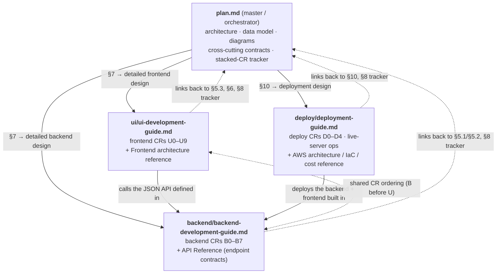
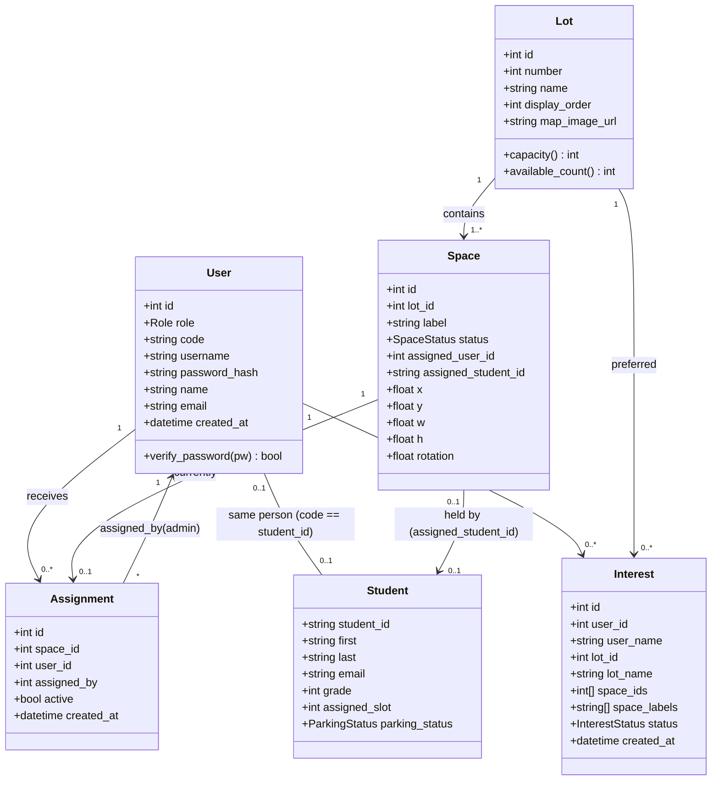
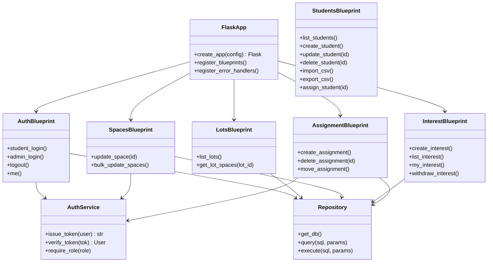
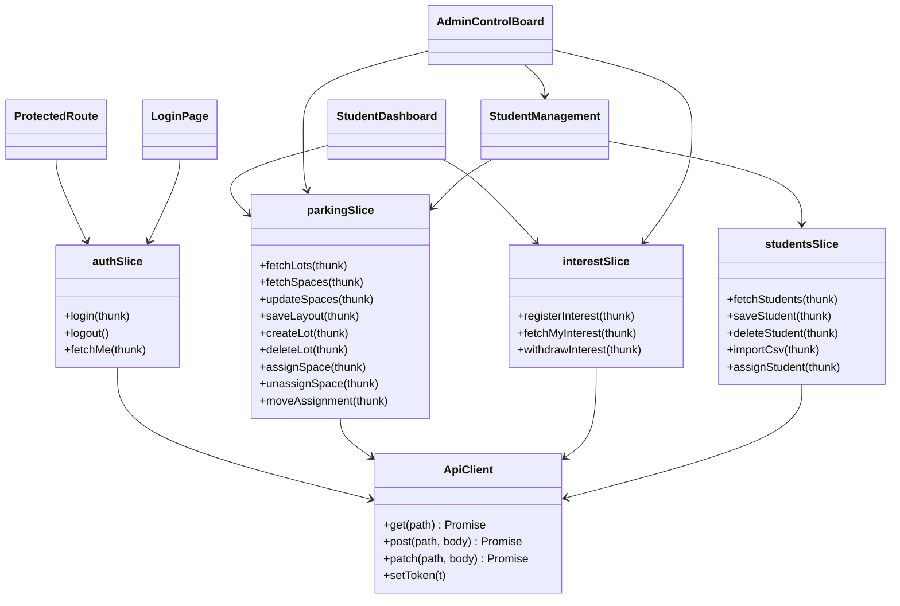
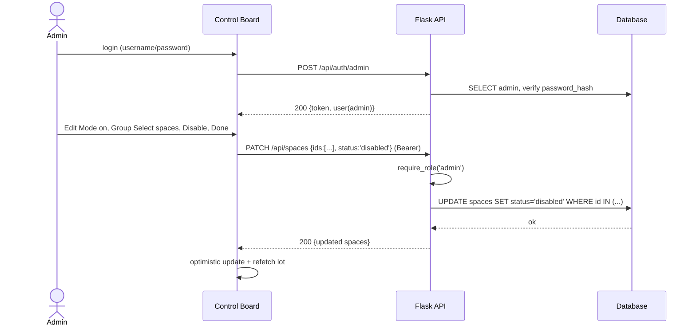
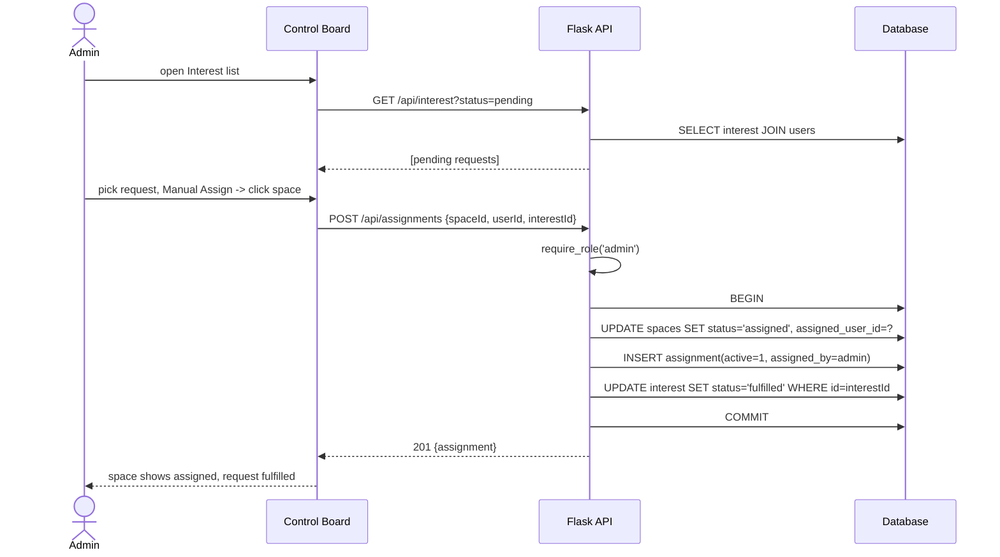
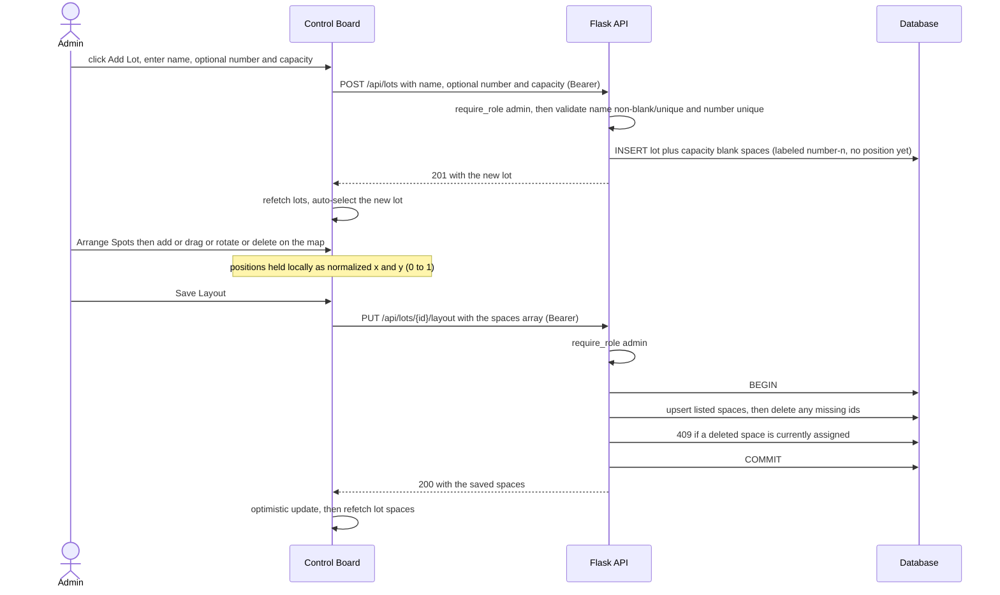

# LTRide — Parking Management Project Plan

## Executive Summary

LTRide is a school parking management system with two goals:

1. **Students** register interest in a parking spot.
2. **Admins** manage parking allocation (enable/disable spaces, assign spots, review interest).

This is the **master/orchestrator design doc**. It captures **what exists today**, the **gaps**, the **architecture (class diagrams + runtime views)**, the **cross-cutting contracts** that bind frontend and backend, an **incremental stacked-CR plan** (§8), and the **AWS deployment** design (§10). The step-by-step **implementation details** live in two sibling guides — one per component — which this doc orchestrates and links to:

- **Frontend:** [`ui/ui-development-guide.md`](ui/ui-development-guide.md)
- **Backend + deployment:** [`backend/backend-development-guide.md`](https://github.com/LTRide2/LTR-Backend/tree/main/plan/backend/backend-development-guide.md)

**Current runtime reality.** Everything the app does today runs against an in-memory **mock backend** (`src/api/mock/backend.ts`, persisted to `localStorage`), which is **on by default** — `USE_MOCK` in `src/api/client.ts` treats an unset `VITE_USE_MOCK` as `true`. The Flask backend this doc designs (§3, §7, §8) is the next increment the frontend will point at, not what it currently talks to; §2 has the full mock/API-parity detail.

**Scope / out of scope.** In scope: a decoupled React SPA + Flask JSON API + relational DB, JWT auth, the parking domain (lots, spaces, interest, assignments), and a single-instance AWS deployment. Out of scope (for now): direct student *self-claim* without admin approval (the PoC instead ships the in-scope request→approve flow — a single-spot pick with lock/withdraw, see §2), payments, notifications, multi-campus, and horizontal scale-out (the HA option is costed in the [deployment guide §B.13](deploy/deployment-guide.md#b13-monthly-cost-estimate-c6g4xlarge) but not built).

---

## 0. Start here — which document do I read?

There are **four documents**: this orchestrator plus one guide per component (frontend, backend, deployment), each in its own folder under `plan/`. They reference each other and work together. The runnable deployment artifacts the deployment guide describes live in the repo-root [`deploy/`](../deploy/README.md) home folder:

```
LTR-Backend/
├── plan/
│   ├── plan.md                          ← master / orchestrator (this file)
│   ├── ui/
│   │   └── ui-development-guide.md       ← frontend design + implementation (+ frontend deploy)
│   ├── backend/
│   │   └── backend-development-guide.md  ← backend design + implementation
│   └── deploy/
│       └── deployment-guide.md           ← deployment: AWS deploy (D0–D4) + ops + IaC/cost reference
└── deploy/                              ← runnable artifacts: CloudFormation, scripts, server config
    └── README.md                         ← indexes the artifacts; points to the deployment guide
```

| Document | What it is | Read it when |
|---|---|---|
| **`plan.md`** (this file) | The **master reference / orchestrator**: architecture, data model, diagrams, cross-cutting contracts, the stacked-CR plan + [status tracker](#82-cr-status-tracker), and the deployment map (§10 → the detail lives in the deployment guide). | You want the big picture, the CR ordering, or how the halves fit together. |
| **[`ui/ui-development-guide.md`](ui/ui-development-guide.md)** | A **beginner, step-by-step guide to building the website (frontend)**, including every git command and a local test for each CR (U0–U9). Its [Frontend architecture reference](ui/ui-development-guide.md#appendix--frontend-architecture-reference) holds the frontend design detail (moved from this file's old §7.2). | You're sitting down to write frontend code. |
| **[`backend/backend-development-guide.md`](https://github.com/LTRide2/LTR-Backend/tree/main/plan/backend/backend-development-guide.md)** | A **beginner, step-by-step guide to building the server + database (backend)**, with every git command and a local test for each CR (B0–B7). Its [API Reference](https://github.com/LTRide2/LTR-Backend/tree/main/plan/backend/backend-development-guide.md#appendix-a--backend-api-reference-v1) holds the full endpoint contracts (moved from this file's old §7.1). | You're sitting down to write backend code. |
| **[`deploy/deployment-guide.md`](deploy/deployment-guide.md)** | A **step-by-step guide to putting the app on AWS** (CRs D0–D4), plus live-server operations and the full architecture / IaC / [cost reference](deploy/deployment-guide.md#part-3--reference-architecture-iac--cost-model). | You're ready to deploy, operate, or price the live system. |

### How the four documents relate



**If you are brand new and just want to start building:** open [`ui/ui-development-guide.md`](ui/ui-development-guide.md) or [`backend/backend-development-guide.md`](https://github.com/LTRide2/LTR-Backend/tree/main/plan/backend/backend-development-guide.md) and follow it top to bottom; when the backend runs locally, use [`deploy/deployment-guide.md`](deploy/deployment-guide.md) to go live. Come back to *this* file whenever a guide says "see plan.md §X" for the big picture, the CR ordering, or a shared contract.

**The golden rules (both guides follow them):**
1. **One CR = one small, complete change**, on its own branch named `cr/<id>-<slug>`.
2. **Each CR branches off the previous CR's branch** (stacked), so work continues while a PR is reviewed.
3. **Every PR uses the CR description template** (§8) and includes a **local testing guide**.
4. Build a backend endpoint *before* the frontend CR that depends on it (dependency map is in the backend guide).

---

## 1. Repositories

| Repo | Path | Stack | State |
|---|---|---|---|
| Frontend (UI) | `lt-parking-site-project` ([`github.com/LTRide2/lt-parking-site-project`](https://github.com/LTRide2/lt-parking-site-project)) · local `~/workspace/LT_Proj/lt-parking-site-project` | Vite + React 19 + Redux Toolkit + TypeScript | Feature-complete SPA prototype against a mock backend (mirrors the API contract); real API pending |
| Backend | `LTR-Backend` ([`github.com/LTRide2/LTR-Backend`](https://github.com/LTRide2/LTR-Backend)) | Python / Flask + PostgreSQL | Course scaffold; a one-shot PoC proved B0–B9 run end-to-end (see backend `backport.md`), not yet split into the stacked CRs |

**Overall completion ≈ 45%** — the frontend is a feature-complete prototype driven through a mock backend that mirrors the planned API contract (§7.1), and a throwaway PoC has shown the backend design runs; the *shippable* Flask backend (B0–B9) and AWS deployment (D0–D4) are not yet built.

---

## 2. What We Have in the UI (today)

The frontend is a **feature-complete SPA prototype** that runs against an **independent mock backend** (`src/api/mock/backend.ts`), persisted to `localStorage` and swapped into the `api/` client by the `VITE_USE_MOCK` flag. The mock implements the planned JSON API (§7.1) route-for-route — same `{data}`/`{error}` envelope, same `Authorization: Bearer` token, same paths — so every screen is driven by real thunks/slices and network-shaped calls, **not** local Redux mutation. Flipping `VITE_USE_MOCK=false` points the identical client at the real Flask API once it exists.

This prototype was built on the throwaway `poc` branch to de-risk the frontend and lock down the API contract before backend work starts. The bugs and refinements it surfaced are recorded in the UI `backport.md` (items U-1..U-31) and folded into the matching U# lessons' troubleshooting notes; contract changes it forced on the real backend are digested in the backend `backport.md`.

### Implemented — validates CRs U0–U9
- **Real login, session restore, logout (U1) + URL routing with role-guarded routes (U2).** Students log in by code, admins by username/password; the mock issues a bearer token the client stores and replays; a `ProtectedRoute` guards `/student` and `/admin` by role.
- **Data-driven lots & spaces (U3).** The campus map, lot navigation, and every lot's spot layout render from `GET /api/lots` and `GET /api/lots/:id/spaces` — no hard-coded `LOT_CONFIGS`. Pan + cursor-anchored wheel zoom on both the campus and per-lot views share one normalized-coordinate transform model. Spot colors reflect the server `status`; a floating hover tooltip shows the spot label, availability, and assignee name.
- **Enable/disable persisted (U4).** Admin "Slot Enable/Disable" writes through `PATCH /api/spaces` and survives refresh.
- **Student registers interest (U5) + admin allocation (U6).** Admins see per-lot pending requests by student **name** (not raw id); "Assign to Spot" binds a request to a space transactionally; "Unassign" frees a space and re-queues the request.
- **Update school map image (U7).** Admin uploads a lot map, stored as a base64 data URL by the mock and rendered in every lot view.
- **Place & arrange spots (U8).** An Arrange editor adds (➕ Add Spot), drags, resizes, relabels, and deletes spots on the lot map; positions **and sizes** are normalized fractions (`x`,`y`,`w`,`h`) saved via `PUT /api/lots/:id/layout`, so the layout holds at any zoom; deleting an assigned spot is refused.
- **Create & remove a lot (U9).** ➕ Add Lot (with an optional admin-set **lot number** that prefixes spot labels) via `POST /api/lots`; 🗑 Remove Lot via `DELETE /api/lots/:id`, refused when any of its spaces is assigned.

### Implemented beyond the original U0–U9 plan
These were added during the PoC and are **not yet on the CR tracker**; each surfaced a real-backend contract change catalogued in the backend `backport.md` digest.
- **Student roster / Student Management** (`src/StudentManagement.tsx`) — a `students` entity keyed by `student_id`, with search, CRUD, CSV import (upsert) + CSV export, and a `parking_status` lifecycle; the PoC links roster↔login by `user.code === student.student_id`. (backport U-26, U-28)
- **Direct assign / move a roster student to a spot**, including students with no login account (a space carries `assigned_student_id`), with one-slot-per-student move semantics. (U-27)
- **Unassign & re-queue; move a request to another lot** — from both Student Management and the map's Assign-to-Spot mode. (U-23, U-29)
- **Student self-service map** (`src/StudentDashboard.tsx`) mirroring the admin map (no sidebar): a student picks **exactly one** available spot and submits; the selection then **locks**. While `pending` they may **withdraw** (rescind) and re-pick; once `fulfilled` it is read-only. (U-30, U-31)

### Still mock-only (not yet real)
- All state persists to `localStorage` through the mock backend; **nothing is saved to a real server**. The Flask backend (B0–B9) is not built, so `VITE_USE_MOCK=false` has no API to reach.
- The backend contract changes the extensions require (students entity + CSV, `assigned_student_id`, lot `number`, unassign/move endpoints, preferred-spot on interest) are logged in the backend `backport.md` digest but have **no B-CR yet**.
- No automated tests yet.

---

## 3. What We Have in the Backend (today)

`LTR-Backend` is a **generic Flask course template** (UMich "insta485" pattern), essentially unmodified for parking.

- Flask 2.2.2 + SQLite + a Webpack/React bundle served from Jinja templates.
- **Duplicated app** in two folders: `BK/` and `webapp/` (copy-paste scaffolding).
- Only DB table is a placeholder `developer (fullname, email, picture, password)`.
- `views/index.py` queries for `"John Doe"` and ignores the result.
- Returns **HTML templates, not JSON** — no REST API.
- No parking domain, no auth logic, no tests.

### 🚨 Security issues to fix first
- **`aws-tutorial.pem` (a private SSH key) is committed** — leaked secret. Remove from history **and rotate the key**.
- **`SECRET_KEY` is hard-coded** in `config.py` — move to environment variable.
- Committed `venv/`, `__pycache__/`, `.DS_Store`, `*.sqlite3` — should be gitignored.

---

## 4. Target Architecture

**Decoupled SPA + JSON API.** Frontend and backend deploy independently.

```
┌──────────────────┐      JSON / REST       ┌──────────────────┐       ┌────────────┐
│  React SPA       │  ───────────────────▶  │  Flask API       │  ───▶ │  Database  │
│  (Vite build)    │  ◀───────────────────  │  (JSON endpoints)│       │ SQLite→PG  │
└──────────────────┘                        └──────────────────┘       └────────────┘
```

- **Auth:** simple custom — students log in with a pre-issued **code**; admins with **username + password**; server issues a session/JWT token.
- **DB:** start on **SQLite**, designed so it can migrate to **PostgreSQL** for AWS.

> Open decisions (see §11) assume: **evolve Flask in place + decoupled SPA + SQLite→Postgres path + JWT**.

---

## 5. Domain / Class Diagram

### 5.1 Data model (entities)



**Enums:** `Role = {student, admin}`, `SpaceStatus = {available, disabled, assigned}`, `InterestStatus = {pending, fulfilled, cancelled}` (a student *withdraws* a pending request → `cancelled`), `ParkingStatus = {unassigned, valid, expired, suspended}` (the roster's view of whether a student currently holds/paid for a slot).

**Space geometry (part of the base schema):** `x`, `y` are **normalized** positions and `w`, `h` the **normalized size** (all `0..1` fractions of the lot's map image, matching the frontend's `Space` fields), with `rotation` in degrees — all nullable, so a space with no authored layout falls back to the front-end's config-table layout. Storing size as fractions (not fixed pixels) is what keeps a spot aligned *and correctly shaped* at any zoom/screen size — the map's zoom scale is never persisted. These columns are **designed into the initial schema (B2)** from the start — spot placement is a real property of a space — not bolted on by a later migration; nothing *writes* them until the drag-and-drop editor ships, which does so via `PUT /api/lots/:id/layout` (backend **B8**). New lots are created via `POST /api/lots` (backend **B9**) — see [§8.4 Phase 3](#84-the-crs-phase-by-phase-narrative--local-test-seed).

**Student roster (extension surfaced by the PoC).** `Student` is an admin-managed roster keyed by **`student_id`** (a school id string, *not* email), imported/exported as CSV. It is distinct from `User` (the login identity): the PoC links the two by convention `user.code == student.student_id`, and the real backend makes that a foreign key. A `Space` can be held either by a login `User` (`assigned_user_id`) **or** by a roster `Student` with no login account (`assigned_student_id`) — the two identity paths let an admin assign a CSV-imported student who has never logged in. `assigned_slot` mirrors the space a student holds and `parking_status` tracks their allocation lifecycle. Roster CRUD, CSV import (upsert)/export, and direct assign/move live on the **students endpoints** (see §5.2 and the backend API Reference); these are an **extension beyond the original B0–B9 plan** and are not yet on the CR tracker (§8.2).

**Preferred spot on an interest.** A request carries `space_ids` — the specific spot the student picked (the PoC allows **exactly one**, so the array holds ≤ 1; kept as an array so the contract can widen to ranked choices later). `space_ids`/`space_labels` are **optional**: a legacy lot-only request (no spot chosen) omits them and reads as "no specific spot," while `user_name`/`lot_name` are server-derived display fields the mock always populates for the admin's interest list. A student has **one active request at a time** (upsert), may **withdraw** it while `pending` (`DELETE /api/interest/me` → `cancelled`), and it becomes read-only once `fulfilled`.

### 5.2 Backend layering (component classes)



### 5.3 Frontend module structure



---

## 6. Runtime Views (sequence diagrams)

### 6.1 Student login + register interest

```mermaid
sequenceDiagram
    actor S as Student
    participant UI as React SPA
    participant API as Flask API
    participant DB as Database

    S->>UI: enter code, submit
    UI->>API: POST /api/auth/student {code}
    API->>DB: SELECT user WHERE code=? AND role='student'
    DB-->>API: user row
    API-->>UI: 200 {token, user}
    UI->>UI: store token, route to /student

    S->>UI: open a lot (read its layout)
    UI->>API: GET /api/lots/:id/spaces (Bearer — login-gated, not admin-only)
    API-->>UI: 200 Space[] (bare array; fetchSpaces bundles it with lotId client-side)
    S->>UI: pick ONE available spot, Submit
    UI->>API: POST /api/interest {lotId, spaceIds:[spaceId]} (Bearer)
    API->>API: verify student token, validate spot in-lot and available (else 400 none/multi, 409 taken)
    API->>DB: UPSERT the student's one active interest (pending, with preferred space_ids)
    DB-->>API: ok
    API-->>UI: 201 {interest}
    UI-->>S: Request submitted (pending) — selection locks, may Withdraw while pending
```

### 6.2 Admin disables spaces (bulk)



### 6.3 Admin assigns a space to a student (allocation)



The API also exposes an **unassign** path (`DELETE /api/assignments/:spaceId` — frees the space and re-queues the request) and a **move** path (`POST /api/assignments/move {fromSpaceId, toLotId}` — detailed in [§6.5](#65-extension-flows-surfaced-by-the-poc-roster-withdraw-move)); both are already exercised by the frontend's `unassignSpace`/`moveAssignment` thunks against the mock.

### 6.4 Admin creates a lot, then arranges its spots (authoring)



### 6.5 Extension flows surfaced by the PoC (roster, withdraw, move)

These four flows were validated in the PoC and are **extensions beyond the core B0–B9 / U0–U9 plan** (they need their own CR rows, §8.2). They reuse the same transactional, validate-first patterns as §6.3/§6.4:

- **Withdraw a request** (student, while `pending`). `DELETE /api/interest/me` sets the student's one active interest to `cancelled` and frees any preferred pick; the map re-opens for a fresh pick. A `fulfilled` request is read-only (no self-withdraw — contact an admin).
- **Move an assigned request to another lot** (admin). `POST /api/assignments/move {fromSpaceId, toLotId}` — inside one transaction: the source space is freed (`available`, both identity fields cleared, roster slot → `unassigned`) and the occupant's `fulfilled` interest is re-queued as `pending` in the target lot; the admin then assigns a spot there via the normal §6.3 path. 409 if the source is not currently assigned.
- **Manage the roster + direct assign** (admin). CRUD + CSV import (upsert by `student_id`) / export via the students endpoints; `POST /api/students/:id/assign {spaceId}` binds a roster student — *including one with no login account* — to an available space (409 otherwise), freeing any spot the student already holds first (one-slot-per-student move semantics) and stamping `assigned_student_id`. If a login `User` exists for that `student_id`, their pending interest is re-pointed and fulfilled.
- **Read-for-pick access.** All of the above depend on `GET /api/lots/:id/spaces` being **login-gated, not admin-only**, so a student can read a lot's layout to pick a spot (§7.1).

---

## 7. Implementation Details (live in the two guides)

The step-by-step implementation detail has been **moved out of this file** into the two component guides, so each guide is self-contained for the person building that half. This section is the orchestrator: it says *what* the contract is and *where* the detail lives.

| Detail | Lives in | Was previously |
|---|---|---|
| **Backend** app structure, conventions, full API surface + per-endpoint request/response contracts | [backend guide → Appendix A — API Reference](https://github.com/LTRide2/LTR-Backend/tree/main/plan/backend/backend-development-guide.md#appendix-a--backend-api-reference-v1) | plan.md §7.1 |
| **Frontend** module structure, API client, slices/thunks, routing, data-driven map, UX states | [UI guide → Frontend architecture reference](ui/ui-development-guide.md#appendix--frontend-architecture-reference) | plan.md §7.2 |
| **Backend cross-cutting** (config, seed data, server-side logging) | [backend guide → Appendix A.3](https://github.com/LTRide2/LTR-Backend/tree/main/plan/backend/backend-development-guide.md#a3-cross-cutting-backend-side) | plan.md §7.3 |
| **Frontend cross-cutting** (config, token storage, client-side logging) | [UI guide → Frontend architecture reference §C](ui/ui-development-guide.md#c-cross-cutting-frontend-side) | plan.md §7.3 |

### 7.1 The contract that binds the two halves (authoritative here)

Everything else about implementation is delegated to the guides, but these are the **shared contracts** both halves must agree on — so they are pinned in the orchestrator:

- **Transport & envelope:** JSON over HTTP. Success = `{ "data": ... }`; error = `{ "error": { "code", "message", "details"? } }` with a meaningful HTTP status. Both the Flask handlers and the React `api` client are written to this shape.
- **Auth:** JWT in `Authorization: Bearer <token>`, signed `{user_id, role, exp}` with `SECRET_KEY`. Admin routes are guarded by `@require_role('admin')`; the SPA guards routes by `auth.user.role`.
- **CORS:** the backend `CORS_ORIGINS` env must list every SPA origin (localhost dev + the deployed domain), or the browser blocks the calls.
- **Enums (shared vocabulary):** `Role = {student, admin}`, `SpaceStatus = {available, disabled, assigned}`, `InterestStatus = {pending, fulfilled, cancelled}`, and (roster extension) `ParkingStatus = {unassigned, valid, expired, suspended}` — see the data model in §5.1.
- **Space read access:** `GET /api/lots/:id/spaces` is **login-gated (any authenticated role), not admin-only** — students must read a lot's layout to pick a spot (§6.1). Only *mutating* space/lot/assignment routes require `@require_role('admin')`.
- **Correlation across the process boundary:** a request is traceable end-to-end by pairing the browser-side console/toast log (UI) with the Flask access-log line (backend) for the same `METHOD /api/...`. See each guide's cross-cutting/observability note.

The endpoint-by-endpoint realization of this contract is the [backend API Reference](https://github.com/LTRide2/LTR-Backend/tree/main/plan/backend/backend-development-guide.md#appendix-a--backend-api-reference-v1); the client-side realization is the [frontend reference](ui/ui-development-guide.md#appendix--frontend-architecture-reference).

---

## 8. Implementation Strategy (stacked CRs)

The work is broken into small, independently-reviewable **stacked CRs**. **B#** = backend, **U#** = frontend/UI, **D#** = deployment. Each CR is one small, complete, shippable change that unblocks the next; each branches off its *parent* CR's branch (not `main`) so review and building proceed in parallel. The per-CR step-by-step instructions live in the two guides — this section owns the **ordering, dependencies, and live status**; the [tracker](#82-cr-status-tracker) links each CR to its guide section, and each guide CR links back here.

> **This is the orchestrator's job.** plan.md keeps the CR list *short but complete* (id, ordering, dependency, status, and a link to the detail). The fleshed-out steps, code, and local tests are in the guide sections linked from the tracker — mirroring the reference model in `modules/hosted/plan/on-demand-jwt-token/plan.md`.

### 8.1 CR workflow & branching strategy

**Stacked branches — each CR branches off the *previous* CR's branch, not `main`.** This lets you keep building (and deploying from a branch) while an earlier CR is still in review, instead of blocking on each merge.

- Branch naming: `cr/<id>-<slug>` (e.g. `cr/b1-app-skeleton`, `cr/u1-real-auth`).
- Base each branch on the one it depends on per the build order (§9):
  ```bash
  git checkout cr/b0-cleanup            # prior CR's branch
  git checkout -b cr/b1-app-skeleton    # new CR stacks on top
  # ...work, commit, open PR with base = cr/b0-cleanup (not main)
  ```
- **Open the PR against the parent branch** so the diff shows only this CR's changes (the reviewer isn't re-shown the parent's diff).
- **Keep the stack in sync after a review:** when a parent branch changes or merges, rebase the children onto the new base so fixes flow downstream:
  ```bash
  git rebase --onto cr/b0-cleanup <old-base> cr/b1-app-skeleton
  ```
- **Merge in order.** When a parent merges to `main`, GitHub auto-retargets the child PR's base to `main`; rebase to drop the now-merged commits, then merge. Use squash-merge to keep `main` history one-commit-per-CR.
- **Deploying while waiting for review:** `deploy.sh` / `release.sh` accept any checked-out branch, so you can ship a tip-of-stack branch to a staging instance for end-to-end validation before the PRs land. Only merged `main` deploys to production (CI in CR **D3**).

Independent CRs (no data dependency) may branch directly off `main` and merge in any order — e.g. **B0** and **U0** are parallel; backend `B#` and the matching frontend `U#` are stacked only where the UI consumes that endpoint.

### 8.2 CR status tracker

Every CR that realizes this design, with its parent branch, cross-layer dependency, a link to its step-by-step guide section, and its live status. Keep this table updated as CRs open and merge (add the PR link, advance the status). **Status legend:** 📋 Proposed (not started) · 🧪 PoC-validated (built and working against the mock backend on the `poc` branch, no real CR/PR opened yet) · 🔍 In Review · ✅ Merged.

> **Tracking note.** This is a public GitHub project, so CRs are tracked by **PR** (and optionally a GitHub Issue), not a GUS work item. Fill the **PR** column with the PR number/link when each CR opens. The 🧪 rows' code already exists — as squashed commits on the throwaway `poc` branch, not as the per-CR PRs this tracker expects — so their **PR** column intentionally stays "—" until each is re-cut as its own real CR against `main`; don't read "—" there as "nothing has shipped."

**Backend (`B#`) — build in `backend/backend-development-guide.md`:**

| CR | Title | Branch | Parent | Also needs | Step-by-step | PR | Status |
|---|---|---|---|---|---|---|---|
| B0 | Clean slate & safety (gitignore, `SECRET_KEY`/`DATABASE_URL` → env) | `cr/b0-hygiene` | `main` | — | [B0](https://github.com/LTRide2/LTR-Backend/tree/main/plan/backend/backend-development-guide.md#cr-b0--clean-slate--safety-do-this-first) | — | 📋 |
| B1 | Health check + `create_app()` + CORS | `cr/b1-health` | B0 | — | [B1](https://github.com/LTRide2/LTR-Backend/tree/main/plan/backend/backend-development-guide.md#cr-b1--health-check-prove-the-server-runs) | — | 📋 |
| B2 | DB schema (migration) + seed data | `cr/b2-schema` | B1 | — | [B2](https://github.com/LTRide2/LTR-Backend/tree/main/plan/backend/backend-development-guide.md#cr-b2--database-schema--seed-data) | — | 📋 |
| B3 | Auth: JWT, `@require_role`, student/admin login + `/me` | `cr/b3-auth` | B2 | — | [B3](https://github.com/LTRide2/LTR-Backend/tree/main/plan/backend/backend-development-guide.md#cr-b3--authentication-login) | — | 📋 |
| B4 | Read lots & spaces | `cr/b4-lots` | B3 | — | [B4](https://github.com/LTRide2/LTR-Backend/tree/main/plan/backend/backend-development-guide.md#cr-b4--read-lots--spaces) | — | 📋 |
| B5 | Admin enable/disable spaces (single + bulk) | `cr/b5-spaces` | B4 | — | [B5](https://github.com/LTRide2/LTR-Backend/tree/main/plan/backend/backend-development-guide.md#cr-b5--admin-enablesdisables-spaces) | — | 📋 |
| B6 | Student registers interest (+ admin list) | `cr/b6-interest` | B5 | — | [B6](https://github.com/LTRide2/LTR-Backend/tree/main/plan/backend/backend-development-guide.md#cr-b6--student-registers-interest) | — | 📋 |
| B7 | Admin assigns a space (transactional) | `cr/b7-assignments` | B6 | — | [B7](https://github.com/LTRide2/LTR-Backend/tree/main/plan/backend/backend-development-guide.md#cr-b7--admin-assigns-a-space) | — | 📋 |
| B8 | Save lot layout — spot positions (`PUT /api/lots/:id/layout`; writes `x/y/w/h/rotation`, columns defined in B2) | `cr/b8-layout` | B7 | — | [B8](https://github.com/LTRide2/LTR-Backend/tree/main/plan/backend/backend-development-guide.md#cr-b8--save-lot-layout-spot-positions) | — | 📋 |
| B9 | Create a parking lot (`POST /api/lots`) | `cr/b9-create-lot` | B8 | — | [B9](https://github.com/LTRide2/LTR-Backend/tree/main/plan/backend/backend-development-guide.md#cr-b9--create-a-parking-lot) | — | 📋 |

**Frontend (`U#`) — build in `ui/ui-development-guide.md`:**

> **PoC status (frontend).** A throwaway prototype on the `poc` branch built and validated **U0–U9 end-to-end against a mock backend** that mirrors the API contract (§7.1), and implemented features beyond this list — student self-service single-spot requests with lock/withdraw, a student roster + CSV import/export, direct assign/move, and unassign-and-re-queue (see §2 and the UI `backport.md`, items U-1..U-31). The rows below still track the **real** stacked CRs against the Flask API and remain 📋 until opened; the extensions need their own follow-on CR rows once the backend contract changes they require (backend `backport.md` digest) are scheduled.

| CR | Title | Branch | Parent | Also needs | Step-by-step | PR | Status |
|---|---|---|---|---|---|---|---|
| U0 | Project hygiene (router dep, API client, `.env`) | `cr/u0-hygiene` | `main` | — | [U0](ui/ui-development-guide.md#cr-u0--project-hygiene-foundation-no-visible-change) | — | 🧪 |
| U1 | Real login + session restore + logout | `cr/u1-real-auth` | U0 | **B3** | [U1](ui/ui-development-guide.md#cr-u1--real-login-replaces-the-fake-login) | — | 🧪 |
| U2 | Routing + role-guarded `ProtectedRoute` | `cr/u2-routing` | U1 | — | [U2](ui/ui-development-guide.md#cr-u2--routing-real-pages-with-urls) | — | 🧪 |
| U3 | Data-driven lots & spaces from API | `cr/u3-real-lots` | U2 | **B4** | [U3](ui/ui-development-guide.md#cr-u3--show-real-lots-and-spaces-data-driven-map) | — | 🧪 |
| U4 | Persist enable/disable (optimistic + rollback) | `cr/u4-save-status` | U3 | **B5** | [U4](ui/ui-development-guide.md#cr-u4--make-enabledisable-actually-save) | — | 🧪 |
| U5 | Student dashboard + register interest | `cr/u5-student-interest` | U4 | **B6** | [U5](ui/ui-development-guide.md#cr-u5--student-registers-interest-core-feature-1) | — | 🧪 |
| U6 | Admin interest panel + Manual Assign | `cr/u6-admin-assign` | U5 | **B7** | [U6](ui/ui-development-guide.md#cr-u6--admin-assigns-spaces-core-feature-2) | — | 🧪 |
| U7 | Update school map image (multipart upload) | `cr/u7-map-upload` | U6 | map endpoint | [U7](ui/ui-development-guide.md#cr-u7--update-the-school-map-image) | — | 🧪 |
| U8 | Place & arrange spots (drag-and-drop layout editor) | `cr/u8-arrange-spots` | U7 | **B8** | [U8](ui/ui-development-guide.md#cr-u8--place--arrange-parking-spots-drag-and-drop-layout-editor) | — | 🧪 |
| U9 | Add a new parking lot from the admin UI | `cr/u9-add-lot` | U8 | **B9** | [U9](ui/ui-development-guide.md#cr-u9--add-a-new-parking-lot-from-the-admin-ui) | — | 🧪 |

**Extensions (`B13–B16`, `U10`) — PoC-validated, beyond the core plan; not yet expanded into guide sections.**

The PoC (§2) validated four features beyond core U0–U9. The **frontend is already prototyped** (see the UI `backport.md` and the U# lessons — including the [U10 Student Management extension lesson](ui/lessons/README.md)); each still needs its **backend** CR. These stack after **B9/U9** and may be sequenced before or after the Phase-4 hardening pass. The per-endpoint contract each adds is digested in the backend `backport.md`; the runtime flows are in [§6.5](#65-extension-flows-surfaced-by-the-poc-roster-withdraw-move) and the entities/enums in [§5.1](#51-data-model-entities).

| CR | Title | Depends on | Contract it adds | Frontend | Status |
|---|---|---|---|---|---|
| B13 | Student roster + CSV import/export | B2, B4 | `students` entity (PK `student_id`); `GET/POST/PATCH/DELETE /api/students`; `POST /api/students/import` (multipart, upsert); CSV export | U10 | 📋 |
| B14 | Direct assign / move a roster student | B13, B7 | `spaces.assigned_student_id` (nullable FK); `POST /api/students/:id/assign {spaceId}` (one-slot-per-student move) | U10 | 📋 |
| B15 | Preferred-spot interest + withdraw | B6 | `interest.space_ids`; `POST /api/interest {lotId, spaceIds}` (400 none/multi · 409 taken · upsert one-active); `DELETE /api/interest/me` (→ `cancelled`) | folded into U5 | 📋 |
| B16 | Move an assigned request to another lot | B7 | `POST /api/assignments/move {fromSpaceId, toLotId}` (transactional free-and-re-queue) | folded into U6 | 📋 |
| U10 | Student Management (roster + CSV + direct assign/move) | B13, B14 | *(consumes B13/B14)* | [U10 lesson](ui/lessons/U10-student-management.md) | 🧪 |

*Also folded into existing CRs as contract additions (not separate CRs): `Lot.number` extends **B9/U9**; `w`/`h` size on layout save extends **B8/U8**; `assigned_user_name` in space serialization extends **B4/U3**.*

**Deployment (`D#`) — run in `deploy/deployment-guide.md`:**

| CR | Title | Branch | Parent | Step-by-step | PR | Status |
|---|---|---|---|---|---|---|
| D0 | One-time AWS account + CLI setup *(not a code CR)* | — | — | [D0](deploy/deployment-guide.md#d0--one-time-aws-account-setup-not-a-code-cr-but-do-it-once) | — | 📋 |
| D1 | CloudFormation templates (network/db/compute/dns) | `cr/d1-cfn-templates` | `main` | [D1](deploy/deployment-guide.md#cr-d1--write-the-cloudformation-templates-the-infrastructure-code) | — | 📋 |
| D1b | Server config (nginx, systemd, provision.sh) | `cr/d1b-server-config` | D1 | [D1b](deploy/deployment-guide.md#cr-d1b--server-configuration-files-nginx-gunicornsystemd-provisioning) | — | 📋 |
| D2 | Stand up the infrastructure (`deploy.sh up`) | `cr/d2-provision` | D1 | [D2](deploy/deployment-guide.md#cr-d2--stand-up-the-infrastructure) | — | 📋 |
| D3 | Release the application code (`release.sh`) | `cr/d3-release` | D2 | [D3](deploy/deployment-guide.md#cr-d3--release-the-application-code) | — | 📋 |
| D4 | Domain + Route 53 + HTTPS (certbot) | `cr/d4-dns-tls` | D3 | [D4](deploy/deployment-guide.md#cr-d4--buy-a-domain-wire-it-to-route-53-and-turn-on-https) | — | 📋 |

**Hardening (`B10/U11`, `B11/U12`, `B12`) — planned, not yet expanded into guide sections.** Validation/error-envelope polish (B10/U11), automated tests — pytest + Vitest (B11/U12), and the SQLite→Postgres path (B12). *Note:* the guides already build directly on **PostgreSQL** from B2 onward, so B12 is largely satisfied by design; it remains listed for the explicit "run the suite against a second Postgres" check. These get their own guide sections + tracker rows when scheduled. *(Frontend hardening is **U11/U12**, not U10 — **U10** is the PoC's Student Management extension above. Backend was earlier renumbered from B8/B9/B10 when the layout-save and create-lot features claimed B8/B9 · U8/U9.)*

> **Ordering — the one hard cross-layer rule.** A frontend CR in the "Also needs" column **cannot be tested to green until its backend CR is merged (or at least deployed to a branch/staging instance)** — U1→B3, U3→B4, U4→B5, U5→B6, U6→B7, U8→B8, U9→B9. Build/open the backend CR first. Within a layer, the `Parent` column is a strict stack: rebase children when a parent changes (§8.1). The critical path that respects both is in §9.

### 8.3 CR description template (every CR uses this)

Every CR — backend and frontend — ships with a PR description in this shape. The **Local testing guide** is mandatory and expands on the one-line *Local test* summary listed per CR below.

```markdown
## <CR id> — <title>
**Depends on:** <parent CR / branch>     **Base branch:** cr/<parent>

### What & why
<1–3 sentences: the change and the user-facing/architectural reason.>

### Changes
- <file/area> — <what changed>

### Local testing guide
1. Setup: <env vars, seed/migrate commands, services to start>
2. Steps: <exact commands / clicks to exercise the change>
3. Expected: <responses, status codes, UI states — incl. error/403/404/409 paths>

### Rollback
<how to revert safely — e.g. revert PR, run down-migration>
```

> **Which CRs get the detailed description + local testing guide? All of them.** It is a standing requirement, not specific to one CR. The per-CR **Local test** lines below are the seed for each CR's "Local testing guide" section.

### 8.4 The CRs, phase by phase (narrative + local-test seed)

> **Authority.** The [tracker](#82-cr-status-tracker) (§8.2) and the two guides are the source of truth for branch names, dependencies, and the exact step-by-step. This subsection is the **narrative walkthrough** — why each phase exists and the one-line local test that seeds each CR's "Local testing guide". Where a number differs, the guides win.

#### Phase 0 — Hygiene & foundations
- **B0 — Repo cleanup & secret rotation.** Remove `aws-tutorial.pem` from history, rotate the key, add `.gitignore`, delete the duplicate app folder (keep one), move `SECRET_KEY` to env. *(blocks everything)*
  - **Local test:** `git log --all --oneline -- aws-tutorial.pem` returns nothing; `git ls-files | grep -E 'pem|sqlite3|__pycache__'` is empty; app still starts with `SECRET_KEY` read from env.
- **U0 — Project hygiene.** Add `.env` handling, `react-router-dom`, ESLint/Prettier baseline, and an `api/` client module. No behavior change yet.
  - **Local test:** `npm install && npm run lint && npm run build` succeed; `npm run dev` renders the existing app unchanged.

#### Phase 1 — Backend API foundation
- **B1 — App skeleton + health check.** Clean `create_app()`, `GET /api/health`, CORS, env config.
  - **Local test:** `curl localhost:8000/api/health` → `{"data":{"status":"ok",...}}`; a cross-origin `fetch` from the SPA origin succeeds (no CORS error in the browser console).
- **B2 — Schema + migrations + seed.** `schema.sql` (§5.1) on **PostgreSQL**, seed data (lots, spaces, admin, student codes), dict connection helpers. *(Exact seed set — see the [B2 guide section](https://github.com/LTRide2/LTR-Backend/tree/main/plan/backend/backend-development-guide.md#cr-b2--database-schema--seed-data).)*
  - **Local test:** run the migration + seed against the dev Postgres, then `\dt` in `psql` shows all tables and `SELECT count(*) FROM lots;` matches the seed.
- **B3 — Auth endpoints.** `/api/auth/student|admin|logout|me`, JWT issue/verify, password hashing, `@require_role`.
  - **Local test:** `curl -XPOST localhost:8000/api/auth/student -d '{"code":"ABC123"}' -H 'Content-Type: application/json'` returns a token; reuse it on `GET /api/auth/me` → 200; a bad code → 401; admin route without token → 401.

#### Phase 2 — Core parking API
- **B4 — Lots & spaces read API.** `GET /api/lots`, `GET /api/lots/:id/spaces`.
  - **Local test:** `curl localhost:8000/api/lots` lists the seeded lots; `curl localhost:8000/api/lots/1/spaces` returns spaces with `status`; unknown lot id → 404.
- **B5 — Admin space management.** `PATCH /api/spaces/:id`, bulk `PATCH /api/spaces` (admin-only).
  - **Local test:** with an admin token, `PATCH /api/spaces/1001 {"status":"disabled"}` → 200 and re-GET shows `disabled`; same call with a student token → 403; bulk PATCH returns `updated`/`skipped`.
- **B6 — Interest registration API.** `POST /api/interest`, `GET /api/interest`, `GET /api/interest/me`.
  - **Local test:** student token `POST /api/interest {"lotId":1}` → 201 `pending`; `GET /api/interest/me` shows it; admin `GET /api/interest?status=pending` lists it; duplicate active request → 409.
- **B7 — Assignment API.** `POST /api/assignments`, `DELETE /api/assignments/:spaceId`, mark interest fulfilled (transactional, per §6.3).
  - **Local test:** admin `POST /api/assignments {"spaceId":1001,"userId":1,"interestId":55}` → 201; verify space is now `assigned` and interest `fulfilled`; assigning an already-assigned space → 409; `DELETE /api/assignments/1001` frees the space (`available`).
- **B8 — Save lot layout (spot positions).** `PUT /api/lots/:id/layout` (admin-only) full-replaces a lot's spot set — upsert listed spaces, delete omitted ids — inside one transaction (per §6.4). It writes the `x/y/w/h/rotation` columns that are **already defined on `spaces` in the B2 schema** (designed in from the start — no migration in B8). Positions and sizes are normalized fractions (0–1), so they survive zoom/resize.
  - **Local test:** admin `PUT /api/lots/1/layout` with a spaces array → 200 and re-GET `/api/lots/1/spaces` shows the saved `x/y/w/h/rotation`; a student token → 403; deleting a space that is currently `assigned` → 409 (no partial write); out-of-range coordinate → 400.
- **B9 — Create a parking lot.** `POST /api/lots` (admin-only) inserts a lot and, if `capacity` is given, that many positionless `available` spaces; rejects blank/duplicate name.
  - **Local test:** admin `POST /api/lots {"name":"North Lot","capacity":10}` → 201 with the new lot; `GET /api/lots` now lists it and it has 10 spaces; a blank name → 400; a duplicate name → 409; a student token → 403.

#### Phase 3 — Wire the UI to the API
- **U1 — Real auth flow.** Replace fake login with B3; token storage, auth guard, real logout, error states.
  - **Local test:** with backend running, log in as student with a seeded code → lands on dashboard; wrong code shows an error; refresh keeps you logged in (`/me`); logout returns to login; visiting `/admin` while logged out redirects.
- **U2 — Routing.** `react-router`; remove manual view switching.
  - **Local test:** `/login`, `/student`, `/admin` are directly navigable; back/forward buttons work; deep-linking to a protected route while logged out redirects to `/login`.
- **U3 — Data-driven lots & spaces.** Fetch from B4; render any lot's grid from data.
  - **Local test:** switching lots in the nav renders each lot's real grid (not just Lot 1) from the API; space colors reflect server `status`; loading + error states show when the API is slow/down.
- **U4 — Admin enable/disable persisted.** Connect Disable/Enable/Group Select to B5; optimistic update + refetch.
  - **Local test:** disable spaces as admin, **refresh the page** → they remain disabled (persisted); a forced API failure rolls back the optimistic update.
- **U5 — Student interest registration.** Real student dashboard: view availability, register interest (B6), see status.
  - **Local test:** as a student, register interest → status shows `pending`; the same request appears in the admin's interest list; re-registering is blocked/handled.
- **U6 — Admin allocation.** Implement *Manual Assign* against B7; interest list + assign; reflect assigned state on the map.
  - **Local test:** admin opens interest list, assigns a space to a student → space shows `assigned` on the map and the request flips to `fulfilled`; the assigned student sees their spot.
- **U7 — Update School Map.** Admin uploads/replaces a lot's map image (`POST /api/lots/:id/map`).
  - **Local test:** upload a PNG/JPG for a lot → the new image renders after refresh; a non-image or >16 MB file is rejected with a visible error.
- **U8 — Place & arrange spots.** Drag-and-drop layout editor: in an "Arrange" edit mode, add/drag/rotate/delete spots on the lot map; positions held locally as normalized coordinates, saved via B8's `PUT /api/lots/:id/layout`.
  - **Local test:** as admin, drag a spot to a new position and **Save Layout** → **refresh** and it stays put; rotate/delete persist too; zooming the map keeps spots aligned (normalized coords); a save that hits a 409 (assigned space deleted) shows an error and leaves the server unchanged.
- **U9 — Add a new parking lot.** Admin **➕ Add Lot** button + Create Lot modal (`POST /api/lots`, B9); auto-selects the new lot and hands off to U7 (map) + U8 (arrange).
  - **Local test:** create a lot → it appears in the nav **without refresh** and is selected; blank name is blocked client-side; a duplicate name shows the server's red error; after refresh the lot persists; a student never sees the control.

#### Phase 4 — Hardening *(planned; tracker rows B10/U11, B11/U12, B12)*
- **B10 / U11 — Validation & error handling.** Server validation, consistent error envelope, UI toasts/empty/loading states.
  - **Local test:** malformed/oversized payloads return 400 with the `{error:{code,message}}` envelope; the UI surfaces a toast instead of crashing; empty lists show an empty state.
- **B11 / U12 — Tests.** Backend: pytest (API + auth). Frontend: Vitest + Testing Library.
  - **Local test:** `pytest` is green (auth + each endpoint, incl. 401/403/409 paths); `npm run test` green for login, routing guard, and interest/assign flows.
- **B12 — Second-Postgres check** (run schema + suite against a fresh Postgres via `DATABASE_URL`). *The app is already Postgres-native from B2, so this is a portability check, not a migration.*
  - **Local test:** run a local Postgres (e.g. `docker run -e POSTGRES_PASSWORD=pw -p 5432:5432 postgres`), point `DATABASE_URL` at it, run the migration + seed, and re-run `pytest` green against it.

#### Phase 5 — Deployment (EC2 + RDS via CloudFormation, see §10)

Deployment CRs are **D0–D4** in the [tracker](#82-cr-status-tracker); the full step-by-step lives in the [deployment guide, Part 1](deploy/deployment-guide.md#part-1--deploy-to-aws-step-by-step-crs-d0d4).
- **D0 — One-time AWS account + CLI setup** *(not a code CR)*. Account, IAM user, AWS CLI, Route 53 hosted zone.
  - **Local test:** `aws sts get-caller-identity` returns your account; the hosted zone exists (`aws route53 list-hosted-zones`).
- **D1 — CloudFormation templates** (`deploy/cfn/` network/db/compute/dns) + `deploy.sh` + `params/prod.json`.
  - **Local test:** `aws cloudformation validate-template --template-body file://deploy/cfn/01-network.yaml` (etc.) passes for every template; `cfn-lint deploy/cfn/*.yaml` is clean; a `create-change-set` previews the expected resources without erroring.
- **D1b — Server configuration files** (nginx site, gunicorn systemd unit, `provision.sh`).
  - **Local test:** `nginx -t -c` against the rendered config passes; `systemd-analyze verify` accepts the unit file; `bash -n provision.sh` parses clean.
- **D2 — Stand up the infrastructure** (`deploy.sh up` — deploy the stacks).
  - **Local test:** stacks reach `CREATE_COMPLETE`; `curl http://<elastic-ip>/api/health` → ok once provisioning finishes; `detect-stack-drift` reports no drift.
- **D3 — Release the application code** (`release.sh` — build + rsync + restart).
  - **Local test:** the SPA loads over the public IP and logs in against RDS-backed data; `/api/health` returns ok from the released build.
- **D4 — Domain + Route 53 + HTTPS** (certbot).
  - **Local test:** `https://<your-domain>/api/health` returns 200 with a valid cert; HTTP redirects to HTTPS.

---

## 9. Suggested Build Order (critical path)

```
B0 → B1 → B2 → B3 → U0/U1/U2  →  B4 → U3  →  B5 → U4  →  B6 → U5  →  B7 → U6  →  U7
      →  B8 → U8  →  B9 → U9  →  (Phase 4 hardening) → (Phase 5 deploy)
```

Demoable after **U5** (students register interest, admins manage spaces); feature-complete after **U9** (admins can create lots and author each lot's spot layout).

---

## 10. AWS Deployment — EC2 + RDS via CloudFormation

> **Where the detail lives.** The deployment design, the CloudFormation stack-by-stack reference, the AWS-services inventory, and the full cost model now live **with the backend implementation guide** (deployment is primarily a backend/ops concern), and the runnable artifacts live in the repo-root [`deploy/`](../deploy/README.md) folder. This section is the orchestrator's map to them.

**Architecture (one paragraph):** Flask served by **gunicorn** behind **nginx** on a single **EC2** instance; **PostgreSQL on RDS** in private subnets; the React static bundle served from the same nginx (or optionally S3 + CloudFront). HTTPS via **Let's Encrypt (certbot)** on a domain in **Route 53**. **All infrastructure is CloudFormation (IaC)** — no manual console clicks.

```
                 ┌──────── EC2 c6g.4xlarge (Ubuntu 22.04, arm64) ──────┐
 Internet ──443──┤ nginx (TLS, reverse proxy, serves React build)      │
   (Route 53)    │   │                                                  │
                 │   └─ proxy /api ─▶ gunicorn (systemd) ─▶ Flask app   │
                 └───────────────────────────┬──────────────────────────┘
                                              │ 5432 (private SG)
                                     ┌────────▼─────────┐
                                     │ RDS PostgreSQL   │
                                     └──────────────────┘
```

### 10.1 Where each piece now lives

| What you want | Where it is |
|---|---|
| **Click-by-click deploy tutorial** (D0–D4: account setup, templates, provision, release, DNS/TLS) | Deployment guide → [Part 1 — Deploy to AWS](deploy/deployment-guide.md#part-1--deploy-to-aws-step-by-step-crs-d0d4) |
| **Live-server operations & troubleshooting** | Deployment guide → [Part 2 — Operating the live server](deploy/deployment-guide.md#part-2--operating--troubleshooting-the-live-server) |
| **Deployment design reference** — architecture, IaC layout, per-stack CloudFormation snippets, AWS-services inventory, deployment diagram | Deployment guide → [Part 3 — Reference](deploy/deployment-guide.md#part-3--reference-architecture-iac--cost-model) |
| **Cost model** — monthly AWS estimate (min/mid/max for ~1000 users) + professional build/maintenance labor | Deployment guide → [Part 3 §B.13–§B.14](deploy/deployment-guide.md#b13-monthly-cost-estimate-c6g4xlarge) |
| **Frontend build & serve** (`npm run build` → `dist/`, nginx static serving, prod `VITE_*`, SPA fallback) | UI guide → [Deployment (frontend)](ui/ui-development-guide.md#part-f3--deployment-frontend) |
| **Runnable artifacts** — CloudFormation templates, `deploy.sh`, `release.sh`, nginx/systemd/provision configs | Repo-root [`deploy/`](../deploy/README.md) |

### 10.2 The deployment CRs (tracked in §8.2)

Deployment is delivered as CRs **D0–D4** in the [CR status tracker](#82-cr-status-tracker): D0 one-time AWS account setup, D1 CloudFormation templates, D1b server config files, D2 stand up the infrastructure, D3 release the application code, D4 domain + Route 53 + HTTPS. Each row links to its step-by-step section in the backend guide's Part 2.

---

## 11. Open Decisions to Confirm
1. **Backend base:** evolve `webapp/` in place vs clean Flask rebuild vs switch (FastAPI / Node). *(plan assumes evolve/clean Flask)*
2. **Frontend–backend coupling:** decoupled SPA + JSON API (assumed) vs Flask serves the React build.
3. **Database:** stay on SQLite for local dev with a Postgres-ready layer (assumed) — the EC2 + RDS deploy in §10 runs on PostgreSQL.
4. **Auth token:** JWT (assumed) vs session cookie.

---

## 12. Risks & Mitigations

| # | Risk | Impact | Mitigation | Owning section |
|---|---|---|---|---|
| R1 | **Committed secret** (`aws-tutorial.pem`, hard-coded `SECRET_KEY`) leaks credentials. | High — account/key compromise. | **B0** rotates the key, purges it from history, moves `SECRET_KEY`/`DATABASE_URL` to env. | [B0](https://github.com/LTRide2/LTR-Backend/tree/main/plan/backend/backend-development-guide.md#cr-b0--clean-slate--safety-do-this-first) |
| R2 | **Cross-layer stack drift** — a frontend CR merges before the backend endpoint it needs. | Medium — UI CR can't reach green; false "done". | "Also needs" column in §8.2 + the hard ordering rule; open/merge the backend CR first. | [§8.2](#82-cr-status-tracker) |
| R3 | **Rebase churn** in a long CR stack when a parent changes. | Medium — repeated conflict resolution. | Keep CRs small (one endpoint / one screen); rebase children promptly per §8.1. | [§8.1](#81-cr-workflow--branching-strategy) |
| R4 | **Contract drift** between the two halves (envelope, enums, auth header). | Medium — integration breakage. | §7.1 is the single authoritative contract; both guides link to it, not to each other's copies. | [§7.1](#71-the-contract-that-binds-the-two-halves-authoritative-here) |
| R5 | **Assignment race** — two admins assign the same space. | Medium — double-booking. | Transactional assign with a conditional update (per §6.3); 409 on conflict. | [§6.3](#63-admin-assigns-a-space-to-a-student-allocation) |
| R6 | **Single-EC2 SPOF / no backups.** | Medium — downtime, data loss. | RDS automated backups; CloudFormation makes the box reproducible; documented restore. Scale-out is out of scope (§Executive Summary). | [§10](#10-aws-deployment--ec2--rds-via-cloudformation) |
| R7 | **Cost overrun** — the sized instance is far larger than a school parking app needs. | Low/Medium — budget. | The [cost model (deployment guide §B.13)](deploy/deployment-guide.md#b13-monthly-cost-estimate-c6g4xlarge) is an explicit planning decision to revisit; right-size before provisioning. | [§10](#10-aws-deployment--ec2--rds-via-cloudformation) |
| R8 | **Layout save destroys assigned spots** — the full-replace `PUT /api/lots/:id/layout` (B8/U8) deletes spaces omitted from the payload. | Medium — an admin re-arranging could wipe a space a student is assigned to. | Transactional save that **refuses (409)** to delete any space that is currently `assigned`; positions stored as normalized 0–1 fractions so they don't break on zoom/resize. | [§6.4](#64-admin-creates-a-lot-then-arranges-its-spots-authoring) |
| R9 | **Roster↔login identity drift** — the PoC links `Student` to `User` by the convention `user.code == student.student_id`; a typo or duplicate leaves a space held by a `student_id` with no matching login (or vice-versa). | Medium — a student can't see the spot assigned to them; orphaned `assigned_student_id`. | Make it a real **FK** in the backend (B13/B14), enforce uniqueness on `student_id` and `user.code`, and reconcile on assign/import; the dual-identity assign path is validated (409 on unavailable spot). | [§5.1](#51-data-model-entities), [§6.5](#65-extension-flows-surfaced-by-the-poc-roster-withdraw-move) |

---

## 13. Observability (scoped to this deployment)

This is a single-box Flask + React deployment on EC2 — **not** a fleet with a central log platform, so observability is deliberately lightweight:

- **Structured local logs.** gunicorn/Flask log as structured lines to the systemd journal (`journalctl -u ltride`); nginx access/error logs on the box. Details: [backend guide §A.3](https://github.com/LTRide2/LTR-Backend/tree/main/plan/backend/backend-development-guide.md#a3-cross-cutting-backend-side).
- **Correlation id across the process boundary.** The API accepts/generates an `X-Request-Id`, echoes it on the response, and logs it; the SPA attaches it to each request and includes it in client-side error reports so a user-visible failure can be traced to a server log line. Client side: [UI guide Appendix §C](ui/ui-development-guide.md#appendix--frontend-architecture-reference).
- **Client-side logging.** The SPA logs API failures to the browser console with the request id and surfaces a user-facing toast (no crash). See UI guide Appendix §C.
- **Health & liveness.** `GET /api/health` is the single liveness probe used in D2/D3 smoke tests and after every release.

> **Out of scope:** external APM, metrics dashboards, alerting/paging, and log aggregation. If the app grows beyond one box, revisit (candidate: CloudWatch Logs + a metric filter on the health check).

---

## 14. Glossary

| Term | Meaning |
|---|---|
| **CR** | Change Request — one small, independently-reviewable pull request. See [§8](#8-implementation-strategy-stacked-crs). |
| **Stacked CR** | A CR whose base branch is another CR's branch (not `main`), so it builds on unmerged work; children are rebased when a parent changes. |
| **Orchestrator doc** | This `plan.md` — owns cross-cutting design, the shared contract, and the CR tracker; delegates implementation detail to the two guides. |
| **Guide** | One of the two implementation docs: `ui/ui-development-guide.md` (frontend) and `backend/backend-development-guide.md` (backend + deployment). |
| **Envelope** | The uniform JSON response shape: `{data}` on success, `{error:{code,message,details}}` on failure. Authoritative in [§7.1](#71-the-contract-that-binds-the-two-halves-authoritative-here). |
| **`@require_role`** | Backend decorator enforcing that a valid JWT with the required role (`student`/`admin`) is present. |
| **Interest** | A student's request for parking, carrying a **preferred spot** (`space_ids`, ≤ 1 in the PoC). One active request per student; `pending` → `fulfilled`, or the student **withdraws** it while pending → `cancelled`. Core feature 1. |
| **Roster / Student** | An admin-managed list of students keyed by **`student_id`** (a school id string, not email), imported/exported as CSV. Distinct from the login `User`; linked by `user.code == student.student_id`. A PoC extension (§5.1, §6.5). |
| **Dual assignment identity** | A space records who holds it as either `assigned_user_id` (a login `User`) **or** `assigned_student_id` (a roster `Student` with no login account) — so an admin can place a CSV-imported student who has never logged in. |
| **Assignment** | An admin binding a student to a specific space (transactional; flips space→`assigned`, interest→`fulfilled`). Core feature 2. |
| **Normalized coordinates** | A spot's position **and size** stored as fractions of the map image (`x`,`y`,`w`,`h` in 0–1) plus a `rotation` in degrees, so both placement and shape survive zoom/resize on any screen (the zoom scale itself is never persisted). The columns live on `spaces` from the initial schema (B2); they're first *written* by the arrange-spots feature (§6.4, B8/U8). |
| **Layout (authored)** | A lot's set of spot positions saved as data via `PUT /api/lots/:id/layout`, replacing the hard-coded config-table positions in the prototype. Full-replace + transactional (§6.4). |
| **IaC** | Infrastructure as Code — all AWS resources defined in CloudFormation templates, no manual console clicks (§10). |
| **SPA** | Single-Page Application — the React frontend, served as a static build and talking to the API over JSON. |
| **B#/U#/D#** | CR id prefixes: **B**ackend, **U**I/frontend, **D**eployment. Full list in the [tracker](#82-cr-status-tracker). |

---

## 15. Key Design Decisions

The decisions that shaped this plan, each linking to the section that justifies it. (Guardrail: the doc ends here.)

1. **Decoupled SPA + JSON API over a Flask-rendered app.** Lets the two halves be built and reviewed on independent CR stacks and keeps the contract explicit. → [§7.1](#71-the-contract-that-binds-the-two-halves-authoritative-here), [§8.2](#82-cr-status-tracker)
2. **Three-doc structure: one orchestrator + two guides.** Cross-cutting design and the shared contract live once in `plan.md`; implementation detail lives with the code it describes, so a frontend or backend dev reads one guide without wading through the other. → [§0](#0-start-here--which-document-do-i-read), [§7](#7-implementation-details-live-in-the-two-guides)
3. **Stacked CRs, backend-before-frontend on shared features.** Small PRs review faster and the "Also needs" dependency makes the one hard cross-layer rule explicit. → [§8.1](#81-cr-workflow--branching-strategy), [§8.2](#82-cr-status-tracker)
4. **Uniform response envelope + JWT/`@require_role`.** One success/error shape and one auth mechanism the whole app agrees on, defined authoritatively in the orchestrator. → [§7.1](#71-the-contract-that-binds-the-two-halves-authoritative-here)
5. **Transactional assignment with conditional update.** Prevents two admins double-booking one space. → [§6.3](#63-admin-assigns-a-space-to-a-student-allocation), [R5](#12-risks--mitigations)
6. **PostgreSQL from the first schema CR (B2 onward).** Avoids a late SQLite→Postgres migration; the "second-Postgres" item (B12) becomes a portability check, not a migration. → [§8.2](#82-cr-status-tracker), [§10](#10-aws-deployment--ec2--rds-via-cloudformation)
7. **All AWS resources as CloudFormation (IaC), single EC2 + RDS.** Reproducible infra sized for a school-scale app; scale-out explicitly out of scope. → [§10](#10-aws-deployment--ec2--rds-via-cloudformation), [R6](#12-risks--mitigations)
8. **Lightweight, single-box observability.** Structured journal logs + a correlation id across the process boundary, no external APM — matched to the deployment, not a fleet. → [§13](#13-observability-scoped-to-this-deployment)
9. **Spot positions are authored data, not hard-coded config.** Layouts are stored as normalized coordinates (position **and size**, `x/y/w/h/rotation`) on `spaces` and edited via a drag-and-drop editor (U8) saved through a transactional full-replace endpoint (B8) that refuses to delete assigned spaces; lots are created from the UI (U9/B9) instead of a fixed seed loop. Lets the school grow and rearrange lots without a code change. → [§6.4](#64-admin-creates-a-lot-then-arranges-its-spots-authoring), [§8.2](#82-cr-status-tracker), [R8](#12-risks--mitigations)
10. **Roster is a separate entity from the login user, with dual assignment identity (PoC extension).** Students are managed as a CSV-backed `students` roster keyed by `student_id`, distinct from the login `User` and linked by `user.code == student.student_id`; a space can be held by either `assigned_user_id` or `assigned_student_id`. This lets an admin allocate a student who has never logged in, at the cost of one convention (soon a FK) binding the two identities — the residual risk is tracked in [R9](#12-risks--mitigations). → [§5.1](#51-data-model-entities), [§6.5](#65-extension-flows-surfaced-by-the-poc-roster-withdraw-move)
11. **Student self-service is a single-spot request→approve, not a self-claim (PoC extension).** A student picks **exactly one** preferred spot (`interest.space_ids`, ≤ 1), holds **one active request**, and the pick **locks on submit** — changeable only by withdrawing while `pending`; an admin still approves via the §6.3 assignment. Keeps the in-scope approval workflow (Executive Summary out-of-scope: direct self-claim) while giving the student a concrete pick. → [§5.1](#51-data-model-entities), [§6.1](#61-student-login--register-interest)
