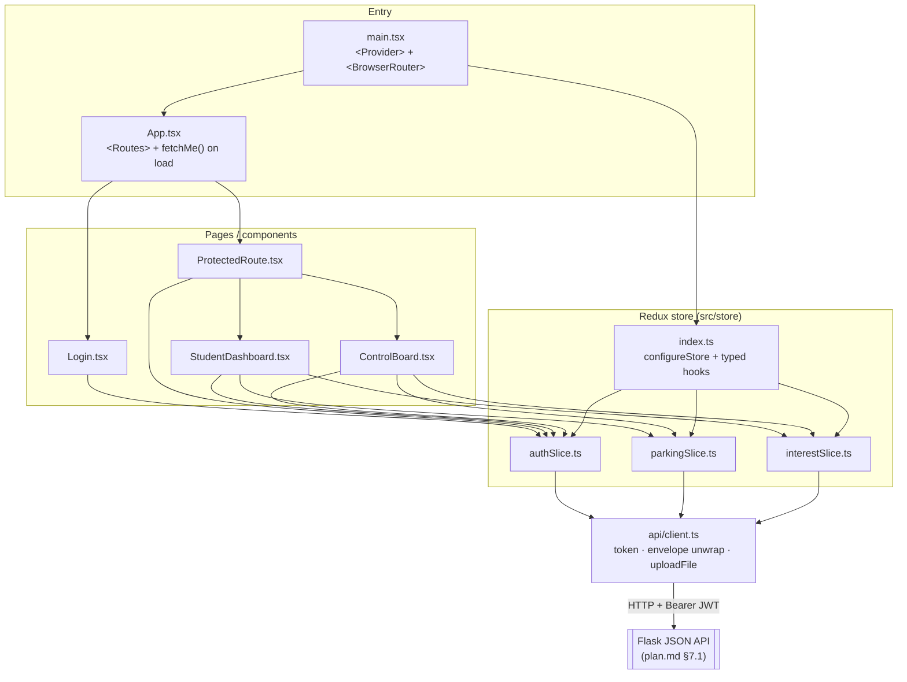
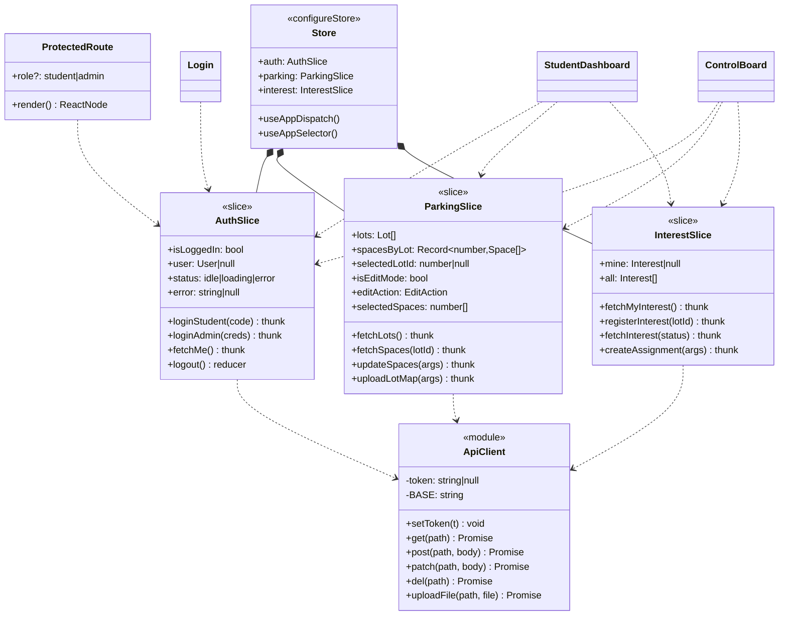

add # LTRide — Frontend (UI) Design

The **design reference** for the React SPA: what the frontend is, how it's structured, how data flows, and how each screen behaves. This is the *architecture* view; the [ui-development-guide.md](ui-development-guide.md) is the step-by-step *build* view, and [plan.md](plan.md) is the master spec (API contracts, data model, deployment).

> **Source of truth.** This document does not restate the API. Every request/response shape lives in **[plan.md §7.1](plan.md#71-backend-flask)**; the data model in **[plan.md §5.1](plan.md#51-data-model-entities)**; the runtime flows in **[plan.md §6](plan.md#6-runtime-views-sequence-diagrams)**. When they disagree, `plan.md` wins.

> **Status (verified against code 2026-07-30):** the UI is still the client-only prototype — no CR (U0–U7) has started. See the progress board in [ui-development-guide.md](ui-development-guide.md#progress-snapshot-verified-against-the-code-on-2026-07-30) and [plan.md §8](plan.md#8-incremental-delivery-plan-crs).

---

## 1. What the frontend is

A **decoupled single-page app** (Vite + React 19 + Redux Toolkit + TypeScript) that talks to the Flask JSON API over REST. It deploys independently of the backend and holds no server secrets. See the system diagram in **[plan.md §4](plan.md#4-target-architecture)**.

**Two roles, two experiences** (same app, gated by `auth.user.role`):
- **Student** — logs in with a pre-issued **code**, sees availability, **registers interest** in a lot, and tracks request status.
- **Admin** — logs in with **username + password**, manages the campus map: enable/disable spaces, review interest, **assign** spaces to students, upload lot map images.

**Auth:** the server issues a **JWT**; the SPA stores it (localStorage) and sends `Authorization: Bearer <token>`. Session is restored on load via `GET /api/auth/me`.

---

## 2. Target module structure

Where the app is heading (each file tagged with the CR that adds it). This mirrors the tree in [ui-development-guide.md](ui-development-guide.md#the-source-structure-youre-building-toward).

```
src/
├── main.tsx              # boots React; wraps app in <Provider> + <BrowserRouter>   (U2)
├── App.tsx               # <Routes>; restores session via fetchMe() on load         (U1, U2)
├── ProtectedRoute.tsx    # redirects if not logged in / wrong role                   (U2)
├── Login.tsx             # login page (student code / admin user+pass), shows errors (U1)
├── StudentDashboard.tsx  # student: availability list + register interest + status   (U5)
├── ControlBoard.tsx      # admin: data-driven 17-lot map, disable/enable, assign, map upload (U3,U4,U6,U7)
├── api/
│   └── client.ts         # the ONE place that talks to the backend; token + error unwrap (U0, U7 adds uploadFile)
└── store/
    ├── index.ts          # configureStore; registers the slices; typed hooks
    ├── authSlice.ts      # login thunks + token + fetchMe                             (U1)
    ├── parkingSlice.ts   # fetchLots / fetchSpaces / updateSpaces / uploadLotMap thunks (U3,U4,U7)
    └── interestSlice.ts  # registerInterest / fetchMyInterest / fetchInterest / createAssignment (U5,U6)
```

Component/slice relationships are drawn in **[plan.md §5.3](plan.md#53-frontend-module-structure)** (data-model class diagram in [§5.1](plan.md#51-data-model-entities)); the frontend-specific views below expand on it.

### 2.1 Module view (dependency graph)

How the files depend on each other at runtime. Every network call funnels through the single `api/client.ts`; components never call `fetch` directly — they `dispatch` thunks, and thunks call the client.



### 2.2 Class diagram (components, slices, client)

The frontend "types" and their key members — UI components (top), the state slices with their thunks + reducers (middle), and the API client (bottom). Domain interfaces (`User`/`Lot`/`Space`/`Interest`) come from **[plan.md §5.1](plan.md#51-data-model-entities)**.



---

## 3. Layers & responsibilities

### 3.1 API client (`src/api/client.ts`) — U0
The single boundary to the backend. Responsibilities:
- Base URL from `import.meta.env.VITE_API_URL`.
- Attach `Authorization: Bearer <token>` (token held in-module + mirrored to `localStorage` so refresh survives). `setToken(null)` clears it.
- Unwrap the success envelope `{ data: ... }`; turn `{ error: { message } }` into a thrown `Error` so slices can reject cleanly. Handle `204 No Content`.
- Expose `api.get/post/patch/del`, plus `uploadFile(path, file)` (U7) for `multipart/form-data` (no JSON content-type — the browser sets the multipart boundary).

The envelope + error contract is defined in **[plan.md §7.1 "Conventions"](plan.md#71-backend-flask)**.

### 3.2 State (Redux Toolkit)
Three slices. **Server calls go through `createAsyncThunk`**; pure UI state (selected lot, edit mode, current selection) stays as plain reducers.

| Slice | Server thunks | UI-only state | Consumes (plan.md §7.1) |
|---|---|---|---|
| `authSlice` | `loginStudent`, `loginAdmin`, `fetchMe` | `status`, `error` | `POST /api/auth/student·admin`, `GET /api/auth/me` |
| `parkingSlice` | `fetchLots`, `fetchSpaces`, `updateSpaces`, `uploadLotMap` | `selectedLotId`, `isEditMode`, `editAction`, `selectedSpaces` | `GET /api/lots`, `GET /api/lots/:id/spaces`, `PATCH /api/spaces`, `POST /api/lots/:id/map` |
| `interestSlice` | `fetchMyInterest`, `registerInterest`, `fetchInterest`, `createAssignment` | — | `GET/POST /api/interest*`, `POST /api/assignments` |

**Types** (`Lot`, `Space`, `Interest`, `User`) map to the entities in **[plan.md §5.1](plan.md#51-data-model-entities)**. Spaces carry a numeric `id`, a `label`, and a `status ∈ {available, disabled, assigned}` — the server `status` is the single source of truth (no more browser-only `disabledSpaces`/`assignedSpaces` lists).

### 3.3 Routing & guards — U2
`react-router-dom` with three routes: `/login`, `/student`, `/admin`, and a `*` fallback to `/login`. `ProtectedRoute` reads `auth.isLoggedIn` + `auth.user.role`; a logged-out or wrong-role visit redirects to `/login`. On load `App` calls `fetchMe()` if a token exists, then routes the user to their home page by role.

### 3.4 UX states
Every data view handles **loading / empty / error**: spinners while thunks are `pending`, an empty state only when a list is *truly* empty, error toasts/messages on `rejected`. Admin mutations (disable/assign) are **optimistic** — recolor immediately, refetch to reconcile, roll back on failure.

---

## 4. Screens

### 4.1 Login (`Login.tsx`) — U1
Selection → student form (code) or admin form (username + password). Submitting dispatches the matching thunk; a rejected login shows a red inline error and stays on the page. Success flips `isLoggedIn` and routing takes over.

### 4.2 Student dashboard (`StudentDashboard.tsx`) — U5
- **Availability list:** each lot's `available_count / capacity` from `fetchLots`.
- **Register interest:** pick a lot → `registerInterest(lotId)`. One active request at a time; a duplicate is rejected (`409`) and surfaced as an error.
- **Status:** shows the current request as `pending` / `fulfilled`. Restored on refresh via `fetchMyInterest`.

Flow: **[plan.md §6.1](plan.md#61-student-login--register-interest)**.

### 4.3 Admin control board (`ControlBoard.tsx`) — U3, U4, U6, U7
The most complex screen. The **existing prototype layout is kept** (17-lot rendering from `LOT_CONFIGS`/`LOT_MAP_CONFIGS`/`LOT_FAN_CONFIGS`/`MAP_ONLY_LOTS`, pan/zoom campus map, edit-mode gating) — only the **data source** changes from local strings to server data.

- **Lot nav + map (U3):** `Home` (campus map) + one button per fetched lot; each lot draws its real spaces colored by server `status` (available / disabled=grey / assigned=blue; selected=yellow).
- **Enable/Disable (U4):** Edit Mode → select spaces → `updateSpaces({ ids, status })`. Persists to the server; an `assigned` space can't be disabled (`409`). Flow: **[plan.md §6.2](plan.md#62-admin-disables-spaces-bulk)**.
- **Manual Assign (U6):** replaces the prototype's type-in-ID modal. Admin picks a **pending interest request** (which already knows the student) → clicks an available space → `createAssignment({ spaceId, userId, interestId })`. Space flips to `assigned`, request to `fulfilled`. Flow: **[plan.md §6.3](plan.md#63-admin-assigns-a-space-to-a-student-allocation)**.
- **Update School Map (U7):** upload a PNG/JPG for the selected lot via `uploadFile` → `POST /api/lots/:id/map`; refetch lots so the new image shows.

> **Prototype-only feature not in the plan:** the current student *self-claim* (click an open spot to claim) is a different model from "student registers interest → admin assigns." The plan keeps admin-assigns as the real feature; self-claim would need its own backend CR. See the note in [ui-development-guide.md → CR U6](ui-development-guide.md).

---

## 5. Space status → color (shared contract)

| `status` | Meaning | Color |
|---|---|---|
| `available` | open | white |
| `disabled` | admin-disabled | grey |
| `assigned` | taken by a student | blue |
| *(selected in edit mode)* | UI-only selection | yellow |

Admins see every assigned space's student id; a student sees only their own.

---

## 6. Cross-cutting

- **Config:** `VITE_API_URL` in `.env` (git-ignored) + committed `.env.example`. Never commit secrets. ([plan.md §7.3](plan.md#73-cross-cutting))
- **Token:** localStorage + rehydrate via `fetchMe()` on load; `logout` clears it.
- **CORS:** the backend must allow the SPA origin (`CORS_ORIGINS`); a dev origin of `http://localhost:5173` and the deployed domain in prod.
- **Build:** `npm run build` (`tsc -b` + vite) → `dist/`, served by nginx or S3+CloudFront ([plan.md §10.7](plan.md#107-build--place-the-frontend)).

---

## 7. Delivery order

The frontend CRs stack **U0 → U1 → U2 → U3 → U4 → U5 → U6 → U7**, each branching off the previous. Each U-CR depends on a matching backend CR (U1→B3, U3→B4, U4→B5, U5→B6, U6→B7). Full per-CR steps and local tests: [ui-development-guide.md](ui-development-guide.md); build-order rationale: [plan.md §9](plan.md#9-suggested-build-order-critical-path).
